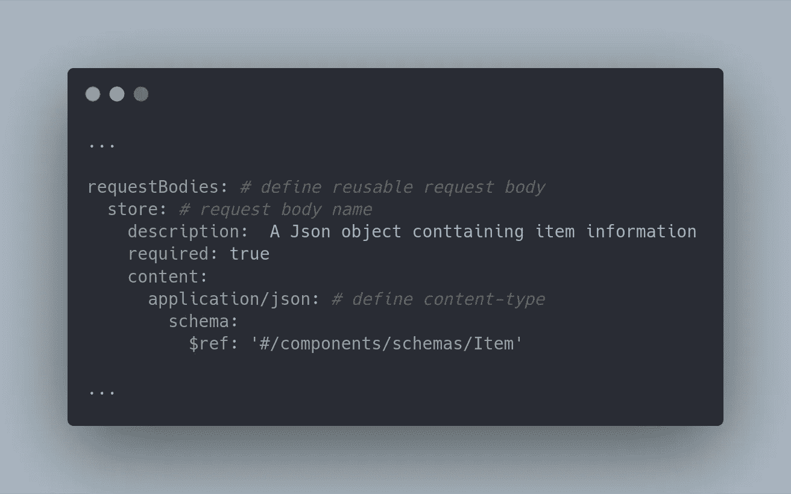

# 用 OAS 3.0 和 API Sprout 实现 API 优先开发

> 原文：<https://levelup.gitconnected.com/implementing-api-first-development-with-oas-3-0-and-api-sprout-5842f829c32d>

今天我学习了如何使用 Open API Specification 3.0 实现 API 优先开发，以及如何使用 API Sprout 创建模拟服务器进行快速防阻塞开发，我想与您分享

Marc Sendra Martorell 在 [Unsplash](https://unsplash.com?utm_source=medium&utm_medium=referral) 上拍摄的照片

# 介绍

**API 优先开发**是一种减少客户端和服务器端开发阻塞的开发方法。如果我们不进行 API 优先的开发，客户端将被迫等待，直到我们的服务器 API 实现完成。通过使用 API 优先开发，客户机和服务器必须就如何使用 API、路径、请求和响应达成一致和期望。通过这样做，客户端不必等到服务器完成 API 的实现，他们中的一个就可以创建模拟服务器以避免阻塞开发。

[**开放 API 规范(OAS)**](https://github.com/OAI/OpenAPI-Specification/blob/master/versions/3.0.3.md) 是通过 JSON / YAML 文件描述 RESTful APIs 的规范，可用于为用户生成文档、创建模拟服务器、生成代码等。 **OAS** 是语言无关的规范，你可以按照[定义的格式](https://swagger.io/specification/)来编写。协议和期望将写在本规范上。这次我将使用 YAML 文件来编写 OAS，这样更容易读写。

[**API Sprout**](https://github.com/danielgtaylor/apisprout)**是一个帮助你通过简单读取 OAS 文件来创建模拟服务器的工具。API Sprout 提供了**头盔图**和 **docker 图像**，我在这个简单的例子中使用了 docker 图像。支持 OAS 的一些替代方案和其他工具您可以在这里找到。**

**请注意，并不是写在 OAS 文件上的所有东西都会影响我们构建的模拟服务器，因为毕竟 OAS 文件有它自己的目的，而 API 只是创建模拟服务器。**

# **让我们编码…还是写脚本？**

**这一次我们只是为一个简单的例子编写了最小的规范，你可以使用[我的 github 库](https://github.com/clavinjune-blog-repo/5842f829c32d)来探索更多的开发和一些我放在这个博客下面的资源。**

# **项目结构**

**编写 OAS 没有正式的目录结构，但是为了简化和清理结构，我这样定义结构**

****

**项目结构**

****API 目录**将用于定义我们的 oas 规范，建议将 OAS 文件的根文件命名为:`openapi.json`或`openapi.yaml`。**

****组件目录**将用于为每个域/资源存储可重用组件，如模式、响应、参数、请求体等。**

**Dockerfile 将用于构建我们的模拟服务器。**

****Makefile** 将用于定义所需的操作并将其合并到一个文件中。**

****脚本目录**将用于存储任何助手脚本，在这种情况下，它包含所有用于测试的`curl script`。**

**现在我们将为、`index`、`show`和`store`项编写一个简单的 API。**

# **创建 Makefile**

****

**Makefile 内容**

**对于运行开发服务器，您可以使用`make dev`命令，构建`make build`，使用`make run`运行 docker 镜像。**

**当使用`--watch`时，apisprout 将监听定义的根文件中的任何变化，在这种情况下，它监听`/api/openapi.yaml`。**

# **创建 openapi.yaml**

****

**openapi.yaml 内容**

**Openapi 属性将定义我们将要使用的 openapi 的版本**

**定义我们的 API 信息**

****

**信息内容**

**[**服务器**](https://swagger.io/docs/specification/api-host-and-base-path/) 定义我们将用于 API 的服务器位置和路径**

****

**服务器内容**

**[**路径**](https://swagger.io/docs/specification/paths-and-operations/) 定义可用端点，其方法、请求和响应。**

****

**路径内容**

**在这种情况下，我们有三个端点，如`GET: /items`、`POST: /items`和`GET: /items/{id}`。**

**[**组件**](https://swagger.io/docs/specification/components/) 定义了可复用的组件，如参数、请求体、响应、模式等。我们将在**组件目录**中按资源拆分组件。**

# **正在创建 item.yaml**

****

**item.yaml 内容**

**[**模式**](https://swagger.io/docs/specification/data-models/) 定义我们将要使用的模式。**

****

**模式内容**

**[**参数**](https://swagger.io/docs/specification/describing-parameters/) 定义了我们将要使用的每个参数，包括`path parameter`、`query`、`cookie`和`header`。**

****

**参数内容**

**[**请求体**](https://swagger.io/docs/specification/describing-request-body/) 为我们定义的每个端点定义可接受的请求体**

****

**请求体内容**

**[**响应**](https://swagger.io/docs/specification/describing-responses/) 定义每个请求可能返回的响应。**

****

**响应内容**

# **让我们测试脚本**

**让我们为`scripts directory`中的每个端点创建 curl 脚本**

****

**index.sh 内容**

****

**show.sh 内容**

****

**store.sh 内容**

**创建 curl 脚本后，只需通过命令`make dev`运行开发服务器。确保`Makefile`中的开发服务器端口和你的 curl 脚本是相同的。**

****

**测试开发服务器**

# **创建 Dockerfile 文件**

**从 APISprout 创建 dockerfile 很简单，只需将`api directory`复制到构建映像中即可。**

****

**Dockerfile 文件内容**

# **让我们构建模拟服务器映像！**

**你可以使用`make build`命令来构建镜像，你可以调整 Makefile。然后你可以运行服务器或者把图像推送到 kubernetes。**

****

**建立形象**

# **结论**

**我觉得是这么长的博文(因为图片)，但至少我希望你能实现 API 优先的开发。你可以克隆这篇博文的[库](https://github.com/clavinjune-blog-repo/5842f829c32d)。希望对大家有帮助。**

**感谢您的阅读！**

 **[## OpenAPI 规范

### 3.0.3 版关键词“必须”、“不得”、“要求”、“应当”、“不得”、“应当”、“不应当”…

swagger.io](https://swagger.io/specification/)** ** [## clavinjune-blog-repo/5842 f 829 c32d

### 这个库属于我的中型博客帖子-clavinjune-blog-repo/5842 f 829 c32d

github.com](https://github.com/clavinjune-blog-repo/5842f829c32d)  [## OpenAPI。工具

### 我们希望让 API 开发人员随时掌握最好的 OpenAPI 工具，并帮助指导人们实现高质量的……

openapi.tools](https://openapi.tools/)  [## 丹尼尔·泰勒/阿皮斯普劳特

### 一个简单、快速、跨平台的 API 模拟服务器，它返回 API 描述文档中指定的示例。

github.com](https://github.com/danielgtaylor/apisprout)**