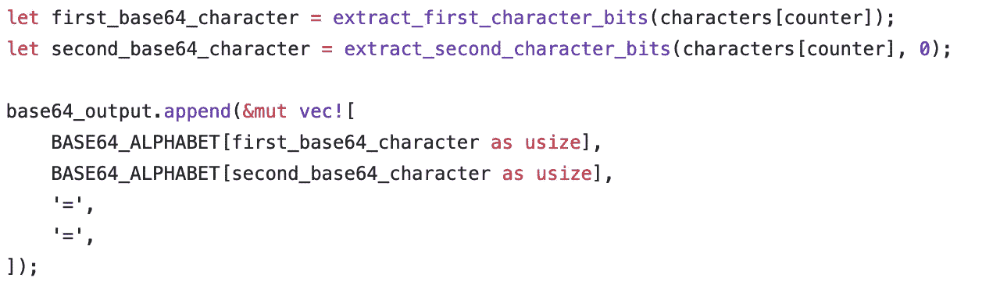

# 在 Rust 中实现 Base64

> 原文：<https://levelup.gitconnected.com/implementing-base64-in-rust-34ef6db1e73a>

迈克·冯在 [Unsplash](https://unsplash.com?utm_source=medium&utm_medium=referral) 上的照片

几乎每个开发人员都以这样或那样的方式使用 base64，但是这个算法实际上是如何工作的呢？对我来说，真正理解一个算法最简单的方法就是实现它。让我们开始吧。

base64 算法本身是在 RFC [4648](https://tools.ietf.org/html/rfc4648) 中定义的。它的想法非常简单:任何输入都可以被视为一个比特流。通常，这些位被分成字节，因此分成 8 个一组。Base64 做同样的事情，除了它把比特分成 6 个一组。然后使用预定义的表格将每个值翻译成字符`a-z`、`A-Z`、`0-9`和`+`、`/`。另外，`=`用作填充。但是我们不要想太多。

让我们从定义用于编码和编写第一个测试的 base64 函数接口开始。我将只为字符串实现 base64，而不是为字节流。

这是第一个测试。我们的编码函数接受一个`&str`并对字符串进行编码。

# 将比特分成 6 个一组

第一步是将我们的字节重组为 6 位组。我们从 3 个 ascii 字符开始，因为它们在 utf8 (Rust 的编码)中有 24 位，我们可以将它们重组为 4 个 base64 字符。首先，让我们把字符转换成字节。

为了得到我们的 4 base64 字符，我们需要应用位掩码来删除不需要的信息，并将字符移动到正确的位置。

对于第一组 6 位，我们只删除最后两位，并将所有内容向右移动 2 位。(实际上，只需将所有内容右移两位就可以完成这项工作……但我在编写代码时没有想到这一点。)

第二组由第一个 ascii 字符的后两位和第二个 ascii 字符的前 4 位组成。因此，我们删除第一个 ascii 字符的前 6 位，并将它们左移 4 位。然后，我们删除第二个 ascii 字符的最后 4 位，将它们向右移动 4 位，并将它们二进制化在一起。

第三组需要第二个 ascii 字符的后 4 位和第三个 ascii 字符的前两位。就像上面一样，我们删除多余的位，并将相关信息合并在一起。

最后，第三个 ascii 字符的最后 6 位是最后一个 base64 字符。因为您已经看到了前三个 base64 字符的代码，并且代码非常简单，所以我不会在这里添加代码。

# 将 base64 字符转换为实际的 base64 字符串

base64 字符现在必须转换成 base64 输出字符串。这里`BASE64_ALPHABET`是一个片段，它对文章开头显示的 base64 字母表进行了编码。

如果我们返回`base64_output`，我们应该有我们的第一个工作测试。🎉

让我们添加第二个测试，允许字符串长于 3 个字符。

为了实现这一点，我们需要在我们的字符串中循环 3 个字符的组，并将它们转换为 base64。

每次迭代后，我们将索引向前移动编码字节的长度，所以是 3。

# 对少于 3 个字节的字符串进行编码

到目前为止，我们只编码了 3 字节倍数的字符串。我们如何对 2 个甚至 1 个字节进行编码？如果我们用零填充丢失的字符，解码器将无法知道最后一个字节是否丢失，或者它们实际上只是`0`。(请记住，base64 实际上适用于任何类型的字节流，而不仅仅是字符串。)

有一个巧妙的解决办法。如果我们只编码 2 个字节，我们需要 3 个 base64 字符来包含所有的位信息。因此，如果我们添加一个`=`作为填充，解码器可以知道只有 2 个字节被编码，而不是 3 个。让我们为此添加一个测试。

因此，我们可以提取 3 个 base64 字符并添加填充。

相同的系统适用于编码 1 个字节。需要 2 个 base64 字符来携带该字节，我们可以用`==`填充 base64 字符串，从而告诉解码器如何正确解码该字符串。

# 摘要

总而言之，base64 的简单思想是将比特流分成 6 比特组，并使用固定的字符表对这些值进行编码。这很容易实现，但我通过实现学到了很多东西。这不仅是我第一次使用它的规范实现算法，也是我第一次实际使用位屏蔽。

最后，在这篇博文中，我只实现了编码。现在轮到你实现解码了。或者，你可以在我的 GitHub [repo](https://github.com/niklasbuechner/experiments/blob/bbdb3136293bb2833529a47edcc5d9fa2dc5d405/base64/src/encode.rs) 中查看。

完整代码可以在 GitHub 上找到:[https://GitHub . com/niklasbuechner/experiments/blob/bbdb 3136293 bb 2833529 a 47 edcc 5d 9 fa 2 DC 5d 405/base64/src/encode . RS](https://github.com/niklasbuechner/experiments/blob/bbdb3136293bb2833529a47edcc5d9fa2dc5d405/base64/src/encode.rs)