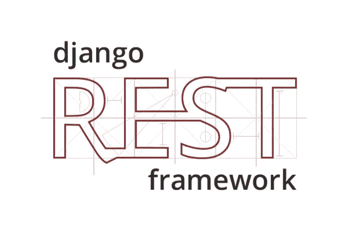
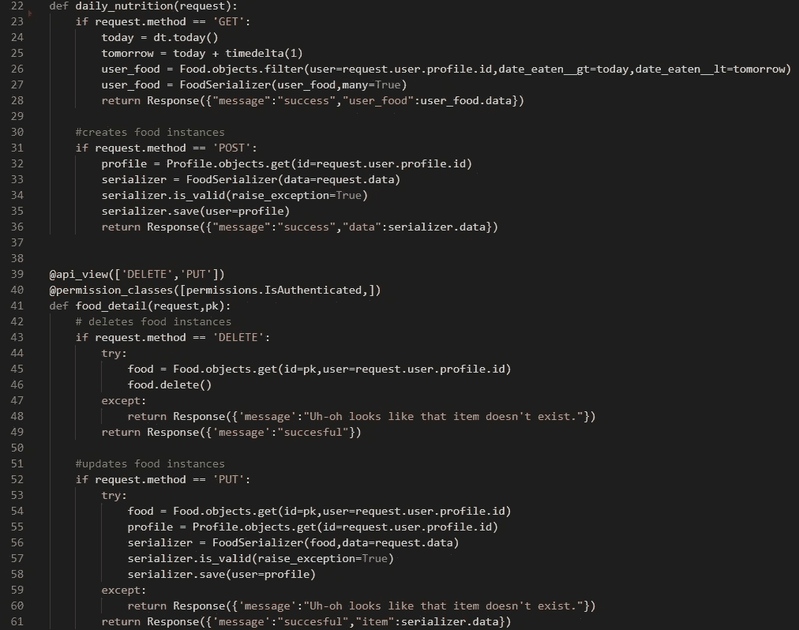
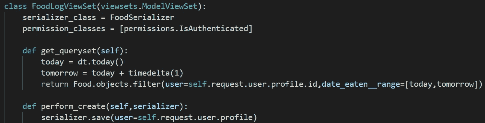
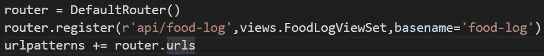

# 在 Django REST 框架中实现基于类的视图集

> 原文：<https://levelup.gitconnected.com/implementing-classed-based-viewsets-in-django-rest-framework-fd0224852f50>

使用 Django Rest 框架将基于函数的视图重构为基于类的视图集的简单例子。

> Django REST 框架是一个用于构建 Web APIs 的强大而灵活的工具包。

这不是一个使用 Django REST 框架的教程，但是你可以在 https://www.django-rest-framework.org/tutorial/quickstart/的[上学习。](https://www.django-rest-framework.org/tutorial/quickstart/)

# 为什么要使用 Django REST 框架？

Django 是一个用非常详细的文档创建 web 应用程序的强大框架。您可以仅使用 Django 创建应用程序的前端和后端，但是有时在混合中加入前端框架可能是有益的。有很多流行的前端框架，包括 React、Vue、Angular 等等。

为了允许这些前端框架与 Django 提供的后端进行通信，我们需要一个 API。这个 API 序列化数据，允许前端框架和后端之间的通信。你可以从头开始创建这些序列化器，但是 Django REST 框架可以用很少的代码创建序列化器。

# 如何创建这些 API

使用 Django REST，我们可以用许多不同的方式创建这些 API。一旦创建了序列化程序，就需要创建视图来处理前端发出的请求。我们将讨论您将会遇到的典型请求:GET、POST、PUT 和 DELETE。我们可以创建视图函数，以两种方式处理这些请求:

1.  使用`@api_view`装饰器的基于函数的视图
2.  基于类的视图/视图集

# Django 休息/反应卡路里跟踪器 API

我目前正在开发一个简单的卡路里跟踪器，在 REST API 中使用 Django-REST，在前端使用 React-Redux。大部分功能都是在网站上实现的，我只是在重构，给项目添加一些小细节。下面是该应用程序的简短演示。该应用程序的代码可以在以下位置找到:

 [## kristian-Roopnarine/Django-React-Calorie-Tracker

### 一个 Django/React-Redux 应用程序，允许用户跟踪每日卡路里摄入量。…

github.com](https://github.com/Kristian-Roopnarine/Django-React-Calorie-Tracker) 

当用户填写表单、编辑食物日志或删除条目时，我们会向后端发出请求来处理这些信息。

最初，我创建了基于函数的视图来处理这些请求。

基于函数的 API 视图

我编写了两个不同的视图函数，每个函数都使用条件来处理两个请求。它们都返回一个包含要在前端呈现的序列化数据的`Response`对象。

我不记得为什么我创建了两个不同的函数来处理这些请求，但我记得基于函数的逻辑可以提取到基于类的视图集中。当您必须对数据执行特定的修改或查询时，基于函数的视图是很好的，而不是基于类的视图。

**基于重构类的视图集看起来简单多了—**

重构的 CBV

我们能够将跨越 30 多行代码的函数变成近 10 行代码。基于类的视图集处理所有基本的 HTTP 请求:GET、POST、PUT、DELETE，而不需要硬编码任何逻辑。

如果您需要任何特定的功能，您可以覆盖这些方法。当我们的用户登录应用程序时，他们收到的食物日志数据应该是今天和那个用户的。要指定这一点，我只需简单地覆盖为该视图集返回 queryset 的方法。

每个食物日志条目都与用户有一个`ForeignKey`关系，这个关系在通过覆盖`perform_create`方法创建条目时应用。

# API 端点呢？

Django REST 框架使得创建与这个 API 交互的端点变得简单！在应用程序`urls.py`文件中，我们创建了一个`DefaultRouter`实例，它为我们创建了端点。

Django REST 框架创建 API 端点。

我们在路由器中注册视图集，并提供一个起始正则表达式字符串来与视图集交互。Django REST 将根据请求创建以下 URL:

*   获得:`api/food-log/`
*   帖子:`api/food-log/`
*   删除:`api/food-log/id/`
*   放:`api/food-log/id/`

# 摘要

当创建应用程序时，我们很容易过于专注于实现一个特性，而忽略了它在我们的程序中是如何工作的。我非常兴奋地让我的应用程序的部分工作起来，我决定单独编写这些视图函数，没有花时间去想这些请求可以一下子处理。我能够使用 Django REST 框架提供的基于类的视图集来补救这种情况。下次你实现一个特性的时候，仔细想想它是如何在你的程序中工作的，以防止以后不必要的重构！

 [## 克里斯蒂安-Roopnarine -概述

### Kristian-Roopnarine 有 29 个存储库。在 GitHub 上关注他们的代码。

github.com](https://github.com/Kristian-Roopnarine)