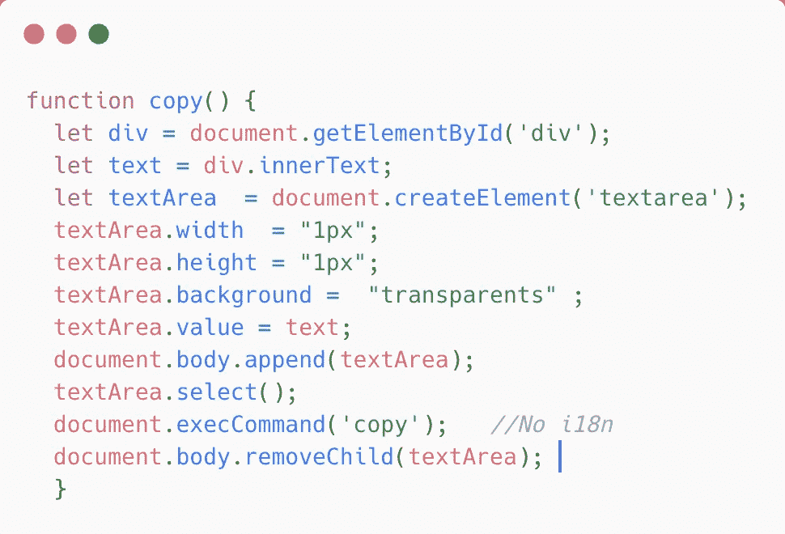

# 使用 JavaScript 实现点击复制

> 原文：<https://levelup.gitconnected.com/implementing-copying-text-of-div-in-javascript-f2f764ec03b7>

我们看到许多网站都有通过点击按钮来复制一段文字的选项。让我们学习如何使用普通的 JavaScript 来构建它。

```
Steps to copy text in javascript1\. Create a textarea element2\. Get the text from the div using div.innerText3\. Set the value of textarea with the text we retrived4\. Then select the text using **select()** method5\. Then use the method **document.execCommand('copy')** to copy text.NOTES: Don't forgot to set text area width and height, and also DO NOT set  "display : none" property to the textarea.
```

[](https://gitconnected.com/learn/javascript) [## 学习 JavaScript -最佳 JavaScript 教程(2019) | gitconnected

### JavaScript 是世界上最流行的编程语言之一——它随处可见。JavaScript 是一种…

gitconnected.com](https://gitconnected.com/learn/javascript)