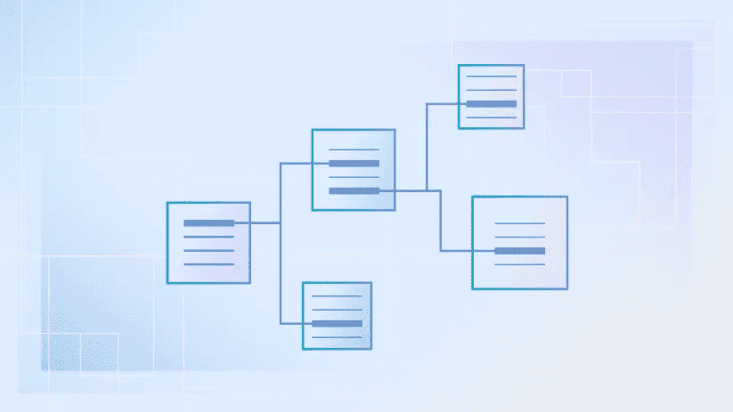
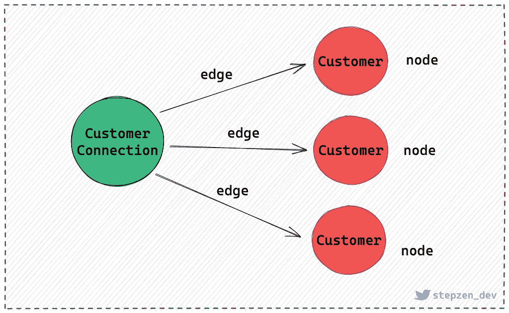

# 为每个 GraphQL API 实现基于光标的分页

> 原文：<https://levelup.gitconnected.com/implementing-cursor-based-pagination-for-every-graphql-api-3bcdcd9cc4bd>



后端通常会返回大量数据，同时获取所有数据会导致更多开销并增加响应时间。分页通过在后续请求中接收小块数据来保持应用程序的性能，直到接收到整个数据集。

当脸书公开发布 GraphQL 作为一种客户端驱动的基于 API 的查询语言时，它迅速得到了大肆宣传，因为它允许前端开发人员轻松修改他们的后端。使用 GraphQL 的应用程序效率更高，可以在慢速网络上快速工作，因此，它正在迅速取代 REST 等传统 API 架构。分页是 GraphQL 中的一个基本概念，但是 GraphQL 中关于分页的资源并不多。

在本文中，我们将比较在 GraphQL 中处理分页的不同方式，并学习如何使用 StepZen 配置 REST 指令来为每个 REST API 执行基于光标的分页。

> **TL；DR** :你可以在这里找到使用 StepZen [分页 GraphQL 的完整文档。](https://stepzen.com/docs/connecting-backends/rest-services-graphql-pagination)

## 比较 GraphQL 中不同的分页方法

GraphQL 中的分页与 REST APIs 中的分页没有什么不同，尽管某些类型的分页更适合 GraphQL。在讨论 GraphQL 中首选的分页方法之前，我们先来看看不同的分页类型。通常，API 提供了三种分页方法。这些是:

*   [胶印分页](https://stepzen.com/blog#1-offset-pagination)
*   [页码分页](https://stepzen.com/blog#2-page-number-pagination)
*   [光标分页](https://stepzen.com/blog#3-cursor-pagination)

## 1.偏移分页

偏移量分页由两个主要参数组成:limit 和 Offset。该限制表示要显示的最大结果数。偏移量表示列表中分页开始的位置。

假设您有一个 100 名学生的列表。如果将 limit 参数设置为 10，offset 参数设置为 20，则数据库引擎将从第 20 个学生开始计数，并在每次迭代中显示接下来的 10 个学生。例如，第一次迭代将显示学生从 20 岁到 30 岁，然后从 30 岁到 40 岁，等等。

虽然偏移分页是最直接的方法，但是它有一个很大的缺点。当添加或删除某些项时，偏移分页会导致重复或丢失数据值。

**优点:**

*   通常最常用的分页方式。
*   实现相对简单。
*   大多数基于 SQL 的数据库支持 limit 和 offset 变量，因此映射值更容易。

**缺点:**

*   容易出现数据不一致(数据重复或缺失)。
*   它不提供关于更多页面、总页面或检索以前页面的信息。

## 2.页码分页

顾名思义，页码分页为每个请求返回一页。在处理表格时，你们都见过“下一页”选项；每张表显示相同数量的结果或条目。类似地，页码分页为每个请求返回相同数量的结果。

我们举个例子来了解一下它的工作原理。页码分页使用 after 参数来指示分页的起点。例如，如果您有一个 30 名学生的列表，并将 after 和 limit 参数分别设置为 23 和 5，那么输出列表将显示从第 23 到第 28 个条目的 5 名学生的列表。

页码分页更加可靠，因为即将到来的结果是从最后获取的值开始的。

**优点:**

*   更容易实现。
*   不需要复杂的逻辑分析。

**缺点:**

*   数据不一致。

## 3.光标分页

第三种分页是基于光标的分页。然而，它是最复杂的，但适用于动态数据。因此，这是在 GraphQL 中进行分页的首选方式。

此方法包括光标的特定参数。游标只是一个参考点，它显示了数据库中某项的位置。在图形表示中，数据表示为节点，光标表示为边。

游标是一个 base64 编码的数字。为基于光标的分页编写的查询返回一个对象表示，而不是一个列表。

**优点:**

*   在 GraphQL 中进行分页的首选方式。
*   为 UX 的使用提供了有价值的数据。
*   允许反向分页。
*   在动态数据的情况下没有问题，因为分页是针对特定的行进行的。

**缺点:**

*   它不允许随机访问。
*   需要复杂的查询。

## 如何使用 StepZen 在 GraphQL 中实现分页

现在您已经了解了所有可能的分页方法，以及在 GraphQL 中进行分页的首选方式，即基于光标的分页。如果您的 REST API 支持偏移量或页码分页，那么您可以使用 StepZen 在 GraphQL 中轻松实现基于光标的分页。

您需要为每种分页类型指定的两个基本参数是`type`和`setters`。`type`参数定义了您想要实现的分页样式。它有三个可能的值:`PAGE_NUMBER`、`OFFSET`和`NEXT_CURSOR`。接下来是`setters`参数，它需要指向一个字段，指示响应将输出多少结果或页面。您可以在[文档](https://stepzen.com/docs/connecting-backends/rest-services-graphql-pagination/)中找到不同分页样式的所有参数列表。

让我们看一些例子:

## 1.为偏移量实现游标分页

下面的代码片段演示了如何使用 StepZen for REST APIs 实现 GraphQL 基于光标的分页，该 API 支持偏移分页。请注意，参数`first`被设置为所需结果的数量。第二个参数`after`被设置为分页的起点。

```
customers(
  first: Int! = 20 
  after: String! = ""
): CustomerConnection
  @rest(
    endpoint:"https://api.example.com/customers?limit=$first&offset=$after"
    pagination: {
        type: OFFSET
        setters: [{field:"total" path: "meta.total_count"}]
      }
    )
```

因为这是第一个请求，`after`参数等于一个空字符串。`first`参数设置为`20`，表示将返回前 20 个结果。在第二次请求时，您可以将`after`的值更改为等于前一次请求的`first`的值。每个新请求都是`first`参数的倍数。

## 2.实现页码分页

当您的 REST API 依赖于页码分页时，请查看以下代码，以便更好地理解如何使用 StepZen 在 GraphQL 中实现基于光标的分页:

```
customers(
  first: Int! = 20 
  after: String! = ""
): CustomerConnection
  @rest(
    endpoint:"https://api.example.com/customers?page=$after&per_page=$first"
    pagination: {
        type: NEXT_CURSOR
        setters: [{field:"nextCursor" path: "meta.next"}]
      }
    )
```

上面的例子说明了一些重要的方面。`after`参数设置为空字符串，表示这是第一个请求。相比之下，第一个参数设置为`20`，意味着每页将返回 20 个结果。记住，第一个参数的值对于后续请求也保持不变。即将到来的请求中的`after`参数将根据您想要返回的页码。例如，第三页是`3`，第四页是`4`。

## 3.实现游标分页

实现基于光标的分页与其他两种分页方法非常相似。唯一的区别是您需要将`type`参数指定为`NEXT_CURSOR`，并将 setters 参数更改为指向表示下一个光标的字段。

```
customers(
  first: Int! = 20 
  after: String! = ""
): CustomerConnection
  @rest(
    endpoint:"https://api.example.com/customers?first=$first&after=$after"
    pagination: {
        type: NEXT_CURSOR
        setters: [{field:"nextCursor" path: "meta.next"}]
      }
    )
```

当然，这只适用于 REST API 已经支持基于光标的分页的情况。

## 如何在 GraphQL 中查询光标分页

在上一节中，您已经了解了如何使用 StepZen 为任何 REST API 实现基于光标的分页。例如，基于光标的分页由 [Relay](https://relay.dev/graphql/connections.htm) 使用，并且也由 StepZen GraphQL API 支持。基于光标的分页是 GraphQL 中进行分页的首选方式，因为它为 UX 的使用提供了有价值的数据。但是，正如我们在第一节中看到的，它也带来了查询更复杂的缺点。

让我们看看基于光标的分页所使用的`Connection`类型:

```
type Customer {
  activities: [Activity]
  addresses: [Address]
  contacts: Contacts
  description: String
  designation: String
}

type CustomerEdge {
  node: Customer
  cursor: String
}

type CustomerConnection {
  pageInfo: PageInfo!
  edges: [CustomerEdge]
}
```

`CustomerConnection`类型是由`customers`查询返回的类型。它包含一个类型为`PageInfo`的`pageInfo`字段。`PageInfo`类型包含以下字段:

```
query MyQuery {
  customers {
    pageInfo {
      endCursor
      hasNextPage
      hasPreviousPage
      startCursor
    }
  }
}
```

这些字段通知您当前页面，以及是否有更多页面要获取。`endCursor`和`startCursor`字段是您需要在下一个请求中使用的光标。`hasNextPage`和`hasPreviousPage`字段指示是否有更多页面要获取。

`edges`字段包含一列`CustomerEdge`对象。`CustomerEdge`类型包含一个`Customer`类型的`node`字段。要获得关于客户的信息，您需要使用`node`字段:

```
query MyQuery {
  customers(first: 3, after: "eyJjIjoiTzpRdWVyeTpwYXJrcyIsIm8iOjl9") {
    edges {
      node {
        id
        description
      }
    }
  }
}
```

“边和节点”的概念有点混乱，但非常简单。它来源于 GraphQL 中的一切都是图的概念。`edges`字段包含一个`CustomerEdge`对象列表，该列表是特定于该连接的信息，但不是所有节点共享的。类型`CustomerEdge`包含类型`Customer`的`node`字段。这是真实的客户信息。



对于中继，您可以在[文档](https://relay.dev/graphql/connections.htm)中找到有关 GraphQL 连接的更多信息。

## 结论

GraphQL 允许不同种类的分页。但是，如何决定哪一个效果最好呢？GraphQL 建议使用基于光标的分页。但是，这取决于您的应用程序的要求。如果您使用的 REST API 已经支持基于光标的分页，那么这是显而易见的。但是如果您使用的 REST API 不支持基于光标的分页，那么您可以使用 StepZen 来实现它。

最常见和最简单的分页方式是**偏移**和**页码**。尽管它们实现起来相对简单，但它们更适合静态数据。相比之下，**基于光标的分页**比较复杂，但是最适合更改数据，因为它可以防止数据不一致。使用 StepZen，可以直接为任何 API 实现基于光标的分页。

请访问 [StepZen Docs](https://stepzen.com/docs/quick-start) 了解更多信息。用一个[免费账户](https://stepzen.com/signup)试试吧，我们很乐意得到你的反馈，并回答关于我们[不和](https://discord.com/invite/9k2VdPn2FR)的任何问题。