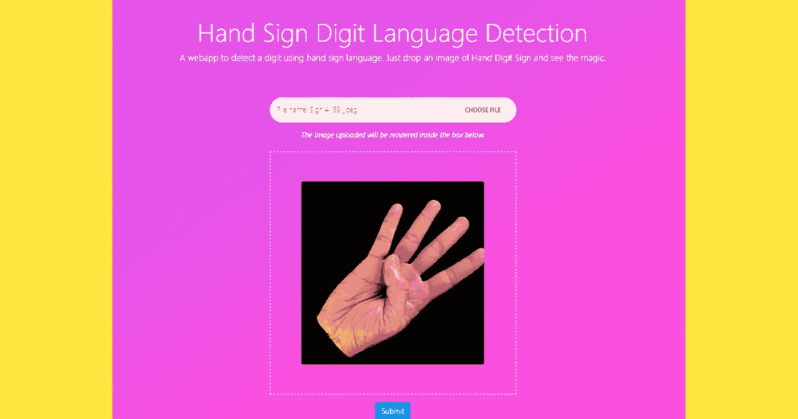
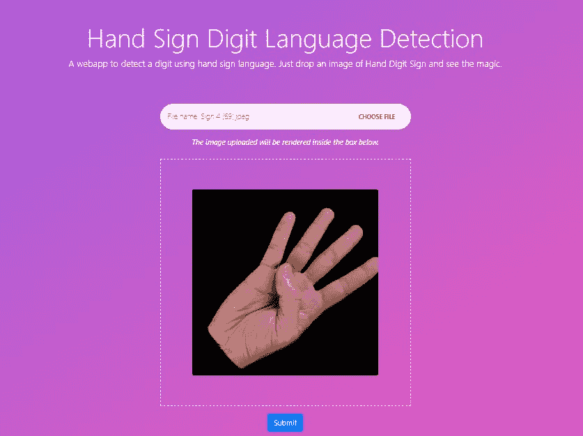
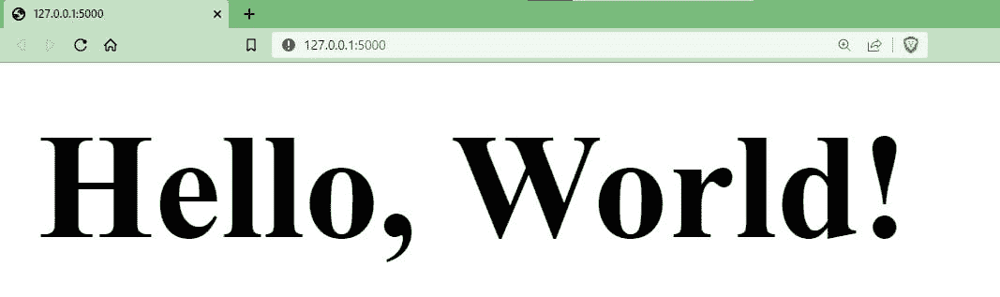

# 将定制深度学习模型实现到 Flask 应用中以进行图像识别

> 原文：<https://levelup.gitconnected.com/implementing-custom-deep-learning-model-into-flask-app-for-image-recognition-3ccd4e451839>



**来源:作者(**[**GeekPython**](https://geekpython.in/flask-app-for-image-recognition)**)**

我们将制作的 web 应用程序是关于预测手势语数字的图像。该模型在 Kaggle 上找到的名为“[美国手语](https://www.kaggle.com/datasets/rayeed045/american-sign-language-digit-dataset)”的数据集上进行训练。

本教程将重点介绍使用 Flask web 框架制作 web 应用程序，因此所有必要的后端流程，包括数据准备、数据预处理和训练模型，都已经完成。

我们将通过在客户端嵌入模型来实现我们的模型。

# 概观

该 web 应用程序有一个漂亮的用户界面，其中我们有一个**图像上传**区域和一个**图像预览**部分，在这里我们可以看到上传图像的预览。所有这些都是使用 **Bootstrap、CSS 和 JS** 制作的。web 应用程序有一个负责处理预测和呈现预测页面的按钮，在这里我们将看到使用自定义模型预测图像所获得的结果。



**来源:作者(**[**geek python**](https://geekpython.in/flask-app-for-image-recognition)**)**

点击[这里](https://user-images.githubusercontent.com/72191416/201943098-c8f5fd8b-ec7d-4e5d-883d-8b69109b946f.mp4)看一眼 app。

我们使用 **Bootstrap** 构建我们的客户端界面并预览用户将要上传的图像，我们使用**自定义 CSS 和 JS** ，我们使用 **Keras、NumPy 和 Pillow** 在后端识别和预测图像。

# 属国

我们需要以下依赖关系来开始这个项目。

# 安装依赖项

我们需要安装上面看到的依赖项。打开您的终端并运行以下命令，使用 ***pip*** 安装库。

```
pip install Flask tensorflow numpy Pillow
```

该命令将开始在您的基本 Python 环境中安装库。如果您的环境中已经安装了这些库，则该命令会将这些库升级到更新版本，或者提示一条消息，说明已经满足要求。

然而，建议您使用将库保存在**隔离 Python 环境**中的**虚拟环境**，避免相同依赖项的不同版本之间的冲突，这样您的其他项目就不会因为依赖项版本的变化而受到**影响**。

***要创建 Python 虚拟环境，请参见下面的详细指南。***

[](https://geekpython.in/python-virtual-environments-venv) [## Python 虚拟环境[VENV] -什么是虚拟环境，如何设置

### 除了您的主要 Python 环境之外，您是否需要一个隔离的环境来管理不同的…

geekpython.in](https://geekpython.in/python-virtual-environments-venv) 

在项目目录中成功地设置了虚拟环境并安装了所需的依赖项之后，继续进行编码部分。

# 创建 flask 服务器

我们将创建一个基本的 Flask 服务器，在本地主机上使用默认的**端口号 5000** 启动我们的 web 应用程序。

在项目目录的根文件夹中，创建一个名为`app.py`的文件，并添加以下代码来启动 flask 服务器。

```
from flask import Flask

app = Flask(__name__)

@app.route('/')
def hello_world():
    return '<h1>Hello, World!</h1>'
```

要运行该应用程序，请打开您的终端并将目录更改为项目目录，或者打开与 IDE (PyCharm)或**代码编辑器** (VS Code)集成的**终端，并执行以下命令。**

```
>flask --app app.py run
```

了解如何从终端运行 flask 应用程序。以下指南将帮助您了解不同标志的 `*flask run*` *命令的用法。*

[](https://geekpython.in/run-flask-app-from-the-command-line-in-windows) [## 如何在 Windows 中从命令行运行 Flask App

### Flask 是一个纯粹用 Python 编写的微型 web 框架，它允许我们构建 web 应用程序。烧瓶是…

geekpython.in](https://geekpython.in/run-flask-app-from-the-command-line-in-windows) 

这将在端口号为 **5000** 的 **localhost** 上启动我们的开发服务器，我们可以访问网址为`[http://127.0.0.1:5000](http://127.0.0.1:5000.)` [的 web app。](http://127.0.0.1:5000.)



烧瓶应用预览

我们的 flask 应用程序已经准备好了，我们将开始把我们的应用程序构建成一个好的 web 应用程序。但是首先，我们必须编写我们的后端。

# 后端编码

在编写用户界面之前，我们需要创建**函数**，它将处理上传图像的**预处理和对上传图像的预测**。

创建一个名为`model.py`的 Python 文件，我们处理图像预处理和预测的所有函数都放在这个文件中。

首先，我们导入了将在代码中进一步使用的库。

*   **来自`keras.model`的 load_model** 将用于加载模型。
*   **来自`keras.utils`的 img_to_array** 将用于将图像转换成数组。
*   numpy 用于将图像转换成一个数组，但是我们将在预测函数中使用它。
*   来自 **PIL** (Python 图像库)的**图像**将用于加载图像。

在下一节中，我们使用`load_model`函数加载我们的模型，在其中指定我们的训练模型的路径，并将其存储在名为`model`的变量中。

然后，我们定义了预处理图像的函数，它采用图像的**路径**，然后我们使用`Image.open`函数加载图像。然后，我们将加载的图像调整为 224 x 224 的尺寸，因为我们使用迁移学习技术来训练我们的模型。**我们用于迁移学习的**[**MobileNet**](https://keras.io/api/applications/mobilenet/)**模型是用 224 x 224 尺寸的图像**进行预训练的。然后，我们创建了调整过大小的图像的**数组**，通过将其除以 **255.0** ，我们将图像像素范围从 **0 转换为 1** ，然后将其整形为所需的形状并返回。

最后，我们建立了一个函数来预测预处理图像的结果。

# 前端编码

后端部分完成。现在我们将编写 web 应用程序的前端部分。在`app.py`文件中，添加以下代码。

最初，我们导入了所需的库和函数来帮助我们在这段代码中前进。

*   **烧瓶**将用于创建或服务我们的应用程序。
*   **render_template** 将用于渲染我们的 HTML 文件。
*   **请求**在我们的应用程序前端访问用户上传的图像。

`preprocess_img`和`predict_result`是我们在`model.py`文件中创建的函数。

之后，我们创建了 home route，在这里我们用 path ( `/`)和函数`main`定义了 decorator `@app.route("/")`来呈现 HTML 模板`index.html`。

**index.html**文件包括 web 应用程序的用户界面，它有一个上传图像的表单、一个图像预览部分和一个提交按钮。

在 flask 应用程序中添加 HTML 文件。在目录的根文件夹中创建一个名为`templates`的文件夹，然后创建名为`layout.html`和`index.html`的文件。

***layout.html***

layout.html 文件包含 HTML 样板文件，我们在其中包含了定制的 CSS 和 JS 文件。

***index.html***

在图像上传部分，我们添加了将处理**图像上传、预处理和预测**的 **URL** 。此外，我们添加了`method='post'`来处理 **POST** 请求。我们将在本教程之前定义`predict_image_file`的逻辑。

现在，添加自定义 CSS 和 JS 文件，这些文件将添加样式和功能，以便用户预览上传的图像。

在项目目录的根文件夹中创建一个名为`static`的文件夹，然后在文件夹中创建子文件夹`css`和`js`，然后分别添加`custom.css`和`image_upload.js`文件。

**custom . CSS**

这个 **CSS** 文件为我们的 web 应用程序的用户界面提供了额外的样式。

**image _ upload . js**

这个 **JS** 文件显示了上传到我们 web 应用程序上的图片预览。

*制作我们 web app 的 UI 的参考，这里是取自*[](https://jsfiddle.net/bootstrapious/8w7a50n2)**。**

*在添加了所有的 HTML、CSS 和 JS 文件之后，有趣的部分来了。*

*然后我们定义了另一条路径，它包含了一个 **POST** 请求的代码，图像的**预处理**，然后是**预测**。*

*在`app.py`文件的这一部分，我们使用装饰器`@app.route('/prediction', methods=['POST'])`创建了预测路由，其中我们指定了路径`/prediction`并将方法设置为`POST`以处理 **post 请求**。*

*然后定义函数`predict_image_file`，其中代码获取用户上传的图像的**图像流**，并且**使用来自`model.py`文件的函数`preprocess_img`执行预处理**，然后**使用`predict_result`函数预测结果**，然后最终呈现我们可以看到结果的`result.html`页面。*

*为了避免任何错误，我们将代码包装在`try-except`块中，其中如果用户上传了一个无法处理的文件，那么代码将在前端显示错误。*

*要添加结果页面，在 templates 文件夹中创建一个名为`result.html`的文件，并添加以下 HTML。*

****result.html****

*如果用户上传的图像被成功处理，该页面负责显示预测。否则，将显示错误消息。*

****获取这个 app 的源代码👇****

*[](https://github.com/Sachin-crypto/Flask_Image_Recognition) [## GitHub-Sachin-crypto/Flask _ Image _ Recognition:这个 Flask webapp 是关于预测牌型的…

### 这个 Flask webapp 是基于深度学习模型预测手势数字图像的，该模型使用…

github.com](https://github.com/Sachin-crypto/Flask_Image_Recognition) 

# 结论

在本教程中，我们学习了基于深度学习模型创建用于图像识别的 Flask 应用程序。

我们在制作应用程序时学到了一些要点:

*   **在 app 中实现深度学习模型**
*   **创建烧瓶应用程序**
*   **使用自定义模型预测图像**
*   **图像预处理**

前往我的 [GitHub](https://github.com/Sachin-crypto/Flask_Image_Recognition) 获取**源代码**开始这个项目。* 

*🏆**如果你喜欢这篇文章，你可能会喜欢的其他文章***

***✅** [**搭建一个 Streamlit app，对新冠肺炎数据**](https://medium.com/@geekpython/python-web-app-under-100-lines-of-code-using-streamlit-f862d2f1693b) **进行可视化分析。***

***✅** [**用简单的步骤在 Heroku 服务器上部署你的 Streamlit 应用**](https://medium.com/@geekpython/how-to-deploy-streamlit-app-to-heroku-server-a8c4a657808d) **。***

***✅** [**为你的博客创建一个功能齐全的联系表单，每当用户发送消息时，你都会收到一封电子邮件，并将被动态保存在数据库中**](https://medium.com/@geekpython/contact-form-for-your-blog-get-emails-save-in-db-dynamically-8faaa5d8c5b6) **。***

***✅** [**如何在 Python 中使用 async/await**](https://medium.com/@geekpython/asyncio-how-to-use-async-await-in-python-ef4372a8c2c5)**。***

***✅** [**如何执行 Python 中动态生成的代码**](https://medium.com/@geekpython/using-exec-to-execute-dynamically-generated-code-in-python-758ae20b3a7c) **。***

***暂时就这些了***

***保住 Coding✌✌***

**原发布于*[*https://geek python . in*](https://geekpython.in/flask-app-for-image-recognition)*。**

# *分级编码*

*感谢您成为我们社区的一员！在你离开之前:*

*   *👏为故事鼓掌，跟着作者走👉*
*   *📰查看[升级编码出版物](https://levelup.gitconnected.com/?utm_source=pub&utm_medium=post)中的更多内容*
*   *🔔关注我们:[Twitter](https://twitter.com/gitconnected)|[LinkedIn](https://www.linkedin.com/company/gitconnected)|[时事通讯](https://newsletter.levelup.dev)*

*🚀👉 [**加入升级人才集体，找到一份惊艳的工作**](https://jobs.levelup.dev/talent/welcome?referral=true)*