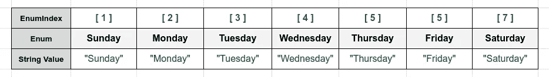
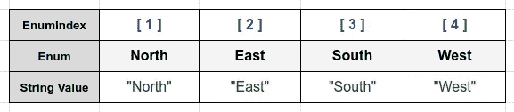

# 在 Golang 中实现枚举

> 原文：<https://levelup.gitconnected.com/implementing-enums-in-golang-9537c433d6e2>

## 枚举将相关的常数组合在一个类型中。枚举是一个具有广泛用途的强大功能。然而，在 Go 中，它们的实现与大多数其他编程语言完全不同。

[Christopher Gower](https://unsplash.com/@cgower?utm_source=unsplash&utm_medium=referral&utm_content=creditCopyText) 在 [Unsplash](/s/photos/code?utm_source=unsplash&utm_medium=referral&utm_content=creditCopyText) 上拍摄的照片

**注意:**在您继续学习之前，我希望您对 go 语法和原始类型有一个初级的了解，以便理解源代码。

在本文中，我将向您展示如何使用预先声明的标识符`iota`在 Golang 中实现枚举。在继续列举之前，我们先了解一下什么是`iota`以及它是如何使用的。

## iota 是什么？

`iota`是一个与`constant`一起使用的标识符，它可以简化使用自动递增数字的常量定义。`**iota**`关键字代表从零开始的整数常量。

iota 关键字表示连续的整数常量 0，1，2，…每当 const 一词出现在源代码中时，它就重置为 0，并在每个 const 规范之后递增。

代码清单 1.1 — [在 Go 操场上跑步](https://play.golang.org/)

你可以避免在每个常量前写连续的`iota`。这可以简化为下面的代码清单:

代码清单 1.2 — [在 Go 操场上跑步](https://play.golang.org/p/VvCKeMvLn23)

要从 1 而不是 0 开始一个常量列表，可以在算术表达式中使用`iota`。

代码清单 1.3 — [在 Go 操场上跑步](https://play.golang.org/p/XoDG3NQ2fQc)

您可以使用空白标识符跳过常数列表中的值。

## 使用 iota 实现枚举

为了实现自定义枚举类型，我们必须考虑以下几点

*   声明一个新的自定义类型—整数类型。
*   使用`iota`声明相关常数。
*   创建通用行为——给类型一个`String`函数。
*   创建额外的行为——给类型一个`EnumIndex`函数。

## 示例 1: C *为工作日创建一个枚举。*

工作日—按作者分类的图像

代码清单 1.4- [在 Go 操场上跑步](https://play.golang.org/p/CGj0fFeU3kJ)

## 示例 2:为方向创建一个枚举。

方向-作者提供的图片

代码清单 1.5- [在 Go 操场上跑步](https://play.golang.org/p/SnJFpftp5Gm)

## 结论

枚举是由一组命名常数值组成的数据类型。枚举是一个具有广泛用途的强大功能。然而，在 Golang 中，它们的实现与大多数其他编程语言完全不同。Golang 不直接支持枚举。我们可以用`iota`和`constants`来实现。

就这些了…继续学习…快乐学习😃

# 分级编码

感谢您成为我们社区的一员！[订阅我们的 YouTube 频道](https://www.youtube.com/channel/UC3v9kBR_ab4UHXXdknz8Fbg?sub_confirmation=1)或者加入 [**Skilled.dev 编码面试课程**](https://skilled.dev/) 。

 [## 编写面试问题+获得开发工作

### 掌握编码面试的过程

技术开发](https://skilled.dev)