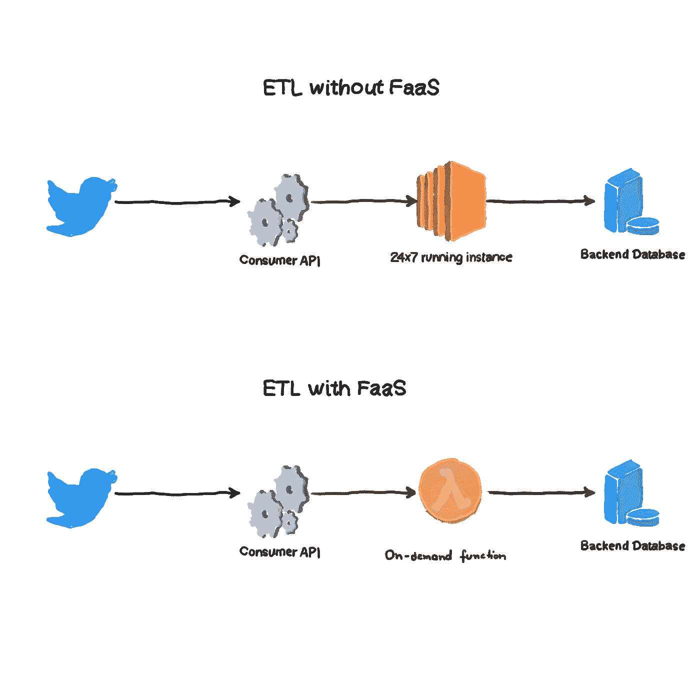
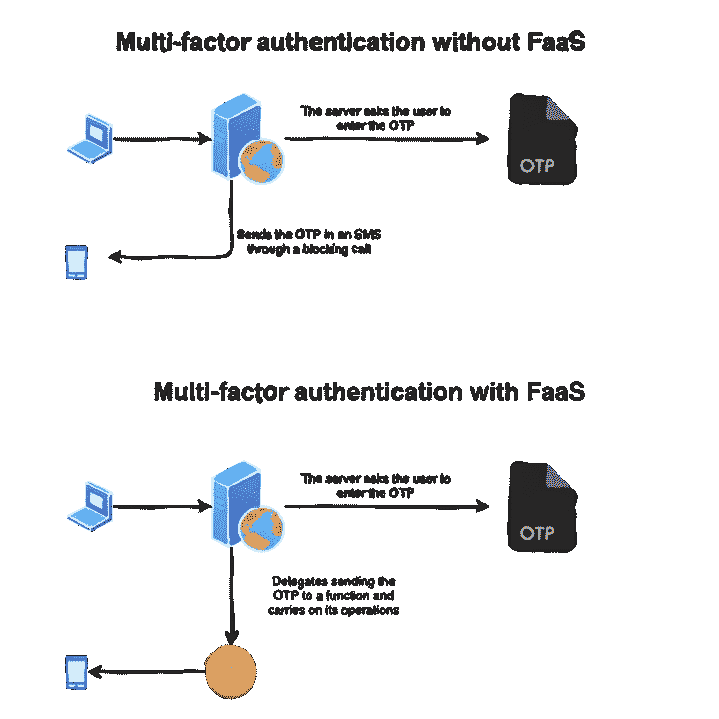
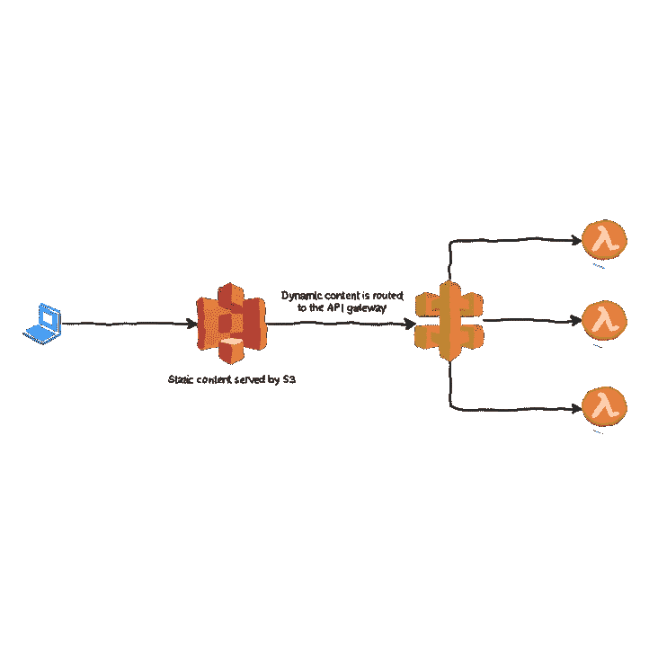
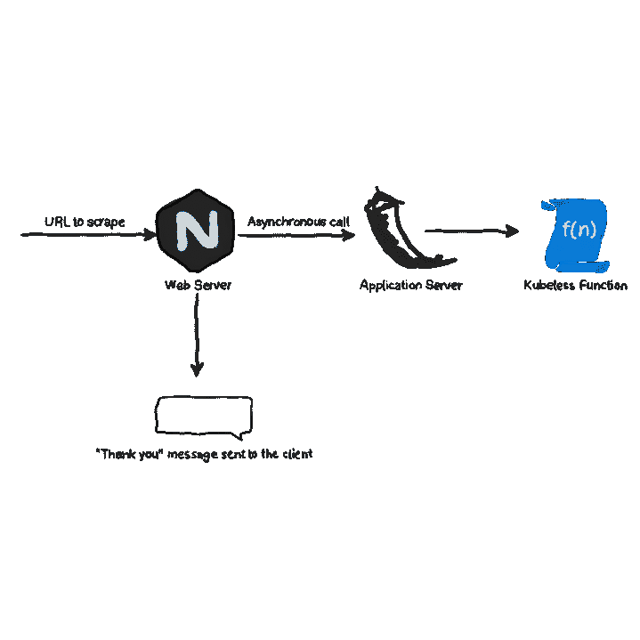
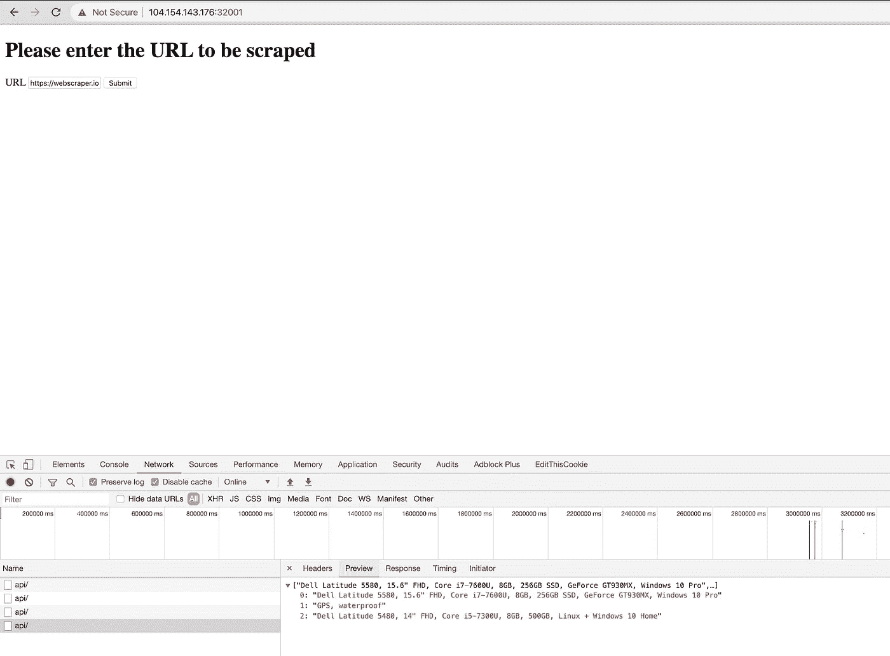

# 使用 Kubeless 在 Kubernetes 中实现 FaaS

> 原文：<https://levelup.gitconnected.com/implementing-faas-in-kubernetes-using-kubeless-c4797156f561>

*本文原载于*[https://www . magalix . com/blog/implementing-FAAS-in-kubernetes-using-kubeless](https://www.magalix.com/blog/implementing-faas-in-kubernetes-using-kubeless)

# 什么是 FaaS 架构，我们什么时候需要它？

功能即服务(FaaS)是一种相对较新的架构模式。当 AWS 等主要云提供商开始提供 Lambda 函数等产品时，它就出现了，随后是 Azure 函数(微软 Azure)和谷歌云函数(谷歌云)。这些产品背后的想法是，有时，你可能不需要“永远在线”模式的服务。相反，你想要“一次性”的服务；只有当一个请求到达，然后“死亡”时，它才被激活如果一个新的请求需要实现，一个新的服务实例被启动，等等。

为了帮助您更好地理解 FaaS 模型何时适用，请考虑以下用例:



*   双因素身份验证:您有一个非常棒的 web 应用程序，每天都有大量的访问者，由于它越来越受欢迎，您决定增加安全措施以避免任何黑客攻击。因此，您实现了一个双因素身份验证系统，在该系统中，用户输入他们的密码，还必须输入一次性密码(OTP)代码，该代码会发送到他们注册的手机上。问题是让 web 应用程序二进制发送 SMS 需要一个阻塞执行过程，这不仅会导致向最终用户显示页面的延迟，而且还会增加 web 应用程序服务器的负载，尤其是在繁忙/高峰时间。一个可能的解决方案是将发送 SMS 委托给一个功能。一旦被触发，该功能将在另一个容器中执行以满足请求(即发送 SMS)。验证用户输入了用户名和密码后，web 应用程序立即显示第二个页面，要求用户输入发送到他/她的手机的 OTP 代码。下图有助于解释在这种情况下使用 FaaS 的优势:



无服务器编程:FaaS 的一些应用程序包括创建整个 web 应用程序，而无需管理任何服务器。例如，一个 web 应用程序除了由应用服务器(PHP、Go、Ruby、Python 等)生成的动态内容之外，还由一些静态内容(HTML、JavaScript、images、CSS 等)组成。)，后端数据库可以使用 FaaS 和无服务器编程来构建，如下所示:

*   请求到达网络服务器。像 AWS 这样的云提供商提供云管理的静态内容服务器，例如 AWS S3。然后，从桶中提供任何静态文件。
*   当请求动态内容时，静态 HTML 页面向 API 网关发出请求(通常通过 AJAX ), API 网关是应用程序和云功能之间的接口。
*   云函数被触发，它完成请求并在终止前返回结果。在后台，云提供商启动一个容器，在其中执行该功能。一旦执行完成，容器就会死亡。我们可以在下图中以 AWS 为例描述无服务器托管:



# 什么是无库？

现在，您已经了解了 FaaS，以及为什么和何时应该使用它，是时候做一个快速实践练习来演示我们如何在 Kubernetes 中使用该模型了。让这成为可能的著名工具之一是 [kubeless](https://kubeless.io/) 。Kubeless 可以被认为是 Kubernetes 的附加产品。它创建了一个定制资源(和一个处理它的控制器),还提供了一个方便的命令行工具，允许您轻松地发出命令。在本文的其余部分，我们将在我们的集群中安装 kubeless，并使用它为 web 应用程序实现一个非常简单、极简的 FaaS 模型。

# 无缝安装

安装非常简单。它只涉及对正在运行的 Kubernetes 集群发出三个命令:

```
$ export RELEASE=$(curl -s https://api.github.com/repos/kubeless/kubeless/releases/latest | grep tag_name | cut -d '"' -f 4)
$ kubectl create ns kubeless
$ kubectl create -f [https://github.com/kubeless/kubeless/releases/download/$RELEASE/kubeless-$RELEASE.yaml](https://github.com/kubeless/kubeless/releases/download/$RELEASE/kubeless-$RELEASE.yaml)
```

上面的命令创建了一个名称空间，并部署了必要的组件以使 kubeless 工作。如果您打算广泛使用 kubeless，我们强烈建议您也安装他们提供的命令行工具:

```
export OS=$(uname -s| tr '[:upper:]' '[:lower:]')
curl -OL https://github.com/kubeless/kubeless/releases/download/$RELEASE/kubeless_$OS-amd64.zip && \
  unzip kubeless_$OS-amd64.zip && \
  sudo mv bundles/kubeless_$OS-amd64/kubeless /usr/local/bin/
```

以上命令将在您的 linux/macOS 系统上安装 kubeless CLI 工具。如果你运行的是 Windows，你可能想参考[文档](https://kubeless.io/docs/quick-start/)来了解具体步骤。

# 实验:使用 FaaS 在 Kubernetes 中实现一个 Web Scraper

我们将编写一个非常简单的 web 应用程序，它接受来自用户的 URL，然后从网站中抓取重要数据。最后，数据被清理并保存到后端数据库。使用 FaaS，我们可以启动一个函数来异步抓取数据，这样它就不会阻塞用户的 UI。该模型可以进一步扩展，以调用另一个函数，通知用户他们的数据已经成功抓取，可以下载了(可能以 CSV 或 PDF 的形式)。

我们的工作流程可以详细描述如下:

*   应用程序通过 AJAX POST 请求接收 URL。
*   web 应用程序不是自己处理任务并阻塞 UI，而是分派一个函数(通过由 Kubernetes 创建的 Kubernetes 服务)来抓取 web 页面的数据。
*   最终，数据可以保存到永久存储器(MySQL、Redis 等)。).

我们可以画一个简单的图表，描述应用程序的工作流程如下:



现在您已经知道了系统的样子，让我们继续实际构建它。

我们正在使用的网站是 https://webscraper.io/test-sites/e-commerce/allinone。这是一个专门为测试网络抓取工具而创建的网站。现在，让我们来完成实验步骤。

# 创建无库函数

您可以为该函数使用许多运行时环境，这意味着您可以用自己喜欢的编程语言编写该函数。在这个实验中，我们使用 Python。我们的 Kubeless 函数驻留在 scraper.py 文件中(名字不重要)。该文件的内容如下:

```
from bs4 import BeautifulSoup
import requests
import jsondef main(event, context):
   url = event['data']['url']
   r = requests.get(url)
   soup = BeautifulSoup(r.text, 'html.parser')
   items =  [x.find("p",{"class":"description"}).text for x in soup.find_all("div",{"class":["col-sm-4", "col-lg-4", "col-md-4"]})]
   return json.dumps(items)
```

该脚本简单地抓取页面并返回待售商品的标题。这里我们需要注意的第一件事是文件的结构:

*   代码必须存在于接受两个参数的函数中(名称无关紧要):事件和上下文。事件是包含传递给函数的数据的对象，而上下文包含与函数相关的任何其他元数据。
*   您可以在文件中使用任意数量的其他函数。然而，您需要选择启动代码执行的引导函数(稍后在部署我们的函数时会详细介绍)

如果你以前使用过 Python，你可能会注意到我们使用了两个非标准的库，即:requests 和 bs4 (BeautifulSoup)。这带来了一个重要的问题:

# 如果代码需要依赖怎么办？

通常情况下，您需要安装第三方库来执行复杂的任务。在我们的实验室中，我们使用 bs4 进行网页抓取和请求，以便轻松获取网页数据。要允许无库函数使用外部库，您必须做两件事:

1.  将库安装到您的函数所在的根目录。在 Python 中使用 pip: pip3 install -t . bs4 请求可以很容易地做到这一点
2.  将包含函数文件+外部库的整个目录打包到一个 zip 文件中。因此，假设您在目录中，zip -r9 ~/package.zip *将所有内容压缩到您主目录中的 package.zip 文件中。

现在，您可以简单地将 zip 文件部署为函数文件。但是，根据设计，etcd 不能存储大小超过 1.5 MB 的对象。这意味着如果 zip 文件很大(这是经常发生的情况)，我们就不能在 Kubernetes 数据库中存储我们的函数。此问题的解决方案是将文件存储在文件服务器上，并提供文件位置的 URL。在我们的实验室中，我们使用 GitHub 来实现这个目的，但是您可以使用任何 HTTP 服务器，只要它可以从 pod 到达。现在，让我们看看如何部署我们的功能。

# 部署无库功能

与其他 Kubernetes 对象一样，您可以使用无库工具强制部署无库功能，也可以使用 YAML 文件声明式部署。在本实验中，我们使用声明式方法，因为我们可以将 YAML 文件置于版本控制之下。我们的文件 function.yml 如下所示:

```
apiVersion: kubeless.io/v1beta1
kind: Function
metadata:
 name: scraper
 namespace: default
 label:
   created-by: kubeless
   function: scraper
spec:
 runtime: python3.7
 timeout: "180"
 handler: scraper.main
 deps: ""
 checksum: sha256:8c1136a7ecf95aef19c7565b9acb3977645fe98d1f877dd2397aa6455673805e
 function-content-type: url+zip
 function: [https://github.com/MagalixCorp/k8s-faas/blob/master/packagae.zip?raw=true](https://github.com/MagalixCorp/k8s-faas/blob/master/packagae.zip?raw=true)
```

让我们来看看这个定义的重要部分:

1-文件创建一个 Function 类型的对象。这是我们安装 Kubeless 时为我们创建的自定义资源。

2-规范部分包含许多有趣的功能:

*   **运行时**:函数运行的环境。从技术上讲，这定义了函数的容器将使用的图像。在本实验中，我们使用 Python 3.7。Kubeless 支持许多运行时，比如 Go、Python、Ruby、Java 等等。你可以在这里看看完整的名单:【https://kubeless.io/docs/runtimes/】T2
*   **超时**指定功能运行的最大时间(秒)。如果执行时间超过这个数字，函数将被提前终止。如果代码遇到问题(例如，无限循环)并且浪费了宝贵的系统资源，这可能会很方便。
*   **处理程序**是告诉 Kubeless 如何执行函数的地方。它包含文件名，后跟由点分隔的函数名。所以，如果你在 zip 文件中有很多文件，在代码文件中有很多函数，这就是你指导 Kubeless 如何找到程序入口点的地方。
*   **校验和**是函数文件的 SHA256 哈希字符串。它确保下载的文件确实是应该执行的文件，并且没有被篡改。如果您输入了不正确的哈希值，pod 将不会启动。那么，如何计算文件的散列字符串呢？只需执行以下命令:shasum-a 256 ~/package . zip。注意，对 zip 文件内容的任何更改都需要重新计算和更新哈希值。
*   **function-content-type** 是 url+zip，表示我们需要使用应该从远程位置下载的压缩文件。其他可能的值包括 text 和 base64(您可以选择向任何格式添加+zip，以表示文件是压缩的)。
*   **函数**:该函数的源文件。

现在，我们可以像对待任何其他 Kubernetes 对象一样应用这个定义:

```
kubectl apply -f function.yml
```

部署完成后，您会注意到我们创建了一个新的 pod 和一项服务，两者的名称都是 scraper:

```
$ kubectl get pods
NAME                               READY   STATUS    RESTARTS   AGE
scraper-dfc478fd6-n8w6c            1/1     Running   0          3h37m$ kubectl get svc
NAME         TYPE        CLUSTER-IP    EXTERNAL-IP   PORT(S)        AGE
kubernetes   ClusterIP   10.12.0.1             443/TCP        11h
scraper      ClusterIP   10.12.5.46            8080/TCP       9h
```

请注意，服务类型是 ClusterIP，这意味着只能从集群中的另一个 pod 调用它。然而，Kubeless 支持向服务添加入口，以便可以从外部世界访问它。关于如何做的更多信息，请参考 Kubeless 文档。

在继续之前，我们需要确保我们的功能正在工作。因为只有在集群内部才能调用它，所以我们有两个选择:

*   使用类似 [kubectl proxy](https://kubernetes.io/docs/tasks/access-kubernetes-api/http-proxy-access-api/) 的工具访问集群的内部网络，并通过类似 cURL 的工具向服务发出原始 HTTP POST 请求。
*   使用无库命令行工具。

在本实验中，我们将使用第二个选项，因为它简单得多:

```
$ kubeless function call scraper --data '{"url":"https://webscraper.io/test-sites/e-commerce/allinone"}'
["Asus VivoBook 15 X540NA-GQ008T Chocolate Black, 15.6\" HD, Pentium N4200, 4GB, 500GB, Windows 10 Home, En kbd", "Acer Swift 1 SF113-31 Silver, 13.3\" FHD, Pentium N4200, 4GB, 128GB SSD, Windows 10 Home", "Asus VivoBook X441NA-GA190 Chocolate Black, 14\", Celeron N3450, 4GB, 128GB SSD, Endless OS, ENG kbd"]
```

数据以 JSON 格式传递给函数。您可以通过检查 event['data']对象来访问发送给该函数的数据。现在，我们确信我们的函数响应 HTTP POST 请求并返回预期的响应，让我们添加包装器 web 应用程序。

# 构建 Web 应用程序并结束

我们使用的 web 应用程序是我们在 sidecar 模式文章中使用的应用程序的一个略微修改的版本。它基本上有以下组件:

*   由 web 服务器(Nginx)提供服务的 HTML 页面。该页面包含一个输入框和一个提交按钮，单击该按钮会触发对后端 Flask 应用程序的 AJAX 请求。用户应该在框中输入要抓取的 URL，然后单击“提交”
*   后端应用程序正在运行 Python Flask 和 Gunicorn。一旦它接收到来自前端页面的 URL，它就向 scraper 服务建立一个 POST 请求，然后触发 Kubeless 函数。

完整的工作项目可以在我们的 GitHub repo【https://github.com/MagalixCorp/k8s-faas 找到。现在，让我们浏览一下申请文件:

# 前端(网络)

*   index.html 是用户提交 URL 的地方。
*   script.js:包含将数据发送到后端 API 的 AJAX 逻辑。
*   default.conf:将请求路由到/api/后端服务的 Nginx 配置。
*   Dockerfile 来构建 web 图像。

# 后端(应用程序)

*   mainapp.py 从前端部分接收请求，并向 scraper 服务发送 POST 请求。
*   wswgi.py 激活 Gunicorn 服务，该服务充当 Flask 的包装器。
*   Dockerifle 来构建应用程序映像。

# Kubernetes 部署(deploy.yml)

该文件包含节点端口服务类型和部署。该部署创建了一个托管两个容器的 pod:应用程序和 web。注意这里使用的 sidecar 模式，Nginx 通过调用 localhost 将后端请求中继到 API 服务器，就好像两个服务运行在同一台主机上一样。

# 运行实验室

这里的最后一步是测试我们的工作。导航到端口 32001 上的任何群集节点 IP 地址。在网址框中输入 https://webscraper.io/test-sites/e-commerce/allinone[并点击提交。](https://webscraper.io/test-sites/e-commerce/allinone)



因为我们的函数能够如此快速地执行任务，所以我们可以通过浏览浏览器开发工具的 network 选项卡来查看返回给我们的结果。在真实的场景中，当函数异步开始它的执行之旅时，用户应该只收到一个很好的“谢谢”消息。当执行完成时，应该有某种警报逻辑来通知客户端他们的数据准备好了。该功能可以将结果存储在永久存储器中，用户可以通过另一个页面查看它。

# TL；速度三角形定位法(dead reckoning)

*   通过 FaaS(功能即服务)模式，您可以“按需”执行代码。例如，您可以使用 web 应用程序面向客户端的部分来执行验证，强制执行业务逻辑规则，同时将重担交给函数。
*   所有主要的云提供商都已经通过产品实现了 FaaS(例如，AWS Lambda 功能)。
*   您可以通过使用 Kubernetes 之类的工具在 Kubernetes 集群中实现自己的 FaaS 逻辑。
*   Kubeless 的工作方式是在一个受支持的运行时环境中创建一个函数，并将其部署到集群中。
*   该函数通过发送到专用于该函数 pod 的服务的 POST 请求来接收调用请求。
*   一旦接收到，该功能被触发。您可以选择以 JSON 格式将数据传递给函数。

*原载于 2020 年 3 月 4 日*[*【https://www.magalix.com】*](https://www.magalix.com/blog/implementing-faas-in-kubernetes-using-kubeless)*。*