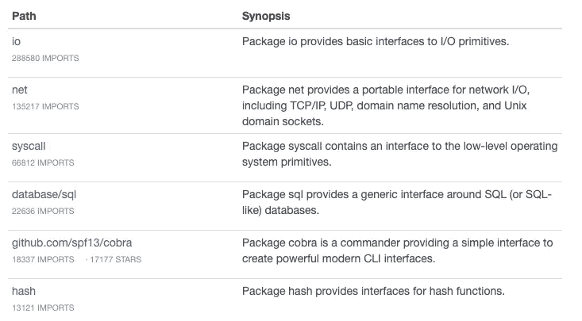
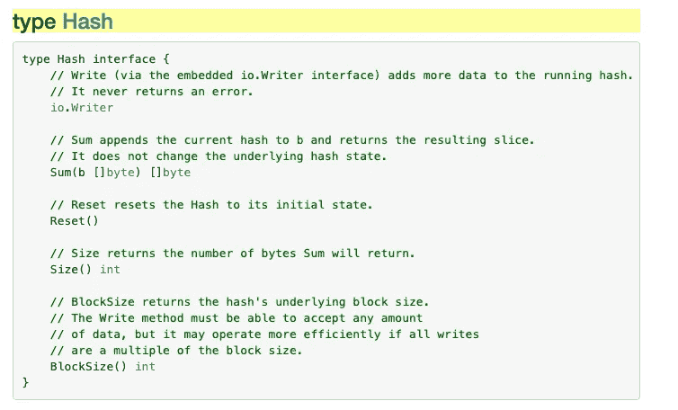

# 实现 Golang 接口；像老板一样

> 原文：<https://levelup.gitconnected.com/implementing-golang-interfaces-like-a-boss-73a0f7757597>

> TL；DR [impl](https://github.com/josharian/impl) 是在 Go 中实现接口的一个非常方便的工具。


Go 中的接口提供了一种非常棒的方式来编写可重用的代码。它们在几乎所有的 Go 项目中被大量使用，所以我发现自己经常引用不同的 [GoDocs](https://godoc.org/) 来在我自己的项目中实现接口。然而，为了弄清楚如何完全实现一个特定的接口，需要不断地参考文档，这可能会浪费一些时间。



例如，为了使我的结构可散列，需要实现 [hash](https://golang.org/pkg/hash/#Hash) 接口是很常见的。以下是 hash 的文档页面:



我没有将实现这个接口所需的五个方法签名提交到内存中，而是提出了一个更好的解决方案。

## 把英普尔·⚡️带来

[Impl](https://github.com/josharian/impl) 生成实现接口的方法存根。这听起来足够简单，但是在实践中，它*居然*有用！

要使用 impl，您只需要指定您想要实现接口的结构的名称，以及您想要实现的接口的名称。

```
$ impl <struct-name> <interface-name>
```

回到 hash 示例，让我们看看如何利用 impl 来生成这个接口的实现。

运行`impl Foo hash.Hash`会为我们生成以下代码:

现在，我们不再需要查找如何实现 Hash，我们可以参考 impl 为我们留下的方便的注释，以便完成每个方法。厉害！

现在想象一下，在未来，我们的`Foo`结构不仅需要是可散列的，还需要是可排序的。这不是问题，我们也可以通过 impl 来根除`sort`接口的实现！

```
$ impl Foo sort.Interface
```

同样，这会生成实现 sort 所需的方法！

impl 不仅可以用来生成标准库接口的实现，还可以用来清除任何接口！例如， [go-mysql](https://github.com/siddontang/go-mysql/) 提供了一个强大的工具集，用于在 go 中与 mysql 数据库进行交互。我们可以很容易地使用 impl 来实现 go-mysql 中的 [Handler](https://github.com/siddontang/go-mysql/blob/8b4711353793b5410c8dee9f44377bb11f9aa728/server/command.go#L11) 接口。

```
$ go get github.com/siddontang/go-mysql/server
$ impl Foo server.Handler
```

现在，我们已经有了一个完整的、经过注释的 go-mysql 服务器处理程序接口的实现，可以填充了！有了这个一般原则，我们可以利用 impl 快速实现任何接口。

在幕后，impl 利用了 [go:generate](https://golang.org/pkg/cmd/go/internal/generate/) ,我希望在以后的文章中会谈到这一点。如果您对此感兴趣，请告诉我！

感谢阅读！👋

[](https://skilled.dev) [## 编写面试问题

### 一个完整的平台，在这里我会教你找到下一份工作所需的一切，以及…

技术开发](https://skilled.dev)