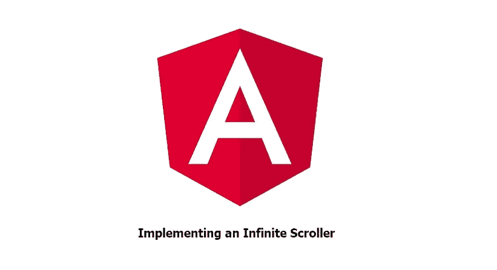
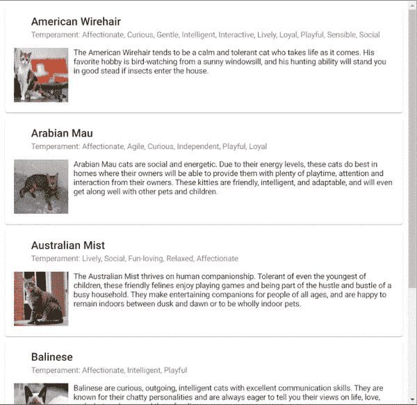

# 使用角度实现无限滚动

> 原文：<https://levelup.gitconnected.com/implementing-infinite-scrolling-using-angular-82c66f27e817>



在本文中，我将带您了解如何使用 Angular 实现无限滚动。您希望一次呈现一定数量的元素，当您滚动到页面底部时，您将呈现下一组元素。这个过程可以清洗和重复，直到你已经滚动到最底部，并已达到你的数据集的最后一个条目。

从可用性的角度来看，当用户无限期地浏览大量数据时(想想在社交媒体移动应用程序上滚动新闻提要或用户生成的一些大型内容列表)，这可能是有益的。一旦用户滚动到页面的末尾，新数据的呈现是自动的，而不是单击按钮以分页的方式前进到下一页。

在这个演示中，我们将使用 Angular 14 和一个公开可用的 REST API 来显示猫的列表和关于它们的信息( [TheCatAPI](https://docs.thecatapi.com/api-reference/breeds/breeds-list) )。这个例子的源代码可以在[这里](https://github.com/mwiginton/angular-infinite-scroll-example)找到，你可以在这里[找到这个例子的现场版本。](https://angular-infinite-scroll-fd946.web.app/)

**新项目设置**

现在让我们通过首先创建我们的项目来实现我们的无限滚动示例。您可以通过运行命令`ng new angular-infinite-scroll-example`创建一个新项目。你可以给你的项目起任何你喜欢的名字。在我们的例子中，我们的项目名为`angular-infinite-scroll-example`。

一旦您的项目被创建，通过执行命令`cd angular-infinite-scroll-example`导航到您的项目目录。在此目录中，您需要添加角度材料从属关系。需要这种依赖来创建卡片，在这些卡片中，我们的每个数据条目都将呈现在 UI 中。

```
ng add @angular/material
```

接下来你需要安装`ngx-infinite-scroll`包。这种依赖性将用于实现我们的无限滚动功能。

```
npm i ngx-infinite-scroll
```

接下来，让我们将我们的`InfiniteScrollModule`导入到我们的`app.module.ts`文件中。我们还将导入`HTTPClientModule`来进行 REST API 调用，以及`MatCardModule`来显示从 API 调用返回的每个条目的信息。

```
import { HttpClientModule } from '@angular/common/http';
import { MatCardModule } from '@angular/material/card';
import { InfiniteScrollModule } from 'ngx-infinite-scroll';
...
imports: [... HttpClientModule, MatCardModule, InfiniteScrollModule]
```

**创建我们的模型和服务**

接下来，让我们为我们想要呈现的条目创建一个类似于我们的`Cat`对象的模型。通常，为应用程序中使用的每个实体定义模型是一种很好的做法，因为它为数据模型设定了一个标准，并有助于保持事物的有序性。

```
ng g i cat --type=model
```

我们具有所有期望属性的最终结果如下所示:

我们需要执行的下一步是创建我们的服务类。我们的服务类是我们消费 API 的地方，API 最终获取我们将在无限滚动示例中使用的数据。我们在这种情况下使用的 API 是前面提到的 CatAPI，我们将使用它来检索猫的列表，以便在我们的示例中显示。我们可以通过执行下面的命令来生成一个新服务:`ng g s cat`。

在我们的`CatService`类中，我们可以创建我们的函数`getCats(page:number)`，它将使用我们的 API 来检索猫的列表。你会注意到我们在这里用了一个`page`作为参数。除了跟踪我们所在页面的`page`查询参数之外，您还需要记下`limit`查询参数。这是我们每个 API 调用检索的记录数(在本例中，我们每个 API 调用检索 5 条记录)。这就是 API 调用如何跟踪我们所在的页面。为了实际使用 API，我们将把`HttPClient`模块注入到服务类的构造函数中。我们演示中的服务将如下所示。

**添加无限滚动逻辑**

现在我们已经建立了我们的项目，创建了我们的`Cat`接口和`CatService`，我们可以继续在我们的`app.component.ts`和`app.component.html`文件中实现无限滚动功能。

先来看看我们的`app.component.ts file`。我们要做的第一件事是初始化关键变量，如下所示:

我们将变量`page`初始化为`1`，因为我们希望从 API 请求的第一页开始。我们将我们的`cats`数组初始化为一个空的`Cat`数组。我们将使用这个集合来存储我们对 API 调用的响应。

接下来你会看到我们正在把我们的`CatService`注入到我们的构造函数中。这样我们就可以从组件中的`CatService`文件中访问`getCats(page)`函数，并且可以进行 API 调用。

```
constructor(private catService: CatService) {}
```

接下来我们来看看我们的`ngOnInit()`函数。这个函数是角度生命周期的一部分，每次加载页面时都会被调用。在这个函数中，我们调用`getCats(page)`方法并传入当前页码(在页面第一次加载的情况下，页面将是 1)。一旦该调用完成，我们就将我们的`cats`数组设置为来自 API 调用的`cats`响应。您将会看到，我们正在将`cats`响应设置为`Cat`数组，以保持我们的数据整洁，并与我们定义的模型保持一致。

```
ngOnInit(): void {
   this.catServic
      .getCats(this.page)
      .subscribe((cats: Cat[]) => {
         this.cats = cats;
      });
}
```

然后你会注意到`onScroll()`功能。该函数将基于我们的`app.component.html`文件中的`(scrolled)`事件触发，我们稍后将在这里查看该文件。在我们的`onScroll()`函数中，我们从`CatService`内部调用我们的`getCats(page)`方法。您会注意到，每次我们进行这个调用时，我们都会将`page`递增 1，以表示我们将在 API 中查询下一页数据。然后，我们将来自 API 调用的`cats`响应追加到现有的`cats`数组中。我们使用 spread `…`操作符这样做，这样我们就可以将整个响应一次添加到数组中。我们的完整组件如下所示:

app.component.ts 文件

现在让我们研究一下我们的`app.component.html`文件。这是我们实际呈现数据并以我们想要的方式显示在 UI 上的地方。您可以删除该文件中任何自动生成的样板代码。

我们首先用一些与无限滚动相关的属性定义一个`div`。其中包括`infinite-scroll`属性，表明我们希望在这个 div 中执行无限滚动。

下一项是`[infiniteScrollDistance]`。这表示为了激发下一个滚动事件，用户需要到达 div 的末尾多远。这是一个基于浏览器窗口大小的乘数。默认值是`0`,这意味着一旦到达页面末尾，下一个滚动事件将被触发。在我们的例子中，我们使用了`2`，这意味着下一个滚动事件将在我们接近当前视图末尾 80%时触发。

下一项是`[infiniteScrollThrottle]`，它作为在`(scrolled)`事件中何时执行函数的延迟，以毫秒为单位(在我们的例子中是 1000)。这种延迟的好处是，否则该函数将被触发太多次，最终可能导致一些性能问题。

您将看到的最后一项是`(scrolled)`事件。这包含当用户滚动到页面末尾时将执行的函数。在我们的例子中，我们将使用递增的`page`值进行 API 调用，以获取下一个数据块。

接下来，我们创建一个`mat-card`来存储从我们的 API 调用返回的每个实体。在此`mat-card`中，我们将显示每只猫的响应中的关键信息，包括`name`、`temperament`、`image`和`description`。

完整的`app.component.html`将如下所示:

这件作品最后的修饰是在我们的`mat-card`元素之间增加一点空间。我们通过在 mat-card 上增加一个空白边来做到这一点。我们还在图像周围添加了一些填充。我们的 app.component.css 文件将如下所示:

无限滚动的样式

一旦完成了这段代码的实现，您就可以运行命令`ng serve`来启动您的应用程序，然后在浏览器中查看它。最终产品的行为方式与录音类似:



无限滚动的现场演示

使用 Angular 实现无限滚动到此结束。我希望这个演示有所帮助。如果有任何问题、顾虑或反馈，请随时告诉我。感谢您的阅读！

本例中使用的`ngx-infinite-scroll`库的官方文档可以在[这里](https://www.npmjs.com/package/ngx-infinite-scroll)找到。

*如果你喜欢阅读这篇文章，请考虑使用* [*我的推荐链接*](https://medium.com/@michelle.wiginton00/membership) *注册 Medium。这种订阅保证了可以无限制地访问我的文章以及其他许多学科的数千名天才作家的文章。*

# 分级编码

感谢您成为我们社区的一员！在你离开之前:

*   👏为故事鼓掌，跟着作者走👉
*   📰查看[升级编码出版物](https://levelup.gitconnected.com/?utm_source=pub&utm_medium=post)中的更多内容
*   🔔关注我们:[Twitter](https://twitter.com/gitconnected)|[LinkedIn](https://www.linkedin.com/company/gitconnected)|[时事通讯](https://newsletter.levelup.dev)

🚀👉 [**加入升级人才集体，找到一份神奇的工作**](https://jobs.levelup.dev/talent/welcome?referral=true)