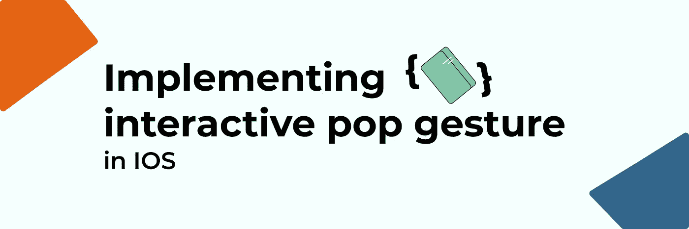

# 在 iOS 中实现交互式 Pop 手势

> 原文：<https://levelup.gitconnected.com/implementing-interactive-pop-gesture-in-ios-3012fa958545>

交互式弹出手势是一个核心交互，它使导航回上一个屏幕变得更加容易。设备越大，它提供的价值就越大。

苹果声称这是开箱即用的默认行为，对于一个标准应用来说确实如此。尽管如此，如果你正在构建一个定制的应用程序，正如我发现自己大部分时间都在做的那样，你会发现这不再适用。

例如，如果您有一个自定义的后退按钮，或者不希望用户从某个屏幕向后导航，那么您就无法控制默认实现。在本文中，我们将通过某种方式实现它，让您完全控制用户是否应该能够从一个屏幕返回。

# 屏幕什么时候能导航回来？

在我们的 BaseViewController 子类中的所有视图控制器)中，我们添加了一个默认函数来确定屏幕是否应该向后导航。有些应用程序可能没有 BaseViewController，如果你是这样，你可以跳过这一步。不过，我建议考虑在中添加一个，以提供对常用功能的屏幕访问。在我们的例子中，我们有一个函数来决定这个屏幕是否应该阻止向后导航。当满足以下条件时，我们允许屏幕向后导航:

*   导航栏是可见的
*   自定义后退按钮可见
*   屏幕上没有显示加载器

这显示在下面的代码片段中。

# 导航控制器什么时候可以导航回来？

这需要在整个应用程序中使用一个子类化的 UINavigationController，或者至少在您想要实现 pop 手势功能的地方使用。我添加到的应用程序已经在生产中，没有一个，所以我用一个新创建的 BaseNavigationController 替换了所有手动创建的 UINavigationController。

这有一个存储的属性`duringPushAnimation`,它允许我们跟踪一个屏幕何时被激活到视图控制器的堆栈上。

您可以看到，我们在 viewDidLoad 函数中设置了两个委托。第一个是需要的，因为我们需要知道一个屏幕什么时候被推送到视图控制器的堆栈上。第二个是用于弹出手势的手势识别器。我们在下一步中遵守协议。

## 实现 UINavigationControllerDelegate

我个人喜欢使用每个协议的扩展来确认一个协议的类。这整齐地分离了不同的关注点，鼓励相关的逻辑被分组，并使另一个开发人员更容易阅读。通过实现这个委托函数，我们可以洞察 UIViewController 何时显示。

## 实现 UIGestureRecognizerDelegate

这是所有神奇的事情发生的地方，这是我们决定允许用户是否可以返回的地方。在三种主要情况下，我们不希望他们导航回来。

*   如果视图控制器不允许的话。这可以通过调用我们之前在基本视图控制器上编写的`preventInteractivePopGesture`函数来完成
*   当堆栈上只有一个屏幕时
*   或者，如果我们是在一个推动动画，这是当一个屏幕上的动画。如果我们允许用户在这段时间返回，可能会打乱屏幕的顺序。

# 就成了

现在你的应用程序应该有一个很棒的交互，允许用户从屏幕的左边缘滑动，导航回上一个。自从最近升级我的 iPhone 以来，屏幕变得相当大，我发现自己比以前更频繁地使用这个功能。

幸运的是，一旦知道该怎么做，这个特性就不难实现。我发现在定制应用程序中实现这一点的在线资源非常缺乏，这需要一点点的尝试和错误。虽然在生产中的两个相当大的应用程序中实现了这一点，但我可以确认它非常有效。希望这已经教会了你一些新的东西，并且当你决定在你的应用中实现它的时候可以节省你的时间。