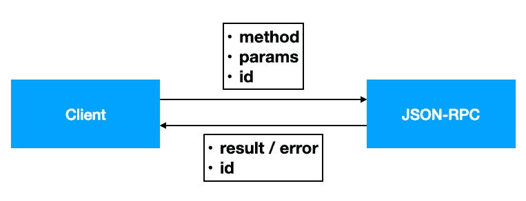

# 用 Python 实现 JSON-RPC

> 原文：<https://levelup.gitconnected.com/implementing-json-rpc-in-python-6ff3ff84cb45>

了解如何使用 HTTP 和 WebSockets 实现 JSON-RPC


照片由[沙哈达特·拉赫曼](https://unsplash.com/@hishahadat?utm_source=medium&utm_medium=referral)在 [Unsplash](https://unsplash.com?utm_source=medium&utm_medium=referral) 上拍摄

大多数全栈开发人员都熟悉 web 服务的概念及其架构风格，尤其是 REST APIs。除了 REST APIs，另一种同样常见的架构风格是 JSON-RPC。

在本文中，我将解释 JSON-RPC 是什么，它与 REST 相比如何，更重要的是，如何使用 Python 实现它。我将向您展示 JSON-RPC 的两个特定实现——第一个使用 HTTP 实现，第二个使用 WebSockets 实现。

# 什么是 JSON-RPC

**JSON-RPC** 是一个使用 JSON 进行编码的远程过程协议。如果您熟悉 REST APIs，您会知道为了让客户机与服务器通信，它使用 HTTP 动词来表明其意图:


例如，您想通过 REST API 向服务器添加一个新项目。在这种情况下，您可以使用 PUT 或 POST 动词来指示此操作。同样，如果您想从服务器检索一些值，您可以使用 GET 动词。作为回报，REST API 将以 JSON 或 XML 字符串的形式返回结果。

JSON-RPC 的工作方式与 REST APIs 非常相似——JSON-RPC 可以使用 HTTP 或 WebSockets 来实现。但是在 JSON-RPC 中，您不必使用 HTTP 动词来指示您想要的动作。相反，您只需在服务器端调用您想要调用的函数:


向 JSON-RPC 服务器发出的请求由三个成员组成:

*   `**method**` —要在服务器上调用的函数的名称
*   `**params**` —要传递给正在调用的函数中的参数的自变量
*   `**id**` —服务器回复时参考的字符串或数字

服务器在调用被调用的函数时，将在 JSON 中返回包含以下内容的结果:

*   `**result**` **/** `**error**` —要么是方法执行的结果，要么是调用函数出错时的错误
*   `**id**` —对应于服务器正在响应的请求的字符串或数字

下图总结了上述组件:



请注意，在有些情况下，客户端只是想向服务器发送消息，而不要求服务器返回结果。这被称为*通知*。在通知的情况下， **id** 组件不需要出现。

有关 JSON-RPC 的更多细节，请查看最新的 2.0 规范:

 [## JSON-RPC 2.0 规范

### 起源日期:2010–03–26(基于 2009–05–24 版本)JSON-RPC 是一个无状态的轻量级远程过程调用…

www.jsonrpc.org](https://www.jsonrpc.org/specification) 

# 使用 HTTP 实现 JSON-RPC

既然您已经对什么是 JSON-RPC 有了更清晰的概念，那么现在是时候自己实现一个 JSON-RPC 了。我们将首先使用 HTTP 实现一个。

## 使用 jsonrpcserver 实现服务器

为了帮助我们实现 JSON-RPC 服务，我们将使用 **jsonrpcserver** 模块:

```
$ pip install jsonrpcserver
```

创建一个名为 **server.py** 的新文件，并用以下内容填充它:

```
from jsonrpcserver import Success, method, serve, 
    InvalidParams, Result, Error
import re@method [](http://twitter.com/method) def validEmail(email) -> Result:    
    if email == "":
        return Error(code=123, message="Empty email provided")
    if re.match("^[a-zA-Z0-9-_]+@[a-zA-Z0-9]+\.[a-z]{1,3}$", email):    
        return Success(True)
    else:
        return Success(False)@method
def validZipCode(zip) -> Result: 
    if zip == "":
        return InvalidParams("Null value")
    if re.match("^[0-9]{5}(?:-[0-9]{4})?$", zip):
        result = { "zip": zip, "result" : "Valid Zipcode" }
    else:
        result = { "zip": zip, "result" : "Invalid Zipcode" }
    return Success(result)if __name__ == "__main__":
    serve('localhost', 5001)
```

在上面的代码片段中，我:

*   实现了两个函数(在 JSON-RPC 中称为*过程*)—`validEmail()`和`validZipCode()`。
*   这些函数中的每一个都接受一个参数(如果需要，可以接受多个参数)并产生一个`Result`对象。
*   这两个函数使用正则表达式来验证电子邮件和邮政编码。
*   为了将结果返回给客户端，函数可以返回一个`Success`、`Error`或`InvalidParams`对象。`Error`对象允许您指定自己的应用程序定义的错误代码和消息。`InvalidParams`对象是`Error`对象的快捷方式，通常在您想要通知客户端发送的参数无效(例如超出范围)时使用。例如，如果`validZipCode()`函数收到一个空的邮政编码，而不是说:

```
return Error(-32602, "Invalid params", "Null value")
```

你可以简单地使用`InvalidParams`对象:

```
return InvalidParams("Null value")
```

> 推荐的 JSON-RPC 错误代码列表可以从 [**JSON-RPC 2.0 规范**](https://www.jsonrpc.org/specification) **中找到。**

*   函数返回的结果使用 JSON 自动编码。
*   最后，该服务侦听本地计算机上的端口 5001。

## 测试服务器

要测试服务器，请在终端中运行应用程序:

```
$ **python server.py**
```

测试服务最直接的方法是使用 **curl** :

```
$ **curl -X POST http://localhost:5001 -d '{"jsonrpc": "2.0", "method": "validEmail", "params": {"email": ""}, "id": 1}'**
```

上面的命令调用`validEmail()`函数，并为`email`参数传递一个空字符串。服务器的响应是:

```
{"jsonrpc": "2.0", "error": {"code": 123, "message": "Empty email provided"}, "id": 1}
```

现在让我们尝试发送一封有效的电子邮件:

```
$ curl -X POST http://localhost:5001 -d '{"jsonrpc": "2.0", "method": "validEmail", "params": **{"email": "weimenglee@gmail.com"}**, "id": 1}'
```

回应是:

```
{"jsonrpc": "2.0", "result": true, "id": 1}
```

如果你试图用错误的参数名调用`validEmail()`函数:

```
curl -X POST http://localhost:5001 -d '{"jsonrpc": "2.0", "method": "**validEmail**", "params": {"**zip**": "weimenglee@gmail"}, "id": 1}'
```

您将得到*无效参数*错误:

```
{"jsonrpc": "2.0", "error": {"code": -32602, "message": "Invalid params", "data": "missing a required argument: 'email'"}, "id": 1}
```

同样，如果您调用`validZipCode()`函数并为`zip`参数发送一个空值:

```
curl -X POST http://localhost:5001 -d '{"jsonrpc": "2.0", "method": "validZipCode", "params": {"zip": ""}, "id": 1}'
```

您将得到*无效参数*错误，但是在`data`中有自定义错误消息:

```
{"jsonrpc": "2.0", "error": {"code": -32602, "message": "Invalid params", **"data": "Null value"**}, "id": 1}
```

## 使用 jsonrpclib 实现客户端

显然，使用 *curl* 进行测试仅用于开发阶段。在生产中，您需要编写一个客户端应用程序来调用服务器中的函数。为此，您可以使用 **jsonrpclib** 模块:

```
$ pip install jsonrpclib
```

一旦模块安装完毕，创建一个名为 **client.py** 的新文件，并在其中填入以下内容:

```
from jsonrpclib import Server
import sysdef main():
    server = Server('[http://localhost:5001'](http://localhost:5001'))
    try:
        print(server.validEmail("[weimenglee@gmail.com](mailto:weimenglee@gmail.com)"))
        print(server.validZipCode("12345"))
    except:
        print("Error: ", sys.exc_info())if __name__ == '__main__':
    main()
```

上面的代码连接到服务器的端口 5001。然后它远程调用`validEmail()`和`validZipCode()`函数。

要运行客户端，请在终端中键入以下命令:

```
$ **python client.py**
```

您应该会看到以下输出:

```
True
{'zip': '12345', 'result': 'Valid Zipcode'}
```

# 使用 WebSockets 实现 JSON-RPC

现在我们已经使用 HTTP 实现了一个 JSON-RPC 服务，是时候看看如何使用 **WebSockets** 实现它了。

> WebSocket 是一种通信协议，通过单一 TCP 连接提供全双工通信通道。

## 使用 jsonrpcserver 实现服务器

我们将使用与我们之前在当前 WebSockets 实现中使用的相同的 **jsonrpcserver** 模块。

创建一个名为 **server_ws.py** 的文件，并用以下内容填充它:

```
from jsonrpcserver import method, Success, Result, Error, 
    InvalidParams, async_dispatch
import websockets
import asyncio
import re@method
async def validEmail(email) -> Result:
    if email == "":        
        return Error(code=123, message="Empty email provided")
    if re.match("^[a-zA-Z0-9-_]+@[a-zA-Z0-9]+\.[a-z]{1,3}$", email):    
        return Success("Valid Email")
    else:
        return Success("Invalid Email")@method
async def validZipCode(zip) -> Result:
    if zip == "":
        return InvalidParams("Null value")
    if re.match("^[0-9]{5}(?:-[0-9]{4})?$", zip):
        result = { "zip": zip, "result" : "Valid Zipcode" }
    else:
        result = { "zip": zip, "result" : "Invalid Zipcode" }
    return Success(result)async def main(websocket, path):
    if response := await async_dispatch(await websocket.recv()):
        await websocket.send(response)start_server = websockets.serve(main, "localhost", 5002)
asyncio.get_event_loop().run_until_complete(start_server)
asyncio.get_event_loop().run_forever()
```

在很大程度上，JSON-RPC 部分类似于使用 HTTP 的部分。值得注意的变化是使用 WebSockets 异步监听传入连接的部分。

要运行服务器，请在终端中键入以下命令:

```
$ **python server_ws.py**
```

## 使用 jsonrpcclient 实现客户端

为了使用在 WebSockets 中实现的 JSON-RPC，我们将使用 **jsonrpcclient** 模块:

```
$ pip install jsonrpcclient
```

> jsonrpcclient 模块包含帮助函数，可以帮助您将函数参数转换成 JSON-RPC 兼容的 JSON 字符串。它还帮助您解码 JSON-RPC 函数返回的响应。

创建一个名为 **client_ws.py** 的文件，并用以下内容填充它(我用粗体显示了发送到服务器的 JSON 和服务器返回的响应):

```
import asyncio
import loggingfrom jsonrpcclient import Ok, parse_json, request_json
import websocketsasync def main():
    async with websockets.connect("ws://localhost:5002") as ws:        
        req = request_json("validZipCode", {"zip":"12345"})
 **print(req)** 
        await ws.send(req)
        result = await ws.recv()
 **print(result)**  
        response = parse_json(result) if isinstance(response, Ok):
        print(response.result)
    else:        
        logging.error(response.message)asyncio.get_event_loop().run_until_complete(main())
```

要运行客户端，请在终端中键入以下内容:

```
$ **python client_ws.py**
```

首先，您将看到由`request_json()`函数生成的 JSON 字符串(来自 **jsonrpcclient** 模块):

```
{"jsonrpc": "2.0", "method": "validZipCode", "params": {"zip": "12345"}, "id": 1}
```

接下来，您将看到服务器返回的结果:

```
{"jsonrpc": "2.0", "result": {"zip": "12345", "result": "Valid Zipcode"}, "id": 1}
```

最后，客户机将打印出`result`键的值:

```
{'zip': '12345', 'result': 'Valid Zipcode'}
```

[](https://weimenglee.medium.com/membership) [## 加入媒介与我的介绍链接-李伟孟

### 阅读李维孟(以及媒体上成千上万的其他作家)的每一个故事。您的会员费直接支持…

weimenglee.medium.com](https://weimenglee.medium.com/membership) 

# **总结**

我希望这篇文章已经清楚地解释了什么是 JSON-RPC 服务，以及如何使用 HTTP 或 WebSockets 实现它。如果您目前在项目中使用 JSON-RPC，请在评论中告诉我。

感谢您成为我们社区的一员！在你离开之前:

*   👏为故事鼓掌，跟着作者走👉
*   📰查看[升级编码出版物](https://levelup.gitconnected.com/?utm_source=pub&utm_medium=post)中的更多内容
*   🔔关注我们:[Twitter](https://twitter.com/gitconnected)|[LinkedIn](https://www.linkedin.com/company/gitconnected)|[时事通讯](https://newsletter.levelup.dev)

🚀👉 [**加入升级人才集体，找到一份神奇的工作**](https://jobs.levelup.dev/talent/welcome?referral=true)