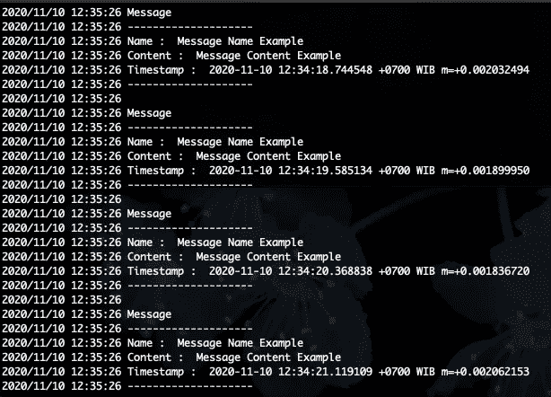

# 使用 Docker 在 Golang 中实现消息队列 NSQ

> 原文：<https://levelup.gitconnected.com/implementing-messaging-queue-nsq-in-golang-using-docker-99b402293b12>


消息队列为服务相互通信提供了一种新的异步方式。与 API 相比，消息队列有许多优点，例如:

*   **优化性能**
    生产者不需要等待消费者完成他们的工作，从而优化了性能
*   **可靠性**
    消息队列中的持久性级别有助于在部分系统停机时最大限度地减少数据丢失
*   **可伸缩性**
    分别伸缩生产者和消费者，以满足您的需求

# 1.NSQ 简介


NSQ 是一个开源的实时分布式消息平台，它是简单队列的继承者。

NSQ 的核心组件包括:

*   *nsqd* 是接收、排队和向客户端传递消息的守护程序。
*   *nsqlookupd* 是管理拓扑信息的守护程序。
    客户端查询 *nsqlookupd* 以发现特定主题的 nsqd 生产者和 *nsqd* 节点广播主题和频道信息。
*   *nsqadmin* 是一个 Web UI，用于实时查看聚合的集群统计信息并执行各种管理任务。

单个 *nsqd* 实例被设计成一次处理多个数据流。流被称为“主题”，一个主题有一个或多个“通道”。每个通道接收一个主题的所有消息的副本。

主题和频道都不是预先配置的。主题是在命名主题首次发布时创建的，或者是通过订阅命名主题的频道创建的。频道是在第一次使用订阅命名频道时创建的。并且两者相互独立地缓冲数据。

一个通道通常有多个连接的客户端，每个消息将被传递给一个随机的客户端

# 2.代码和 NSQAdmin

所以在这里，我想通过在消息队列中传递 struct 对象并显示 NSQAdmin，使用基于*github.com/nsqio/go-nsq*的 Docker 在 Golang 中尝试一个简单的 NSQ 实现

*   docker-compose.yml

```
# docker-compose.yml
version: '3'
services:
  nsqlookupd:
    image: nsqio/nsq
    command: /nsqlookupd
    ports:
      - "4160:4160"
      - "4161:4161"
  nsqd:
    image: nsqio/nsq
    command:  /nsqd --broadcast-address=nsqd --lookupd-tcp-address=nsqlookupd:4160
    depends_on:
      - nsqlookupd
    ports:
      - "4151:4151"
      - "4150:4150"
  nsqadmin:
    image: nsqio/nsq
    command: /nsqadmin --lookupd-http-address=nsqlookupd:4161
    depends_on:
      - nsqlookupd  
    ports:
      - "4171:4171"
```

注意:不要忘记在*your*/etc/hosts* 中添加 *nsqd* 作为 127.0.0.1，因为我们的生产者和消费者位于我们的本地主机中，而 NSQ 环境在 docker 中运行，这将提供一个变通办法，因此 docker 端和本地主机端都可以访问 docker 中的 *nsqd* 服务。*

*   *制作人.去吧*

```
*package mainimport (
 "encoding/json"
 "github.com/nsqio/go-nsq"
 "log"
 "time"
)type Message struct {
 Name      string
 Content   string
 Timestamp string
}func main() {//The only valid way to instantiate the Config
 config := nsq.NewConfig()//Creating the Producer using NSQD Address
 producer, err := nsq.NewProducer("127.0.0.1:4150", config)
 if err != nil {
  log.Fatal(err)
 }//Init topic name and message
 topic := "Topic_Example"
 msg := Message{
  Name:      "Message Name Example",
  Content:   "Message Content Example",
  Timestamp: time.Now().String(),
 }//Convert message as []byte
 payload, err := json.Marshal(msg)
 if err != nil {
  log.Println(err)
 }//Publish the Message
 err = producer.Publish(topic, payload)
 if err != nil {
  log.Println(err)
 }
}*
```

*   *消费者. go*

```
*package mainimport (
 "encoding/json"
 "github.com/nsqio/go-nsq"
 "log"
 "os"
 "os/signal"
 "syscall"
 "time"
)type messageHandler struct{}type Message struct {
 Name      string
 Content   string
 Timestamp string
}func main() {
 //The only valid way to instantiate the Config
 config := nsq.NewConfig()//Tweak several common setup in config
 // Maximum number of times this consumer will attempt to process a message before giving up
 config.MaxAttempts = 10// Maximum number of messages to allow in flight
 config.MaxInFlight = 5// Maximum duration when REQueueing
 config.MaxRequeueDelay = time.Second * 900
 config.DefaultRequeueDelay = time.Second * 0//Init topic name and channel
 topic := "Topic_Example"
 channel := "Channel_Example"//Creating the consumer
 consumer, err := nsq.NewConsumer(topic, channel, config)
 if err != nil {
  log.Fatal(err)
 }// Set the Handler for messages received by this Consumer.
 consumer.AddHandler(&messageHandler{})//Use nsqlookupd to find nsqd instances
 consumer.ConnectToNSQLookupd("127.0.0.1:4161")// wait for signal to exit
 sigChan := make(chan os.Signal, 1)
 signal.Notify(sigChan, syscall.SIGINT, syscall.SIGTERM)
 <-sigChan// Gracefully stop the consumer.
 consumer.Stop()
}// HandleMessage implements the Handler interface.
func (h *messageHandler) HandleMessage(m *nsq.Message) error {//Process the Message
 var request Message
 if err := json.Unmarshal(m.Body, &request); err != nil {
  log.Println("Error when Unmarshaling the message body, Err : ", err)
  // Returning a non-nil error will automatically send a REQ command to NSQ to re-queue the message.
  return err
 }//Print the Message
 log.Println("Message")
 log.Println("--------------------")
 log.Println("Name : ", request.Name)
 log.Println("Content : ", request.Content)
 log.Println("Timestamp : ", request.Timestamp)
 log.Println("--------------------")
 log.Println("")// Will automatically set the message as finish
 return nil
}*
```

*所有代码完成后，我们继续执行:*

*   *使用命令
    `*docker-compose up -d*`启动对接器*
*   *构建 producer.go 和 consumer.go
    `*go build producer.go
    go build consumer.go*`*
*   *首先执行消费者二进制文件，然后多次执行生产者二进制文件
    *。/消费者
    。/制片人**

*注:消费者有时需要查询 *nsqlookupd**

*这是结果截图*

******

*您可以通过以下方式检查 *NSQadmin* :*

*   *在浏览器中打开[*http://localhost:4171*](http://localhost:4171) *它会列出所有可用的主题**

****

*   **点击所选的*主题* 将显示*主题*的概述，包括总消息、频道列表、每个频道的进行中消息、每个频道的延迟消息等**

****

*   **点击选定的*频道*
    ，将显示与上面相同的概览，但在频道级别**

****

*   **你可以在[https://nsq.io/components/nsqadmin.html](https://nsq.io/components/nsqadmin.html)查看关于 nsqadmin 更深入的解释**

# **3.概括起来**

**用 golang 实现 NSQ 很容易，提供的大部分功能都可以自己解释，并且有很多与这个主题相关的文档，对于初学者来说，[https://godoc.org/github.com/nsqio/go-nsq](https://godoc.org/github.com/nsqio/go-nsq)也很容易理解，可以通过 nsq 和 Golang 学习消息队列的基本功能。**

**像往常一样，我们在东京有一个空缺。我们是一家印度尼西亚科技公司，我们的使命是通过技术实现商业民主化，帮助每个人实现更多。与我们一起在东京找到你梦想的工作！
[https://www.tokopedia.com/careers/](https://www.tokopedia.com/careers/)**

**[https://godoc.org/github.com/nsqio/go-nsq](https://godoc.org/github.com/nsqio/go-nsq)
[https://level up . git connected . com/messaging-platform-comparison-nsq-and-Apache-Kafka-60f 96 f 7466 B1](/messaging-platform-comparison-nsq-and-apache-kafka-60f96f7466b1)
[https://nsq.io/](https://nsq.io/)**