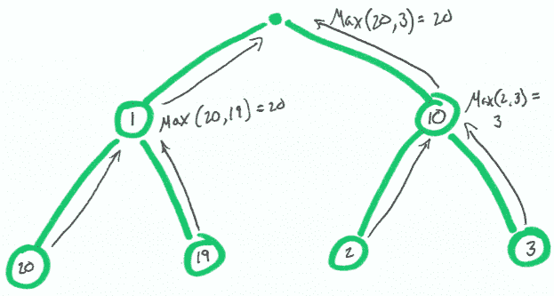
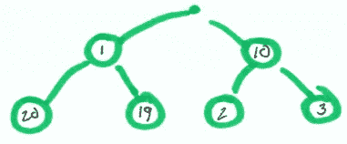
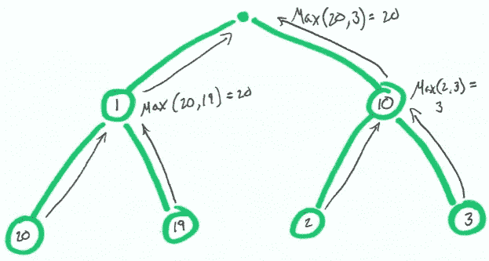
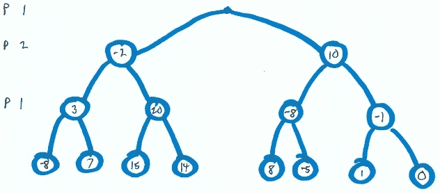
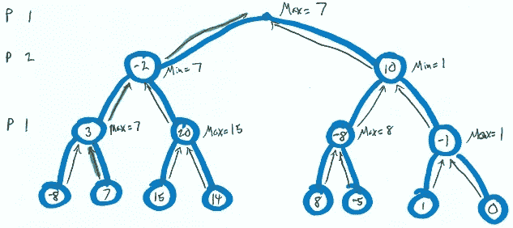
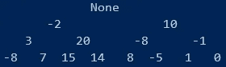

# 实现极大极小树搜索

> 原文：<https://levelup.gitconnected.com/implementing-minimax-tree-search-8ae8604a53b5>



玩游戏是学习机器学习策略的一种方式。大多数游戏机器人都包含一些搜索机制。这就是机器人如何“看到”哪一步会带来有利的结果。

让我们来学习 minimax，这是一种构建人工智能在简单游戏中竞争的有用技术。

# 单人游戏树搜索

让我们玩一个小游戏。游戏的目标是以最高的数字结束。

对于单人游戏的一个回合来说，选择很简单。


单轮游戏

你往右，你以 10 分结束！这是我们这个小游戏中最高的分数了。

让我们把它变得复杂一点。我们的游戏现在有两个回合，你选择什么？



两回合游戏

在你的第一个回合，如果你做了同样的决定(选 10)，那么在你的第二个回合(2 或 3)你会有不好的选择。

为了获得最高分，你需要在第一轮选择 1，以便在第二轮选择 20。

对此建模的一种方法是从底部开始，并在每个节点选择最大值。如果我们对整个树都这样做，我们就确定了我们的最高分(20)和要做的决定(左，左)。



两回合博弈建模

# 双玩家树搜索(Minimax)

如果我们在这个游戏中引入另一个玩家呢？现在两个玩家在互相竞争。对规则做了一点小小的改动。

1.  如果选择正数，玩家 1 获胜。
2.  如果选择负数，2 号玩家获胜。
3.  如果选择 0，则出现平局。
4.  玩家轮流玩，玩家 1 先玩。

就拿下面这个游戏来说吧。



双人游戏

一号玩家(P1)做出第一个选择，然后二号玩家(P2)有机会，最后一号玩家做出最后的选择。

一号玩家想要正数，所以他们想最大化他们的分数。

参与人 2 想要负数，所以他们想最小化他们的分数。

这就是“极小极大”这个术语的来源，来自于玩家想要最小化或最大化他们的分数。

这场游戏会如何进行？如果每个玩家都选择了当时对他们来说最好的选择，那么最优的游戏结果是 7，这意味着玩家 1 赢了！

让我们也为这个游戏建模。



同样，参与人 1 试图最大化他们的分数，参与人 2 试图最小化他们的分数。

参与人 1 向左，参与人 2 向左，最后参与人 1 向右，得分为 7。

# 编程最小值最大值

让我们用 python 实现一个极大极小搜索！

我们首先需要一个数据结构来保存我们的值。

我们创建了一个`Node`类，它可以保存一个值并链接到一个左右`Node`。

然后我们将创建一个代表玩家选择的`Choice`类。

接下来，我们将使用上面建模的两人游戏的值初始化一棵树。

你会注意到在第 41 行，我在打印树。它输出以下内容:



印刷树

*在*[*github repo*](https://github.com/morgankenyon/RandomML/blob/master/src/minimax.py#L15)*上有* `*print_tree*` *功能。*

我们将通过编写递归深度优先搜索算法来解决这个问题。我们要记住的主要问题是:

1.  我们需要记录轮到哪些玩家，我用`is_max`来记录。
2.  我们需要知道什么时候停止搜索，在递归中，这意味着我们需要一些基本情况。
3.  我们想探索整棵树。
4.  我们需要一些比较逻辑来决定我们将选择探索哪个子树。

我们的基本情况是当我们的节点不再有任何子节点时，我们只返回节点的值。

为了探索整个树，我们将在节点的每个子树上调用`minimax`。

确保反转`is_max`，因为玩家轮流。

最后，我们比较结果。如果我们最大化我们取最大结果，那么如果我们最小化我们取最小结果。

让我们创建一个小模拟器来玩我们的游戏。

运行此命令会输出以下内容:

```
Moving left to node with value -2
Moving left to node with value 3
Moving right to node with value 7
Game ends with a score of 7
```

恭喜你。我们已经正确地演示了如何使用极大极小来优化解决一个简单的双人游戏。

# 离别的思绪

这个游戏非常简单。但是搜索是大多数自动游戏机器人不可或缺的一部分。这就是机器人能够“预见”未来的方式。

对于一个挑战，看看你是否可以使用 minimax 来建立一个井字游戏机器人。

可以想象，对于复杂的游戏(国际象棋和围棋)，由于时间和内存的限制，搜索有其局限性。在这些情况下，进一步的策略如 alpha-beta 修剪和蒙特卡罗模拟会有所帮助。

您可能已经注意到，我的基本案例只适用于有两个或零个子节点的节点。 [git repo](https://github.com/morgankenyon/RandomML/blob/master/src/minimax.py) 中的 minimax 将包含处理该条件的代码。

*原载于 2020 年 4 月 26 日*[*https://thesharperdev.com*](https://thesharperdev.com/implementing-minimax-tree-search/)T22。