# 在任何语言中用 Y 组合子实现递归

> 原文：<https://levelup.gitconnected.com/implementing-recursion-with-the-y-combinator-in-any-language-9e83fa369ca>

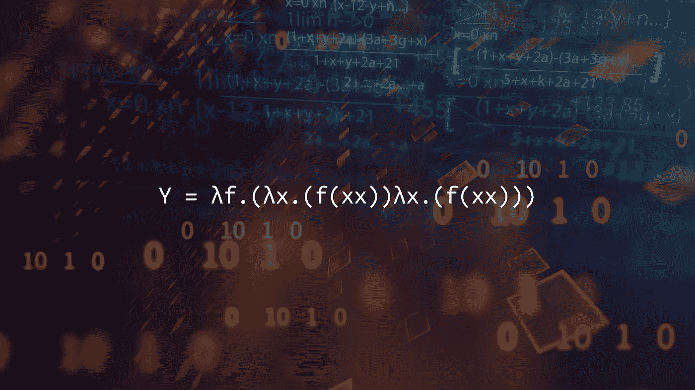

对**λ演算**的新认识？我建议在继续之前阅读 JavaScript 中的 [**Lambda 演算**](https://medium.com/openmindonline/lambda-calculus-in-javascript-1ee947cadb21) ！

Y 组合子是一个**定点高阶函数**，用于在任何本身不支持递归的编程语言中实现递归。它是由数学家和逻辑学家哈斯克尔·库里在 20 世纪 40 年代提出的，被认为是编程和逻辑中最美妙的想法之一。我们将看到如何用 6 种编程语言实现这段令人惊叹的代码:

*   **JavaScript**
*   哈斯克尔
*   **Java**
*   **球拍**
*   **Python**
*   **C**

# λ演算中的原始 Y 组合子

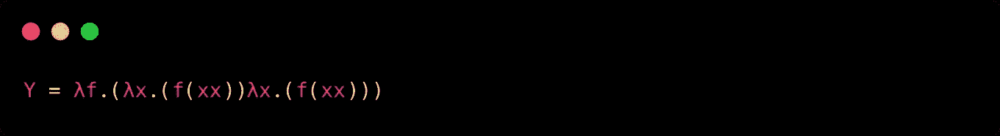

我们刚刚用不到 30 个字符表达了计算机科学中最强大的概念之一。
你可能已经猜到了，我们只是写下了`Y` **抽象**。它的实际应用是什么？
让我们使用典型的**阶乘**例子。

一个数`n`的阶乘是`0`和`n`之间所有正整数的乘积。
我们可以很容易地用递归来求任意正整数的阶乘(用伪代码):

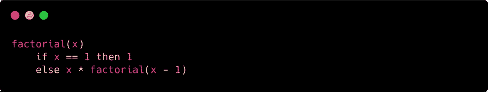

所以让我们假设我们必须计算`3`的阶乘；采用上面的解决方案，我们将以如下方式执行我们的函数:

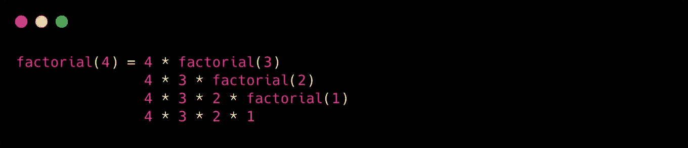

如你所见，我们在`factorial`函数内部调用了`factorial`函数。这是递归如何工作的一个简单例子，并不是每种语言都支持这种编程风格！

**Y 组合器**来了。让我们从用 JavaScript 实现它开始:

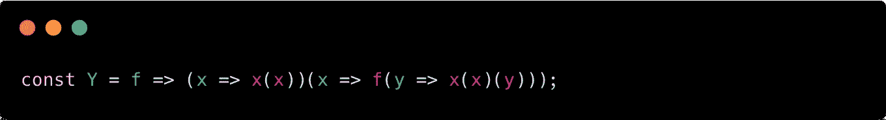

其实挺简单的！如你所见，这非常接近我们上面用 **Lamba Calculus** 符号写的代码！现在，我们需要实现我们的函数，它将计算给定整数的阶乘:

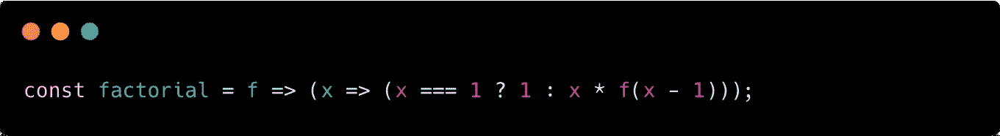

太好了！如您所见，我们没有将整数作为第一个参数，而是创建了一个返回匿名函数的函数，该函数将整数作为唯一的参数。这样，我们对`f`调用进行了参数化，这将在我们的`Y`实现中使用。

现在让我们使用我们刚刚在上面写的 **Y 组合子**调用`factorial`函数，这里是:

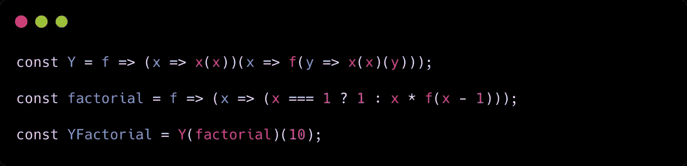

我们现在可以调用我们的 **Y 组合子**内部的任何递归函数，避免 [**运行时内存异常**](https://medium.com/openmindonline/js-monday-06-adopting-memory-safe-recursion-d26dcee409c9) ！

# Haskell 中的 y 组合子

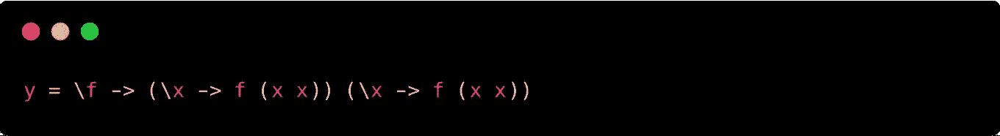

正如你所看到的，当你来自于λ演算符号时，在 Haskell 中编写 Y 组合子抽象是非常容易的！
顺便说一下，这段代码不会编译，因为`(x x)`需要一个无限类型。
因此，我们必须选择是采用**不安全强制**并使其生效，还是改变方法:

**使用不安全胁迫(unsafe):**

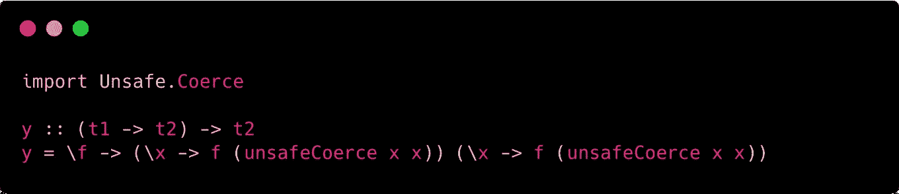

**采用非递归解决方案(安全):**

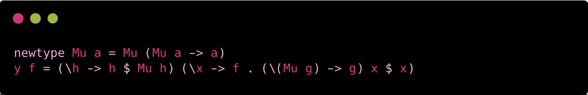

[https://stack overflow . com/questions/4273413/y-combinator-in-haskell/5885270 # 5885270](https://stackoverflow.com/questions/4273413/y-combinator-in-haskell/5885270#5885270)

为了简单起见，我们将使用**不安全的**版本，它更容易展示和解释。让我们在 **Haskell** 中实现阶乘函数吧！

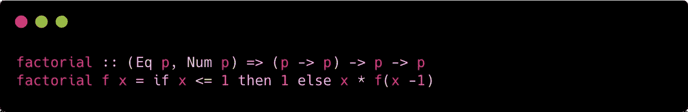

我们现在可以使用之前定义的 **Y 组合子**调用阶乘函数:

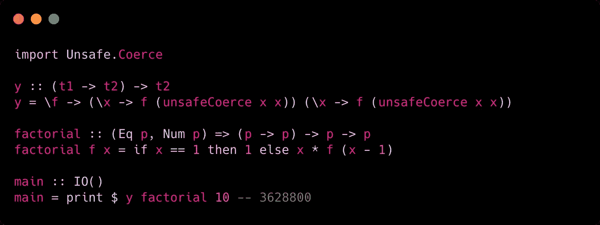

其实挺酷的！但是我发现在 Haskell 中实现这种解决方案更“概念性”，Haskell 已经对递归有了惊人的支持。

# Java 中的 y 组合子

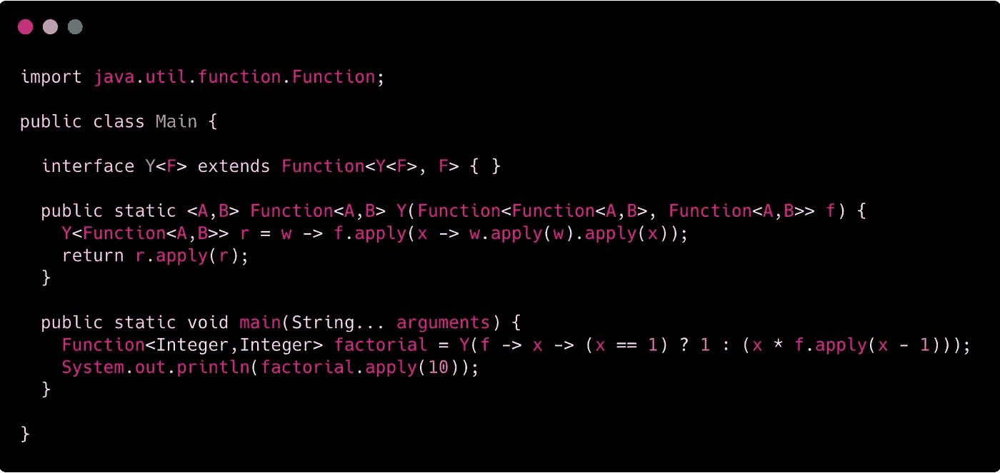

我不得不承认:我不是 Java 专家，这实际上是我写过的最复杂的代码……但它确实有效！它向您展示了 Java 中传统的命令式/面向对象方法的替代方法。
我并不是说每次在 Java 中使用递归解决问题时都应该使用这种方法:相反，我坚信上面的例子向您展示了 **Lambda 演算**实际上可以像**图灵机**一样完整，这是命令式和面向对象语言(如 Java)的基础！

# 球拍中的 y 组合子

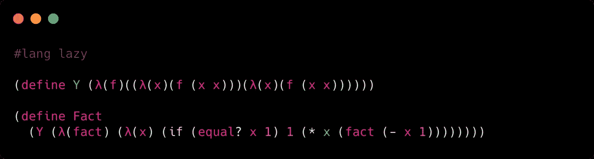

**拍**实现基本上与**λ演算**一模一样！它们实际上非常相似，这种语言显示了它与λ演算符号有多接近，λ演算符号是任何 LISP 编程语言的基础！

# Python 中的 y 组合子

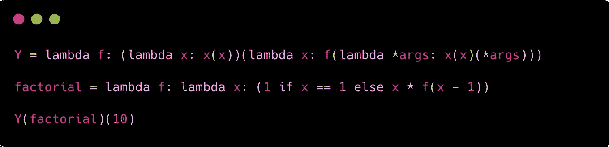

Python 中的 Y 组合子实际上很容易实现，但是因为它的 lambda 语法有点“混乱”。它的工作方式是显而易见的，使用 Python 的开发人员肯定会理解 **Y 组合子**是如何工作的！

# C 语言中的 y 组合子

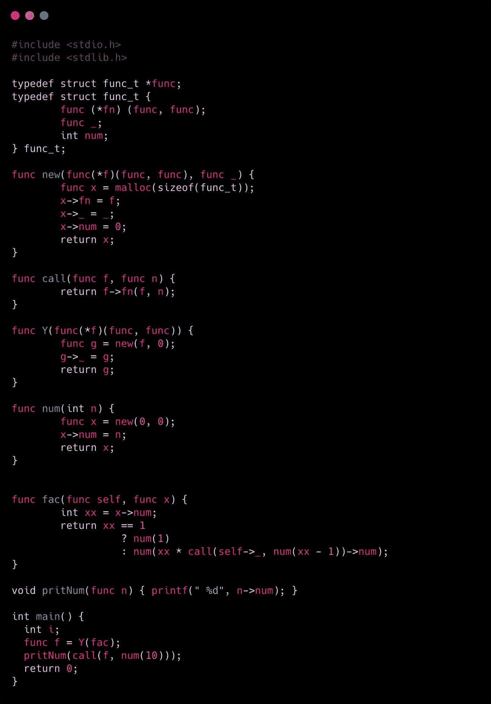

这可能是我一生中最糟糕的想法。尽管如此，看到一个基本上 100%基于**图灵机**的语言仍然可以实现这样一个从**λ演算**中派生出来的抽象概念，还是很令人满意的！

**纯 C** 解决方案甚至不接近 **Lambda 演算**的定义，但做了同样的工作，表现出色！

# 结论

正如我们在 Java 和 C 的例子中所看到的， **Lambda Calculus** 概念仍然可以用与它们的核心完全不同的语言来表达。Lambda 微积分是一个令人惊奇的话题，完全值得花些时间去学习。其实是思想转变！

