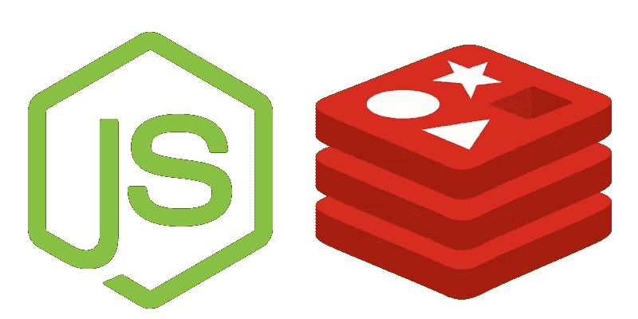
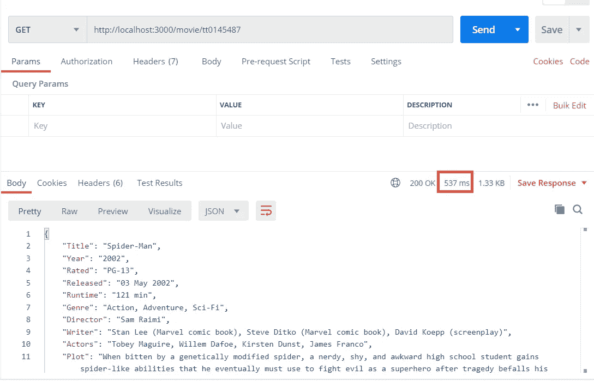
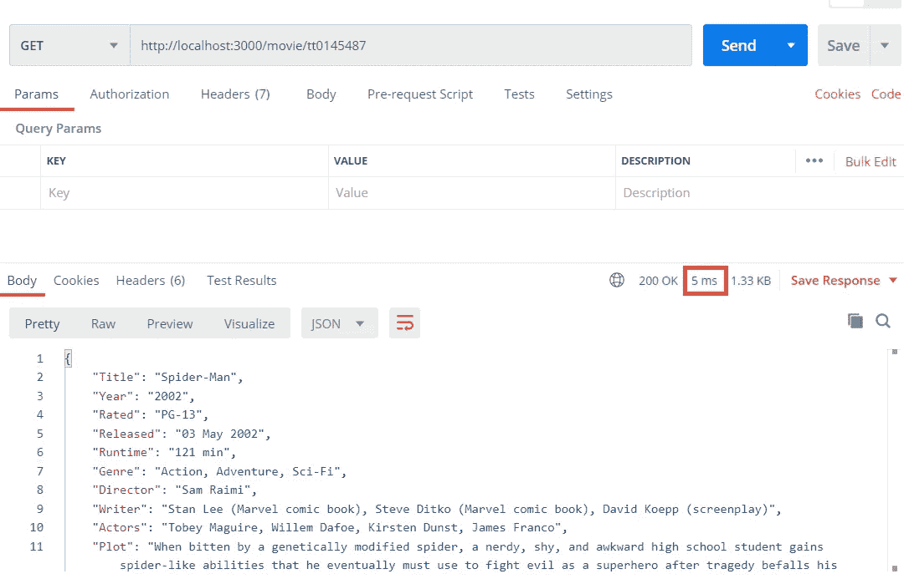
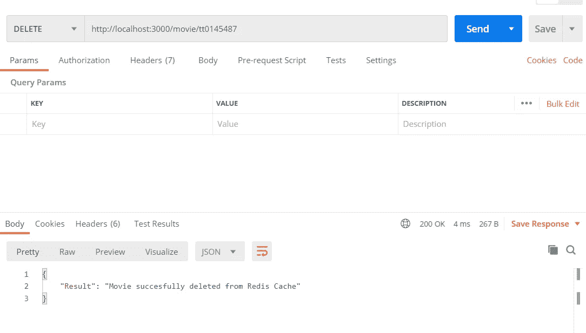

# 在简单的 Nodejs 项目中实现 Redis 缓存

> 原文：<https://levelup.gitconnected.com/implementing-redis-cache-to-simple-nodejs-project-c376d497bcd7>

在本文中，我将解释 Redis 是什么，它的优点，以及如何用一个简单的应用程序将它集成到 Nodejs 项目中。

# 什么是 Redis 缓存

Redis 是内存中的数据结构存储，可用作数据库(NoSQL)、缓存和消息代理。Redis 将数据存储为“键-值”关系。它将数据临时或永久存储在 RAM 中。

# Redis 缓存的优势是什么

*   Redis 支持许多数据结构，如列表、字符串、散列等。
*   速度
*   支持多种编程语言
*   开源

## 所以我们可以从创建我们的应用程序开始:)

这将是一个简单的电影应用程序，我们将使用“**http://www.omdbapi.com**”API 的数据。

在终端窗口中，我们正在写入以下命令:

> > mkdir Redis_Node-MovieApp
> 
> > npm init(我将入口点设置为“src/index.js”)
> 
> > npm 安装快速节点-获取 nodemon

然后，我们在“src”文件夹(这是我的应用程序的入口点)中创建一个“index.js”文件，并添加以下代码:

> 在第三行，我们现在定义了路由器，我们将很快生成它

对于这个应用程序，我更喜欢使用“async-redis”而不是“redis ”,因为 Node Redis 目前不支持承诺(这将在 v4 中推出)。我们将使用路由器文件夹、缓存文件夹、数据文件夹将我们的方法分成几个部分，我们将使用 async-await，以便程序流不会继续对 Redis 服务器进行 get 和 set 操作，并等待响应并将响应返回给被调用的方法(防止返回未定义的)。Redis 本身不支持它，所以我在项目中包含了“async-redis”库。

根据文档“这个库对 node_redis 的 api 做了很少的修改。它只是为每个命令附加一个承诺解决/拒绝回调。”更多信息请点击[这里](https://www.npmjs.com/package/async-redis)。

> > npm 安装异步 redis

在我们将 Redis 库安装到项目中之后，我们将创建一个“cache”文件夹，并在“cache”文件夹中创建一个“redisCache.js”文件来执行缓存操作。我们将下面的代码写入“redisCache.js”文件中:

在我们实现了从 Redis 缓存中获取、设置和清除的代码之后，我们将开始实现数据层以从 API 获取数据。创建“数据访问层”文件夹和“数据. js”文件。在这里，我们实现了从 API 获取数据的方法。我们正在添加以下代码:

现在，我们将为电影添加路由，以路由和管理请求。我们将添加“routes”文件夹，并在其中添加“movieRouter.js”和以下代码:

最后一步，我们将 nodemon 库包含在 package.json 的项目中

现在我们准备起飞，抓紧了…

我们将传递到终端窗口并运行“npm run”命令。如果一切正常，我们可以在终端中看到“服务器在端口 3000 上启动”的消息。为了测试，我们将使用“邮差”工具。

我们可以在“[https://www.imdb.com/](https://www.imdb.com/)”中找到电影 id。我用的是蜘蛛侠电影的 id (tt0145487)。我们正在请求 URL:"[**http://localhost:3000/movie/TT 0145487**](http://localhost:3000/movie/tt0145487)"

我们的第一个请求，我们从 API 获取数据，花费了 537 毫秒，这是一个巨大的时间，没有人不想为每个请求花费和等待这个时间。我们的第二个请求是从缓存中获取数据，因为在第一个请求中从 API 获取数据之后，我们在向客户端发送响应之前将数据设置到缓存中。

正如我们所看到的，我们的应用程序仅用了 5 毫秒和 300 秒就从缓存中响应了数据。我们还为我们的程序实现了一个清除缓存的方法。你也可以测试它。

在这篇文章中，我们看到了 Redis 的力量以及为什么开发人员普遍选择它。你可以在这里访问这个项目[的源代码。](https://github.com/aenesgur/Nodejs-RedisCache_MovieApp)

希望在下一个帖子里看到你，祝你健康。

# 资源

*   [https://redis.io/](https://redis.io/)
*   [https://www.npmjs.com/package/redis](https://www.npmjs.com/package/redis)
*   [https://www.npmjs.com/package/async-redis](https://www.npmjs.com/package/async-redis)
*   [http://www . borakasmer . com/nodejs-uze rinde-redis-kullanimi-ve-refactoring/](http://www.borakasmer.com/nodejs-uzerinde-redis-kullanimi-ve-refactoring/)
*   [https://www . jond Jones . com/architecture/performance/redis/what-is-redis-and-should-I-be-using-it/](https://www.jondjones.com/architecture/performance/redis/what-is-redis-and-should-i-be-using-it/)