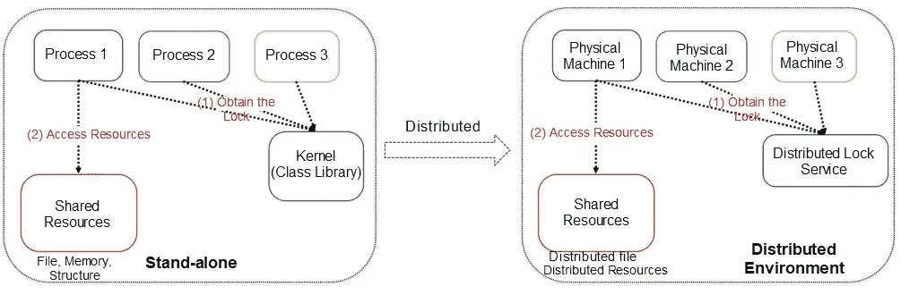
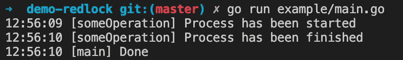
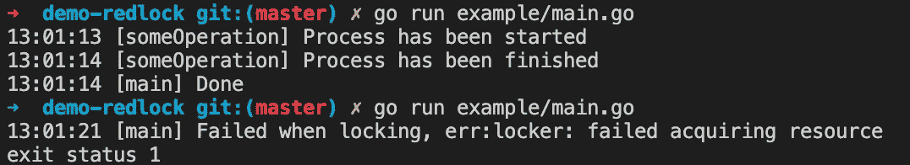
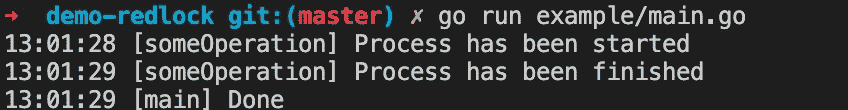

# 在 Redis 上为分布式锁实现 Redlock

> 原文：<https://levelup.gitconnected.com/implementing-redlock-on-redis-for-distributed-locks-a3cfe60d4ea4>

照片由 [eyeball3000](https://www.pexels.com/@eyeball3000-37274?utm_content=attributionCopyText&utm_medium=referral&utm_source=pexels) 从 [Pexels](https://www.pexels.com/photo/brown-padlock-on-wall-602160/?utm_content=attributionCopyText&utm_medium=referral&utm_source=pexels) 拍摄

在多线程编程环境中，我们使用锁来限制对共享资源的访问。一个锁的例子是[互斥](https://en.wikipedia.org/wiki/Mutual_exclusion)，它的名字代表互斥。互斥体通过只允许单个线程访问共享数据来保护共享数据(数组、链表、哈希映射或任何简单的原语类型)。

对于分布式系统，很难确保我们的多个应用程序实例在同一时间做完全相同的工作。例如调用一些外部 API、写入外部存储器以及执行一些繁重的计算。《设计数据密集型应用程序》一书的作者 Martin Kleppman 在他的博客中提到，我们需要在分布式应用程序上加锁有两个原因:

*   效率:让我们不必重复做同样的工作。
*   **正确性:**防止并发进程相互干扰，扰乱系统状态。

来自阿里云[的独立 vs 分布式锁](https://www.alibabacloud.com/blog/the-technical-practice-of-distributed-locks-in-a-storage-system_597141)

[Redis](https://redis.io/)的作者 Salvatore Sanfilippo 提出了一种叫做 Redlock 的算法，使用 Redis 作为分布式锁管理器(DLM)。你可以在[本页](https://redis.io/topics/distlock)看到红锁算法的细节。我们使用 Redis 实现分布式锁的方式是通过设置一个具有生存时间(TTL)的唯一密钥，当客户端使用完资源时，它将删除 Redis 上的密钥。如果客户端发生了错误，Redis 会根据 TTL 自动释放锁。Redlock 设计为至少在 3 台具有独立 Redis 实例的机器上运行，以避免任何单点故障。

让我们使用 Redlock 创建分布式锁的实现，在本文中，我们将使用 Go 来实现它。首先，我们创建一个 Locker 接口来执行**锁定**和**解锁**操作。

然后我们创建一个结构来保存我们的**锁**实现的一些配置。

*   **redisClients:** 因为我们使用多个 Redis 实例，所以我们将客户端存储在片上。在本教程中，我们使用 [go-redis](https://github.com/go-redis/redis) 作为客户端。
*   **到期:**锁会根据给定的 TTL 自动解除。
*   **漂移:**Redis 账户漂移到期。
*   **法定人数:** [法定人数](https://en.wikipedia.org/wiki/Quorum_(distributed_computing))将用于计算可以容忍多少次失败。如果客户机未能获得小于 **N/2+1** 的锁，我们将尝试解锁所有实例上的资源。n 代表我们 Redis 实例的数量**。**
*   **name:** Name 是将用作 Redis 键**，**的值，我们应该为每个锁使用一个唯一的名称。
*   **值:**值是随机字符串，因此只有当锁仍然是由试图移除它的客户端设置的锁时，它才会被移除。

要获得锁，我们需要使用 NX 选项设置不存在的密钥。

如果已经成功设置了密钥，并且在设置数据时我们没有到达到期时间，我们应该增加成功计数器。如果我们的总成功计数器小于定义的法定人数，我们将调用 **Unlock** 方法来释放所有的锁。对于**解锁**实现，我们简单地循环所有客户端，并解锁每个客户端。

为了完成实现，让我们创建一个结构来保存我们的**锁**实现的连接和构造函数。

DLM 结构将保存 Redis 连接，我们将把它作为单例实例使用。并且 **NewLocker** 将创建一个 **Locker** 实现的新实例。我们创建 **generateRandomString** 来生成一个简单的随机值，它将被用作锁值。请根据您的需要随意调整随机值生成器。

现在让我们试试我们的实现，我们将使用 10 秒作为到期时间。并且我们会在执行某个进程后立即调用 **Unlock** (我们在进程内部放了 1 秒睡眠)。

这是结果，我们能够成功地执行流程。

现在，让我们删除演示代码中的**解锁**部分。

在第一次尝试时，它会成功，但是在第二次尝试时，我们得到了一个错误，因为锁没有被前面的执行释放。

让我们等待 15 秒钟，再次运行演示。代码将成功执行，因为锁将在 10 秒后自动释放。

我们刚刚使用 Redis 为分布式锁实现了 Redlock 算法。你可以在这个库上看到这篇文章的完整源代码。

谢谢

**参考:**

*   [https://en.wikipedia.org/wiki/Mutual_exclusion](https://en.wikipedia.org/wiki/Mutual_exclusion)
*   [https://www . educative . io/blog/多线程并发基础](https://www.educative.io/blog/multithreading-and-concurrency-fundamentals)
*   [https://Martin . kleppmann . com/2016/02/08/how-to-do-distributed-locking . html](https://martin.kleppmann.com/2016/02/08/how-to-do-distributed-locking.html)
*   [https://redis.io/topics/distlock](https://redis.io/topics/distlock)
*   [https://redis labs . com/redis-best-practices/communication-patterns/red lock/](https://redislabs.com/redis-best-practices/communication-patterns/redlock/)
*   [https://www . Alibaba cloud . com/blog/the-technical-practice-of-distributed-practice-in-a-storage-system _ 597141](https://www.alibabacloud.com/blog/the-technical-practice-of-distributed-locks-in-a-storage-system_597141)