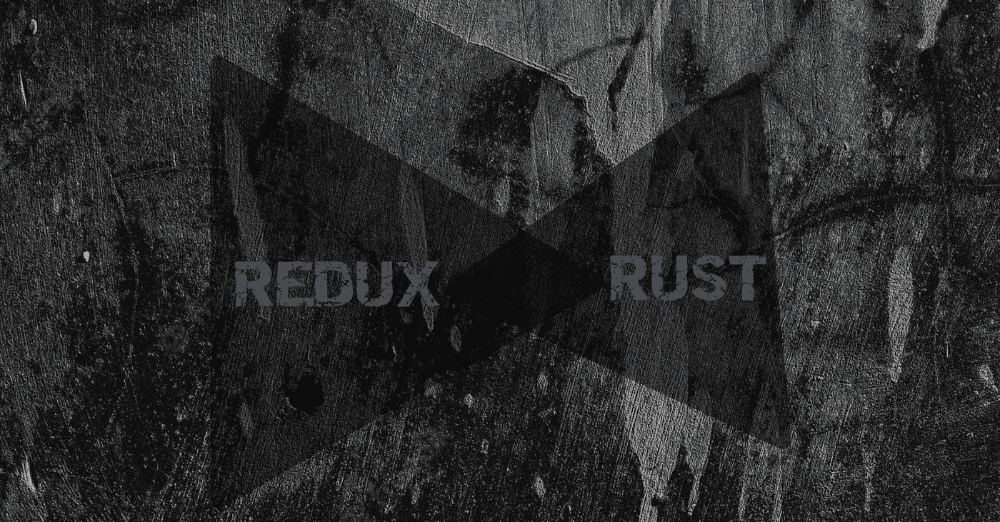

# 用 Rust 实现 Redux

> 原文：<https://levelup.gitconnected.com/implementing-redux-with-rust-a-step-by-step-guide-220acd2885f9>

## 循序渐进的指南



Redux 是一个流行的 JavaScript 应用程序状态管理库。它允许开发人员以可预测和一致的方式管理他们的应用程序的状态，使得开发和维护复杂的应用程序变得更加容易。

在这篇博文中，我们将探讨如何在 Rust 中实现 Redux，Rust 是一种静态类型的系统编程语言，以其性能和安全性而闻名。

为了在 Rust 中实现 Redux，我们需要创建一个表示应用程序状态的 struct 和一个定义可以在状态上执行的动作的 trait。我们还需要创建一个 reducer 函数，它接受当前状态和一个动作，并基于该动作返回一个新状态。

# 基本实现

下面是一个简单结构的示例，它表示待办事项应用程序的状态:

```
struct TodoState {
    todos: Vec<String>,
}
```

接下来，我们将使用 trait 定义可以在状态上执行的操作:

```
trait TodoAction {
    fn apply(&self, state: &mut TodoState);
}
```

然后我们可以定义 reducer 函数，它接受当前状态和一个动作，并基于该动作返回一个新状态

```
fn todo_reducer(state: &TodoState, action: &dyn TodoAction) -> TodoState {
    let mut new_state = state.clone();
    action.apply(&mut new_state);
    new_state
}
```

现在我们已经有了 Redux 实现的基本结构，我们可以定义可以在我们的 to-do 状态上执行的具体操作。例如，我们可能有一个添加新待办事项的操作:

```
struct AddTodoAction {
    todo: String,
}

impl TodoAction for AddTodoAction {
    fn apply(&self, state: &mut TodoState) {
        state.todos.push(self.todo.clone());
    }
}
```

我们还可以定义一个删除待办事项的操作:

```
struct RemoveTodoAction {
    index: usize,
}

impl TodoAction for RemoveTodoAction {
    fn apply(&self, state: &mut TodoState) {
        state.todos.remove(self.index);
    }
}
```

有了这些动作，我们现在可以使用 reducer 函数根据用户交互来更新待办事项应用程序的状态。例如，如果用户添加了一个新的待办事项，我们可以使用`todo_reducer`函数来更新状态，如下所示:

```
let mut state = TodoState { todos: vec![] };
let action = AddTodoAction { todo: "Learn Rust".to_string() };
state = todo_reducer(&state, &action);
```

这是在 Rust 中实现 Redux 的一个非常简单的例子，但是它应该让您对基本结构以及如何创建动作和 reducer 函数有一个很好的了解。在 Rust 中实现 Redux 还有许多其他方法，包括使用宏来生成 reducer 函数，使用枚举来表示动作。

# 使用宏生成 reducer 函数和枚举来表示动作

首先，我们将定义一个枚举，它表示可以对状态执行的不同操作:

```
enum TodoAction {
    AddTodo(String),
    RemoveTodo(usize),
}
```

接下来，我们将定义为我们生成 reducer 函数的宏:

```
#[macro_export]
macro_rules! create_reducer {
    ($state_type:ty, $action_type:ty, $reducer_fn:expr) => {
        fn reducer(state: &$state_type, action: $action_type) -> $state_type {
            let mut new_state = state.clone();
            $reducer_fn(&mut new_state, action);
            new_state
        }
    }
}
```

现在我们可以使用`create_reducer`宏来定义我们的减速器功能，如下所示:

```
create_reducer!(TodoState, TodoAction, |state: &mut TodoState, action| {
    match action {
        TodoAction::AddTodo(todo) => state.todos.push(todo),
        TodoAction::RemoveTodo(index) => state.todos.remove(index),
    }
});
```

这将生成一个 reducer 函数，它接受一个`TodoState`和一个`TodoAction`枚举，并根据动作更新状态。

我们现在可以使用 reducer 函数来更新我们的待办事项应用程序的状态，如下所示:

```
let mut state = TodoState { todos: vec![] };
let action = TodoAction::AddTodo("Learn Rust".to_string());
state = reducer(&state, action);
```

# 现在我们可以使用 Yew 来为我们的待办事项应用程序构建 UI

首先，我们将定义一个表示单个待办事项的组件:

```
use yew::{html, Callback, Html};

struct TodoItem {
    todo: String,
    on_remove: Callback<()>,
}

impl Component for TodoItem {
    type Message = ();
    type Properties = Self;

    fn create(props: Self::Properties, _: ComponentLink<Self>) -> Self {
        Self {
            todo: props.todo,
            on_remove: props.on_remove,
        }
    }

    fn update(&mut self, _: Self::Message) -> ShouldRender {
        false
    }

    fn view(&self) -> Html {
        html! {
            <div>
                <span>{ &self.todo }</span>
                <button onclick=self.on_remove.clone()>{"Remove"}</button>
            </div>
        }
    }
}
```

接下来，我们将定义应用程序的主要组件，它将包含一个待办事项列表和一个用于添加新待办事项的表单:

```
use yew::{html, Callback, Component, ComponentLink, Html, ShouldRender};
use yew_functional::{use_state, use_reducer};

struct TodoApp {
    link: ComponentLink<Self>,
    state: TodoState,
    dispatch: Callback<TodoAction>,
}

impl Component for TodoApp {
    type Message = ();
    type Properties = ();

    fn create(_: Self::Properties, link: ComponentLink<Self>) -> Self {
        let state = TodoState { todos: vec![] };
        let (dispatch, _) = use_reducer(link, reducer, state);
        Self { link, state, dispatch }
    }

    fn update(&mut self, _: Self::Message) -> ShouldRender {
        false
    }

    fn view(&self) -> Html {
        html! {
            <div>
            <h1>{"Todo List"}</h1>
            <ul>
                { for self.state.todos.iter().enumerate().map(|(index, todo)| {
                    html! {
                        <TodoItem
                            todo=todo.clone()
                            on_remove=self.link.callback(move |_| {
                                self.dispatch.emit(TodoAction::RemoveTodo(index))
                            })
                        />
                    }
                }) }
            </ul>
            <form onsubmit=self.link.callback(|event| {
                event.prevent_default();
                let input = event.target().unwrap().try_into::<HtmlInputElement>().unwrap();
                let todo = input.value();
                input.set_value("");
                self.dispatch.emit(TodoAction::AddTodo(todo))
            })>
                <input type="text" />
                <button type="submit">{"Add Todo"}</button>
            </form>
        </div>
    }
}
```

该组件将呈现一个待办事项列表和一个添加新待办事项的表单。使用来自 Yew 的`use_reducer`钩子来管理应用程序的状态，这允许我们使用我们之前定义的 reducer 函数来基于用户交互更新状态。

要在 Yew 应用程序中使用该组件，可以像这样将其添加到根组件中:

```
use yew::{html, App};

fn main() {
    yew::initialize();
    App::<TodoApp>::new().mount_to_body();
    yew::run_loop();
}
```

这个例子帮助你理解如何使用 Yew 和 Redux 在 Rust 中构建一个 web 应用。如果你有任何问题或建议，请不要犹豫地问！

# 分级编码

感谢您成为我们社区的一员！在你离开之前:

*   👏为故事鼓掌，跟着作者走👉
*   📰查看[升级编码出版物](https://levelup.gitconnected.com/?utm_source=pub&utm_medium=post)中的更多内容
*   🔔关注我们:[Twitter](https://twitter.com/gitconnected)|[LinkedIn](https://www.linkedin.com/company/gitconnected)|[时事通讯](https://newsletter.levelup.dev)

🚀👉 [**加入升级人才集体，找到一份惊艳的工作**](https://jobs.levelup.dev/talent/welcome?referral=true)