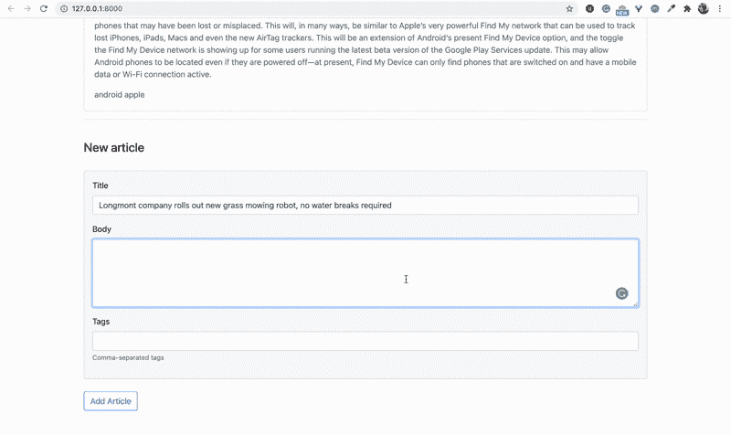
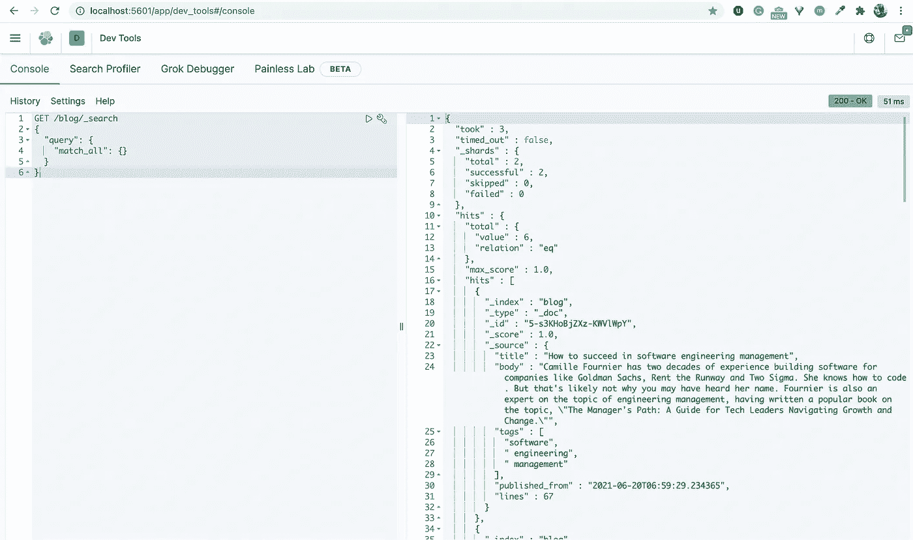
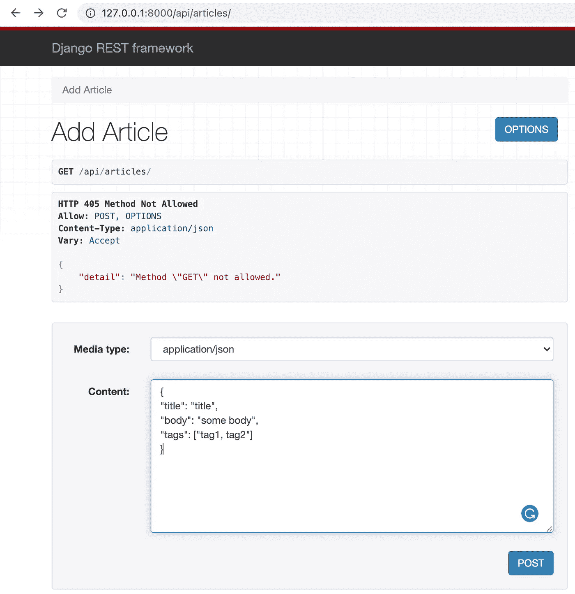

# 用 Django、Elasticsearch 和 Vue.js 实现搜索

> 原文：<https://levelup.gitconnected.com/implementing-search-with-django-elasticsearch-and-vue-js-e69a26c27e0e>

## 实施搜索功能的分步指南


在这个简短的教程中，我将展示一个例子，说明如何用 Django 和 Vue.js 使用 Elasticsearch 实现一个搜索功能。在我们将要创建的 web 应用程序中，用户可以通过提供文章的标题和内容来添加新文章，如果需要，还可以添加一些标签。他们还可以从“文章列表”中搜索文章。

假设你已经知道什么是 Elasticsearch 以及我们为什么需要它(因为你在搜索中偶然发现了这篇文章)，我就不详细解释 Elasticsearch 了。简而言之，Elasticsearch 是一个提供强大搜索功能的数据库，如全文搜索、模糊文本搜索等。我们将使用 Elasticsearch 来增强我们在这个 web 应用程序中的搜索功能。如果你有兴趣学习更多关于 Elasticsearch 的知识，这将是一个好的开始:[https://www.elastic.co/what-is/elasticsearch](https://www.elastic.co/what-is/elasticsearch)

示例应用程序看起来类似于下面的 GIF。如上所述，我们可以使用页面底部的“新文章”表单添加文章，或者使用搜索栏搜索文章。



使用 Elasticsearch 搜索功能

这个示例 web 应用程序的完整代码可以在这个 [GitHub](https://github.com/fatse/django-elasticsearch-vuejs) repo 中找到。

> **使用的技术:**
> 
> [Docker 桌面](https://www.docker.com/products/docker-desktop) [Python](https://www.python.org/downloads/release/python-395/)
> [Django](https://docs.djangoproject.com/en/3.2/releases/3.1.4/)
> [vue . js](https://v3.vuejs.org/)
> [Django REST 框架](https://www.django-rest-framework.org/)
> [elastic search](https://www.elastic.co/elasticsearch/)
> [elastic search DSL](https://elasticsearch-dsl.readthedocs.io/en/latest/)

我们将按照以下步骤构建我们的应用程序:

1.  [*创建新的虚拟环境*](#b1d3)
2.  [*安装 Django*](#7dab)
3.  [*创建新的 Django 项目和新的 Django 应用*](#dbed)
4.  [*创建 REST API 模型&创建 Elasticsearch 模型*](#95d7)
5.  [*使用 Docker*](#0fd0) 设置 Elasticsearch & Kibana 服务器
6.  [*实现 Django 视图*](#1ced)
7.  [*创建 URL 并使用 DRF UI 测试它们*](#d5ef)
8.  [*建立模板，添加并使用 Vue.js*](#7ffa)
9.  [*运行应用*](#f485)

1。 ***创建新的虚拟环境***
让我们从创建新的虚拟环境开始。通过这样做，我们将在每个项目的基础上隔离我们的 Django 设置，因此我们对项目所做的任何更改都不会影响我们可能正在开发的其他项目。

在您的终端中，运行下面显示的命令来创建一个新目录，并将当前目录更改为我们刚刚创建的新项目目录。

```
mkdir elastico-appcd elastico-app
```

创建并进入新目录后，我们就可以通过运行以下命令来创建新的虚拟环境了:

```
python3 -m venv env
```

最后，我们需要像这样激活新的虚拟环境:

```
source env/bin/activate
```

2。 ***安装 Django***
现在我们可以安装我们喜欢的 Django 版本了。在这个例子中，我们将安装 Django 3.1.4。

```
(env) ~/elastico-app$ pip install Django==3.1.4
```

3。 ***创建一个新的 Django 项目和一个新的 Django 应用程序***
接下来，让我们创建一个新的 Django 项目。我们将这个项目命名为**django _ elastic search***，*，我们将通过运行以下代码来创建它:

```
(env) ~/elastico-app$ django-admin startproject django_elasticsearch(env) ~/elastico-app$ cd django_elasticsearch
```

接下来，我们将创建一个新的 Django 应用程序。我们将这个应用程序称为**django _ formset _ vuejs***，我们将这样创建它:*

```
*(env) ~/elastico-app/django_elasticsearch$ python manage.py startapp django_elastico_vuejs*
```

*成功创建新应用程序后，我们必须将其添加到 **settings.py** 文件中的 **INSTALLED_APPS** 中。*

**注:*我们还得在 INSTALLED_APPS 中添加***‘rest _ framework’**。因此，此时 INSTALLED_APPS 列表如下所示:**

```
**INSTALLED_APPS = [
    'django.contrib.admin',
    'django.contrib.auth',
    'django.contrib.contenttypes',
    'django.contrib.sessions',
    'django.contrib.messages',
    'django.contrib.staticfiles', 'rest_framework',
    'django_elastico_vuejs',
]**
```

**我们的项目树应该是这样的:**

```
**elastico-app
├── django_elastico_vuejs
│   ├── admin.py
│   ├── apps.py
│   ├── migrations
│   │   └── __init__.py
│   ├── models.py
│   ├── tests.py
│   └── views.py
├── manage.py
├── django_elasticsearch
│   ├── __init__.py
│   ├── settings.py
│   ├── urls.py
│   └── wsgi.py
└── env**
```

**4。 ***创建 API 模型&创建 Elasticsearch 模式****l*首先，我们需要定义 REST API 模型，以便我们在 REST API 用户和我们的 REST API 服务器之间有一个清晰的接口。**

**接下来，我们需要定义一个 Elasticsearch 文档，我们将使用它来表示存储在 Elasticsearch 中的可搜索数据。**

**这样，两个接口都可以独立发展。**

**让我们将模型保存在一个新的 **" *模型* "** 文件夹中，在***django _ elastico _ vuejs****app 下。***

## *****4.1** *REST API 模型****

***模型对象 *:****

*   ****文章()****
*   **文章请求()**
*   ****searcarticlerequest()****

**模型序列化程序:**

*   ****ArticleSerializer()****
*   ****articlexrequestserializer()****
*   ****searcarticrequestserializer()****

## ****4.2** 弹性搜索文件**

**将 **ArticleDocument()** 定义为我们的弹性搜索文档，并使用 **init()** 方法初始化它。**

***注意:* ArticleDocument 继承自 **elasticsearch_dsl** 库的文档类。**

**和项目树:**

```
**elastico-app
├── django_elastico_vuejs
│   ├── migrations
│   ├── models
│   │   └──api
│   │      ├── __init__.py
│   │      └── models.py
│   │   └──es
│   │      ├── __init__.py
│   │      └── models.py
│   │   └── __init__.py
│   ├── __init__.py
│   ├── admin.py
│   ├── apps.py
│   ├── models.py
│   ├── tests.py
│   └── views.py
├── manage.py
├── django_elasticsearch
│   ├── __init__.py
│   ├── settings.py
│   ├── urls.py
│   └── wsgi.py
└── env**
```

**5。 ***使用 Docker*** 设置 Elasticsearch & Kibana 服务器我们使用 [Docker Compose](https://docs.docker.com/compose/) 工具在本地启动 Elasticsearch 数据库，以便从 Docker 映像运行 Elasticsearch。**

**此外，我们还使用 [Kibana](https://www.elastic.co/kibana?ultron=B-Stack-Trials-AMER-CA-Exact&gambit=Elasticsearch-Kibana&blade=adwords-s&hulk=cpc&Device=c&thor=kibana&gclid=CjwKCAjwz_WGBhA1EiwAUAxIcbEXahJWvNtYsix19Tzquc8I26SHC5blamhok7_UO12IE05XRVLtvRoCQrcQAvD_BwE) 作为 Elasticsearch 的数据可视化工具，因此我们也在 Docker Compose 脚本中定义了一个 Kibana 容器。**

**这是我们的 *docker-compose.yml* 文件的样子:**

**要运行 Docker 编写文件，请打开您的终端并运行以下命令:**

```
**(env) ~/elastico-app$ docker-compose up**
```

***注意:*在尝试运行此命令之前，请确保您已经安装了 [Docker Desktop](https://www.docker.com/products/docker-desktop) ，并且它正在您的机器上运行，否则您会在执行 docker-compose 脚本时遇到问题。**

**使用我们在 docker-compose 文件中定义的端口，即 5601，可以从浏览器访问 Kibana dashboard。例如，当在浏览器的搜索栏中键入[http://localhost:5601/app/kibana #/dev _ tools/console](http://localhost:5601/app/kibana#/dev_tools/console)时，我们看到 ki Bana 的 UI 类似于下面的截图。**

****

**6。 ***实现视图*** 我们准备在**django _ elastico _ vuejs/views . py**中实现我们的视图，并处理我们的 REST API 以及初始化 Elasticsearch 数据库。**

***注意:*我们正在使用 Elasticsearch [模糊查询](https://www.elastic.co/guide/en/elasticsearch/reference/current/query-dsl-fuzzy-query.html)，它返回包含与搜索词相似的词的文档，这是通过 [Levenshtein 编辑距离](https://en.wikipedia.org/wiki/Levenshtein_distance)测量的。**

**7。 ***创建 URL 并使用 DRF UI 测试它们*** 我们还需要在**django _ elastico _ vuejs**app 内创建一个名为 **urls.py** 的新文件。 **urls.py** 中的代码应该是这样的:**

**现在我们需要将 **django_elastico_vuejs** 应用程序的 URL 包含到我们的主 **urls.py** 项目文件中。**

**我们可以使用 DRF 接口测试 REST APIs。例如，如果我们想要测试文章创建 REST API，我们使用这个 url 来访问它:[http://127 . 0 . 0 . 1:8000/API/articles/](http://127.0.0.1:8000/api/articles/)**

****

**8。 ***构建模板，添加并使用 Vue.js*** 我们应该先在 **django_elastico_vuejs** 应用程序内创建一个目录，名为 **templates** 、，然后在 **templates** 目录内，我们应该创建另一个目录，名为 **django_elastico_vuejs** 。现在让我们在 **django_elastico_vuejs 里面添加两个模板**base.html**和**articles.html**。****

**我们的项目树现在看起来像这样:**

```
**elastico-app
├── django_elastico_vuejs
│   ├── migrations
│   ├── models
│   ├── templates
│   │   └──django_elastico_vuejs
│   │      ├── articles.html
│   │      └── base.html
│   ├── __init__.py
│   ├── admin.py
│   ├── apps.py
│   ├── models.py
│   ├── tests.py
│   ├── urls.py
│   └── views.py
├── manage.py
├── django_elasticsearch
│   ├── __init__.py
│   ├── settings.py
│   ├── urls.py
│   └── wsgi.py
└── env**
```

**在**base.html**中，我们将把基本模板的代码与我们的风格、脚本和其他我们希望与其他模板共享的东西放在一起。该文件如下所示:**

**如你所见，我们已经通过添加 CDN 将 Vue.js 添加到我们的项目中，我们可以在扩展**base.html**模板的模板中自由使用它。**

**然后**articles.html**模板中的代码看起来像这样:**

**9。 ***运行应用程序***
此时，我们已经用 Django 和 Vue.js 使用 Elasticsearch 数据库完成了应用程序的实现，我们可以启动本地 web 服务器了。**

```
**(env) ~/elastico-app$ python manage.py runserver**
```

****

**使用 Elasticsearch 搜索功能**

# **结论**

**我希望您喜欢这篇文章，并且您可以使用这个示例作为指南，使用带有 Django REST framework 和 Vue.js 的 Elasticsearch 来使用和实现一个搜索特性。**

*****参考文献及资源:*****

 **[## Home - Django REST 框架

### Django REST 框架是一个用于构建 Web APIs 的强大而灵活的工具包。您可能想使用 REST 的一些原因…

www.django-rest-framework.org](https://www.django-rest-framework.org/)** **[](https://docs.docker.com/compose/) [## Docker 编写概述

### 寻找撰写文件参考？在此处找到最新版本。Compose 是一个定义和运行…

docs.docker.com](https://docs.docker.com/compose/) [](https://www.elastic.co/kibana/) [## Kibana:探索、可视化、发现数据|弹性

### 刚到基巴纳？这是你开始工作所需要的一切。观看视频，了解使用 Kibana 进行数据分析的核心概念…

www.elastic.co](https://www.elastic.co/kibana/) [](https://articlegenerator.org/) [## 文章生成器-免费独特的在线内容生成器！

### 文章生成器是一个轻量级的在线自动工具，只需添加一个…

articlegenerator.org](https://articlegenerator.org/)**