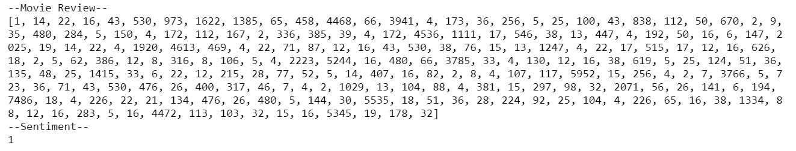
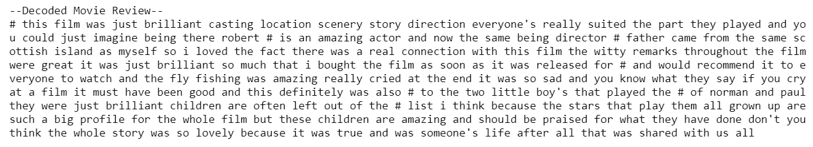

# 用 Keras 实现情感分类

> 原文：<https://levelup.gitconnected.com/implementing-sentiment-classification-with-keras-507f582c80e4>

在本文中，我们将探索 Keras 创建神经网络来预测电影评论情绪的能力。


资料来源:pexels.com

# Keras 是什么？

*   [Keras](https://keras.io/) 是一个深度学习 API，旨在轻松实现神经网络
*   Keras 用 Python 编写，旨在运行在开源机器学习平台 [TensorFlow](https://www.tensorflow.org/) 2.0 之上。它还保持了与 Theano 和 CNTK 平台以及旧版本 TensorFlow 的兼容性
*   Keras 能够在 CPU 和 GPU 架构上运行
*   当前版本:2.3.0(截至 2010 年 6 月 4 日)

# 使用 Keras

我们将使用 Keras 创建一个可以预测电影评论情绪的神经网络。换句话说，我们正在创建一个模型，它将“阅读”评论的文本内容，并对其评级进行预测。例如，考虑下面的评论:

> “这部电影糟透了。我会避免看它。”

在这种情况下，我们希望我们的模型预测评论是负面的。这个预测系统是自然语言处理的一种形式，人工智能试图破译和理解人类语言。

# 入门指南

我们的预测系统将使用流行的 [IMDB 数据集](https://ai.stanford.edu/~amaas/data/sentiment/)构建。该数据集包含来自 IMDB 的 50，000 条电影评论，内置于 Keras API 中。这使得它非常容易使用，因为数据已经为我们进行了预处理。

我们将从导入所有必需的库开始。这包括基本的 numpy 库，以及 Keras 使用的一些不同的神经网络层。

```
import numpy as np
import tensorflow as tf
from tensorflow import kerasfrom keras import layers
from keras.preprocessing import sequence
from keras.models import Sequential
from keras.layers import Dense, Dropout, Flatten, Embedding
```

# 加载数据

然后，我们可以加载 IMDB 数据集。这样做时，我们可以指定几个参数。

*   **num_words:** 我们要使用的唯一单词的数量。没有任何限制，数据集包含 88，584 个单词。将 num_words 设置为 10，000 将只保留 10，000 个最常用的单词
*   **maxlen:** 电影评论的最大长度。任何长于 maxlen 的评论都将被缩短到这个长度

在这种情况下，我将 **num_words** 设置为 10，000，将 **maxlen** 设置为 400。这些都是相当随意的选择，所以我鼓励您尝试这些参数的不同值。

```
num_words = 10000
maxlen = 400(x_train, y_train),(x_test, y_test) = tf.keras.datasets.imdb.load_data(
    path="imdb.npz",
    num_words=num_words,
    skip_top=0,
    maxlen=None,
    seed=113,
    start_char=1,
    oov_char=2,
    index_from=3
)
```

这样做将数据分为训练组和测试组，分别有 25，000 个训练样本和 25，000 个测试样本。

# **描述数据**

正如我之前提到的，Keras 通过预处理数据为我们做了很多工作。让我们看一下第一个样本:

```
print("--Movie Review--")
print(x_train[0])
print("--Sentiment--")
print(y_train[0])
```



符号化评论

在这种情况下，评论已经被**符号化了。**这意味着评论中的每个单词都被转换成了整数。较小的整数对应更频繁使用的单词。通过将 num_words 设置为 10，000，我们只保留了 10，000 个最常用的单词。

我们还可以看到评论的**情绪**等于 1。这意味着审查的基调是积极的。

*   **情绪= 1:** 积极
*   **情绪= 0:** 消极

了解了这些，我们就可以看一下解码的回顾了。

```
print(“ -— Decoded Movie Review -— “)
index = tf.keras.datasets.imdb.get_word_index()
reverse_index = dict([(value, key) for (key, value) in index.items()]) 
decoded = “ “.join( [reverse_index.get(i — 3, “#”) for i in x_train[0]] )
print(decoded)
```



解码评论

# 填充序列

为了将评论输入神经网络，它们的大小必须相同。我们已经用 maxlen 把较长的评论缩短到 400 字。然而，我们还必须“延长”较短的审核以达到这一限制。我们将通过使用 pad_sequences 来做到这一点

```
x_train = sequence.pad_sequences(x_train, maxlen=maxlen)
x_test = sequence.pad_sequences(x_test, maxlen=maxlen)
```

# 创建神经网络

现在我们可以创建我们的模型了！我们应该记住，我们的模型接受 400 个整数的数组作为输入，并输出一个二进制分类器。

```
model = Sequential()
model.add(Embedding(num_words, 32, input_length=maxlen))
model.add(Flatten())
model.add(Dropout(0.5))
model.add(Dense(150, activation='relu'))
model.add(Dense(1, activation='sigmoid'))
model.compile(loss='binary_crossentropy', optimizer='adam', metrics = ['accuracy'])
```

这是我添加的不同图层的一点概述:

*   **嵌入层:**创建一个“地图”，将每个单词(整数)嵌入到一个连续的向量空间中
*   **丢弃层:**正则化技术，通过随机忽略层中一定比例的节点来工作。这有助于减少对训练数据的过度拟合。丢弃层通常会忽略 20%到 50%的结点
*   **密集层:**只是你的“标准”神经网络层。节点数和激活函数作为自变量给出

# 训练和测试神经网络

一旦我们创建了神经网络的框架，我们就可以使它适合我们的训练数据，以有效地完成模型的创建。

```
model.fit(x_train, y_train, epochs=2, batch_size=256, verbose=1)
```

这里，我们有一些可以控制的 **fit()** 方法的参数:

*   **时期:**整个训练数据集恰好通过神经网络一次的次数
*   **批量大小:**神经网络一次迭代中使用的训练样本数
*   **啰嗦:**简单的说 Keras 如何“展示”模型的训练进度。将 verbose 设置为 0 将不会显示任何内容，而将其设置为 1 将会显示一个动画进度条。

然后，我们根据测试数据测试模型，并输出结果。

```
scores = model.evaluate(x_test, y_test, verbose=1)
print("Accuracy: ", (scores[1]*100),"%")
```

# 结论

该模型能够以 88.24% 的准确率预测电影评论的情绪！这很好，但是还有改进的余地。可以对模型进行调整，包括以下内容:

*   更改评论的唯一字数和最大长度( **num_words** 和 **maxlen**
*   调整**辍学率**
*   给模型添加更多的**层**
*   训练模型时更改**时期/批次**大小

如您所见，可以对模型进行许多更改。我希望本演练提供了创建更加准确的预测器所必需的工具！