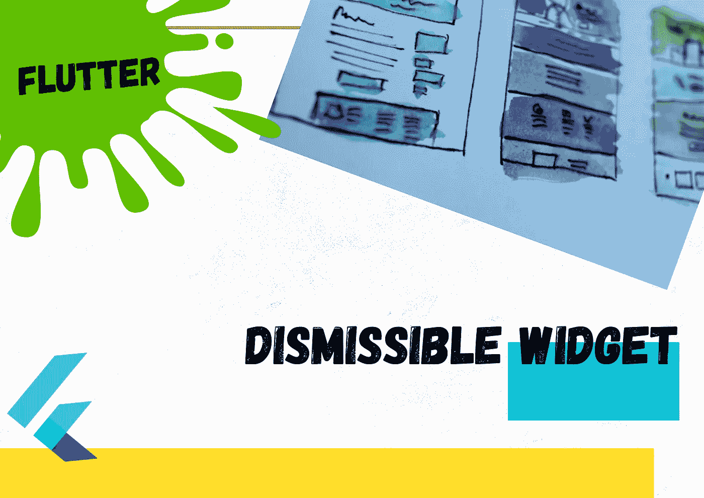
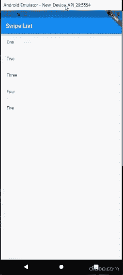

# 在 Flutter 中实现滑动消除

> 原文：<https://levelup.gitconnected.com/implementing-swipe-to-dismiss-in-flutter-b6438cddadcc>

## 自定义可忽略的小部件



作者图片

> 当我们处理 web 和移动应用程序时，我们体验到删除项目需要滑动，或者必须使用单独的功能，可以通过使用滑动动作来完成。

本文将向您展示如何在 Flutter 中使用 ***可忽略的小部件*** 来实现它。可忽略的小部件构造函数如下:

```
const **Dismissible**({@required Key **key**,@required **this.child**,**this.background**,**this.secondaryBackground**,**this.confirmDismiss**,**this.onResize**,**this.onDismissed**,**this.direction** = DismissDirection.horizontal,**this.resizeDuration** = const Duration(milliseconds: 300),**this.dismissThresholds** = const <DismissDirection, double>{},**this.movementDuration** = const Duration(milliseconds: 200),**this.crossAxisEndOffset** = 0.0,**this.dragStartBehavior** = DragStartBehavior.start,})
```

**键** (Key)和**子** (Widget)是构造函数的必填字段。这个键变成了一个重要的角色，因为这个小部件可以从小部件列表中删除。孩子是一个主要角色，因为它显示了我们需要在哪里传递可以被解除的小部件。

[](https://api.flutter.dev/flutter/widgets/Dismissible-class.html)**可以通过此链接收集更多关于房产描述的信息。**

*在简单了解了实现的背景之后，让我们开始吧！😃*

## *1.使用现有项目中的元素创建一个列表*

```
*List<String> _values = ['One', 'Two', 'Three', 'Four'];*
```

## *2.用 itemCount 和 itemBuilder 构建一个 ListView。*

*然后通过 ithemBuilder 返回“可驳回的构造函数”。它需要有前面提到的键和子属性以及下面的示例代码。*

```
*ListView.builder(itemCount: listItems.length,itemBuilder: (context, index) {return Dismissible(key: ObjectKey(listItems[index]),child: Container(padding: EdgeInsets.all(20.0),child: Text(listItems[index]),),);},)*
```

****这是使用 Flutter 实现刷卡功能的主要代码。****

> *现在让我们看看如何处理“可忽略”构造函数的其他属性。*

*   ****设定背景****

*在“可忽略的”构造函数中，有两个主要的交换方向可以使用，它们被定义为 ***背景*** 和 ***次要背景*** 。背景是默认的，其消除方向被定义为“*开始到结束*”，这样从左向右滑动。次级背景消除方向被定义为“*结束到开始*”，从而从左向右滑动。如果我们不设置任何一个，它会自动将背景方向设为“开始到结束”。因此，我们可以使用 background 和 secondaryBackground 来定制它的属性，如颜色、子元素、填充等。名为 onDismissed 的属性用于检测我们滑动的方向。之后，我们可以根据该方向执行任何操作，如删除或添加到收藏夹。*

```
****background***: Container(color: Colors.blue,child: Padding(padding: const EdgeInsets.all(15),child: Row(children: [Icon(Icons.favorite, color: Colors.white),Text('Move to favorites', style: TextStyle(color: Colors.white)),],),),
);***secondaryBackground***: Container(color: Colors.red,child: Padding(padding: const EdgeInsets.all(15),child: Row(mainAxisAlignment: MainAxisAlignment.end,children: [Icon(Icons.delete, color: Colors.white),Text('Move to trash', style: TextStyle(color: Colors.white)),],),),);*
```

*   ****显示确认****

*在可驳回的构造函数下，有一个名为***confirm discover***的属性，可以用来对用户基于滑动方向执行动作进行最终确认。基于滑动方向，我们可以定制我们需要显示的提示。*

```
****confirmDismiss***: (DismissDirection direction) async {return await showDialog(context: context,builder: (BuildContext context) {return AlertDialog(title: const Text("Confirm"),content: direction == DismissDirection.startToEnd?Text("Are you sure you wish add to favorite this item?") :Text("Are you sure you wish to delete this item?"),actions: <Widget>[FlatButton(onPressed: () =>Navigator.of(context).pop(true),child: direction == DismissDirection.startToEnd?Text("FAVORITE") :Text("DELETE"),),FlatButton(onPressed: () => Navigator.of(context).pop(false),child: const Text("CANCEL"),),],);},);}*
```

*上述活动的完整代码如下。*

*酷！！！😃*

**

*作者 gif*

*现在我们对水平方向的刷卡功能实现有了清晰的思路。此外，我们还可以在垂直方向刷卡实现。完整代码实现到**垂直划动**如下图。*

*如果你需要给 ***添加一个函数，在从*on missed*属性检测到方向后，通过添加一个 S *nackBar* 来撤销你所做的*** 修改。这可以如下实现。*

*这里的方向参数提供了我们滑动的方向。*

```
*onDismissed: (direction) {var item = listItems.elementAt(index);Scaffold.of(context).showSnackBar(SnackBar(content: Text("Item deleted"),action: SnackBarAction(label: "UNDO",onPressed: () {undoDeletion(index, item); //undo deletion})));}*
```

> *这里我只使用了可忽略小部件中的几个属性。但是您可以使用其他属性并做进一步的实现。*

*[G *itHub 仓库完整代码…*](https://github.com/sajee1dw/swipe_implementing)*

*如果你对这篇文章有任何问题，或者对如何更好地实现有任何建议，请发表评论。如果你从中获得了任何有用的信息，别忘了鼓掌。*

*感谢您的阅读！！！😜👍*