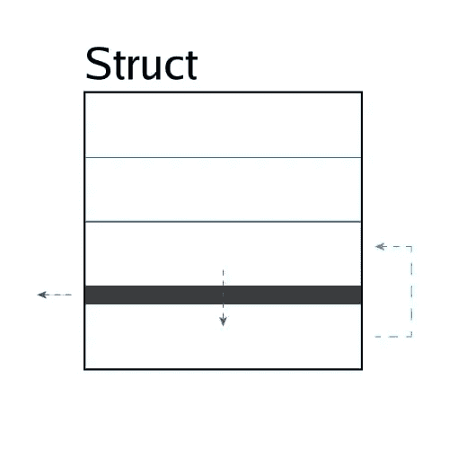

# 在 Go 中实现 Fieldalignment 包

> 原文：<https://levelup.gitconnected.com/implementing-the-fieldalignment-bundle-in-go-1f725302a6dc>



作者照片

这种简单的优化以最小的努力提高了 Go 程序的性能。直到现在也从未实施过。 **fieldalignment bundle** 是一种技术，可以用来最小化应用程序在运行时使用的内存量。由于 Go 垃圾收集器的语义，这可以提高性能。

# 什么是结构填充？

系统架构(32 位、64 位)定义了每个*字*的大小(以位为单位)以及系统内存的对齐方式。第一个因素是 Go 编程语言中原语类型*(即 string、int、uint 等)*大小的基础。例如，基本类型的尺寸可以在`[go/types/sizes.go:131](https://cs.opensource.google/go/go/+/master:src/go/types/sizes.go;l=131?q=sizes.go)`中找到。

第二个因素是**结构填充**的基础，它将结构的字段与内存中的地址对齐。这是通过向结构填充(添加额外的)字节来实现的，因此它的大小是有效字长的倍数*(即 8 字节* 64 位系统上的倍数)*。结构填充的目的是提高内存使用的性能，并防止系统架构上的许多其他问题。

*有关内存对齐的更多信息，请阅读* [*内存布局(Go)*](https://go101.org/article/memory-layout.html) *和* [*处理恶意结构*](https://medium.com/@sebassegros/golang-dealing-with-maligned-structs-9b77bacf4b97) *。*

# 什么是字段对齐？

**字段对齐**是对齐 Go 结构中字段的过程，目的是最小化结构的大小(在内存中)。例如，重新组织结构字段的顺序可以将其大小从 24 字节减少到 16 字节。在 Go 编程语言中，使用`go install golang.org/x/tools/go/analysis/passes/fieldalignment/cmd/fieldalignment@latest`安装的[字段对齐工具](https://pkg.go.dev/golang.org/x/tools/go/analysis/passes/fieldalignment)可以解决字段对齐问题。

使用`fieldalignment`命令将会告诉你程序中错位字段的位置。使用`-fix`标志将为您修复这些问题，而使用`-json`将以 JSON 格式打印出诊断结果。作为一个**警告**，运行`fieldalignment -fix ./...`可能会从您的字段中删除注释，因为在 Go 抽象语法树中操作自由浮动注释存在潜在的困难。这个问题正在 https://github.com/golang/go/issues/20744 得到解决，但是围棋的创造者花了 5 年时间才取得进展。

```
file.go:17:14: struct with 64 pointer bytes could be 56
```

## 有什么好处？

现场校准的好处在批量生产中可以观察到。如果您的应用程序通过字段对齐为每个结构节省 *8 个字节，这将为一百万次请求内使用的每个结构节省 **8 MB** 内存。这让您可以节省内存资源，甚至可以减少 [Go 垃圾收集器](https://agrim123.github.io/posts/go-garbage-collector.html) *(随着时间的推移提高性能)*中的峰值数量。具体来说，Go 使用一个*停止全局垃圾收集器*，它在目标堆大小时触发。通过以一致的速度保持尽可能小的堆，可以减少垃圾收集器的延迟。*

这也是使用零分配库的基本原理。

## 警告

艾伦·多诺万是谷歌的软件工程师，也是 Go 编程语言的合著者。他对场校准有什么看法？

> *“应该审查 fieldalignment 应用的修复，因为在某些情况下，它们可能会* [*降低性能*](https://cs.opensource.google/go/x/tools/+/refs/tags/v0.3.0:go/analysis/passes/fieldalignment/fieldalignment.go;l=45-48) *，并且它们肯定会导致依赖于字段顺序(通过反射)的测试失败。”*
> 
> *艾伦·多诺万(* [*评论*](https://github.com/golang/go/issues/57091#issuecomment-1338150430) *)*

字段对齐会导致性能下降，因为紧凑的字段顺序会导致同时更新的两个变量(在不同的 goroutines 中)占用相同的 CPU 缓存行:这导致一种称为[假共享](https://en.wikipedia.org/wiki/False_sharing)的内存争用。当错误共享发生时，被更新的第一个变量被强制重新加载 CPU 缓存块，即使它不是必需的。因此，更新每个变量的两个 goroutines 都变慢了。

*由于这个警告，建议对你的字段对齐代码进行基准测试。*

# 什么是捆绑？

在软件开发的上下文中，一个包代表了一个文件或源代码的集合。在本文的上下文中，一个包代表整个源包的单个文件版本。因此，通过将应用程序的所有源文件(`.go`)组合成一个单独的`.go`文件，就实现了一个包。这样做可能有很多原因；比如本文中的这个。通过使用`go install golang.org/x/tools/cmd/bundle@latest`安装的工具，可以在 Go 中实现捆绑。

使用`bundle`命令将应用程序捆绑到一个文件中。但是，这可能会生成一个在其导入中包含冲突的文件。通过`-import new=old`标志可以修复文件输出中的导入，但是在其他情况下，您必须手动修复。一个问题([https://github.com/golang/go/issues/57088](https://github.com/golang/go/issues/57088))正在努力解决这些情况。

## 警告

由于“[隐藏](https://cs.opensource.google/go/x/tools/+/refs/tags/v0.3.0:cmd/bundle/main.go;l=259)”，捆绑代码有可能成功编译，但保持与原始包不同的行为。

*由于这个警告，你必须在 CICD 管道中测试你的捆绑代码。*

# 实现 Fieldalignment 包

**fieldalignment bundle** 技术包括捆绑源代码，然后对其进行 fieldalignment。然而，这必须以一种仍然允许开发人员以简单的方式维护代码库的方式来完成。您必须创建代码库的副本并修改该副本，而不是直接将您的代码库转换为捆绑包或字段对齐。这允许您维护一个可供开发人员使用的可读版本。

建议在自己的模块中定义 **fieldalignment bundle** ，这样一个构建将*永远不会*包含两者。定义另一个模块的另一个好处是在测试时实现的:不是强迫开发人员通过`find and replace`操作*(即模块/a 到 b)* 在测试中切换模块，而是可以通过使用单行替换指令([模块](https://go.dev/ref/mod#go-mod-file-replace) / [工作区](https://go.dev/ref/mod#go-work-file-replace))在每个模块之间切换。

*这种实现也使得在 CICD 管道中使用现场校准包变得容易，因为不需要额外的工作来测试代码。*

## 一个实现

Disgo 是第一个以文档化的方式实现 **fieldalignment bundle** 的开源存储库。Disgo 使用这种技术是因为它基于 API 类型库( [Dasgo](https://github.com/switchupcb/dasgo) )，定义了类型的排序方式。Disgo 的整个代码生成器过程在`[_gen/README.md](https://github.com/switchupcb/disgo/blob/v10/_gen/README.md)`中有描述。捆绑文件(`disgo.go`)代码生成器位于`[_gen/bundle](https://github.com/switchupcb/disgo/tree/v10/_gen/bundle)`。

由于捆绑命令代码(来自`x/tools/cmd`)中的错误，必须实施`go generate`解决方案。因此，下面的步骤用于在 Go 中实现 fieldalignment 包。

1.  清除包文件。
2.  将 go generate 注释添加到文件中。
3.  调用 go 生成。
4.  解决包文件导入。
5.  字段对齐代码。由于以下原因，您必须从代码中多次调用 fieldalignment 可执行文件。

*   在某些情况下，fieldalignment 必须运行多次才能完全应用。当未使用`-json`标志时，这由退出代码 3 指示。
*   以这种方式调用 fieldalignment 时使用`-json`标志会导致退出代码 1 *(分析错误)*，而没有建议的修复*(与*[*【https://github.com/golang/go/issues/57091*](https://github.com/golang/go/issues/57091)*)*中的语句相反)。
*   没有一个`golang.org/x/tools`使用导出的函数。

## 修复删除的注释

当您使用 Git 等版本控制软件时，您可能会注意到在 *diff* 中，某些字段的注释被删除了。在某些情况下，修复就像对字段重新排序一样简单*(这样它们就不会被字段对齐工具修改)*。在其他情况下，重新排序字段会破坏文档的质量。虽然有许多方法可以解决这个问题，但是最简单的方法是在包文件代码生成器中使用一个`find and replace`函数。

简单的`strings.Replace`函数调用不起作用，因为一行中的空格*(填充)*数量可能不同。Disgo 在一个[多步骤过程](https://github.com/switchupcb/disgo/tree/v10/_gen#comments)中解决了这个问题，该过程涉及在一个文本文件中将字段对齐结构*(不带注释)*定义为字段对齐结构*(带注释)*。在字符串比较之前，这些文本文件和捆绑文件被去除空间，以便可以比较跨多行的文本。一旦发生这种情况，就可以正确无误地使用替换操作。

*原载于 2022 年 12 月 9 日 https://switchupcb.com**[*。*](https://switchupcb.com/blog/implementing-the-fieldalignment-bundle-in-go/)*