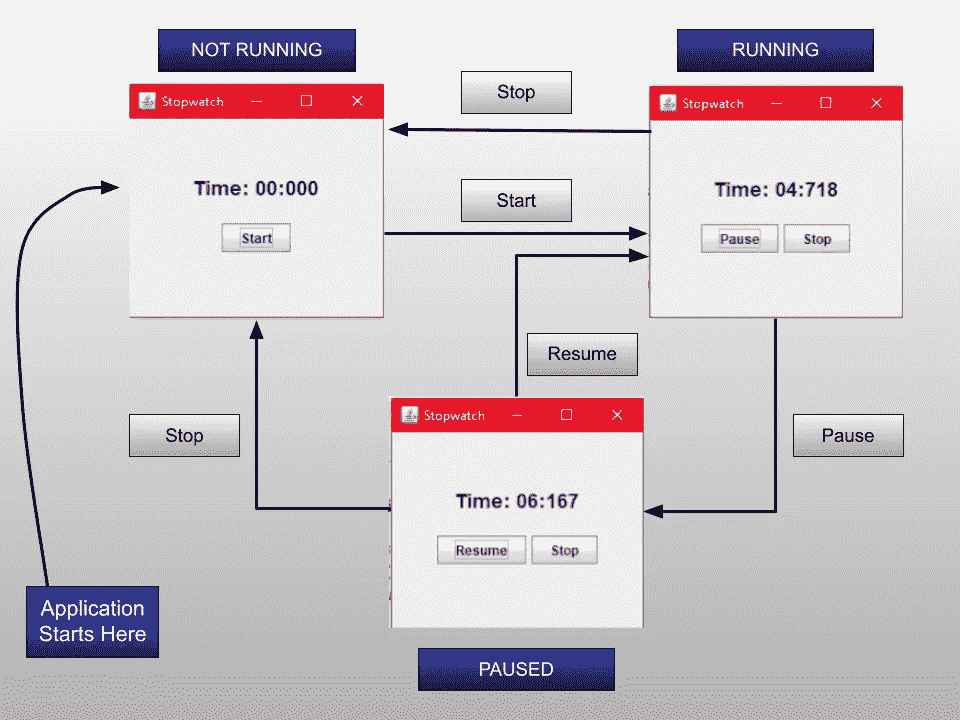
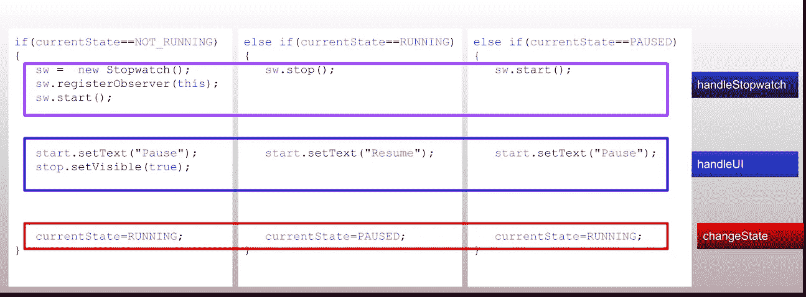
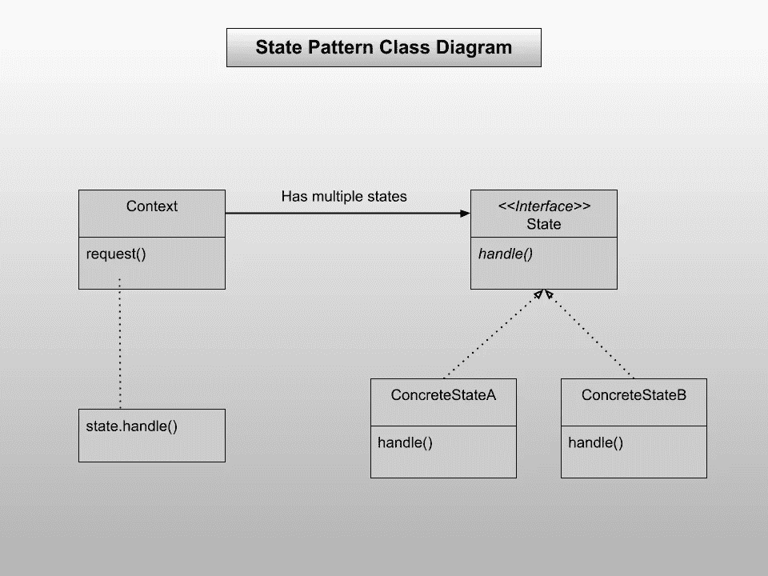
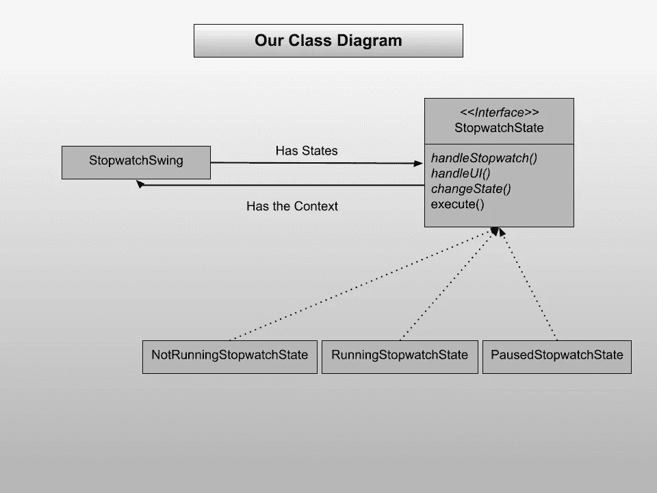

# 实现状态模式(第 6 部分)

> 原文：<https://levelup.gitconnected.com/implementing-the-state-pattern-part-6-7631a532c0ea>


礼貌:timeanddate.com

欢迎来到本系列的第 6 部分:“强大的设计模式来创建一个惊人的秒表应用程序”。我们的秒表应用程序就要完成了。我们只需要给它画龙点睛。我们的应用程序当前版本的问题是:它不可扩展。看一下我们在以下状态下处理按钮按压的方式:

```
private void handleStartPress() {
    if(currentState==NOT_RUNNING)
    {
        sw =  new Stopwatch();
        sw.registerObserver(this);
        sw.start();
        start.setText("Pause");
        stop.setVisible(true);
        currentState=RUNNING;
    }
    else if(currentState==RUNNING)
    {
        sw.stop();
        start.setText("Resume");
        currentState=PAUSED;
    }
    else if(currentState==PAUSED)
    {
        sw.start();
        start.setText("Pause");
        currentState=RUNNING;
    }

}
```

太多 if-else 语句。如果我们试图添加更多的状态，我们必须在很多地方进行修改，当我们忘记更新甚至一个地方时，这可能会引入错误。我们必须考虑如何让这个应用程序可扩展且易于理解。

# 之前的教程

如果您是第一次阅读这一部分，那么您一定要看看本系列的第 5 部分。

*   [**代号**](https://github.com/rajtilakls2510/Stopwatch/tree/S5_Adding_functions_to_the_APP) 直到现在。
*   [第五部](https://rajtilakls2510.medium.com/adding-start-pause-resume-and-stop-to-our-app-part-5-dd562d82d0a3)

顾名思义，我们将实现状态模式。警告:这种模式包括添加许多新的 java 文件，可能有点难以理解。但是我会尽我所能让你明白，所以继续读下去直到最后。

回想一下我们的应用程序的状态图:



请记住这个图表，因为我们将使用它来构建我们的模式。在进入该模式之前，让我们先确定一些当按下 start 按钮时执行的常见任务。这是当用户在非运行状态下按下开始按钮时运行的代码:

```
if(currentState==NOT_RUNNING)
{
    sw =  new Stopwatch();
    sw.registerObserver(this);
    sw.start();
    start.setText("Pause");
    stop.setVisible(true);
    currentState=RUNNING;
}
```

你能说出这里的一些常见任务吗？

```
sw =  new Stopwatch();
sw.registerObserver(this);
sw.start();
```

这三条线明确表明我们正在用秒表做一些事情。

```
start.setText("Pause");
stop.setVisible(true);
```

这两行表明我们正在更新 UI。

```
currentState=RUNNING;
```

这一行表明我们正在改变状态。

非常类似地，您可以在每个状态中识别这三类任务:

*   手柄秒表
*   handleUI
*   变更状态

看看下面这张图。



现在让我们了解一下状态模式。有一个公共的接口状态，具体的类从这个接口状态派生它们的方法。这个状态接口有一些适用于所有状态的通用方法。状态模式的类图如下所示:



您可以看到有一个接口状态，它有一个方法句柄()。所有的派生类都重写 handle()并放置它们自己的功能。这包括做自己的事情和改变状态(很重要)。

上下文是具有这些状态的类，这些状态随时间变化。这个上下文有一个 request()方法，它只接受当前状态并调用它的 handle()方法。无论当前状态如何，都会调用适当的 handle()方法并实现所有任务。

正式定义:

状态模式允许一个对象在其内部状态改变时改变其行为。该对象看起来会改变它的类。

在我们的应用程序中，每个状态都有三个常见的任务，我们将把这些任务放在每个状态的各自的方法中。状态接口将定义这些公共方法，处理这些公共方法的内部内容将是相应状态的责任。让我们从绘制我们的应用程序的类图开始，这样会给你更多的感觉。



让我们通过使接口 StopwatchState 来陈述。制作一个 java 文件 StopwatchState.java

```
public interface StopwatchState {

    public void handleStopwatch();
    public void handleUI();
    public void changeState();
}
```

请注意，handleStopwatch()、handleUI()和 changeState()需要按顺序调用。所以，我们再做一个封装这个算法的方法:execute()。你可能想知道如何在一个接口的方法中编写代码？方法不是抽象的吗？我们将利用 java8 中 Java 提供的**默认**关键字。这个关键字让你写一个接口方法的方法体。我们在这里并没有做太多的事情，我们只是写了当它必须改变状态时，这些方法需要被调用的顺序。

```
public interface StopwatchState { default void execute()
    {
        handleStopwatch();
        handleUI();
        changeState();
    }
    public void handleStopwatch();
    public void handleUI();
    public void changeState();
}
```

execute()方法的优点是 StopwatchSwing 只需对 currentState 调用 execute，它的所有秒表任务都将被处理，它的所有 UI 内容都将被处理，状态将自动改变。

使其处于不运行状态。创建一个 java 文件 NotRunningStopwatchState.java，并编写:

```
public class NotRunningStopwatchState implements StopwatchState{

    @Override
    public void handleStopwatch() {

    }

    @Override
    public void handleUI() {
    }

    @Override
    public void changeState() {
    }
}
```

我们已经覆盖了 StopwatchState 接口及其所有方法。现在，我们需要一个对上下文类的引用，这里的上下文类是 StopwatchSwing 类。因此，我们将创建一个类变量来保存 StopwatchSwing 对象，并在构造函数中初始化它。

```
 public class NotRunningStopwatchState implements StopwatchState{
    StopwatchSwing stopwatchSwing;

    public NotRunningStopwatchState(StopwatchSwing stopwatchSwing) {
        this.stopwatchSwing = stopwatchSwing;
    }

   ....
}
```

我们稍后将填充这些被覆盖的方法。让我们首先创建另外两个状态:RunningStopwatchState 和 PausedStopwatchState。

PausedStopwatchState.java

```
 public class PausedStopwatchState implements StopwatchState{
    StopwatchSwing stopwatchSwing;

    public PausedStopwatchState(StopwatchSwing stopwatchSwing) {
        this.stopwatchSwing = stopwatchSwing;
    }

    @Override
    public void handleStopwatch() {
    }

    @Override
    public void handleUI() {
    }

    @Override
    public void changeState() {
    }
} 
```

RunningStopwatchState.java

```
 public class RunningStopwatchState implements StopwatchState{
    StopwatchSwing stopwatchSwing;

    public RunningStopwatchState(StopwatchSwing stopwatchSwing) {
        this.stopwatchSwing = stopwatchSwing;
    }

    @Override
    public void handleStopwatch() {
    }

    @Override
    public void handleUI() {
    }

    @Override
    public void changeState() {
    }
}
```

我们将在后面填充所有这些被覆盖的方法。首先，让我们转到 StopwatchSwing 类，并在那里创建州。用给定代码替换以下代码:

```
//Replace this
public class StopwatchSwing implements Observer {

    ...
    final int NOT_RUNNING=0, RUNNING=1, PAUSED=2;
    int currentState;
    ....}// Replace it with thispublic class StopwatchSwing implements Observer { ....
    StopwatchState notRunningState;
    StopwatchState runningState;
    StopwatchState pausedState;

    StopwatchState currentState; .....
}
```

我们创建了三个状态，它们的类型是 StopwatchState，因为我们知道它们将实现 StopwatchState。让我们在 StopwatchSwing 的构造函数中创建它们各自的对象，并首先用 NotRunningStopwatchState 对象初始化 currentState(与之前用 final integers 实现时相同):

```
StopwatchSwing()
{
    // Remove this
    currentState = NOT_RUNNING;
    sw = new Stopwatch();
    sw.registerObserver(this); // Add this
    notRunningState = new NotRunningStopwatchState(this);
    runningState = new RunningStopwatchState(this);
    pausedState = new PausedStopwatchState(this);
    currentState = notRunningState;
    .... }
```

注意，我们在每个状态的构造函数中传递上下文，因为它们需要上下文来更新 UI 元素和秒表。

接下来，我们将向 StopwatchSwing 添加一些状态访问器方法，以便这些状态类可以访问类变量。非常简单，只需添加这些 getter 和 setter 方法:

```
public class StopwatchSwing implements Observer {

    ....

    *// <-------------------- Accessor Methods ------------------->* public void setState(StopwatchState state)
    {
        currentState = state;
    }

    public StopwatchState getState()
    {
        return currentState;
    }

    public void setStopwatch(Stopwatch sw)
    {
        this.sw =sw;
    }
    public StopwatchState getNotRunningState() {
        return notRunningState;
    }

    public StopwatchState getRunningState() {
        return runningState;
    }

    public StopwatchState getPausedState() {
        return pausedState;
    }
    ....
}
```

注意，我们有一个设置当前状态的 setState()方法，获取当前状态的 getState()方法，设置新秒表的 setStopwatch()方法，获取未运行状态对象的 getNotRunningState()方法，以及类似的其他 getter 方法。

现在，让我们去填充状态类的未完成的覆盖方法。从 NotRunningStopwatchState 开始。代码类似且易于理解:

```
public class NotRunningStopwatchState implements StopwatchState{
    StopwatchSwing stopwatchSwing;

    public NotRunningStopwatchState(StopwatchSwing stopwatchSwing) {
        this.stopwatchSwing = stopwatchSwing;
    }

    @Override
    public void handleStopwatch() {
        Stopwatch sw = new Stopwatch();
        stopwatchSwing.setStopwatch(sw);
        sw.registerObserver(stopwatchSwing);
        sw.start();
    }

    @Override
    public void handleUI() {
        stopwatchSwing.start.setText("Pause");
        stopwatchSwing.stop.setVisible(true);
    }

    @Override
    public void changeState() {
        stopwatchSwing.setState(stopwatchSwing.getRunningState());
    }
}
```

您可以在 handleStopwatch()方法中看到，我们正在创建一个新的秒表，并将其设置为 stopwatchwangobjects Stopwatch 变量。我们正在注册观察器并启动它。在 handleUI()方法中，我们正在更新 StopwatchSwing 类的 UI。最后注意改变状态的方法。它从上下文类中获取运行状态，并使用 StopwatchSwing 类的 setState()方法更新它。

所有其他州的代码几乎相同，我将只给出它们而不做任何解释:

PausedStopwatchState.java:

```
public class PausedStopwatchState implements StopwatchState{
    StopwatchSwing stopwatchSwing;

    public PausedStopwatchState(StopwatchSwing stopwatchSwing) {
        this.stopwatchSwing = stopwatchSwing;
    }

    @Override
    public void handleStopwatch() {
        stopwatchSwing.sw.start();
    }

    @Override
    public void handleUI() {
        stopwatchSwing.start.setText("Pause");
    }

    @Override
    public void changeState() {
        stopwatchSwing.setState(stopwatchSwing.getRunningState());
    }
}
```

RunningStopwatchState.java:

```
public class RunningStopwatchState implements StopwatchState{
    StopwatchSwing stopwatchSwing;

    public RunningStopwatchState(StopwatchSwing stopwatchSwing) {
        this.stopwatchSwing = stopwatchSwing;
    }

    @Override
    public void handleStopwatch() {
        stopwatchSwing.sw.stop();
    }

    @Override
    public void handleUI() {
        stopwatchSwing.start.setText("Resume");
    }

    @Override
    public void changeState() {
        stopwatchSwing.setState(stopwatchSwing.getPausedState());
    }
}
```

现在只剩下两件事:更新两个按钮监听器方法。在 handleStartPress()方法中，删除所有内容并编写:

```
private void handleStartPress() {
    currentState.execute();

}
```

就这么简单，对吧？

在 handleStopPress()方法中，只需替换行 currentState = NOT_RUNNING:

```
private void handleStopPress(){
    ...
    // Replace this currentState=NOT_RUNNING;

    // Replace it with 
    currentState = notRunning;}
```

此时，如果您运行代码，它将像以前一样运行，但这次我们实现了状态模式。我们将很快对此进行一次演练。首先，让我们再次看看 handleStopPress()方法。

```
private void handleStopPress(){
    if(sw!=null)
        sw.stop();
    sw = null;
    timerDisplay.setText("Time: "+formatTime(0L));
    start.setText("Start");
    stop.setVisible(false);
    currentState=notRunningState;
}
```

在这里，是同样的问题。我们手动更改秒表和手动更新 UI，而其他状态自己处理这些事情。我们必须改变这种实现方式，但是我们能做些什么呢？

如果你想创造另一个国家，你是对的。鉴于我们已经实现了 State 模式，向它添加一个新的状态应该很简单。只需创建一个新类，实现 StopwatchState，覆盖这些方法并填充它们。在 StopwatchSwing 类中，进行适当的修改，然后嘣:我们完成了。

创建一个新的国家:StopPressedStopwatchState.java

```
public class StopPressedStopwatchState implements StopwatchState{
    StopwatchSwing stopwatchSwing;

    public StopPressedStopwatchState(StopwatchSwing stopwatchSwing)      {
        this.stopwatchSwing = stopwatchSwing;
    }

    @Override
    public void handleStopwatch() {
        if(stopwatchSwing.sw != null)
            stopwatchSwing.sw.stop();
        stopwatchSwing.sw =null;
    }

    @Override
    public void handleUI() {
        stopwatchSwing.timerDisplay.setText("Time: "+ stopwatchSwing.formatTime(0L));
        stopwatchSwing.start.setText("Start");
        stopwatchSwing.stop.setVisible(false);
    }

    @Override
    public void changeState() {
        stopwatchSwing.setState(stopwatchSwing.getNotRunningState());
    }
}
```

注意，我们已经编写了当用户在这种状态下按下 Stop 按钮时将执行的所有逻辑。最后，此状态将状态更改为 NotRunningState。

在 StopwatchSwing 类中创建一个新的状态变量:

```
public class StopwatchSwing implements Observer {

    ...
    StopwatchState notRunningState;
    StopwatchState runningState;
    StopwatchState pausedState;
    StopwatchState stopPressedStopwatchState; // New State

    StopwatchState currentState;
    ....
}
```

在构造函数中初始化它，并使用以下 stopPressedStopwatchState 初始化 currentState:

```
StopwatchSwing()
{
    notRunningState = new NotRunningStopwatchState(this);
    runningState = new RunningStopwatchState(this);
    pausedState = new PausedStopwatchState(this);
    stopPressedStopwatchState = new StopPressedStopwatchState(this);
    currentState = stopPressedStopwatchState;
    currentState.execute();
    ....
}
```

请注意，我们正在调用 stopPressedStopwatchState 对象的 execute()方法，该对象立即处于当前状态。这将初始化秒表对象，初始化按钮和 timerDisplay 等 UI 元素，然后将状态更改为 NotRunningState。

还记得我们为什么做出这个新状态吗:减少 handleStopPress()方法中的代码。现在我们更新一下:

```
private void handleStopPress(){
    currentState = stopPressedStopwatchState;
    currentState.execute();
}
```

这里，我们转换到 stopPressedStopwatchState，然后调用 execute()方法。这将初始化所有内容，并将状态更改为未运行。

现在我们可以运行这段代码了。但是一旦运行它，就会得到一个 NullPointerException。你能猜到原因吗？

原因是，我们在创建任何 UI 元素之前调用了 currentState.execute()方法。当我们调用 execute()方法时，它试图更新尚未创建的 timerDisplay。因此应用程序崩溃。我们必须将 currentState.execute()方法移动到所有 UI 元素都已初始化的位置(到构造函数的最后)。因此，将这几行移到构造函数的末尾，您的应用程序就会运行良好:

```
notRunningState = new NotRunningStopwatchState(this);
runningState = new RunningStopwatchState(this);
pausedState = new PausedStopwatchState(this);
stopPressedStopwatchState = new StopPressedStopwatchState(this);
currentState = stopPressedStopwatchState;
currentState.execute();
```

就是这样！这是我们所有的代码。

你会注意到构造函数中有太多的代码，对于第一次看到它的人来说可能很难理解。因此，让我们将它们放在单独的功能中:

```
StopwatchSwing()
{
    initializeJFrame();
    setUpPanels();
    addButtonListeners();
    initializeStates();
    frame.setVisible(true);
}

public void initializeJFrame()
{
    *// Initializing the JFrame* frame = new JFrame("Stopwatch");
    frame.setSize(300,300);
    frame.setMinimumSize(new Dimension(300,300));
    frame.setLayout(new GridLayout(2,1));
    frame.setDefaultCloseOperation(JFrame.*EXIT_ON_CLOSE*);
}
public void setUpPanels()
{
    *// Setting Up Panels* panel1 = new JPanel();
    panel1.setLayout(new FlowLayout(FlowLayout.*CENTER*, 0, 50));

    timerDisplay = new JLabel();
    Font font = timerDisplay.getFont();
    timerDisplay.setFont(new Font(font.getFontName(), font.getStyle(), 18));

    panel1.add(timerDisplay);

    panel2 = new JPanel();
    panel2.setLayout(new FlowLayout(FlowLayout.*CENTER*));
    start = new JButton("Start");
    stop = new JButton("Stop");
    stop.setVisible(false);
    panel2.add(start);
    panel2.add(stop);

    frame.add(panel1);
    frame.add(panel2);
}
public void addButtonListeners()
{
    *// Adding Listeners to the Buttons* start.addActionListener(new ActionListener() {
        @Override
        public void actionPerformed(ActionEvent e) {
            handleStartPress();
        }
    });

    stop.addActionListener(new ActionListener() {
        @Override
        public void actionPerformed(ActionEvent e) {
            handleStopPress();
        }
    });
}

public void initializeStates()
{
    *// Initializing states* notRunningState = new NotRunningStopwatchState(this);
    runningState = new RunningStopwatchState(this);
    pausedState = new PausedStopwatchState(this);
    stopPressedState = new StopPressedStopwatchState(this);
    currentState=stopPressedState;
    currentState.execute();
}
```

注意，我已经将所有 JFrame 创建和初始化代码移动到一个函数中，将所有面板创建和初始化代码移动到一个函数中，将所有按钮监听器移动到一个函数中，并将所有状态初始化移动到一个函数中。最后，我调用 frame.visible(true)。

这是秒表应用程序的最终代码。

让我们浏览一下整个过程:

*   首先，我们的 JFrame 正在被创建和初始化。
*   然后，我们添加两个面板，并向其中添加 JLabel 和 JButtons。
*   然后，我们向它添加按钮监听器。
*   我们正在初始化所有状态，并将当前状态设置为 stopPressedStopwatchState。
*   在 currentState 上调用 execute 时，初始化所有 UI 元素，如 JLabel 和 Jbuttons，并将状态更改为 NotRunningStopwatchState。
*   每当用户按下开始按钮时，我们就调用 curentState 的 execute()方法。我们甚至不必考虑改变州和所有的废话，因为它是由各州自己照顾。
*   在状态对象上按下 execute()方法时，它依次调用 handleStopwatch()、handleUI()和 changeState()方法。
*   每当用户按下 stop 按钮时，我们只需将 stopPressedStopwatchState 设为当前状态，并调用其 execute()方法。
*   因为这个 StopwatchSwing 类是一个注册的观察者，所以当秒表运行时，它会自动得到时间变化的通知。

就是这样！这就是我们所关心的。

让我们回顾一下我们到目前为止所做的工作，并理解我们为什么要走这条路:

*   首先，我们创建了运行在不同线程上的核心秒表类。
*   我们实现了 Observer 模式，不让 StopwatchSwing 类创建不同的线程来查看秒表时间。
*   我们实现了状态模式，以减少每当有状态转换时手动更改 UI 的负载。

***不知不觉中我们又实现了一个模式:模板模式。回想一下，状态接口的执行方法。我们已经在 execute 方法中定义了算法，并将其他方法保持抽象，以便可以根据派生类的需要填充它们。这是模板模式。***

**设计模式的威力只有在与探索性的编程风格相比较时才能看到。这就是为什么我已经给它一个尝试。这是相同版本的秒表，但是没有使用任何设计模式:**

Stopwatch2.java

```
public class Stopwatch2 {
    private long offset, currentStart;
    private boolean isStopped;
    public Stopwatch2()
    {
        offset = 0L;
        currentStart = System.*currentTimeMillis*();
        isStopped = true;
    }
    public void start()
    {
        if(isStopped)
            currentStart = System.*currentTimeMillis*() - offset;
        isStopped = false;
    }
    public void stop()
    {
        if(!isStopped)
            offset = System.*currentTimeMillis*() - currentStart;
        isStopped = true;
    }
    public long getTime()
    {
        if(!isStopped)
            return System.*currentTimeMillis*() - currentStart;
        else
            return offset;
    }
    public boolean isStopped(){
        return isStopped;
    }
}
```

这个类很简单。这里没有使用任何重物。

StopwatchSwing2.java

```
import javax.swing.*;
import java.awt.*;
import java.awt.event.ActionEvent;
import java.awt.event.ActionListener;

public class StopwatchSwing2 implements Runnable {
    Stopwatch2 sw;

    *// UI Widgets* JFrame frame;
    JPanel panel1, panel2;
    JLabel timerDisplay;
    JButton start, stop;

    final int NOT_RUNNING=0, RUNNING=1, PAUSED=2;
    int currentState;

    Thread th;

    public StopwatchSwing2()
    {
        currentState = NOT_RUNNING;

        *// Initializing the JFrame* frame = new JFrame("Stopwatch");
        frame.setSize(300,300);
        frame.setMinimumSize(new Dimension(300,300));
        frame.setLayout(new GridLayout(2,1));
        frame.setDefaultCloseOperation(JFrame.*EXIT_ON_CLOSE*);

        *// Setting Up Panels* panel1 = new JPanel();
        panel1.setLayout(new FlowLayout(FlowLayout.*CENTER*, 0, 50));

        timerDisplay = new JLabel("Time: "+formatTime(0L));
        Font font = timerDisplay.getFont();
        timerDisplay.setFont(new Font(font.getFontName(), font.getStyle(), 18));

        panel1.add(timerDisplay);

        panel2 = new JPanel();
        panel2.setLayout(new FlowLayout(FlowLayout.*CENTER*));
        start = new JButton("Start");
        stop = new JButton("Stop");
        stop.setVisible(false);
        panel2.add(start);
        panel2.add(stop);

        frame.add(panel1);
        frame.add(panel2);

        *// Adding Listeners to the Buttons* start.addActionListener(new ActionListener() {
            @Override
            public void actionPerformed(ActionEvent e) {
                handleStartPress();
            }
        });

        stop.addActionListener(new ActionListener() {
            @Override
            public void actionPerformed(ActionEvent e) {
                handleStopPress();
            }
        });
        frame.setVisible(true);
    }

    private void handleStartPress(){
        if(currentState==NOT_RUNNING)
        {
            sw =  new Stopwatch2();
            th = new Thread(this);
            sw.start();
            th.start();
            start.setText("Pause");
            stop.setVisible(true);
            currentState=RUNNING;
        }
        else if(currentState==RUNNING)
        {
            th = null;
            sw.stop();

            start.setText("Resume");
            currentState=PAUSED;
        }
        else if(currentState==PAUSED)
        {
            sw.start();
            th = new Thread(this);
            th.start();
            start.setText("Pause");
            currentState=RUNNING;
        }
    }
    private void handleStopPress()
    {
        th=null;
        if(sw!=null)
            sw.stop();
        sw = null;
        timerDisplay.setText("Time: 000");
        start.setText("Start");
        stop.setVisible(false);
        currentState=NOT_RUNNING;
    }

    String formatTime(long time)
    {
        int time1 = (int)time;
        int milis=0, secs = 0, minutes = 0, hours = 0;
        String formattedTime="";

        milis = time1%1000;
        time1 = time1 / 1000;
        secs = time1 % 60;
        time1 = time1 / 60;
        minutes = time1 % 60;
        time1 = time1 / 60;
        hours = time1 % 60;

        formattedTime = String.*format*("%02d", secs) + ":" +String.*format*("%03d", milis);
        if(minutes>0)
            formattedTime = String.*format*("%02d", minutes) + ":" + formattedTime;
        if(hours>0)
            formattedTime = String.*format*("%02d", hours) + ":" + formattedTime;
        return formattedTime;

    }
    public static void main(String[] args) {
        SwingUtilities.*invokeLater*(new Runnable() {
            @Override
            public void run() {
                new StopwatchSwing2();
            }
        });
    }

    @Override
    public void run() {
        while(sw!=null && !sw.isStopped())
        {
            timerDisplay.setText("Time: "+ formatTime(sw.getTime()));
            try {
                Thread.*sleep*(10);
            } catch (InterruptedException e) {
                e.printStackTrace();
            }
        }
    }
}
```

乍一看，您可能会说这段代码比我们实现设计模式的代码要少得多。你是对的，但是看看我们展示代码的方式。一个月后当我回到这里时，我甚至会忘记我写了什么。一切都是非结构化的，一切都是手动的。

这就是设计模式的美妙之处，我很高兴能够让您清楚地了解如何在现实应用中使用它们。

# 完整代码:

完整的代码在这里。

# 参考资料:

*   书籍: [Head First 设计模式](https://www.oreilly.com/library/view/head-first-design/0596007124/)，作者埃里克弗里曼、伊丽莎白罗布森、伯特贝茨、凯西塞拉。