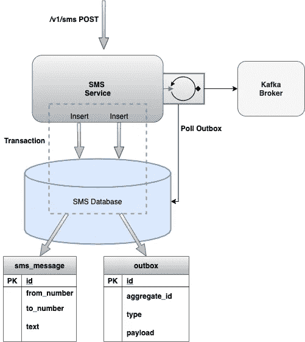
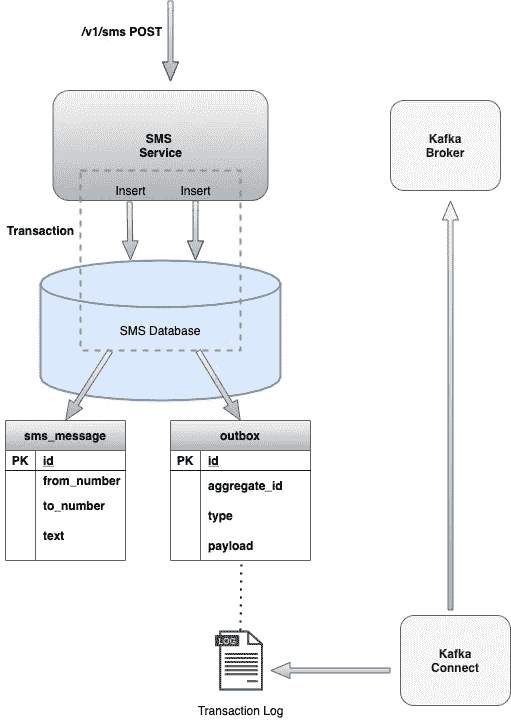
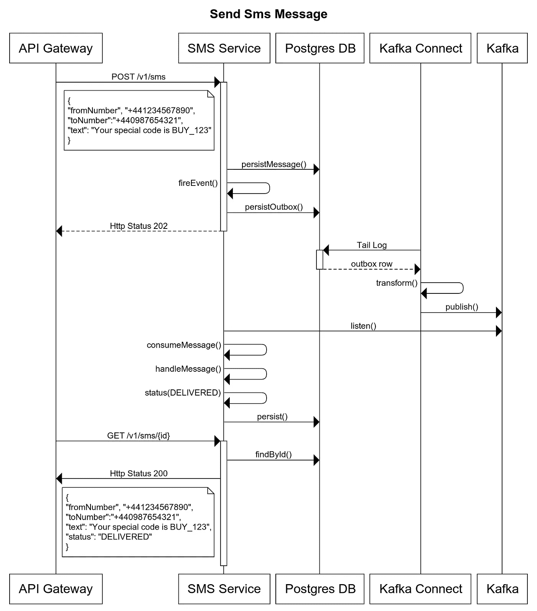

# 在 Quarkus 中用 Debezium 实现事务发件箱模式

> 原文：<https://levelup.gitconnected.com/implementing-the-transactional-outbox-pattern-with-debezium-in-quarkus-f2680306951>


马太·亨利摄于 StockSnap

这是 Quarkus、Kotlin 和 Debezium 从头开始构建微服务系列的第二部分。

在[第一部分](https://medium.com/@changeant/building-a-microservice-from-the-ground-up-with-quarkus-kotlin-and-debezium-83ae5c8a8bbc)中，我们在 Quarkus 中构建了一个简单的 REST API 来保存 SMS 消息。我们使用 testcontainers 在 docker 容器中运行服务，并确定一切按预期运行。

在这一部分中，我们将使用事务性发件箱模式在消息被持久化时生成事件。然后，我们可以异步处理消息，最终将 SMS 消息发送到最终用户的移动设备。

## 事务发件箱模式

微服务中的一个常见模式是在实体发生变化时生成事件。这使得消费者可以得到任何变化的通知。然而，我们正在处理两个独立的事务:写入数据库和发布到消息代理。为了避免 XA 事务带来的复杂性，我们可以通过将事件写入发件箱表来实现原子事务，作为保存实体更改的同一事务的一部分。然后，两个持久化都被注册到同一个事务中，我们保证事件已经和实体一起保存到数据库中。

我们有两种不同的方法来处理发件箱表中的事件。第一种方法包括轮询发件箱表，并在单独的进程中将条目转发给消息代理。



图表 1。轮询发件箱表

另一种轮询方法是使用[事务日志跟踪](https://microservices.io/patterns/data/transaction-log-tailing.html)，也称为变更数据捕获(CDC)。在这里，我们可以跟踪数据库事务日志，并寻找新的发件箱条目。我们不轮询发件箱表，事实上，我们在条目创建后就删除它们，这样表就不会无限增长。Debezium 连接器跟踪事务日志，并将新条目检索到发件箱表中。使用 kafka connect，我们可以将条目转换为消息，并将其发送给 kafka 代理。



图表 2。跟踪事务日志

## Debezium 和卡夫卡连接

支持 CDC 需要使用 Kafka Connect。Kafka Connect 是一个构建连接器的框架，用于将数据移入和移出 Kafka。Debezium 为大多数主要数据库提供了源连接器。在这个项目中，我们将使用 PostgreSQL 连接器，它直接从 WAL 日志中读取数据。

Postgres 需要一些初始设置来使用连接器(参见[文档](https://debezium.io/documentation/reference/1.2/connectors/postgresql.html))。对于这个项目，我们将使用 Debezium 提供的 postgres docker 图像。我们还将使用 Debezium Kafka 连接器，它也可以作为 docker 图像使用。在 Avro 中有一个流事件的选项，但是对于这个服务，我们将坚持使用 JSON。

## 在 SMS 服务中实现事件处理

对于项目的这一部分，您可以克隆存储库(如果您在第一部分中没有这样做),并检出分支

```
git clone [git@github.com](mailto:git@github.com):iainporter/sms-service.git
git checkout part_two
```

## 添加发件箱表格

我们需要添加一个 flyway 迁移来创建发件箱表和 processed_event 表(稍后会详细介绍)

要将记录插入发件箱表，我们需要实现 ExportedEvent 接口

消息有效负载被包装在一个事件中，并用事件类型“message_created”进行标记

使用 [CDI 事件](https://docs.jboss.org/weld/reference/latest/en-US/html/events.html)我们将它注入到 SmsService 中，并在创建新的 SmsMessage 时触发一个事件(第 13 行)

它负责在发件箱表中创建新行。下一步是处理由 Debezium 连接器发送给 kafka 的消息。

Quarkus 使用 [SmallRye](https://smallrye.io/smallrye-reactive-messaging/smallrye-reactive-messaging/2.2/index.html) 反应式消息传递，我们可以通过添加依赖关系将它引入到项目中

```
<dependency>
  <groupId>io.quarkus</groupId>
  <artifactId>quarkus-smallrye-reactive-messaging-kafka</artifactId>
</dependency>
```

接下来，我们配置想要收听的频道，我们将其定义为“sms”

```
mp.messaging.incoming.sms.connector=smallrye-kafka
mp.messaging.incoming.sms.topic=outbox.event.sms_message
mp.messaging.incoming.sms.bootstrap.servers=kafka:9092
mp.messaging.incoming.sms.group.id=sms-service
```

默认情况下，主题的名称与通道名称相同，但在这里我们将其覆盖以对应于发件箱事件将被发送到的主题(outbox.event.sms_message ),其中“sms_message”是 SmsMessageCreatedEvent 中 aggregateType 的名称。

消息消费者

通道名(第 9 行)对应于上面 smallrye 配置中的设置。我们提取 kafka 记录的相关部分并调用消息处理程序。

现在我们所做的就是加载事件引用的相应的 SmsMessage，并将其状态设置为 DELIVERED(第 11 行)。在代码的下一次迭代中，我们将实现向提供商发送 SMS 的路由。但是现在我们有足够的地方来测试消息传递部分的工作。

注意第 4 行，我们如何检查具有这个 id 的事件是否已经被处理，如果是，忽略这个事件。这满足了[至少一次](https://www.cloudcomputingpatterns.org/at_least_once_delivery/)交付模式。EventLog 将保存 eventId，如果它已经在数据库中，将捕获异常并忽略消息。

将所有这些放在一起，消息流如下所示



图表 3。发送消息序列图

## 组件测试

在第一部分中，我们看到了 testcontainers 在编写组件测试时是多么有用。使用 testcontainers 可以非常容易地调出所需的 docker 容器，这样我们就可以测试所有的依赖项是否按照预期的那样一起工作。首先，我们定义想要使用的容器。

这将启动一个已经安装了 Debezium 插件的 postgres 容器、一个 kafka 容器、一个 Debezium 容器和一个 Sms 服务容器。一旦 debezium 容器启动，我们需要注册 SMS 连接器，它将跟踪事务日志，并将任何新的发件箱记录路由到 kafka 中已配置的主题。

连接器的配置

以下代码将启动容器，注册 sms 连接器，然后在执行任何测试之前等待连接器注册

现在容器正在运行，连接器已经注册，我们可以测试向服务发送消息。

## 运行服务

我们可以使用 docker-compose 来显示所有内容

```
mvn clean install
cd sms-service
docker-compose up -d
```

接下来，我们需要向 Kafka connect 注册连接器

```
curl 'localhost:8083/connectors/' -i -X POST -H "Accept:application/json" \
-H "Content-Type:application/json" \
-d '{"name": "sms-connector", "config": {"connector.class": "io.debezium.connector.postgresql.PostgresConnector", "database.hostname": "postgres-db", "database.port": "5432", "database.user": "postgres", "database.password": "postgres", "database.dbname" : "sms", "database.server.name": "smsdb1", "table.whitelist": "public.outboxevent", "transforms" : "outbox","transforms.outbox.type" : "io.debezium.transforms.outbox.EventRouter", "transforms.OutboxEventRouter.event.key": "aggregate_id", "transforms.outbox.table.fields.additional.placement": "type:header:eventType"}}'
```

发送消息

```
curl ['http://localhost:8080/v1/sms'](http://localhost:8080/v1/sms/60a17509-4d25-449d-9a21-819f2'http://localhost:8080/v1/sms') -i -X POST \
   -H 'Content-Type: application/json'  \
   -d '{"text":"Foo Bar!", "fromNumber": "+1234567890", "toNumber": "+1234567891"}'
```

您应该会得到类似这样的结果

```
HTTP/1.1 202 Accepted
Content-Length: 0
Location: [http://localhost:8080/v1/sms/c75e551a-b11c-4703-bbe7-5c6bb38b001c](http://localhost:8080/v1/sms/c75e551a-b11c-4703-bbe7-5c6bb38b001c)
```

我们可以使用位置头来获取消息细节

```
curl [http://localhost:8080/v1/sms/c75e551a-b11c-4703-bbe7-5c6bb38b001c](http://localhost:8080/v1/sms/c75e551a-b11c-4703-bbe7-5c6bb38b001c)
```

结果应该与此类似

```
{"createdAt":"2020-07-21T09:38:17.372071Z","fromNumber":"+1234567890","id":"c75e551a-b11c-4703-bbe7-5c6bb38b001c","status":"DELIVERED","text":"Foo Bar!","toNumber":"+1234567891","updatedAt":"2020-07-21T09:38:17.743689Z"}
```

这就是服务迭代开发的完成阶段。我们现在可以请求发送 SMS 消息。我们使用消息代理来保证消息传递到下一个处理阶段。目前，除了通过更新状态来表明消息已经被处理之外，我们没有做任何有用的事情。在下一阶段，我们将通过添加路由逻辑将 sms 消息发送给第三方 SMS 提供商来完成处理生命周期。

本文的代码库可从[这里](https://github.com/iainporter/sms-service/tree/part_two)获得

该系列的其他部分包括:

*   [第一部分:构建框架并添加持久性](/building-a-microservice-from-the-ground-up-with-quarkus-kotlin-and-debezium-83ae5c8a8bbc)
*   [第三部分:连接到第三方 API 并用 Wiremock 测试](/building-a-resilient-microservice-with-quarkus-and-wiremock-de59b2a4fac7)
*   [第四部分:使用 OpenID Connect 保护服务](/securing-a-microservice-in-quarkus-with-openid-connect-505204d1c9a9)
*   [第五部分:使用 GraalVM 本机运行](https://medium.com/@changeant/running-a-microservice-in-quarkus-on-graalvm-52d6b42a5840)
*   [第六部分:用 Jib 封装你的微服务](https://medium.com/@changeant/containerizing-your-microservice-in-quarkus-with-jib-fae0f62bd57e)
*   [第七部分:使用 CircleCI 为微服务构建 CI 管道](/building-a-ci-pipeline-for-a-microservice-in-quarkus-with-circleci-11e9b679423f)