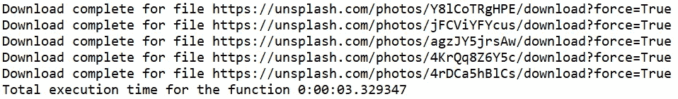

# 在 Python 中实现线程

> 原文：<https://levelup.gitconnected.com/implementing-threading-in-python-3e2e0858ad07>

## 用 Python 实现线程的快速简单指南

在这篇文章中，你将学到

*   线程的基本概念
*   使用线程库实现线程
*   使用 ThreadPoolExecutor 实现线程
*   使用线程的利与弊


尼科·纳泽尔在 [Unsplash](https://unsplash.com/s/photos/thread?utm_source=unsplash&utm_medium=referral&utm_content=creditCopyText) 上的照片

一个线程是:

*   程序中要执行的最小独立命令集
*   应用程序中的多个线程可以在一个 CPU 上同时执行，这被称为多线程
*   总是在程序中运行，不能独立运行
*   当程序受限于网络或有大量 I/O 操作时使用
*   内存在一个进程中的多个线程之间共享，因此具有较低的资源消耗


一个进程中的多个线程共享内存

多线程的一个简单例子是从互联网下载多个文件。

假设我们想要下载 100 个文件。我们可以等待一个文件下载，然后开始下载下一个文件，或者创建多个线程并允许它们下载文件。当一个线程等待连接建立时，另一个线程可以下载另一个文件的数据，从而提供更快的执行速度和更好的系统利用率。

***我们将以从网上下载文件为例，演示 Python 中线程的实现。***

## 使用线程库实现线程

您想从互联网上下载文件，所以您编写了一个简单的 python 脚本，如下所示。

我们将从 [Unsplash](https://unsplash.com/) 传递一些图像 URL，使用请求库下载文件，并将其保存到当前目录。

```
file_list=["[https://unsplash.com/photos/agzJY5jrsAw/download?force=True](https://unsplash.com/photos/agzJY5jrsAw/download?force=True)",
"[https://unsplash.com/photos/4rDCa5hBlCs/download?force=True](https://unsplash.com/photos/4rDCa5hBlCs/download?force=True)",
"[https://unsplash.com/photos/jFCViYFYcus/download?force=True](https://unsplash.com/photos/jFCViYFYcus/download?force=True)",
"[https://unsplash.com/photos/Y8lCoTRgHPE/download?force=True](https://unsplash.com/photos/Y8lCoTRgHPE/download?force=True)",
"[https://unsplash.com/photos/4KrQq8Z6Y5c/download?force=True](https://unsplash.com/photos/4KrQq8Z6Y5c/download?force=True)"]**import requests
from datetime import datetime****def download_file(file):
    file_1=file.split('/')[4]
    r = requests.get(file, allow_redirects=True)    
    open(file_1, 'wb').write(r.content)
    return True****start_time= datetime.now()
for i in range(len(file_list)):
    result= download_file(file_list[i])
end_time= datetime.now()
exec_time= end_time-start_time****print(f"Total execution time for the function {exec_time}")**
```


让我们使用线程，看看我们是否可以减少执行时间。

我们将线程库添加到导入列表中。

```
**import threading**
**import requests
from datetime import datetime**
```

download_file 函数保持不变。

```
**def download_file(file):
    file_1=file.split('/')[4]
    print(file_1)
    r = requests.get(file, allow_redirects=True)    
    open(file_1, 'wb').write(r.content)
    return True**
```

**创建一个线程实例，将你要在单线程上执行的函数作为*目标*传递，函数的参数作为 *args* 传递。**

我们通过***download _ file()***对 ***目标*** 和 ***file_list*** 中的每一项作为 ***自变量*** 进行函数。

**t1.start()启动线程执行。**

我们追加所有线程，然后在遍历所有文件并下载它们之后加入它们。

**Join()应该放在主线程中。Join 阻塞调用线程或主线程，直到被加入的线程的执行也终止。**


**join()阻塞主线程，直到线程 1 和 2 的执行终止**

## With join()

```
**def download_file(file):
    file_1=file.split('/')[4]
    #print(file_1)
    r = requests.get(file, allow_redirects=True)    
    open(file_1, 'wb').write(r.content)
    print(f'Download complete for file {file}')**
threads=[]
start_time=datetime.now()
**for i in range(len(file_list)):
    t1= threading.Thread(target=download_file, args=[file_list[i]])
    t1.start()
    threads.append(t1)****for thread in threads:
    thread.join()**

**end_time=datetime.now()
exec_time= end_time-start_time
print(f"Total execution time for the function {exec_time}")**
```



带有 join()的输出

## 不带联接()

我们现在移除 join()方法来理解 join()的影响

```
**def download_file(file):
    file_1=file.split('/')[4]
    r = requests.get(file, allow_redirects=True)    
    open(file_1, 'wb').write(r.content)
    print(f'Download complete for file {file}')****start_time=datetime.now()
for i in range(len(file_list)):

    t1= threading.Thread(target=download_file, args=[file_list[i]])
    t1.start()   

end_time=datetime.now()
exec_time= end_time-start_time
print(f"Total execution time for the function {exec_time}")**
```


没有连接的输出()

**join()上的结论**

*   当我们使用 join()时，主线程被阻塞，直到下载文件的线程完成。
*   当我们不使用 join()时，主线程的执行甚至在下载文件的线程完成之前就完成了。

## ThreadPoolExecutor

ThreadPoolExector 是一种使用`[**concurrent.futures**](https://docs.python.org/3/library/concurrent.futures.html#module-concurrent.futures)**.**`实现和产生多个线程的简单方法


**concurrent.futures 有一个抽象类 Executor，它有两个具体的子类**

*   **ThreadPoolExecutor:用于多线程**
*   **ProcessPoolExecutor:用于多重处理**

## 使用 ThreadPoolExecutor 实现相同的下载文件

我们导入 **concurrent.futures** 并创建一个 **ThreadPoolExecutor()的实例。**

我们使用*****映射* ()** 来应用***download _ file()***并迭代 ***file_list*** 中的每个 URL。**

```
**import concurrent.futures
def download_file(file):
    file_1=file.split('/')[4]
    r = requests.get(file, allow_redirects=True)    
    open(file_1, 'wb').write(r.content)
    return f'Download complete for file {file} using ThreadPoolExecutor'
start_time=datetime.now()****with concurrent.futures.ThreadPoolExecutor() as executor:
   results= executor.map(download_file, file_list)****for result in results:
    print(result)

end_time=datetime.now()
exec_time= end_time-start_time****print(f"Total execution time for the function {exec_time}")**
```

****

**使用 ThreadPoolExecutor 的输出**

## **使用线程的利与弊**

****使用线程的优点****

*   **为 I/O 或网络绑定程序提供更快的执行速度**
*   ****一个进程中的所有线程将**共享内存，** **让程序响应更快。******
*   ****线程间共享内存也使得**上下文切换更加容易和快速。******

******使用穿线的缺点******

*   ******线程不应用于计算密集型程序**。对 CPU 密集型程序使用多处理。****
*   ******线程化增加了程序的复杂性，**从而使调试变得困难。****
*   ****即使进程中的一个线程挂起，也会导致整个进程崩溃。****
*   ****开销与管理线程相关联。****

## ****结论:****

****对于 Python 中的 I/O 或网络密集型程序，使用多线程使用 Threading class 或 ThreadPoolExecutor。对于 CPU 密集型进程，使用 ProcessPoolExecutor 进行多处理。****

## ****参考资料:****

****[https://docs.python.org/3/library/concurrent.futures.html](https://docs.python.org/3/library/concurrent.futures.html)****