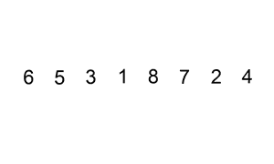

# 用 JavaScript 和 LISP 实现东尼·霍尔快速排序

> 原文：<https://levelup.gitconnected.com/implementing-tony-hoare-quick-sort-in-javascript-and-lisp-b1c1ac1f386d>

早在 1978 年，东尼·霍尔就已经创作了*通信顺序进程*，它现在被用于 Clojure 和 GO 编程语言中的多线程。托尼的另一个突出的想法是一个快速排序算法，它提供了最好情况下的时间复杂度 *N*log n* 。换句话说，快速排序算法比其他实现要快得多。

让我们浏览一下这个话题。这是最直观的*冒泡排序*算法，具有时间复杂度 *N .* 它在两个嵌套循环中对集合进行迭代，并比较图像上显示的一对两个相邻值。

来自维基百科的一篇文章[的气泡排序解释](https://en.wikipedia.org/wiki/Bubble_sort)

在对第三行取消注释以便用长输入值列表运行它之后，它在我的笔记本(MacBook Air)上的结果是 10 982 毫秒。

与插入排序实现相比。它一次接受一个元素，并在列表中为它寻找一个位置:

插入排序一次获取一个元素，并在结果列表中查找它的位置。一张图片来自[一篇维基百科文章](https://en.wikipedia.org/wiki/Insertion_sort)。

插入排序运行时间为 9191 毫秒。比冒泡排序略快。

但是快速排序方法有多快呢？让我们来看看:

仅需 124 毫秒即可运行！令人印象深刻。

它怎么跑得这么快？*快速排序*从输入列表中随机抽取一个元素，并生成两个后续列表:

*   元素*比元素小的那个；*
*   以及元素*大于元素*的一个。

然后，它对这些新列表应用相同的方法，生成四个嵌套列表(两个用于较小的列表，两个用于较大的列表)，直到整个集合最终在列表树中排序。当从树的底部到顶部合并这些列表时，你最终构建了一个排序的结果。

快速排序算法树

你可能注意到快速排序经常使用列表。因此，使用专门为处理这种数据结构而设计的编程语言是有意义的。这是它在 LISP (Clojure)中的样子:

只有十行代码，比 JavaScript 代码小两倍。

**总结**

与其他算法中的 10 982 毫秒和 9 191 毫秒相比，快速排序实现快了 124 毫秒。它的实现在 LISP 中看起来特别简洁，因为它大量使用了列表。

# 分级编码

感谢您成为我们社区的一员！在你离开之前:

*   👏为故事鼓掌，跟着作者走👉
*   📰查看[升级编码出版物](https://levelup.gitconnected.com/?utm_source=pub&utm_medium=post)中的更多内容
*   🔔关注我们:[Twitter](https://twitter.com/gitconnected)|[LinkedIn](https://www.linkedin.com/company/gitconnected)|[时事通讯](https://newsletter.levelup.dev)

🚀👉 [**加入升级达人集体，找到一份惊艳的工作**](https://jobs.levelup.dev/talent/welcome?referral=true)