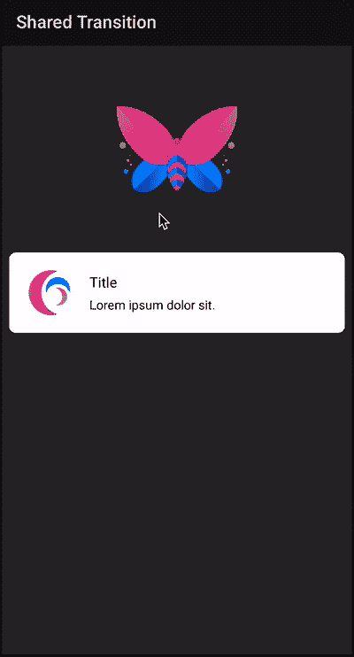

# 在 Android 上实现过渡动画

> 原文：<https://levelup.gitconnected.com/implementing-transition-animations-on-android-38943f83e883>

## 过渡动画

## 通过活动和片段中的共享元素转换


[达蒙·霍尔](https://unsplash.com/@damodigital?utm_source=unsplash&utm_medium=referral&utm_content=creditCopyText)在 [Unsplash](https://unsplash.com/s/photos/transition?utm_source=unsplash&utm_medium=referral&utm_content=creditCopyText) 上拍照

一个好的动画让你的应用程序变得用户友好，而不会分散用户对应用程序本身的注意力。时至今日，动画已经成为一种功能性元素，而不是像樱桃一样的装饰。

当我们开始一个新的活动或添加一个新的片段时，Android 提供了自己的默认过渡。这些转换可以在进入和退出屏幕时看到。但这些是传统的过渡，会让你的应用看起来过时。

大多数情况下，两个屏幕之间有一些共同的元素，如果能够在这些共享元素之间转换，将会强调应用程序整体流程的连续性。

在本文中，我们将探索活动和片段之间的共享元素转换。这是我们将在本文结束时开发的最终产品的截图。(本文末尾提供了该示例应用程序的 GitHub 存储库)



图中的动画是活动间共享元素转换的一个例子。我们一步一步来详细了解实现。

# 1.活动之间的共享元素

这个想法是在不同布局的不同视图之间有一个平滑的过渡动画。请记住，视图实际上永远不会在活动之间移动。

## 1.1 启用窗口内容过渡

导航到 *styles.xml* 并为 *AppTheme* 添加`windowActivityTransitions`属性

活动和共享元素的进入和退出转换是可选的。在示例应用程序中，我们没有使用任何进入/退出转换。

## 1.2 设置通用转换名称

现在，即使不同布局中的视图 id 不同，我们也需要确保它们被分配了一个公共的转换名称。

通用的转换名称有助于在不同的活动之间映射这两个元素。

```
<ImageView
    ...
    android:transitionName="@string/transition_image"
    ... 
/>
```

## 1.3 用活动选项开始下一个活动

在开始下一个活动时，我们将利用`ActivityOptions.makeSceneTransitionAnimation()`来定义我们在布局中设置的转换视图和转换名称。

在示例应用程序中，我们为所有需要转换动画的视图创建了`Pair`。

# 2.片段之间的共享元素

共享元素转换以类似的方式处理片段，就像它处理活动一样。

步骤 1.1 和 1.2(即启用窗口内容转换并设置公共转换名称)对于片段也是一样的。

然而，我们开始下一个片段的方式有一些变化

```
*supportFragmentManager*.beginTransaction()
    .replace(R.id.*content*, fragmentB)
    .addSharedElement(imageView, getString(R.string.blue_name))
    .commit();
```

这里，我们已经将过渡动画应用于`imageview`并且`fragmentB`是开始事务时的目的片段。现在，如果您运行应用程序，您应该会看到一些新的转换，而不是默认的转换。

请记住，活动转换 API 仅在 Android 5.0 (API 21)及更高版本上可用。查看官方[文档](https://developer.android.com/training/transitions/start-activity#start-with-element)了解更多细节

本文到此为止。您可以在 GitHub 上找到示例应用程序的源代码

[](https://github.com/KunalChaubal/SharedTransitionActivity) [## KunalChaubal/shared transaction

### 展示活动间共享元素转换的示例应用程序

github.com](https://github.com/KunalChaubal/SharedTransitionActivity) 

随意叉/投稿。

编码快乐！