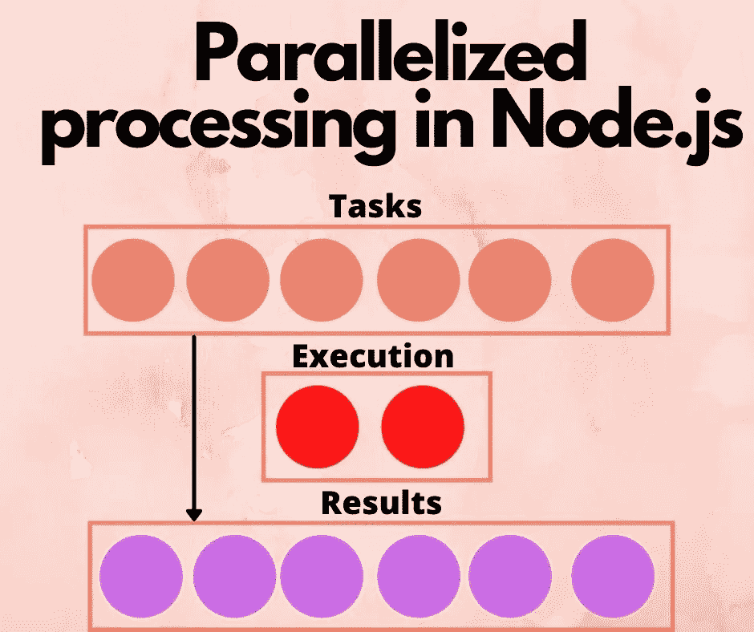

# 在 Node.js 中实现用于处理数据集的工作队列

> 原文：<https://levelup.gitconnected.com/implementing-worker-queues-for-processing-datasets-in-node-js-8f060d434b91>



图片由作者大卫·赫伦提供

处理大型数据集可以通过简单的 *for* 循环来完成。但是，一次处理一个数据项消除了并行处理数据可能带来的效率提升。但是，并行处理是不可伸缩的，因为它很容易淹没 CPU 或内存资源。Worker queue 包通过限制同时执行的并行任务的数量来提供帮助。

有时我们有大量的任务，例如处理数百个图像文件。总的想法是输入数据集，其中您需要对一些或所有数据项应用转换。这是*地图*图案，但是比例比正常的要大。

一个用例是在*机器学习*阶段，在训练模型之前，收集训练和测试数据。你可能有一百万张图像，对于每张图像，你应用视觉算法来识别图像的特征。这些特征被转化成数字，这些数字实际上被用于训练模型中。

在我的例子中，我开发了一个静态网站生成工具 AkashaCMS，其中的工作是将 Markdown 或 Nunjucks 模板之类的输入文件渲染到网站的 HTML 中。我使用 AkashaCMS 来发布这个站点(TechSparx)和其他几个站点。这个站点上有超过 1500 个页面，这意味着重新生成站点会呈现所有 1500+个页面。AkashaCMS 内部有一个循环，它首先找到所有的内容文件，然后一个接一个地将内容呈现为 HTML。为了提高 AkashaCMS 的性能，我用一个工作队列替换了那个循环。

处理大型数据集可以通过工作队列来完成。您的程序将任务添加到队列中，队列管理模块调度任务执行，并交付结果。管理模块约束同时执行的任务，以避免淹没系统。

有一个缩放的问题。您希望数据集的处理速度有多快？您想分配多少个 CPU？分布式任务队列可以将工作分散到多台计算机上。有了足够多的计算机，数据集可以在瞬间得到处理。但是分布式任务队列更复杂，在本教程中，我们将重点关注内存中的工作队列，它将所有内容保持在传统 Node.js 事件队列的边界内。

# 数据集处理 101

最简单的方法是编写一个简单的循环:

```
let array = []; // Fill this array with data to process for (let item of array) {
     processItem(item); 
}
```

创建和维护这样的循环是很容易的。但是，这是最好的方法吗？例如，`processItem`步骤可能有暂停，比如从磁盘或数据库读取数据，在此期间工作可以并行化。并行处理项目可能会减少处理所有项目的总时间。

记住 Node.js 最初的灵感是关于处理异步执行的。有一段时间，另一个系统正在处理对数据的异步请求。我们被要求考虑这一陈述:

```
database.query('SELECT * FROM ...', function(err, result) {
    if (err) handleErrors(err);
    else handleResult(result);
}
```

是的，我知道今天这将是一个`async`函数，我们将使用`await`。关键是，在调用`database.query`和调用回调函数之间发生了什么？那可能是几毫秒的时间。对计算机来说，这是一个永恒，在此期间，计算机可以做其他事情。

对于简单的处理循环，等待来自其他系统的数据是浪费时间。Node.js 所做的是返回到事件循环，以便它可以处理其他任务。

对于上面的简单的一次一个循环，Node.js 在等待异步结果时没有机会处理任何其他任务。

想想静态网站生成任务。呈现每个页面是一项独立的任务。它首先读取一个 Markdown 文件，然后应用几个模板，将结果写入输出目录。因此，页面可以并行呈现。当 renderer 循环正在读取一个文件的模板或等待来自数据库的数据时，Node.js 事件循环可能正在为另一个页面呈现模板。页面呈现可以很容易地并行化，因为通常一个页面的呈现不依赖于其他页面的呈现。

概括的场景是拥有一系列数据对象，其中每个对象都可以独立处理，同时处理其他对象。在这种情况下，可以对每个项目并行运行`processItem`。

例如，我们可以像这样重写上面的循环:

```
let items = []; // Fill with data objects
let tasks = [];
for (let item of items) {
     tasks.push(processItemAsync(item)); 
}
await new Promise.all(tasks);async function processItemAsync(item) { ... }
```

这样做的是在每一项上调用一个异步函数，因此`tasks`数组被 Promise 对象填充。这些承诺开始时处于未解决的状态，但是随着任务的完成，它们会翻转到已解决或被拒绝的状态。`Promise.all`步骤将等待，直到每个承诺都解析为已解析或已拒绝状态。对于任何失败，都会抛出一个错误。

这也是一个易于编码和维护的简单循环。但是，考虑一下这个网站上的 1500+页面，尝试同时生成 1500 个页面是否可行。不，那不可行。

相反，最好采取中间立场。也就是说，要有某种任务管理器来维护最大数量的同时处理任务，同时确保所有任务完成，并处理任何抛出的错误。

例如，我们可能会想，我们有一个`items`数组，我们将来自`processItemAsync`的承诺推入到一个`workers`数组中，确保该数组中最多有 10 个项目，并且一旦有任何项目完成，就将另一个工作线程排入队列。但是，当你试图解决这个问题时，你的眼睛开始被细节和潜在的复杂情况所迷惑。

幸运的是，我们的前辈程序员已经认识到了这一需求，并编写了解决方案。在本教程中，我们将研究两个这样的 Node.js 库， *FastQ* 和 *Better Queue* 。

# 使用 fastq 构建任务队列

在内存工作队列中， [fastq](https://www.npmjs.com/package/fastq) 包将自己标记为 *Fast。*文章包括性能声明，表明它比其他替代产品更快。

需要了解的一件事情是，这个包是 33kb 的，并且只有一个依赖项。换句话说，它不会导致膨胀。

为了用 *FastQ* 建立一个处理队列，我们这样做:

```
const fastq = require('fastq').promise;
let concurrency = 10;
async function worker(item) {
     ...
     return processedItem;
}const queue = fastq(worker, concurrency);
```

也就是说，我们传入一个*工作器*函数以及一个*并发*配置。对于每个推入队列的项，调用一次 worker 函数。顾名思义，并发设置决定了有多少工作线程将同时执行。

我们来试一个具体的例子。我们将用 ES6 模块来编写这个，这样我们就可以使用[顶级](https://techsparx.com/nodejs/async/top-level-async.html) `[async](https://techsparx.com/nodejs/async/top-level-async.html)` [/](https://techsparx.com/nodejs/async/top-level-async.html) `[await](https://techsparx.com/nodejs/async/top-level-async.html)` [语句](https://techsparx.com/nodejs/async/top-level-async.html)。将此另存为`fq.mjs`，用 Node.js 14.8 或更高版本运行。

```
import { promise as fastq } from 'fastq';let concurrency = 5;async function worker(item) {
     return await new Promise((resolve, reject) => {
         setTimeout(() => { resolve(item * 2); }, 1000);
     });
}const queue = fastq(worker, concurrency);
const tasks = [];
for (let item of [ 1, 2, 3, 4, 5, 6, 7, 8, 9, 10 ]) {
     tasks.push(queue.push(item));
}
await Promise.all(tasks);
console.log(tasks);const results = [];
for (let result of tasks) {
     results.push(await result);
}
console.log(results);
```

worker 函数通过使用`setTimeout`函数模拟一个长时间运行的任务。函数结果是一个简单的数学计算。

我们使用`queue.push`将数字添加到要处理的队列中。在我们正在使用的 FastQ 的 Promises 版本中，`queue.push`函数返回一个承诺。当任务完成时，Promise 解析为从 worker 函数返回的任何值。这意味着`tasks`数组充满了 Promise 对象。

我们用`Promise.all`等待每一个承诺的解决。这使得`tasks`数组充满了已经被解析的 Promise 对象。

下一个循环只是将每个 Promise 对象的值提取到一个新数组中，`results`。

结果看起来像这样:

```
$ node fq.mjs
[
   Promise { 2 },
   Promise { 4 },
   Promise { 6 },
   Promise { 8 },
   Promise { 10 },
   Promise { 12 },
   Promise { 14 },
   Promise { 16 },
   Promise { 18 },
   Promise { 20 }
]
[    2,  4,  6,  8, 10,
   12, 14, 16, 18, 20 
]
```

第一个数组确实填充了已解析的 Promise 对象，第二个数组包含每个 Promise 的值。

进一步考虑这个问题，试着注释掉第`Promise.all`行和紧随其后的第`console.log`行。在`tasks`数组上的循环等同于`Promise.all`将要做的，不需要第二步。

```
const tasks = [];
for (let item of [ 1, 2, 3, 4, 5, 6, 7, 8, 9, 10 ]) {
         tasks.push(queue.push(item));
}
// await Promise.all(tasks);
// console.log(tasks);const results = [];
for (let result of tasks) {
     results.push(await result);
}
console.log(results);
```

这个循环等待每个承诺被解决，这正是`Promise.all`所做的。因此使用`Promise.all`等待任务完成是多余的，这个循环也等待任务完成。

这让我们可以一步直接检索结果:

```
$ node fq.mjs
[
    2,  4,  6,  8, 10,
   12, 14, 16, 18, 20 
]
```

我们已经展示了 FastQ 易于使用，并且能够处理几个相同的任务。我已经在 AkashaCMS 中编写了一个几乎相同的循环，并可以验证它确实可以在更复杂的应用程序中工作。

# 使用更好的队列构建任务队列

另一个队列处理器包是[*Better queue*](https://www.npmjs.com/package/better-queue)。正如你可能想象的那样，它被描述为更好，能够处理更复杂的情况。

全面的特性集也意味着 Better Queue 更大，达到 78 千字节，并且它有三个依赖项。这不完全是膨胀，但比 FastQ 要大。

API 使用老式的回调方法，而不是新的`async` / `await`方法。为了了解这意味着什么，让我们来看一个与前一个例子相当的例子:

```
import Queue from 'better-queue';function worker(item, cb) {
     setTimeout(() => { cb(undefined, item * 2); }, 1000);
}const queue = new Queue(worker, { concurrent: 5 });const finished = new Promise((resolve, reject) => {
     queue.on('drain', function() { resolve(); });
});
await new Promise((resolve, reject) => {
     queue.on('task_failed', function (taskId, err, stats) {
         reject(err);
     });
});const results = [];
queue.on('task_finish', function(taskId, result, stats) {
     results.push(result);
});for (let item of [ 1, 2, 3, 4, 5, 6, 7, 8, 9, 10 ]) {
     queue.push(item);
}await finished;console.log(results);
```

在`cb`参数中，worker 函数需要接受一个回调函数。`cb`的签名有一个`error`指示器作为第一个参数，结果作为第二个参数。

创建队列时，第一个参数是 worker 函数，第二个是 options 对象。有一个很长的选项列表，这是为什么 Better Queue 团队可以正确地说他们支持复杂操作的部分原因。

最终的对象支持事件监听器，你可以看到我们使用了三个— `drain`、`task_failed`和`task_finish`。当队列被完全处理时，触发`drain`事件。我们在这里所做的是建立一个 Promise 对象，当`drain`事件触发时，这个对象将被解析。当其中一个任务发生错误时，触发`task_failed`事件。我们已经用 Promise 包装器对此进行了配置，因此错误会出现在我们的应用程序中。顾名思义，`task_finish`函数在每个任务完成时触发。我们用它将结果推入`results`数组。

除了这个事件处理程序之外，API 没有提供收集结果的方法。

接下来，我们使用一个简单的`for`循环调用`queue.push`，将工作推入队列。因为`queue.push`返回一个发出事件的任务对象，我们可以用一个承诺包装器来重新构造它。该包装器将捕获`failed`或`finish`事件，并以不同的方式捕获结果(或失败)。

语句`await finished`是指当`drain`事件被触发时将触发的承诺。换句话说，脚本将一直等到承诺兑现，这意味着所有任务都已完成，并且所有`task_finish`事件都已触发。此时，`results`数组应该已经被数据填充。

要运行脚本:

```
$ node bq.mjs  
[
    2,  4,  6,  8, 10,
   12, 14, 16, 18, 20 
]
```

事实上，我们得到了预期的输出。

这里有一个受前面讨论启发的替代实现:

```
import Queue from 'better-queue';function worker(item, cb) {
     setTimeout(() => { cb(undefined, item * 2); }, 1000); 
}const queue = new Queue(worker, { concurrent: 5 });const tasks = [];
for (let item of [ 1, 2, 3, 4, 5, 6, 7, 8, 9, 10 ]) {
     let task = queue.push(item);
     tasks.push(new Promise((resolve, reject) => {
         task.on('failed', function(err) { reject(err); });
         task.on('finish', function(result) { resolve(result); });
     }))
}const results = [];
for (let result of tasks) {
     results.push(await result);
}
console.log(results);
```

这种实现可能更容易理解和维护。

`tasks`数组现在包含一个对应于队列中每个任务的 Promise 对象。对于成功的任务，结果存储在承诺中，否则存储错误。与 FastQ 示例一样，第二个循环等待所有任务完成，并从每个承诺中检索结果。

结果是一样的:

```
$ node bq.mjs  
[
    2,  4,  6,  8, 10,
   12, 14, 16, 18, 20 
]
```

这表明 Better Queue 为组织如何使用队列提供了许多选项。您需要过滤添加到队列中的项目，还是拒绝处理某些项目？更好的队列允许您配置这些行为中的任何一个，以及更多。

# 摘要

在本教程中，我们学习了两个可以帮助应用程序处理大型数据集的包。虽然可以使用简单的循环来处理数据集，但显然可以通过并行运行任务来减少所需的总时间。

例如，在并发度为`1`(无并行执行)的 AkashaCMS 中，处理一个测试网站需要 32 秒，并发度为`10`的需要 9 秒。

让我们用 FastQ 例子来尝试同样的区别。

```
$ time node fq.mjs  
[    2,  4,  6,  8, 10,
   12, 14, 16, 18, 20 
]real    0m10.573s
user    0m0.120s
sys     0m0.029s$ time node fq.mjs  
[
    2,  4,  6,  8, 10,
   12, 14, 16, 18, 20
]real    0m1.255s
user    0m0.110s
sys     0m0.028s
```

第一次计时是将`concurrency`设置为`1`，这意味着没有并行执行。请记住，工人功能包括 1 秒钟的延迟。因此，这里显示的时间，大约 10 秒，与执行`10`任务是一致的。第二个计时是将`concurrency`设置为`10`，这允许最多十个任务并行执行。这里显示的时间也与并行执行 10 个任务一致。

在现实环境中，任务需要执行大量的工作，增加并行性会造成压力。一方面，您的程序可以同时执行并行任务，但另一方面，这会扩大 Node.js 进程对内存和 CPU 的影响。最好在不同的并发级别测量您的应用程序，并根据您的需要调整并发性。

*最初发表于*[*https://techsparx.com*](https://techsparx.com/nodejs/async/queue-processing.html)*。*

# 分级编码

感谢您成为我们社区的一员！[订阅我们的 YouTube 频道](https://www.youtube.com/channel/UC3v9kBR_ab4UHXXdknz8Fbg?sub_confirmation=1)或者加入 [**Skilled.dev 编码面试课程**](https://skilled.dev/) 。

[](https://skilled.dev) [## 编写面试问题+获得开发工作

### 掌握编码面试的过程

技术开发](https://skilled.dev)