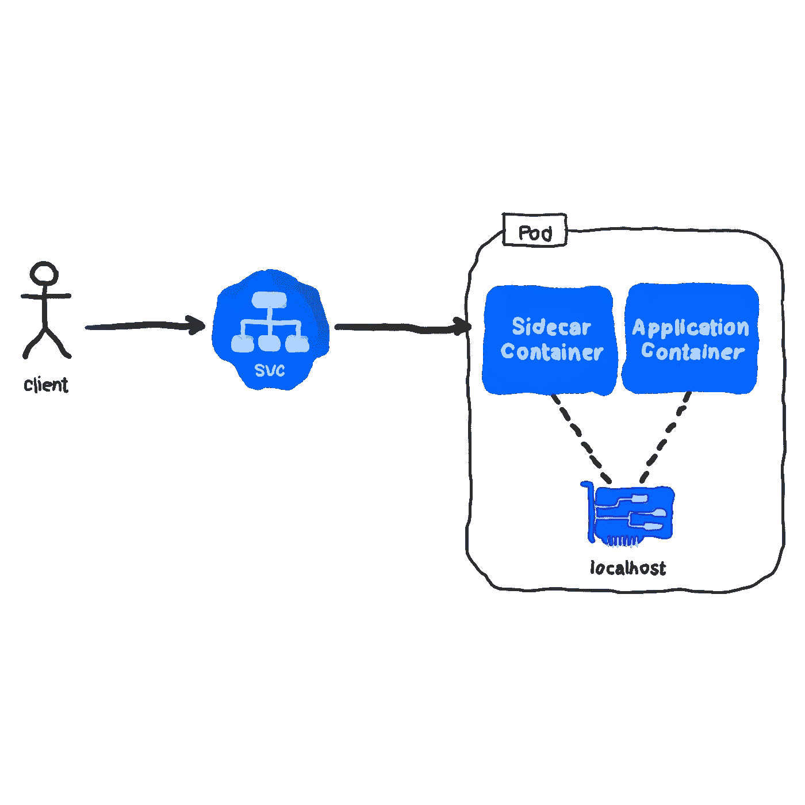
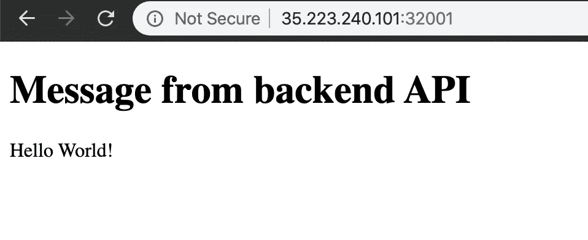

# 使用 Sidecar 在 Kubernetes 中实现反向代理服务器

> 原文：<https://levelup.gitconnected.com/implemeting-a-reverse-proxy-server-in-kubernetes-using-the-sidecar-eebba956801a>

*本文原载于*[https://www . magalix . com/blog/implementing-a-reverse-proxy-server-in-kubernetes-using-the-sidecar-pattern](https://www.magalix.com/blog/implemeting-a-reverse-proxy-server-in-kubernetes-using-the-sidecar-pattern)

# 什么是边车？

[边车](https://www.magalix.com/blog/the-sidecar-pattern)指的是附在自行车或摩托车上的座位，这样它们可以用三个轮子行驶。边车通常用来运送乘客或设备。除了军事用途，边车在体育运动中也有很多用途。不管你想在哪里使用边车，概念都是一样的:一个物体附在另一个物体上，从而成为它的一部分。辅助对象的主要目的是帮助主对象。

# 什么是 Kubernetes 边车模式？

从上面的定义，我们明白了什么是边车，它是用来做什么的。在 [Kubernetes](https://www.magalix.com/blog/kubernetes-101-concepts-and-why-it-matters) 中，我们有边车模式，它利用了 Kubernetes 最强大的组件之一:[吊舱](https://www.magalix.com/blog/kubernetes-pods-101-the-cluster-sailors)。pod 的一个重要特性是，在同一个 pod 上托管的容器共享相同的网络地址和文件系统。同一个 pod 上的所有容器都可以通过本地主机地址相互连接，就像同一台机器上的进程通过 HTTP 相互通信一样。因此，我们可以通过应用程序容器创建一个承载主应用程序的 pod，并在同一个 pod 上添加一个 sidecar 容器来提供额外的功能层。像边车座位一样，同一个 pod 上的容器被视为一个单元:它们被一起创建、销毁并从一个节点移动到另一个节点。那么，边车模式有哪些可能的用途呢？有很多。例如，我们可以向运行 Nginx 的应用程序 pod 添加一个 sidecar 容器。有了 Nginx，我们可以在应用程序中添加一个 HTTPS 层，只支持 HTTP。另一个用例是为 uWSGI 应用程序(例如 Python Flask)提供前端反向代理，这是本文的主题。

# 建筑

我们有一个非常简单的 API，它是使用 Python Flask 微框架和 Gunicorn 服务器构建的。应用程序托管在一个容器中，但是我们需要在它前面有一个 web 服务器。web 服务器接收 HTTP 请求，在内部将其路由到应用程序 pod，并将响应转发回客户端。你可能会问 web 服务器在这里有什么用，为什么不用 Flask 呢？这里有一个极好的 [Reddit 讨论](https://www.reddit.com/r/Python/comments/68phcu/why_nginxgunicornflask/)，可能会解决你的问题。目前，这里是我们的建筑看起来像什么的描述:



现在，让我们开始编写应用程序。

# 代码

如前所述，我们的应用程序是一个简单的 Python Flask API。应用程序本身由两个文件组成:一个包含应用程序启动时运行的实际代码(mainapp.py)，另一个包含 [Gunicorn](https://gunicorn.org/) 运行我们的应用程序所需的指令(wsgi.py)。mainapp.py 的内容包括:

```
from flask import Flask
from flask import jsonify

app = Flask(__name__)

@app.route("/")
def hello():
   response = {"message":"Hello World!"}
   return jsonify(response)

if __name__ == "__main__":
   app.run(host='0.0.0.0')
```

wsgi.py 文件看起来像这样:

```
from mainapp import app

if __name__ == "__main__":
   app.run()
```

接下来是 docker 文件:

```
FROM python:3
RUN pip install gunicorn flask
ADD mainapp.py wsgi.py /app/
EXPOSE 5000
WORKDIR /app
ENTRYPOINT [ "gunicorn","--bind","0.0.0.0:5000","wsgi:app" ]
```

您可能希望首先在您的机器上进行本地测试。这可以通过构建映像来实现:

docker build-t magalix/flask sidecar。

然后从映像运行容器:

docker run-d-p 5000:5000 magalixcorp/flask sidecar

然后，您可以通过发出 HTTP 请求(使用任何客户端)来确认 API 正在工作。在本实验中，我们使用旋度:

$ curl localhost:5000
{ " message ":" Hello World！"}

# Kubernetes 部署和服务

在应用我们的[部署](https://www.magalix.com/blog/kubernetes-deployments-101)之前，我们需要推送我们的 Docker 映像，以便它可用于 Kubernetes:

码头推送杂志公司/烧瓶侧车

现在，我们可以将我们的部署和服务组合在一个文件中(让我们称之为 deploy.yml):

```
**apiVersion: v1
kind: Service
metadata:
 name: hello-svc
spec:
 selector:
   role: app
 ports:
   - protocol: TCP
     port: 80
     targetPort: 5000
     nodePort: 32001
 type: NodePort
---
apiVersion: apps/v1
kind: Deployment
metadata:
 name: hello-deployment
 labels:
   role: app
spec:
 replicas: 2
 selector:
   matchLabels:
     role: app
 template:
   metadata:
     labels:
       role: app
   spec:
     containers:
     - name: app
       image: "magalixcorp/flasksidecar"**
```

因此，现在我们的服务正在侦听端口 32001 上的连接(在我们的任何节点上),并将连接中继到端口 5000 上的一个后端 pod(我们有两个副本)。部署创建了两个 pod，每个 pod 都托管一个使用 magalixcorp/sidecar 映像的容器。

让我们将这个配置应用到我们的集群:kubectl apply -f deploy.yml

到目前为止，我们可以通过向端口 32001 上的任何集群节点的 IP 地址发出 HTTP 请求来测试我们的设置:

```
$ curl 35.223.240.101:32001
{"message":"Hello World!"}
```

完美！现在，让我们添加我们的边车容器。

# 添加反向代理边车容器

既然现在一切都很好，你可能会问:为什么我们需要一个反向代理？答案很简单:因为 Gunicorn 不是 web 服务器。它可以被认为是一个应用服务器。需要 web 服务器有几个原因。例如:

*   提供静态内容。在本实验中，我们将创建一个通过 AJAX 调用连接到后端 API 的 HTML 页面。放置静态内容(HTML、JS、CSS、图片、PDF 文件等)要高效得多。)而不是将其作为应用服务器任务列表的一部分。
*   它可以用作有效的缓存层来提高性能。
*   终止 HTTPS 的交通。您可以在 web 服务器上安装证书和配置 SSL，减轻应用服务器的负担。

所以，现在我们知道了使用 web 服务器的一些优点，让我们添加一个。在本实验中，我们使用 Nginx，因此您要更改的关键文件是 nginx.conf。该文件的内容应该是:

```
server {
   listen       80;
   server_name  localhost;
   location / {
       root   /usr/share/nginx/html;
       index  index.html index.htm;
   }
   location /api/ {
       proxy_pass  http://localhost:5000/;
   }
   error_page   500 502 503 504  /50x.html;
   location = /50x.html {
       root   /usr/share/nginx/html;
   }
}
```

该文件简单地指示 Nginx 缺省地提供来自/usr/share/nginx/html 的内容和来自 localhost:5000 的任何动态内容(对/api 的任何调用),我们的 Flask 应用程序正在该处运行。现在，让我们从 index.html 页面开始添加一些静态内容:

```
<!DOCTYPE html>
<html>

<head>
   <meta charset="utf-8">
   <title>Hello World</title>
</head>

<body>
   <h1**&Message** from backend API</h1>
   <div id="backend"></div>
   <script src="http://code.jquery.com/jquery-1.9.1.min.js"></script>
   <script src="script.js"></script>
</body>

</html>
```

进行 AJAX 调用所需的 JavaScript 可以在 script.js 文件中找到:

```
$(document).ready(function () {
   $.getJSON("/api/", function (result) {
       $("#backend").text(
           result['message']
       );
   });
});
```

如你所见，我们试图把事情做得尽可能简单，这样我们就可以专注于更重要的事情。该页面只显示一个标题，后面是从后端 API 动态检索的内容。

让我们把整个事情记录下来。我们的 docker 文件应该如下所示:

```
FROM nginx
ADD default.conf /etc/nginx/conf.d/
ADD index.html script.js /usr/share/nginx/html/
```

没什么复杂的，只是 Nginx 配置和静态文件。让我们建立并推广这个形象:

```
**docker build -t magalixcorp/nginxsidecar .
docker push magalixcorp/nginxsidecar**
```

最后，让我们修改 deploy.yml 文件以添加新容器:

```
apiVersion: v1
kind: Service
metadata:
 name: hello-svc
spec:
 selector:
   role: app
 ports:
   - protocol: TCP
     port: 80
     targetPort: 80
     nodePort: 32001
 type: NodePort
---
apiVersion: apps/v1
kind: Deployment
metadata:
 name: hello-deployment
 labels:
   role: app
spec:
 replicas: 2
 selector:
   matchLabels:
     role: app
 template:
   metadata:
     labels:
       role: app
   spec:
     containers:
     - name: app
       image: "magalixcorp/flasksidecar"
     - name: web
       image: "magalixcorp/nginxsidecar"
```

事实上，我们做了两处修改:指示我们的服务在端口 80 而不是 5000 连接到 pod。因为我们的 pod 现在托管两个容器，并且因为同一个 pod 上的容器共享同一个网络，所以连接到端口 80 上的 pod 类似于连接到正在侦听端口 80 的容器(nginx)。我们做的第二个更改是将该容器添加到我们的 pod 中(第 34 和 35 行)。

现在，让我们将修改后的配置应用到集群:

kubectl apply -f deploy.yml

最后，我们可以使用任何 web 浏览器测试我们的工作，并导航到端口 32001 上的一个 IP 地址:

> “与社区分享您的经验并赚钱”
> 
> [https://www.magalix.com/write-for-cloud-native](https://www.magalix.com/write-for-cloud-native)



# TL；速度三角形定位法(dead reckoning)

在本文中，我们讨论了 Kubernetes 边车模式。每当您想要将应用程序所需的额外功能委托给单独的容器而不是单独的 pod 时，您都可以使用这种模式。在整个实验中，我们探索了使用 sidecar 容器的一个可能的用例，即在应用服务器前面添加一个 web 服务器。

也许在这里使用 sidecar 的主要优点是，您可以很容易地用任何其他应用服务器(例如 NodeJS、Go、Ruby 等)替换 Python Flask。)只要它监听相同的端点并遵循相同的业务逻辑。你可以在这里找到这个实验室的源代码[https://github.com/MagalixCorp/sidecar](https://github.com/MagalixCorp/sidecar)

*原载于 2020 年 2 月 26 日*[*【https://www.magalix.com】*](https://www.magalix.com/blog/implemeting-a-reverse-proxy-server-in-kubernetes-using-the-sidecar-pattern)*。*