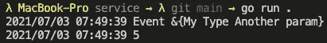

# 在 go 应用程序中导入和使用本地包

> 原文：<https://levelup.gitconnected.com/import-and-use-local-packages-in-your-go-application-885c35e5624>

关于如何在 go 应用程序中使用本地包的简短介绍。


沃洛季米尔·赫里先科在 [Unsplash](https://unsplash.com/) 上的照片

## 为什么首先要使用本地包？

使用与主应用程序不在同一个文件夹中的本地包的原因实际上非常简单。

*   更容易保持它的干净，并与一个特定的目的联系在一起。
*   由于隐含的依赖性更少，测试更容易
*   它可以很容易地在多个应用程序之间共享。这对于共享接口/模型和实用方法特别有用。

因此，让我们看看如何在我们的 go 应用程序中使用本地包

## 代码实现

如果你想看到整个项目，你可以看看我的公共 GitHub 库:

[](https://github.com/Abszissex/medium-golang-import-local-module) [## abszisex/medium-golang-import-local-模块

### 通过在 GitHub 上创建一个帐户，为 abszisex/medium-golang-import-local-module 开发做出贡献。

github.com](https://github.com/Abszissex/medium-golang-import-local-module) 

对于我们的例子，我们将使用一个使用名为`models`的本地包的`service`应用程序。在未来使用多个应用程序时，很有可能在它们之间共享`models`模块，因此它们共享公共接口或方法。

项目文件夹结构:

```
src/
|- models/
|-- go.mod
|-- main.go
|- service/
|-- go.mod
|-- main.go
```

为了在我们的`service`模块中使用`models`模块，我们必须通过`src/service/go.mod`文件包含它。

如你所见，首先我们要像普通模块一样添加`models`模块，有特定的版本。在这种情况下，版本并不重要，因为我们将始终使用本地可用的版本。但是您必须定义一个来与所需的格式保持一致。

下一步是使用`replace`语句，在这里我们可以定义是否以及如何映射我们需要的模块。在上面的例子中，我们定义了`models v1.0.0`应该映射到我们的本地`models`模块，该模块相对于`service`模块的`go.mod`文件位于`../models`。

现在我们可以将`models`模块导入到我们的`service/main.go`文件中，并使用其中定义的公共结构和方法:

正如你在代码中看到的，我们现在可以像导入任何其他模块一样导入我们的`models`模块，并通过键入`models.XYZ`在我们的`main()`方法中访问它。你可能已经猜到了，看看代码，我们有一个结构和一个公共方法定义在我们在这里访问的本地模块中。

在本地模块的`main.go`之后:

**运行代码**

现在让我们验证一切都如预期的那样工作。

要运行代码，我们必须导航到我们的`service`模块并运行我们的 go 应用程序:

```
$ cd ./src/service
$ go run .
```



## 你想联系吗？

如果你想联系我，请在 LinkedIn 上打电话给我。

另外，请随意查看[我的书籍推荐](https://medium.com/@mr-pascal/my-book-recommendations-4b9f73bf961b)📚。

[](https://mr-pascal.medium.com/my-book-recommendations-4b9f73bf961b) [## 我的书籍推荐

### 在接下来的章节中，你可以找到我对所有日常生活话题的书籍推荐，它们对我帮助很大。

mr-pascal.medium.com](https://mr-pascal.medium.com/my-book-recommendations-4b9f73bf961b) [](https://mr-pascal.medium.com/membership) [## 通过我的推荐链接加入 Medium—Pascal Zwikirsch

### 作为一个媒体会员，你的会员费的一部分会给你阅读的作家，你可以完全接触到每一个故事…

mr-pascal.medium.com](https://mr-pascal.medium.com/membership)