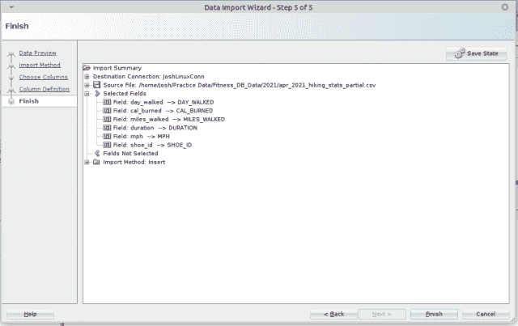

# 使用 Oracle SQL Developer 导入 CSV 文件

> 原文：<https://levelup.gitconnected.com/import-csv-file-with-oracle-sql-developer-b619240168e4>

如果您正在使用 Oracle SQL，并且需要将 CSV 数据加载到您的一个表中，那么使用 Oracle SQL Developer 可以使这个过程变得轻而易举。继续阅读，查看一个简单的例子，并了解如何…

自我推销:

如果你喜欢这里写的内容，尽一切办法，把这个博客和你最喜欢的帖子分享给其他可能从中受益或喜欢它的人。既然咖啡是我最喜欢的饮料，如果你愿意，你甚至可以给我买一杯！

我已经在 SQL 环境中写了[相当多的关于 CSV 的博客文章](https://joshuaotwell.com/csv-resource-for-sql-and-data-professionals/)(一些也在 Python 环境中)。由于我已经开始使用 Oracle 数据库并对其有了更多的了解，我想写一篇关于使用 SQL Developer 加载 CSV 文件数据的博文。对于那些不熟悉的人来说， [SQL Developer](https://www.oracle.com/database/technologies/appdev/sqldeveloper-landing.html) 是一个使用 Oracle SQL 数据库的 IDE。

## 要导入的 CSV 源数据

我将这些数据存储在一个 CSV 文件中，并希望将其加载到现有的临时表中:

用于上传的 CSV 数据

CSV 标题行显示了 6 个字段，它们是分段表中的列， **STG_WALKING_STATS** :

*   **日 _ 走了**
*   **cal_burned**
*   **英里 _ 步行**
*   **持续时间**
*   **时速**
*   **shoe_id**

***题外话*** :我目前正在*将**持续时间**列数据存储在一个 *Oracle 专用的*数据类型中，以表示 HH:MI:SS 格式，如 1 小时 10 分 28 秒。非常感谢来自社区的任何帮助、提示、建议或资源。我在帖子 [SUBSTR()字符函数——Oracle SQL 示例](https://link.medium.com/EyAiYwQQogb)中写了关于这个特定列的数据，您可以阅读更多关于它的信息。*

# 使用 SQL Developer 加载 CSV 数据文件

通过 6 个步骤，您可以使用 SQL Developer 轻松地将 CSV 数据加载到 Oracle SQL 的现有表中。

第一步:

右键单击您想要加载 CSV 数据的目标表格，并点击**导入数据**

第二步:

浏览并选择要上传的 CSV 文件。我在这里保留了大部分默认值。但是，请注意，您可以通过界面中的各种设置跳过标题行之前或之后的行:

浏览或选择要导入的目标数据。

第三步:

同样，我*依赖*默认值。特别是，**导入方法**下拉选择，我将其设置为**插入**。

Oracle SQL Developer 导入方法接口。

第四步:

在这一步中，您将映射出要从中导入的字段标题，可以选择按一定的顺序对它们进行排序。我按照它们在 CVS 文件中的原始顺序保存它们。点击**下一个**按钮继续导入步骤:

选择目标列。

第五步:

现在选择现有表中的目标列 CSV 数据将被加载到:

第六步:

点击**完成**按钮启动整体导入，这是向导中所示步骤的高潮:

数据导入向导的最后一步。

导入完成后，将显示一条成功消息:

成功的数据导入消息…

# 验证导入的 CSV 数据

我们可以执行下面的查询并过滤任何具有大于 14-APR-21 的 **day_walked** 列值的行，检索所有最近导入的行:

新导入的数据。

正如你在这篇文章的各种截图中看到的，导入过程的每一步都有几个可用的设置。在我使用默认值的地方，我相信其他选项在其他情况下会更好，所以一定要使用那些最有利于您的数据导入需求的选项。

喜欢你读过的？看到什么不正确的吗？请在下面评论，感谢阅读！！！

# 行动的号召！

感谢你花时间阅读这篇文章。我真心希望你发现了一些有趣和有启发性的东西。请在这里与你认识的其他人分享你的发现，他们也会从中获得同样的价值。

访问[投资组合-项目页面](https://wp.me/P28ctb-3KD)查看我为客户完成的博客帖子/技术写作。

如果你给我买咖啡，我一定会喝！！！

要在最新的博客文章发表时收到来自本博客(“数字猫头鹰散文”)的电子邮件通知(绝不是垃圾邮件)，请点击“点击订阅！”按钮在首页的侧边栏！(如有任何问题，请随时查看 [Digital Owl 的散文隐私政策页面](https://wp.me/P28ctb-3gI):电子邮件更新、选择加入、选择退出、联系方式等……)

请务必访问[“最佳”](https://joshuaotwell.com/where-blog_post-in-digital-owls-prose-best-of/)页面，收集我的最佳博文。

作为一名 SQL 开发人员和博客作者，Josh Otwell 热衷于学习和成长。其他最喜欢的活动是让他埋头于一本好书、一篇文章或 Linux 命令行。其中，他喜欢桌面 RPG 游戏，阅读奇幻小说，并与妻子和两个女儿共度时光。

免责声明:本文中的例子是关于如何实现类似结果的假设。它们不是最好的解决方案。所提供的大多数(如果不是全部)示例都是在个人发展/学习工作站环境中执行的，不应被视为生产质量或就绪。您的特定目标和需求可能会有所不同。使用那些最有利于你的需求和目标的实践。观点是我自己的。

*原载于 2021 年 5 月 26 日 https://joshuaotwell.com**的* [*。*](https://joshuaotwell.com/import-csv-file-with-oracle-sql-developer/)