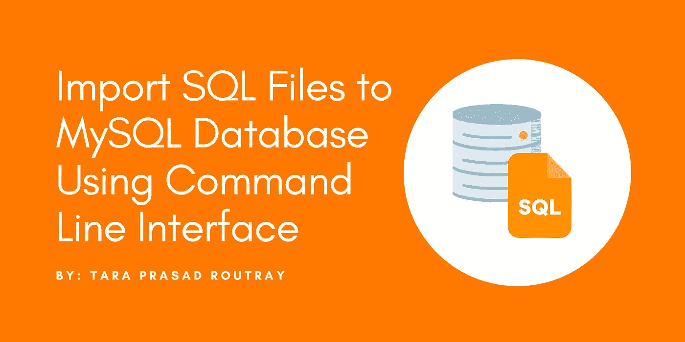

# 使用命令行界面将 SQL 文件导入 MySQL 数据库

> 原文：<https://levelup.gitconnected.com/import-sql-files-to-mysql-database-using-command-line-interface-3a65d54d9cf7>

## 学习在任何环境中使用 CLI 导入 SQL 文件，包括像 WAMP 和 XAMPP 这样的离线服务器。



通过 SQL 查询导入数据库表或进行更改是软件开发中的一项常见任务。您可以使用数据转储(存储在文件中的 SQL 查询)来更新结构或记录。您还可以使用它们将数据迁移到新的服务器或开发环境中。

在本文中，我将详细介绍如何使用命令行界面导入 SQL 文件。您将学习如何使用 MySQL 服务器(在线托管)、WAMP 和 XAMPP 离线服务器提供的 shell 来完成这项工作。

# 涵盖的主题

1.  使用在线服务器提供的 MySQL Shell 导入文件
2.  使用 WAMP MySQL CLI 导入文件
3.  使用 XAMPP MySQL CLI 导入文件

# 1.使用在线服务器提供的 MySQL Shell 导入文件

如果您正在使用任何虚拟主机服务，如 VPS、云主机或专用主机，它们会为您提供一个 shell，通过它您可以使用一组命令来管理您的数据库。如果您有一个包含 SQL 查询的文件，请执行以下命令来导入它。

```
mysql -u username -p database_name < path_to_mysql_file.sql
```

*   `username`，将其替换为您登录数据库时使用的名称。
*   `database_name`，将其替换为要导入 SQL 转储的目标数据库的名称。
*   `path_to_mysql_file.sql`，将其替换为要导入的 SQL 转储文件的完整路径。
    

如果该命令成功运行，它不会在 CLI 中显示任何输出。如果在导入过程中出现任何错误，MySQL 会在 CLI 中显示出来。如果您想验证导入是否成功，请登录 MySQL shell 并检查数据。通过运行`USE database_name`命令选择数据库，然后运行`SHOW TABLES;`命令或类似命令来查找导入的数据。

# 2.使用 WAMP MySQL CLI 导入文件

如果您使用的是 WAMP 脱机服务器，请按照下面的步骤操作。

1.  启动 WAMP 服务器。
2.  左键单击任务栏中的 WAMP 图标。
3.  请参见“默认 DBMS: MySQL”一节下的“MySQL”链接。
4.  在右边，你可以看到你正在使用的 MySQL 的版本。

打开命令提示符，执行以下命令将 SQL 文件导入数据库。

```
C:\wamp64\bin\mysql\mysql8.0.27\bin\mysql -u username -p database_name < path_to_mysql_file.sql
```

*   `mysql8.0.27`，替换成你的 MySQL 版本号。
*   `username`，将其替换为您登录数据库时使用的名称。
*   `database_name`，将其替换为要导入 SQL 转储的目标数据库的名称。
*   `path_to_mysql_file.sql`，将其替换为要导入的 SQL 转储文件的完整路径。
    `e.g: home/downloads/users.sql`

# 3.使用 XAMPP MySQL CLI 导入文件

如果您使用的是 XAMPP 脱机服务器，请打开命令提示符并执行以下命令，将 SQL 文件导入数据库。

```
C:\xampp\mysql\bin>mysql -u username -p database_name < path_to_mysql_file.sql
```

*   `username`，将其替换为您登录数据库时使用的名称。
*   `database_name`，将其替换为要导入 SQL 转储的目标数据库的名称。
*   `path_to_mysql_file.sql`，将其替换为要导入的 SQL 转储文件的完整路径。
    `e.g: home/downloads/users.sql`

太棒了。您已经学习了如何在多种环境中使用命令行界面导入 SQL 文件。

> 如果你喜欢阅读这篇文章，并发现它对你有用，那么请鼓掌，与你的朋友分享，并关注我以获得我即将发布的文章的更新。你可以在 [LinkedIn](https://medium.com/@tararoutray) 上和我联系。