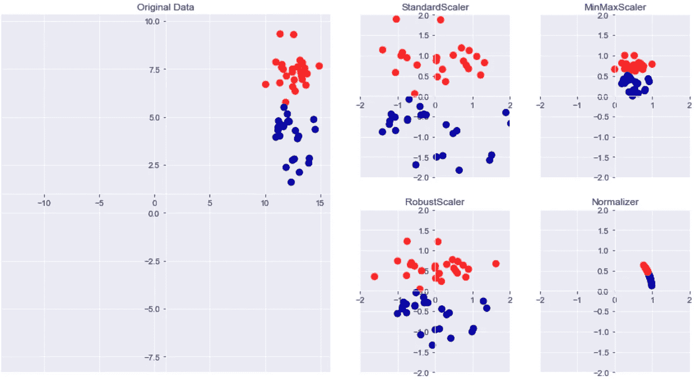
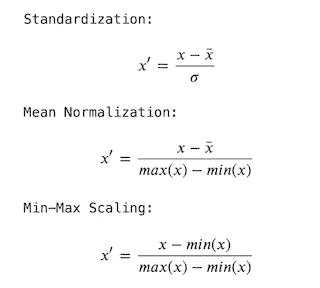

# 数据预处理和缩放在机器学习中的重要性

> 原文：<https://levelup.gitconnected.com/importance-of-data-preprocessing-and-scaling-in-machine-learning-21db1d4377ec>

在实现不同的机器学习算法时，数据预处理和规范化变得非常重要。由于数据预处理会显著影响学习模型的结果，因此所有特征都在同一尺度上非常重要。归一化在诸如 k-NN、支持向量机、神经网络、主成分等算法中是重要的。所需的特征预处理和归一化的类型取决于数据。

## ***预处理类型***

有几种不同的方法来重新调整数据。下图显示了机器学习算法中最常用的四种算法。



**对数据集进行重新标度和预处理的不同方法。**

原始数据下的第一个图显示了只有两个要素的合成两类分类数据集。第一个特征(x 轴值)在 10 到 15 的范围内。第二个特征(y 轴值)介于 1 和 9 之间。右边的四个图显示了产生更多标准范围的数据转换的不同方法。

***标准缩放器*** 确保数据集中每个要素的均值为 0，方差为 1，并使所有要素达到相同的量级。这种缩放不能确保要素的任何最小值和最大值。

***鲁棒定标器*** 的工作原理与标准定标器相似，但使用中值和四分位数，而不是平均值和方差。这使得 scaler 忽略与其他数据点非常不同的数据点(测量误差)。

***规格化器*** 缩放每个数据点，使得特征向量的欧几里德长度为 1。每个数据点都按不同的数字缩放(按其长度的倒数)。当数据的唯一方向重要，而不是特征向量的长度重要时，使用这种归一化。

***MinMaxScaler*** 变换所有的输入变量，所以它们都在 0 和 1 之间的同一标度上。该方法计算训练数据上每个特征的最小值和最大值，然后对每个特征应用最小-最大变换。



> **在 ML 中应用缩放比例**

以下示例显示了如何将 MinMaxScaler 应用于要素。首先创建标量对象，然后使用训练数据 X_train 调用 fit 方法。这将计算该训练数据集中每个要素的最小和最大特征值。然后要应用标量，调用它的 transform 方法，并传入需要重新缩放的数据。输出将是输入数据的缩放版本。在这种情况下，我们希望缩放训练数据，并将其保存在一个名为 X_train_scaled 的新变量中。和测试数据，将其保存到一个名为 X_test_scaled 的新变量中。然后，我们只使用这些缩放版本的特征数据，而不是原始特征数据。

```
from sklearn.preprocessing import MinMaxScaler
scaler = MinMaxScaler()
scaler.fit(X_train)
X_train_scaled = scaler.transform(X_train)
X_test_scaled = scaler.transform(X_test)
clf = SVC().fit(X_test_scaled, y_train)
r2_score = clf.score(X_test_scaled, y_test)
```

这里有两件非常重要的事情。首先，相同的标量对象必须应用于训练和测试。第二，标量对象必须在训练数据上训练，而不是在测试数据上训练。

在 ML 算法中预处理数据时，需要遵循以下重要方面:

*   使用训练集拟合缩放器，然后应用相同的缩放器来转换测试集。
*   不要使用不同的缩放器来缩放训练集和测试集:这可能会导致数据中的随机偏差。
*   不要使用测试数据的任何部分来安装定标器:引用测试数据会导致某种形式的数据泄漏。

> **预处理对监督学习的影响**

以下示例展示了数据预处理在真实世界示例癌症数据集中的重要性。在原始数据上拟合 SVC:

```
# import SVC classifier
from sklearn.svm import SVC# split data
X_train, X_test, y_train, y_test = train_test_split(cancer.data, cancer.target, random_state=0)# initialize classifier and fit data
svm = SVC(C= 100)
svm.fit(X_train, y_train)# checking accuracy for classifier
print("Test set accuracy: {:.2f}".format(svm.score(X_test, y_test)))>>>>> Test set accuracy: 0.63
```

以下代码表示在拟合 SVC 分类器之前使用 MinMaxScaler 缩放数据:

```
# preprocessing using 0-1 scaling
from sklearn.preprocessing import MinMaxScalerscaler = MinMaxScaler()
scaler.fit(X_train)X_train_scaled = scaler.transform(X_train)
X_test_scaled = scaler.transform(X_test)# learning an SVM on the scaled training data
svm.fit(X_train_scaled, y_train)# checking accuracy for classifier
print("Test set accuracy: {:.2f}".format(svm.score(X_test_scaled, y_test)))>>>>> Test set accuracy: 0.97
```

根据精度结果，我们可以看出，缩放数据的影响非常显著。

> **结论**

对于许多机器学习方法来说，数据转换是非常重要的。最适合应用的特征归一化类型取决于数据集、学习任务和要使用的学习算法。没有硬性的规则告诉我们什么时候对数据进行规范化或标准化。最好先将模型与原始数据、标准化数据和规范化数据进行拟合，然后比较性能以获得最佳结果。