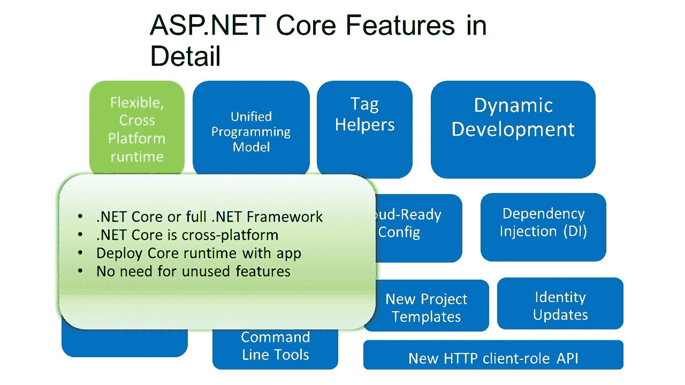

# 重要的 ASP.NET 核心功能

> 原文：<https://levelup.gitconnected.com/important-asp-net-core-features-b05d2e192bd8>


[张诗钟·维诺](https://unsplash.com/@johnyvino?utm_source=unsplash&utm_medium=referral&utm_content=creditCopyText)在 [Unsplash](https://unsplash.com/?utm_source=unsplash&utm_medium=referral&utm_content=creditCopyText) 上的照片

ASP。NET 是微软开发的最成功的 web 应用程序框架之一。

新的和扩展的特性被频繁地添加进来，帮助开发人员构建和部署高可伸缩性和高性能的 web 应用程序。

它还提供了应用程序监控和其他性能工具，如分析器。正因为如此，ASP.NET 已经成为构建令人难以置信的应用程序的强大解决方案。

根据我的经验，我列出了一些对我顺利开发 web 应用程序有很大帮助的特性。



# 开发模式和其他多重环境

ASP.NET 核心中的新环境功能使我们能够轻松区分环境中表现出的不同行为功能。这可以是开发、测试、试运行或生产。在 ASP.NET 核心技术出现之前，没有标准的方法可以做到这一点。

我们可以使用 Startup.cs 文件来帮助我们为不同的环境配置应用程序。在不同的环境中，我们使用不同的 CSS 或 JavaScript 文件，就像我们通常在生产中使用 CDN，而在开发阶段使用本地文件。

```
<environment names="Development">
    [http://~/lib/jquery/dist/jquery.js](http://~/lib/jquery/dist/jquery.js)
    [http://~/lib/bootstrap/dist/js/bootstrap.js](http://~/lib/bootstrap/dist/js/bootstrap.js)
    [http://~/js/someJavaScriptFile.js](http://~/js/site.js)
 </environment>
 <environment names="Testing,Production">
    [https://ajax.aspnetcdn.com/ajax/jquery/jquery-2.2.0.min.js](https://ajax.aspnetcdn.com/ajax/jquery/jquery-2.2.0.min.js)
    [https://ajax.aspnetcdn.com/ajax/bootstrap/3.3.7/bootstrap.min.js](https://ajax.aspnetcdn.com/ajax/bootstrap/3.3.7/bootstrap.min.js)
    [http://~/js/site.min.js](http://~/js/site.min.js)
 </environment>
```

# 高性能增益

众所周知，性能是任何软件的一个非常重要的特性。随着 ASP.NET 核心和 Kestrel web 服务器的推出，ASP.NET 无疑是最快的 web 应用程序框架之一。 [TechEmpower](https://www.techempower.com/blog/2016/11/16/framework-benchmarks-round-13/) 公布的名单中他们也提到了同样的事情。

微软从头开始设计了新的 Kestrel 网络服务器，以充分利用异步编程模型，使其更轻便、更快！

# 跨平台和容器支持

使用 Core，我们不仅可以创建和部署面向 Windows 的 ASP.NET 应用，还可以创建和部署面向 Linux 和 macOS 的应用。这是通过微软和社区所做的大量工作才实现的。由于这个特性，Linux 可以被认为是运行 ASP.NET 的一等公民。

像 Docker、Kubernetes 和其他技术这样的容器都有很高的需求。使用 ASP.NET 核心，开发人员可以利用这些新技术提供的所有优势。Microsoft Azure 甚至支持将我们的应用程序部署到容器和 Kubernetes。

# 依赖注入

ASP.NET 核心的一个伟大的新特性是内置的依赖注入。

这个特性在 ASP.NET MVC 中也被大量使用。大多数开发人员喜欢用这种方法将日志上下文、数据库上下文和其他东西传递给 MVC 控制器。

```
public class EmployeeService : IEmployeeService
{
 public ILogger Logger { get; } //automatically passes the logger factory in to the constructor via dependency injection
 public EmployeeService(ILoggerFactory loggerFactory)
 {
  Logger = loggerFactory?.CreateLogger();
  if (Logger == null)
  {
   throw new ArgumentNullException(nameof(loggerFactory));
  }
  Logger.LogInformation("Employee Service created");
 }
}
```

# 通过 async/await 进行异步编程

ASP.NET 利用异步编程模式的方式非常高效。*异步现在已经在所有普通中实现。NET Framework 类和大多数第三方库。在每个以数据为中心的应用程序中，大部分应用程序时间和 CPU 周期将花费在数据库查询、web 服务调用和其他要完成的 I/O 操作上。*

*ASP.NET 内核速度更快的主要原因之一是，除了在新的 MVC 和 Kestrel 框架中高效利用异步编程之外，它还广泛使用异步编程，从而减少了应用程序的运行时间。*

```
*//mark the method as async
public async Task CallAPI()
{
   HttpClient hc = new HttpClient();

   //await keyword handles all the complexity of async threading and callbacksawait hc.GetAsync("Some API Methods");
   return true;
}*
```

# *CSRF 保护—跨站点请求伪造*

*在任何应用程序中，安全性都非常重要。这也是需要大量工作来防止某些类型的攻击的事情之一。*

***跨** - **站点请求伪造** ( **CSRF** )是一种攻击，它迫使最终用户在他们当前已通过身份验证的 web 应用程序上执行不想要的操作。 **CSRF** 攻击专门针对状态改变**请求**，而不是窃取数据，因为攻击者无法看到对伪造**请求**的响应。*

*Core 提供了一个非常好的框架，将用于防止这些类型的攻击。生成[防伪令牌](https://docs.microsoft.com/en-us/aspnet/core/security/anti-request-forgery?view=aspnetcore-3.1)。*

# *动作过滤器*

*动作过滤器允许开发人员实现可应用于整个控制器或动作的功能，而无需修改动作本身。*

*通常，过滤器用于指定**缓存**、**错误处理**、**授权**，或者我们想要实现的任何定制逻辑。*

```
***[OutputCache(Duration = 10)]**
public string Index()
{
   return DateTime.Now.ToString("T");
}*
```

# *本地化和全球化*

*ASP。NET 使得在我们的 web 应用程序中本地化日期、数字和文本变得很容易。如果我们希望我们的应用程序在全球范围内使用，本地化将是答案。*

*使用资源文件，我们可以在应用程序中进行定制，以提供多语言支持。我们可以将这些资源文件视为中央存储库，其中保存了多种语言的所有文本。应用程序可以读取这个资源文件，根据不同的区域填充标签。*

*有两种类型的资源:*

***本地资源:**特定于一个页面(即每个页面都会有本地资源文件)
**全局资源:**整个网站通用(即所有页面访问一个资源文件)*

# *Web 应用程序托管*

*很多时候，我们需要直接在桌面上部署 web 应用程序，而不是在安装了 IIS 的服务器上。为了处理这种情况，我们可以利用 ASP.NET 核心的自托管特性。*

*有许多方法可以开发和部署自托管的 ASP.NET web 应用程序。英寸 NET 框架 4.5，我们可以通过使用 Owin，南希，或 WCF。然而，如果我们使用 ASP.NET 核心，我们不需要依赖这些功能，我们可以直接使用标准的 Kestrel web 服务器。*

*使用的最大优点之一。NET 核心是 web 应用程序基本上只是一个控制台应用程序。IIS 只是作为一个反向代理坐在它的前面。为了处理非基于服务器的用例，我们可以只使用 **Kestrel** 部署我们的应用程序。*

# ***结论***

*ASP。NET Core 是一个高性能、开源的多平台框架，用于创建现代云应用程序。*

*。Net Core 是几乎所有类型的应用程序的顶级框架之一，无论是任何设备还是任何规模的应用程序。微软和社区投入了大量的时间和精力。Net Core 是市场上一个有竞争力的框架，帮助开发人员在短时间内构建具有最佳性能和可伸缩性的强大应用程序。*

*最棒的是，存在。Net Framework 开发人员不需要任何新知识。网芯。这也是……的主要原因之一。Net Core 在很短的时间内就被开发人员所采用。*

**

## *参考*

*[stack ify](https://stackify.com/asp-net-core-features/)
[coding infinite](https://codinginfinite.com/top-10-asp-net-core-features-need-know/)
多个其他在线文章*