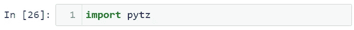

# 熊猫时间序列的重要方法

> 原文：<https://levelup.gitconnected.com/important-for-time-series-in-pandas-c2c632175442>

## 如何使用脸书股票数据集的重采样、移位和窗口方法，以及如何处理时区。

在 [Unsplash](https://unsplash.com?utm_source=medium&utm_medium=referral) 上由[米米·蒂安](https://unsplash.com/@mimithian?utm_source=medium&utm_medium=referral)拍摄的照片

时间序列是一系列按时间顺序排列的数据点。时间序列分析在金融研究中使用非常频繁。Pandas 是一个非常重要的时间序列分析库。有了熊猫，你可以很容易地操纵你的时间序列。在这篇文章中，我将讨论以下主题:

*   什么是重采样？
*   什么是转变？
*   窗口操作
*   处理时区
*   更改时区

让我们开始吧！

 [## 蒂伦达兹学院

### 嗨，欢迎来到提伦达兹学院。Tirendaz 学院是一个在线教育平台，制作视频和写博客…

www.youtube.com](https://www.youtube.com/channel/UCFU9Go20p01kC64w-tmFORw) 

# 什么是重采样？

在 Pandas 中，重采样是一种基于时间的分组方式，其后是每个分组的减少方法。通过重采样，您可以将时间序列从一种频率转换为另一种频率。为了显示重采样，让我导入 Pandas 和 Numpy 库。

重采样执行分组，类似于 groupby 技术。为了解释这一点，我将使用脸书股票数据集。你可以在这里找到这个数据集。让我们导入这个数据集。

请注意，我使用了 parse_dates 参数将 Date 列转换为 datetime 对象。我还设置了 index_col 参数，将该列指定为索引对象。让我们看看数据集的第一行。

重采样方法非常灵活，允许您指定许多不同的参数来控制频率转换和重采样操作。让我们用重采样法来看看月平均值。

让我画出收盘价。首先，我将使用% Matplotlib inline magic 命令来查看行间的绘图。

要查看月平均值的曲线图，可以使用 plot 方法。

让我们来看看季度值的平均价格的条形图。

# 什么是转变？

您可能希望使用 shift 方法在时间上前后移动或延迟时间序列中的值。Series 和 DataFrame 都具有 shift 属性。让我们取 3 月份脸书收盘价的值，并将这些值赋给 fb1 变量。

我们来看看 fb1 变量。

shift 方法接受 freq 参数，该参数可以接受 DataOffset 类或其他 timedelta，如对象或偏移别名。当您可以确定 freq 参数时，shift 方法会更改索引中的所有日期。让我们将时间序列中的值向前移动两个时间。

让我们将时间序列中的值向后移动两次。

你可以在同一个表格中看到这种变化。

我们再来看看 fb1 变量。

在时间序列中，您有时希望找到一天中的变化百分比。现在让我们找出一天内的数值差异。

我们再来看看 fb1 变量。

tshift 方法使用索引的频率来移动时间索引。此方法向前或向后播放索引。为了说明这一点，让我们先看一下 Close 列。

让我们选择关闭列。

让我们看看 fb2 变量的前几行。

让我们看看这些数据的索引结构。

注意，日期值没有频率值。让我们给这些指数分配频率。为此，我将使用 date_range 函数。

现在让我们再次看看 fb2 数据的指数。

请注意，日期指的是工作日。您可以前后移动索引。例如，让我们将日线指数前移。

我们回去 2 天吧。

# 窗口操作

Pandas 包含一组紧凑的 API，用于执行窗口操作，这是一种在值的滑动分区上执行聚合的操作。您可以将 API 函数想象成类似于 groupby API。

窗口操作用于平滑数据。让我们重新思考脸书股票数据集，并讨论滚动函数。该函数类似于 groupby 和 resample 方法。可以用滚动功能分组。例如，滚动(30)意味着 30 天的平均值。为了说明这一点，让我们首先绘制 fb 收盘价。

现在让我们用滚动函数找到 30 日均值，并在图上显示这些值。

# 处理时区

众所周知，世界上每个地区都有不同的时区。许多研究人员根据缩写 UTC 国际时间工作。

pytz 库用于 Python 中的时区。这个库装载了 Anaconda。如果你的电脑没有安装这个库，你可以用 pip 或者 conda 来安装。让我们导入这个库。

比如让我们学习土耳其的时区。

让我们找到美国纽约地区的时区。

例如，让我们查找比中部时区晚 7 个小时的地方。

# 更改时区

您可以更改数据集的时区。为了展示这一点，让我们创建一个 date 对象。

让我们用这个日期对象创建一个时间序列。

让我们来看看这个变量。

让我们使用 tz 属性来控制索引的时区。

ts 数据没有时区。现在让我们为这些数据指定日期范围。为此，您可以使用 tz_localize 方法。

如果要按照某个特殊区域来排列时间序列，可以使用 tz_convert 方法。例如，让我们根据夏威夷设置时间序列。

您可以将数据集转换为国际中部时区。

让我们把这个时间转换成国际当地时间。

现在让我们把这个当地时间转换成伊斯坦布尔当地时间。

如果合并不同地区的两个时间序列，结果将以中部-当地时间显示。让我们再次打印 ts 时间序列。

让我们用两个不同的地区时间创建两个时间序列。

现在让我们把这个时间序列加起来。

让我们看看结果变量的索引。

因此，结果索引是根据中央-地方时间打印的。

# 结论

时间序列分析在金融研究中使用非常频繁。在这篇文章中，我谈到了如何使用重采样、移位和窗口方法，以及如何处理时区。就是这样。我希望你喜欢它。感谢您的阅读。你可以在这里找到这个笔记本[。](https://github.com/TirendazAcademy/PANDAS-TUTORIAL/blob/main/24-Working%20with%20Methods%20in%20Pandas%20-%20Part%201%20.ipynb)

别忘了在[YouTube](https://www.youtube.com/channel/UCFU9Go20p01kC64w-tmFORw)|[GitHub](https://github.com/tirendazacademy)|[Twitter](https://twitter.com/TirendazAcademy)|[ka ggle](https://www.kaggle.com/tirendazacademy)|[LinkedIn](https://www.linkedin.com/in/tirendaz-academy)上关注我们

 [## 数据科学的 10 个最佳 Python 库

### 数据科学家应该知道的图书馆和学习它们的前 5 本书。

levelup.gitconnected.com](/top-10-python-libraries-and-5-best-books-for-data-science-fa0d0cf171a6)  [## 8 个最好的 Seaborn 可视化

### 使用企鹅数据集与 Seaborn 一起动手绘制统计图。

medium.com](https://medium.com/geekculture/8-best-seaborn-visualizations-20143a4b3b2f) 

*如果这篇文章有帮助，请点击拍手👏按钮几下，以示支持👇*