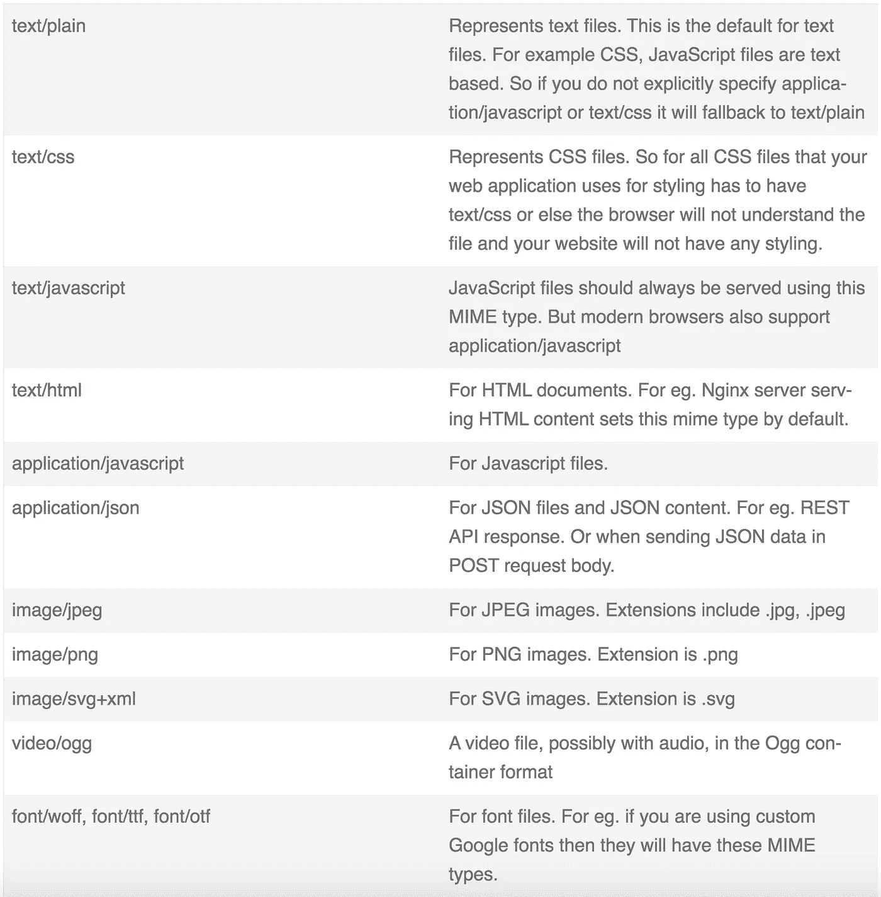

# web 开发人员的重要 MIME 类型

> 原文：<https://levelup.gitconnected.com/important-mime-types-for-web-developers-f5894c948925>


Mime 类型定义了您在 web 开发中通常会遇到的文档格式。在本文中，让我们来看看 web 开发人员的一些重要 mime 类型。

## 哑剧代表什么？

MIME 是**多用途互联网邮件扩展的简称。**它是一个 RFC 标准，定义了文档的格式和性质。不是，只有文档，甚至图像，字体等。它们也被称为媒体类型。

## 谁负责定义 Mime 类型？

**互联网数字地址分配机构(IANA)** 负责所有官方 MIME 类型。它是由一群聪明人组成的标准团体，负责管理和维护 mime 类型。让我试着打个比方。你可能听说过定义 JavaScript 标准(ECMA-262)的 ECMA(欧洲计算机制造协会)。所以 IANA 是相似的。

## Mime 类型定义的基本结构

```
type/subtype
```

## 在哪里使用 Mime 类型？

您可以在 HTTP 请求和响应头中找到 MIME 类型声明。您将看到类似下面的内容，

**1。** **请求/响应报头**

```
Content-Type: application/javascriptContent-Type: text/cssContent-Type: text/htmlAccept:text/html,application/xhtml+xml,application/xml;q=0.9,image/webp,image/png
```

回复标题的完整示例(请注意内容类型):

```
accept-ranges: bytes
age: 9
cache-control: public, max-age=0, must-revalidate
content-length: 599
content-type: application/json
date: Sun, 28 Jun 2020 17:32:11 GMT
etag: "280ea7447fc2b2fead9a3ed5fa838425-ssl"
server: Netlify
status: 200
strict-transport-security: max-age=31536000
x-nf-request-id: f524a793-387b-4034-9ef6-399de460103c-11991605
```

2.**提交表单数据**

您还可以使用 MIME 类型声明来发布表单数据。下面举个例子。您将在表单元素的 **enctype** 属性中指定 mime 类型。对于文件上传或二进制内容提交，您通常会使用多部分/形式数据。它也适用于提交表单域。

请求头看起来像这样，

```
Content-Type: multipart/form-data;
```

但是对于普通的表单域提交，您应该使用**application/x-www-form-urlencoded**。

对于**application/x-www-form-urlencoded**，发送到服务器的 HTTP 消息的主体实际上是一个巨大的查询字符串——名称/值对由&符号(&)分隔，名称和值由等号(=)分隔。这方面的一个例子是:

```
firstname=John&lastname=Doe&email=john@gmail.com
```

好吧，我希望你有一些想法。现在，让我们来看看 web 开发人员的一些重要 mime 类型。

## web 开发人员的重要 Mime 类型

这里有一张流行的表。



## 参考

Mime 类型的官方 RFC 标准— [RFC6838](https://tools.ietf.org/html/rfc6838)

如果你想让我在清单上添加任何其他的，对我大喊一声。

干杯！

如果你喜欢这篇文章，并且想让类似的文章直接发送到你的收件箱，你可以 [**订阅**](https://mailchi.mp/2f84dc456079/newsletter) 我的时事通讯。我每两周发一封电子邮件，里面有新文章、技巧、新闻和免费资料。当然，没有垃圾邮件。

在推特上向我问好，

[https://twitter.com/joseph_rialab](https://twitter.com/joseph_rialab)

*原载于 2020 年 6 月 28 日*[*https://Joseph Khan . me*](https://josephkhan.me/important-mime-types-for-web-developers/)*。*