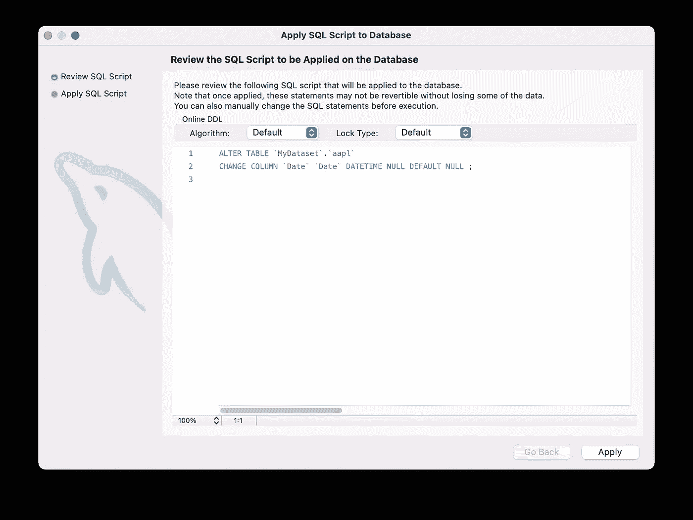

# 将 CSV 导入 MySQL 数据库

> 原文：<https://levelup.gitconnected.com/importing-csv-into-mysql-databases-addbbc9f4944>

## 了解如何使用 MySQLWorkBench 将 CSV 数据集快速导入 MySQL 数据库

米卡·鲍梅斯特在 [Unsplash](https://unsplash.com?utm_source=medium&utm_medium=referral) 上的照片

当您开始数据科学之旅时，您遇到的大多数数据集通常存储在 CSV 文件中。虽然在 Pandas 中处理 CSV 文件很常见，但有时您需要以其他格式访问数据，例如 MySQL 等数据库服务器中的表。在这篇短文中，我将向您展示如何将您的 CSV 文件导入 MySQL 中的表格，以便您可以在 Grafana 等应用程序中轻松使用您的数据。

 [## 使用 Grafana 开发仪表板

### 李伟孟发表于:代码杂志:2022 年 7 月/8 月最后更新:2022 年 8 月 31 日在我的早期文章…

www.codemag.com](https://www.codemag.com/Article/2207061/Developing-Dashboards-Using-Grafana) 

# 使用 MySQLWorkbench

对于本文，我将使用 **MySQL 工作台**。你可以从:[https://dev.mysql.com/downloads/workbench/](https://dev.mysql.com/downloads/workbench/)下载。

通过 MySQL Workbench 登录到 MySQL 服务器后，在服务器中创建一个新的模式(数据库):

将模式命名为 **MyDataset** ，然后单击 **Apply:**

查看 SQL 脚本以创建模式，然后单击**应用**:

一旦创建了模式，右击模式并选择**表数据导入向导**:

浏览要用于导入 MySQL 服务器的 CSV 文件:

> 我在本文中使用的 CSV 文件是 **AAPL.csv** —苹果历史数据集([https://www . ka ggle . com/datasets/prasoonkottarathil/Apple-lifetime-stocks-Dataset](https://www.kaggle.com/datasets/prasoonkottarathil/apple-lifetime-stocks-dataset))。许可证— [CC0:公共领域](https://creativecommons.org/publicdomain/zero/1.0/)

您有机会使用现有的表格，或者创建一个新的表格。点击**下一个**:

您将看到 CSV 中的各种字段以及它们将被导入到表中的数据类型。点击**下一个**:

> 您可能想将日期字段更改为 datetime 类型，但是如果您更改它，数据将无法正确加载。数据加载到表中后，您可以在以后更改数据类型。

在接下来的两个窗口中，点击**下一个**。最后，您将看到一个屏幕，告诉您数据已成功导入。点击**完成**:

现在，您可以刷新数据库并查看 **aapl** 表。右键点击并选择**选择行**:

您现在应该可以看到 **aapl** 表中的记录:

# 更改字段的数据类型

要更改**日期**字段的数据类型，右击 **aapl** 表格并选择**更改表格…** :

将**日期**字段的数据类型从**文本**更改为**日期时间**。点击**应用:**

确认更改数据类型的 SQL 脚本，点击**应用**:

 [## 加入媒介与我的介绍链接-李伟孟

### 阅读李维孟(以及媒体上成千上万的其他作家)的每一个故事。您的会员费直接支持…

weimenglee.medium.com](https://weimenglee.medium.com/membership) 

# 摘要

在这篇短文中，我向您展示了如何将 CSV 文件导入 MySQL 数据库。这在您的工具(如 Grafana)要求数据集为数据库格式的情况下非常有用。