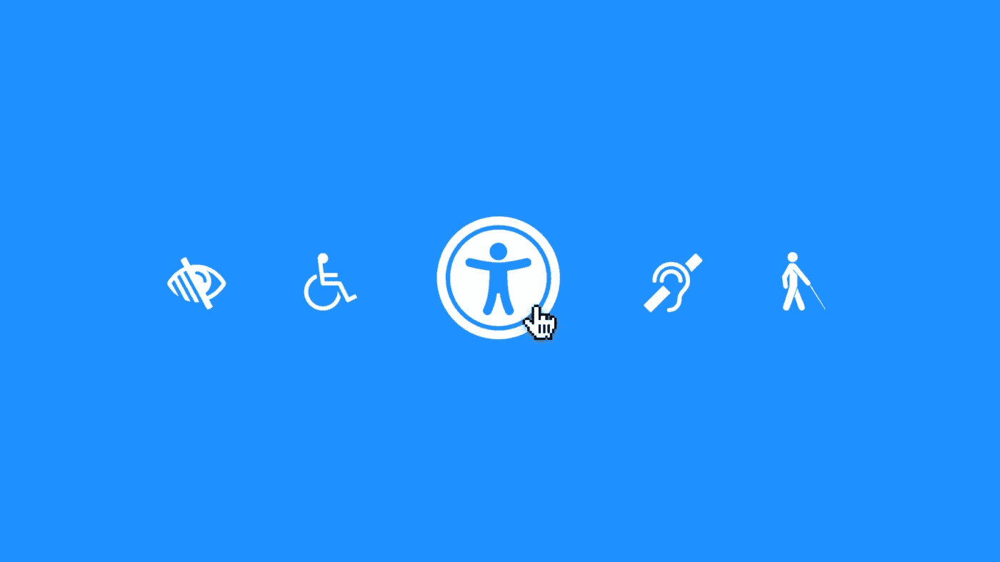
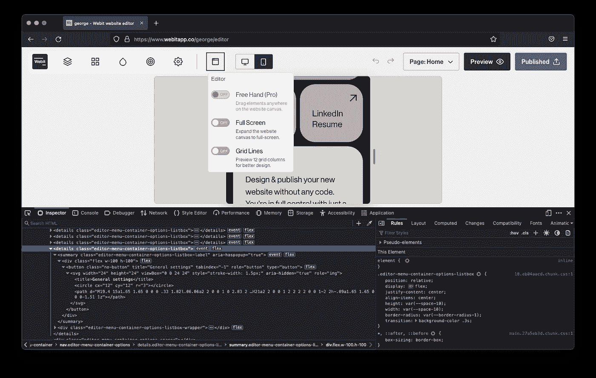
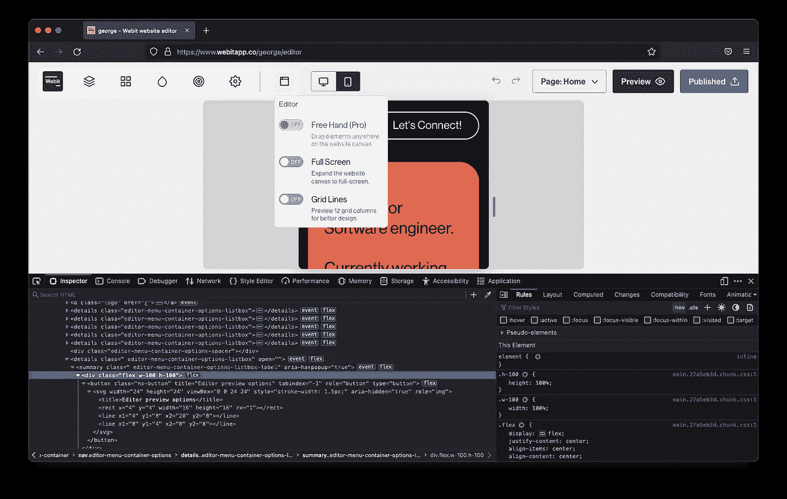

# 通过焦点和焦点可见的轮廓样式提高可访问性。

> 原文：<https://levelup.gitconnected.com/improve-accessibility-with-focus-focus-visible-outline-styling-24468e5295d0>



照片由 outline-offset: 0.125rem;
}

如果我们考虑严格的 [WCAG 2.1](https://www.w3.org/TR/WCAG21/#focus-visible) 要求，我们前面提到的方法就足够了。然而，当使用光标与输入、披露和按钮(以及其他难以处理的元素)交互时，轮廓将持续存在。



图 2:使用光标时轮廓可见的[webitapp.co](https://www.webitapp.co/)的揭示。

在 [CSS4 草案](https://www.w3.org/TR/selectors-4/#the-focus-visible-pseudo)中，我们可以发现`:focus-visible`伪类允许浏览器自动检测输入设备是鼠标还是键盘。默认行为仅在使用键盘时呈现明显的焦点样式。

在撰写本文时，在我们完全取代`:focus`之前，浏览器对`:focus-visible`的支持需要改进。虽然，我们可以在支持该功能时启用`:focus-visible`。结合我们以前的`*:focus`宣言，我们可以补充以下内容:

```
*:focus:not(:focus-visible) {
    /* Remove focus indication when a mouse is used */
    outline: none;
}*:focus-visible {
    outline: 0.125rem solid #000000;
    outline-offset: 0.125rem;
}
```



图 3:与图 2 相同的公开内容，但使用光标时没有可见的轮廓。

## 不同实现的注意事项

还可以使用`border`、`background-color`和`box-shadow`制作聚焦指示器。由于感知轮廓模仿`border-radius`而`outline`可能不模仿`box-shadow`，所以`box-shadow`经常被使用(取决于所使用的浏览器)。

应该避免这种方法，因为它可以根据[特定颜色模式](https://www.a11yproject.com/posts/operating-system-and-browser-accessibility-display-modes/)被覆盖。如果阴影的使用是必要的，提供透明颜色的轮廓`outline: 0.125rem solid transparent;`作为所述颜色模式的后备。

# 最后的想法

焦点指示器样式可能是网站上可以实现的最简单的可访问性改变，产生巨大的价值。

请满足可访问性要求，并且不要删除大纲，除非您用推荐的替代方法覆盖它们。

# 进一步阅读

[](https://hidde.blog/indicating-focus-to-improve-accessibility/) [## 指明重点以提高可访问性

### 这是一个常见但相当容易解决的可访问性问题:缺少指示焦点。在这篇文章中，我将解释…

hidde .博客](https://hidde.blog/indicating-focus-to-improve-accessibility/) [](https://www.sarasoueidan.com/blog/focus-indicators/) [## 设计可访问的、符合 WCAG 标准的焦点指示器指南

### 这篇文章是从我的实践无障碍视频课程中修改的纯文本摘录。我想分享这个指南…

www.sarasoueidan.com](https://www.sarasoueidan.com/blog/focus-indicators/) [](https://www.a11yproject.com/posts/never-remove-css-outlines/) [## 从不删除 CSS 轮廓

### 移除 CSS 中的轮廓会给使用键盘浏览网页的人带来问题。使用 CSS 规则:focus {…

www.a11yproject.com](https://www.a11yproject.com/posts/never-remove-css-outlines/) [](https://www.nicchan.me/blog/tips-for-focus-styles/) [## 焦点样式提示- Nic Chan

### 以下是一系列关于 focus 风格的注释:对可能正在寻找……

www.nicchan.me](https://www.nicchan.me/blog/tips-for-focus-styles/) [](https://developers.google.com/web/fundamentals/accessibility/focus) [## 焦点简介|网络基础|谷歌开发者

### 在这一课中，我们将讨论焦点以及如何在应用程序中管理它。焦点是指…上的哪个控件

developers.google.com](https://developers.google.com/web/fundamentals/accessibility/focus) 

# 如果你觉得这篇文章有用，请与他人分享。一些掌声👏🏻下面多多帮忙！

通过鼓掌，你帮助其他人发现这些内容，并激发更多关于可访问性、设计、反应和 JavaScript 的文章的写作！