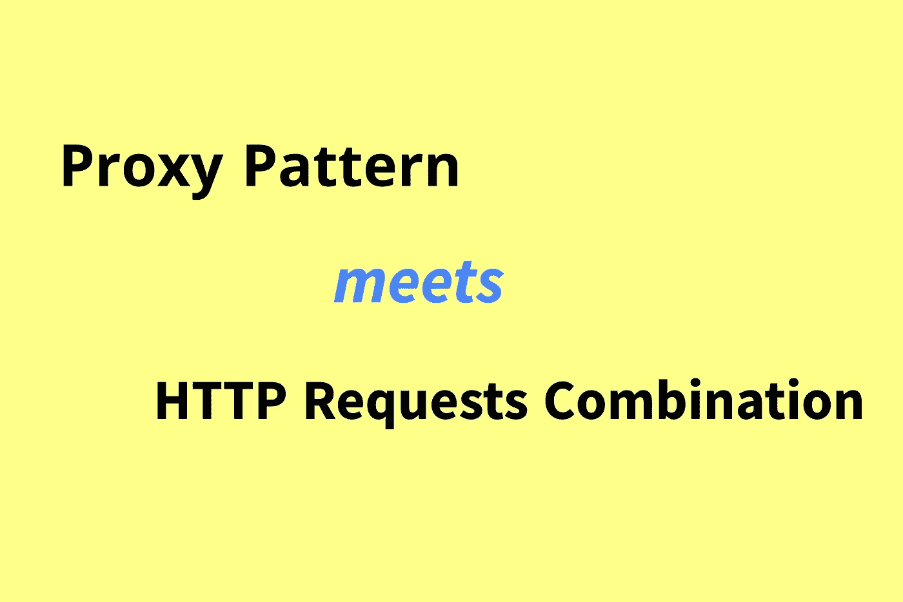
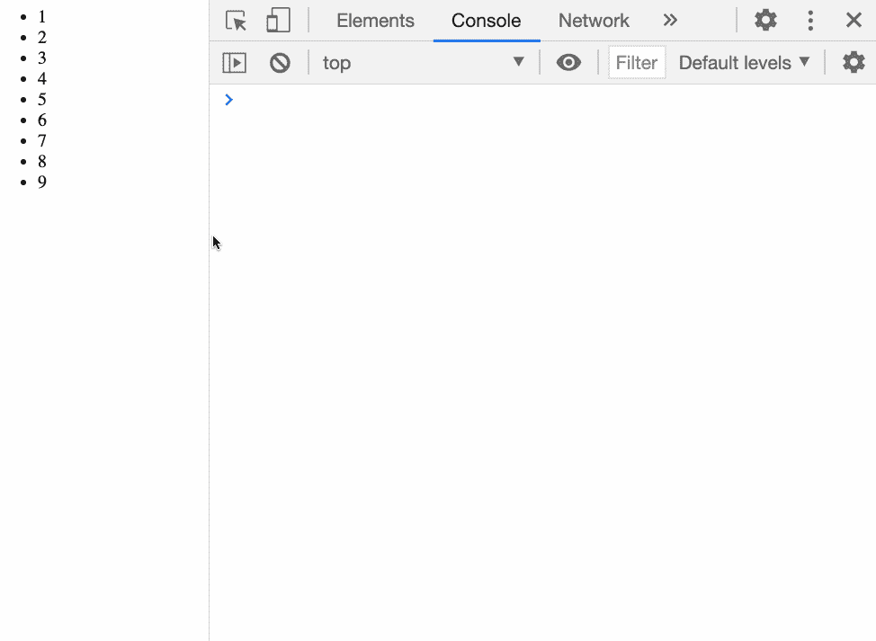
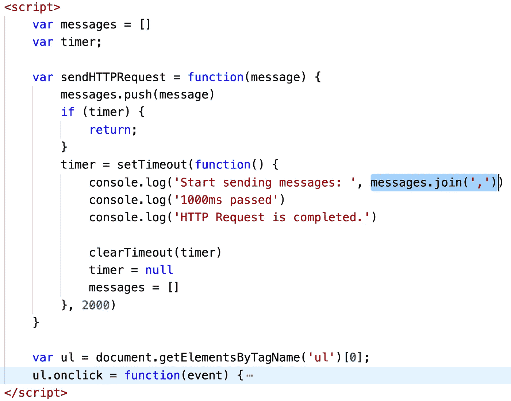
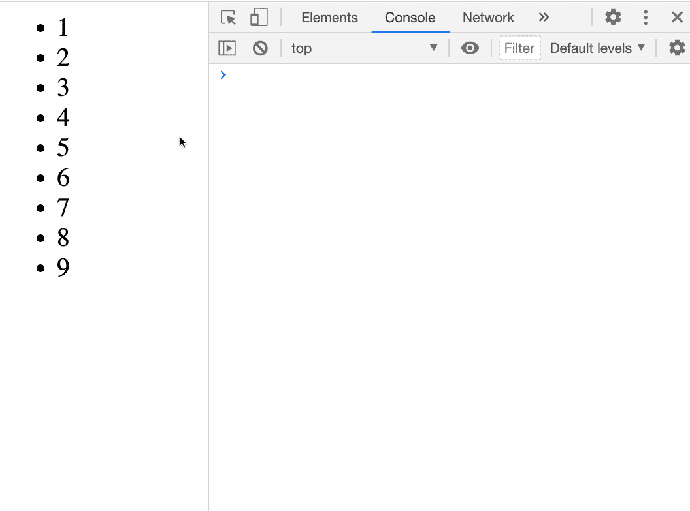
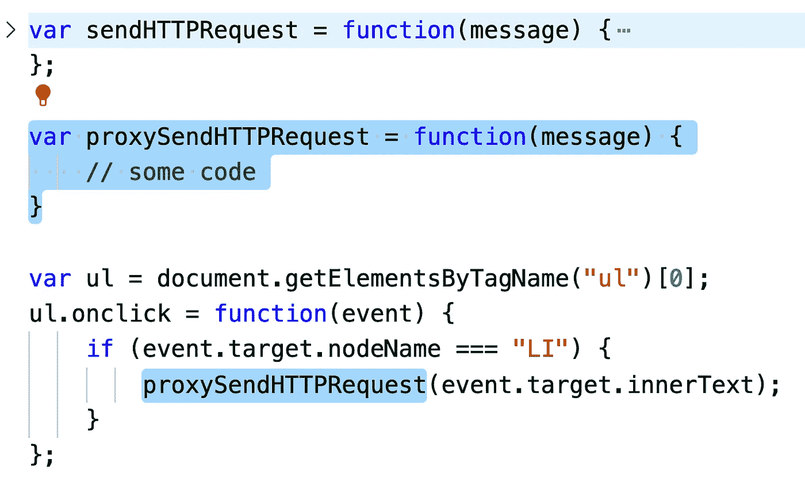
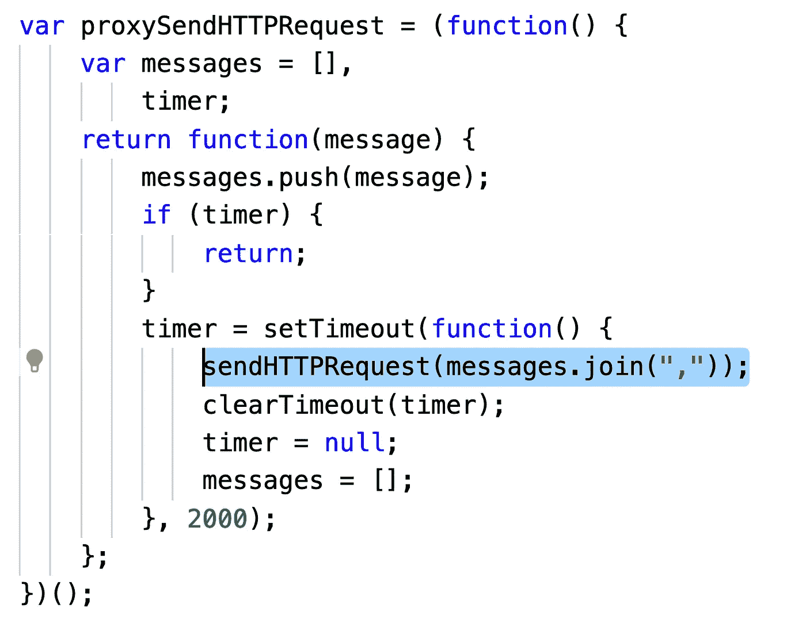

# 提高应用程序性能和代码质量:通过代理模式组合 HTTP 请求

> 原文：<https://levelup.gitconnected.com/improve-both-app-performance-and-code-quality-combining-http-requests-by-proxy-pattern-2cce132d60e>

## 一步一步优化一个真实的项目。



由 bitfish 创建

在一个前端项目中，我们的网页经常需要向服务器发送多个 HTTP 请求。

假设我们的产品有一个特性，每次用户点击`li`标签，客户端都会向服务器发送一个 HTTP 请求。

这里有一个简单的演示:

在上面的代码中，我们直接使用一个简单的`sendHTTPRequest`函数来**模拟**发送一个 HTTP 请求。这样做是为了更好地关注核心目标，所以我简化了一些代码。

然后我们将一个点击事件绑定到`ul`元素。每当用户点击一个标签，比如`<li>5</li>`，客户端就会执行`sendHTTPRequest`函数向服务器发出一个 HTTP 请求。

上面的程序是这样工作的:



为了让你们更容易尝试，我做了一个 Codepen 演示:

*(你需要* ***打开你浏览器的控制台*** *才能看到程序的输出。)*

当然，在一个真实的项目中，我们可能会向服务器发送一个文件，推送通知，或者发送一些日志。但是我们将跳过演示会议的细节。

好了，这是一个非常简单的演示，那么上面的代码有什么缺点吗？

如果您的项目非常简单，那么编写这样的代码应该没有问题。但是，如果您的项目很复杂，并且您的客户端需要频繁地向服务器发送 HTTP 请求，那么这些代码将是低效的。

在上面的例子中，如果用户反复快速点击`li`元素会发生什么？这个时候我们的客户端需要频繁的向服务器发出 HTTP 请求，每个请求都会消耗大量的时间和服务器资源。

每次客户端与服务器建立新的 HTTP 连接时，都会消耗一些时间和服务器资源。因此，在 HTTP 传输机制中，一次传输所有文件比多次传输少量文件更高效。

例如，您可能需要发送五个 HTTP 请求，每个请求的 HTTP 数据包大小为 1MB。现在您一次发送一个 HTTP 请求，数据包大小为 5MB。后者通常会比前一个表现得更好。

网页的大量 HTTP 请求会降低页面的加载速度，最终损害用户体验。如果页面加载速度不够快，这会导致访问者更快地离开页面。

所以在这种情况下，我们可以考虑合并 HTTP 请求。

在我们目前的项目中，我的想法是这样的:我们可以在本地设置一个缓存，然后收集一段时间内需要发送到服务器的所有消息，并将它们一起发送。

你可以暂停一会儿，试着自己想清楚。

提示:您需要创建一个本地缓存对象来收集需要发送的消息。然后，您需要使用计时器定期发送收集到的消息。

下面是一个实现。



```
var messages = [];
var timer;var sendHTTPRequest = function (message) {
  messages.push(message);
  if (timer) {
    return;
  }
  timer = setTimeout(function () {
    console.log("Start sending messages: ", messages.join(","));
    console.log("1000ms passed");
    console.log("HTTP Request is completed.");clearTimeout(timer);
    timer = null;
    messages = [];
  }, 2000);
};
```

每当客户端需要发送消息时，即触发`onclick`事件时，`sendHTTPRequest`不会立即将消息发送给服务器，而是先将消息缓存在`messages`中。然后我们有一个 2 秒后执行的计时器，2 秒后计时器会将之前缓存的所有消息发送到服务器。这种改变达到了组合 HTTP 请求的目的。

测试结果如下:



如您所见，尽管我们多次触发了 click 事件，但在两秒钟内，我们只发送了一个 HTTP 请求。

当然，为了演示方便，我把等待时间设置为 2 秒。如果你觉得这个等待时间太长，可以缩短这个等待时间。

对于不需要太多实时交互的项目，2 秒钟的延迟并不是一个巨大的副作用，但它可以减轻服务器的压力。在合适的背景下，这是非常值得的。

上面的代码确实为项目提供了一些性能改进。但是在代码设计方面，上面的代码并不好。

首先，它违反了单一责任原则。`sendHTTPRequest`函数不仅向服务器发送 HTTP 请求，还组合 HTTP 请求。这个函数做得太多，使得代码看起来非常复杂。

如果一个功能(或对象)承担了太多的责任，那么当我们的需求发生变化时，这个功能通常会发生巨大的变化。这样的设计不能有效地处理可能的变化，这是一个糟糕的设计。

我们理想的代码应该是这样的:



我们没有对`sendHTTPRequest`做任何修改，而是选择为它提供一个代理。这个代理函数执行合并 HTTP 请求的任务，并将合并后的消息传递给`sendHTTPRequest`进行发送。然后我们可以在将来使用`proxySendHTTPRequest`方法。

你可以暂停一会儿，试着自己想清楚。

下面是一个实现:



```
var proxySendHTTPRequest = (function() {
    var messages = [],
        timer;
    return function(message) {
        messages.push(message);
        if (timer) {
            return;
        }
        timer = setTimeout(function() {
            sendHTTPRequest(messages.join(","));
            clearTimeout(timer);
            timer = null;
            messages = [];
        }, 2000);
    };
})();
```

大致思路和前面的代码类似，用一个`messages`变量缓存一个时间范围内的所有消息，然后通过一个定时器统一发送。此外，这段代码使用闭包技巧将`messages`和`timer`变量放在局部范围内，以避免污染全局名称空间。

这段代码和之前的代码最大的区别就是没有改变`sendHTTPRequest`函数，而是把它隐藏在了`proxySendHTTPRequest`后面。我们不再需要直接访问`sendHTTPRequest`，而是使用代理`proxySendHTTPRequest`来访问它。`proxySendHTTPRequest`和`sendHTTPRequest`有相同的参数列表，相同的返回值。

这样的设计有什么好处？

*   发送 HTTP 请求的任务和合并 HTTP 请求的任务被交给两个不同的函数，每个函数专注于一个职责。它符合单一责任原则，并使代码更容易理解。
*   由于两个函数的参数是相同的，我们可以简单地用`proxySendHTTPRequest`替换`sendHTTPRequest`的位置，而不需要做任何剧烈的改变。

想象一下，如果在将来，网络性能提高了，或者由于其他原因，我们不再需要组合 HTTP 请求。此时，如果我们使用以前的设计，我们将不得不再次大规模地更改代码。用现在的代码设计，我们可以简单的替换函数名。

事实上，这个编码技巧在设计模式中经常被称为**代理模式**。

所谓的代理模式实际上在现实生活中很好理解。

*   假设你想访问一个网站，但你不想给出你的 IP 地址。然后你可以使用 VPN，先访问你的代理服务器，然后通过代理服务器访问目标网站。所以目标站点无法知道你的 IP 地址。
*   有时候，你会把你的真实服务器藏在 Nginx 服务器后面，让 Nginx 服务器为你的真实服务器处理一些琐碎的操作。

这些是代理模式的真实例子。

我们不需要纠结于代理模式(或任何其他设计模式)的官方定义，我们只需要知道，当客户端不方便(或不能)直接访问目标函数(或对象)时，我们可以提供一个代理函数(或对象)来控制对目标函数(或对象)的访问。客户机实际上访问代理函数(或对象)，代理函数对请求进行一些处理，然后将请求传递给目标。

如果您有任何问题或认为本文需要改进，欢迎您发表评论。你的建议和批评对我很有用。谢谢你。