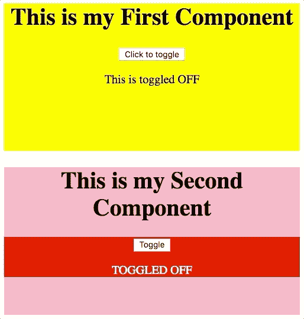

# 使用 React 渲染模式提高代码的可重用性

> 原文：<https://levelup.gitconnected.com/improve-code-reusability-with-reacts-render-prop-pattern-1928beaee1a4>

照片由 [Unsplash](https://unsplash.com?utm_source=medium&utm_medium=referral) 上的[émile Perron](https://unsplash.com/@emilep?utm_source=medium&utm_medium=referral)拍摄

如果您是一名 React 开发人员，并且每天都使用新的和/或以前构建的组件，您可能已经开始注意到代码中重复逻辑的模式。这可以简单到在一个组件中创建多个函数来改变不同的状态键，也可以是创建几个组件，它们是同一事物的稍微不同的版本。本文将重点解决后者，并通过遵循 render prop 模式将函数作为子组件来重构一个可重用的 toggle 组件。

# 原始组件

这个组件只是一个常规的 React 组件，它保持状态，并在单击按钮时切换布尔保持状态。

# 违反单一责任原则

因此，上面的组件做了我们希望它做的事情，但是它不灵活或不可重用，因为它不遵循单一责任原则。你问的是什么？

> “单一责任原则(SRP)是五个所谓的可靠原则之一，由 Robert C. Martin 开发并推广，旨在帮助开发人员生成灵活且可维护的代码。简而言之，SRP 认为一个给定的模块或类应该负责程序功能的一个元素，因此只有一个改变的理由。— [塞弗林·佩雷斯](https://medium.com/@severinperez/writing-flexible-code-with-the-single-responsibility-principle-b71c4f3f883f)

如果你想了解更多关于单一责任原则的知识，请查阅 Severin Perez 的文章(链接见上面的引文和本文末尾的参考文献)。)

当查看我们的原始组件时，我们可以看到它负责几个不同的逻辑位:

1.  呈现带有标题的包装元素。
2.  管理开关的状态。
3.  用一个`button`和条件文本呈现一个`div`。

当我们试图通过修改重用这个组件时，或者我们可能注意到在其他地方复制相同逻辑的模式时，这将开始产生问题，这两种迹象都表明我需要重新检查我的代码并分离它的关注点。

# 重构#1

让我们进行第一次重构，尝试将我们的原始组件拆分开来，这样它就有了一个负责管理状态的父组件，然后呈现一个负责按钮和条件文本的功能组件，从而将关注点 3 从 1 和 2 中分离出来。

我们的功能组件`ToggleWindow`处理关注点 3，接受函数`toggle`和值`isToggled`的支持，并使用给定的信息呈现它需要的元素。`Toggler`现在只负责关注点 1 & 2。

虽然这样更简洁，但是当我们想要重用`Toggler`逻辑，但是呈现不同的按钮和条件文本，或者更好的是呈现不同的父容器时，会发生什么呢

我们可以通过使用 render prop 模式并通过函数调用向`Toggler`的子节点传递它需要的额外参数来解决这个问题。

不过首先…

# 什么是渲染道具？

根据 React 的文档:

> 术语[“渲染道具”](https://cdb.reacttraining.com/use-a-render-prop-50de598f11ce)指的是使用一个其值为函数的道具在 React 组件之间共享代码的技术。
> 
> 具有呈现属性的组件采用返回 React 元素并调用它的函数，而不是实现自己的呈现逻辑。

因此，这意味着我们可以将一个`Toggler`组件的子组件定义为一个函数，我们可以给它附加参数，以实现我们的切换逻辑。

# 重构#2

如果我们将切换逻辑保留在它自己的组件中，那么当我想在后续用例中使用它时，我可以只定义两个功能组件。这也将充分区分和分离我们之前谈到的关注点。

如果您有点困惑，不要担心，代码可以更好地解释它。我在下面创建了一个例子，其中有两个独立的组件，它们对于父元素和子元素有不同的样式和内容规范。两者都将`Toggler`逻辑组件“添加”到其中，但不需要重新定义它。看一看:

我们现在已经坚持了单一责任原则，这使得我们的代码更加松散耦合、可重用和可维护。我们已经将我们的 3 个主要关注点分成不同的定义，允许它们独立存在，并且当它们需要在将来被编辑、更改或重用时，相关的代码是一个点，很容易找到并且适应性强。

对于两种不同的实现，切换逻辑以相同的方式被重用。我创建了两个使用 Toggler 的功能/表示组件的用例，但是在两个用例中都重用了 Toggler，没有重新定义或改变它。

虽然这是一个非常小的基本示例，但是想象一下如何将这种模式扩展到更大、更复杂的逻辑模式，比如数据获取或更大的状态管理任务。如果在您的代码库中应用，这将变得更加有用。

请继续关注我的下一篇关于 React Context API 的博文，它利用这种模式将预定义的逻辑和值添加到特定的组件中。

资源:

 [## 渲染道具-反应

### 术语“渲染道具”指的是一种使用道具在 React 组件之间共享代码的技术，该道具的值是…

reactjs.org](https://reactjs.org/docs/render-props.html)  [## 用单一责任原则编写灵活的代码

### 坚实的原则和可维护的代码

medium.com](https://medium.com/@severinperez/writing-flexible-code-with-the-single-responsibility-principle-b71c4f3f883f)  [## 学习 React -最佳 React 教程(2019) | gitconnected

### 排名前 49 的 React 教程-免费学习 React。课程由开发人员提交并投票，使您能够…

gitconnected.com](https://gitconnected.com/learn/react)