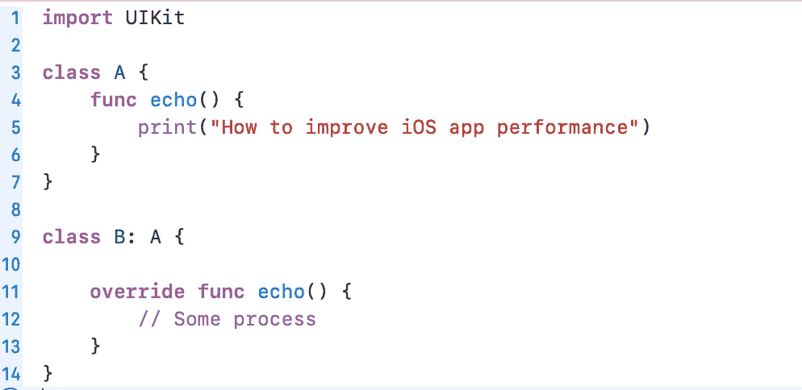
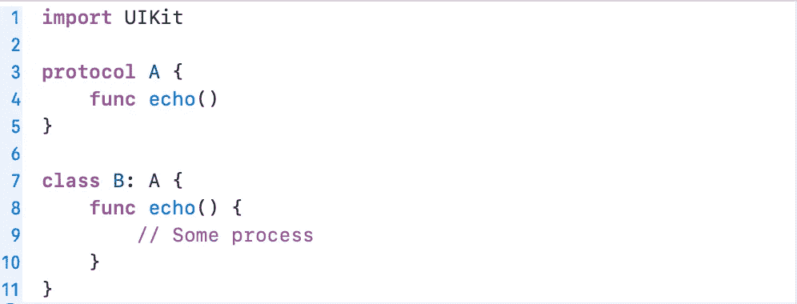

# 提高 iOS 应用程序性能

> 原文：<https://levelup.gitconnected.com/improve-ios-app-performance-64ead2b247d1>

Kolleen Gladden 在 [Unsplash](https://unsplash.com/s/photos/performance?utm_source=unsplash&utm_medium=referral&utm_content=creditCopyText) 上拍摄的照片

代码质量取决于几个因素，如可读性、准确性、性能等。如果你认为时间是世界上最重要的东西，那么性能就不能是一个被低估的因素。

当你创建你的第一个 Hello World 项目时，一切都非常顺利。当你的梦想项目越来越大时，你可能会遭受巨大的编译时间或应用程序性能。只需深入 iOS 生态系统架构。

## 使用面向协议的编程而不是面向对象的编程

如果您查看标准的 Swift 库代码，您会发现协议被频繁使用。如果你从零开始建立继承关系，苹果更喜欢面向协议的编程和使用它的建议。

> 点击[链接阅读官方文件。](https://developer.apple.com/documentation/swift/choosing_between_structures_and_classes)

OOP 范例通过使用继承和多态来解决应用程序中的复杂性问题，多态本身就是最有用的部分。当程序运行时，即运行时，它决定应该调用哪个参数或方法。这个决策过程称为动态调度。

上面的截图是 OOP 的一个小例子。我们知道，类 B 有一个带有 override 关键字的 echo 方法，因为它已经在类 a 的超类中定义了。当我们调用类 B 中的 echo 方法时，触发的是类 B 中被覆盖的 echo 方法，而不是类 a。

一切看起来都很棒，对吧？实际上不是，因为每个进程都是在运行时完成的，就像上面的例子一样，这会降低我们的执行时间。那么，解决办法是什么呢？

POP 代表面向协议的编程。我们通过一个小的修改减少了运行时间的计算。POP 的用法好熟悉啊，不是吗？它是苹果在 UIKit 中大量使用的委托模式。

## 使用静态调度

在阅读关于 Swift 标准库的 Apple 文档时，您可以看到“使用结构而不是类”的阶段如此之多。除了结构是值类型，而类是引用类型之外，结构和类是非常相同的结构。看起来这只是一个很小的差别。其实没那么小！

这种差异的结果是，如果你从一个类创建一个对象，它是动态分配的，而 struct 对象是静态分配的。换一种方式解释，静态创建的对象在编译时在固定大小的堆栈中创建，而动态创建的对象在运行时在堆中创建。它们的大小在运行时被计算并分配给所需的内存。因此，从类对象调用的方法使用动态调度，而结构对象也使用静态调度。

*结论*使用结构结合协议，而不是重类继承。

*** *更新**

非常感谢[范黄乐](https://medium.com/u/7adf7e533179?source=post_page-----64ead2b247d1--------------------------------)的通知。我们说结构是静态分配的，而类是动态分配的。但是如果一个类包含一个结构类型的参数呢？struct 参数仍然是静态分配并在堆栈上创建的吗？答案是否定的！尽管它是一个结构类型，但它的容器是一个类，所以参数是通过动态调度在堆中分配的。

## 检查您的访问级别

在程序运行之前，不会为从类创建的对象确定方法调用和参数访问。因此，当你点击 Xcode 中的 run 按钮时，编译器会编译你的代码，并确定内存分配以及方法和参数访问之间的关系，即多态性的使用。如果编译器发现某个方法或参数没有被外部访问，就将其标记为最终关键字。

如果您知道一个类不是任何类的基类，您应该将 final 关键字添加到类定义中。将最终定义添加到类中时，会将最终定义添加到类中的所有参数和方法中。

假设您有一个应该被覆盖的类。因此，该类不能有 final 关键字。所以你可以给子类中不能访问的所有参数和方法添加私有限制。

你可以阅读苹果开发者文档来获得更多详细的官方信息。

 [## 通过减少动态调度提高性能- Swift 博客

### 像许多其他语言一样，Swift 允许一个类覆盖在其超类中声明的方法和属性。这个…

developer.apple.com](https://developer.apple.com/swift/blog/?id=27) 

# 返回👨‍💻