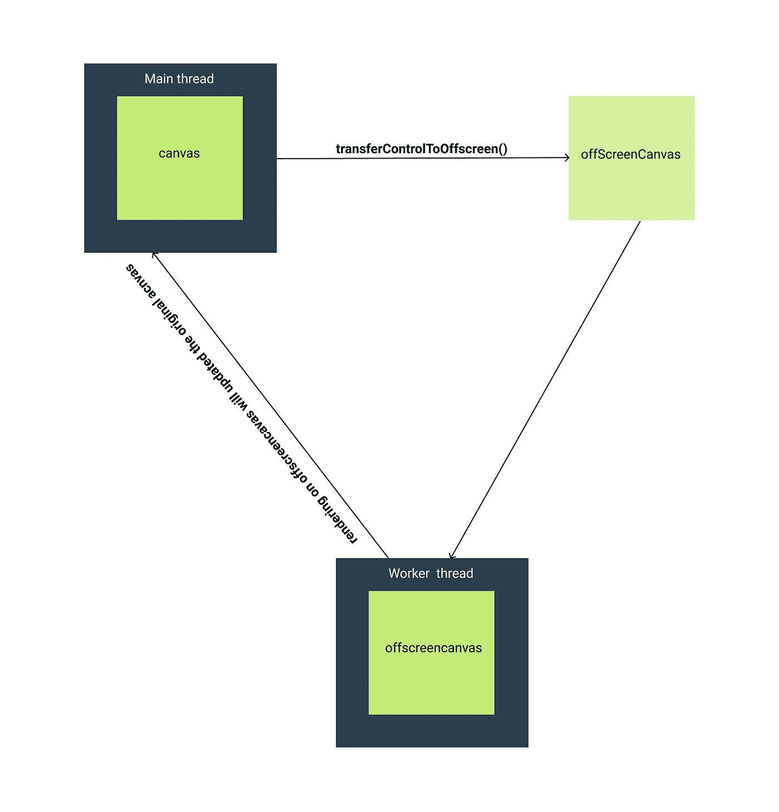

# 使用屏幕外画布提高 JavaScript 性能

> 原文：<https://levelup.gitconnected.com/improve-javascript-performance-with-offscreencanvas-1180dc5376e9>

了解如何通过使用 OffscreenCanvas 来提高在 canvas 中渲染的性能

照片由 [Snapwire](https://www.pexels.com/@snapwire?utm_content=attributionCopyText&utm_medium=referral&utm_source=pexels) 从[像素](https://www.pexels.com/photo/man-riding-bicycle-on-city-street-310983/?utm_content=attributionCopyText&utm_medium=referral&utm_source=pexels)拍摄

OffscreenCanvas 接口允许在 Workers 中使用画布渲染上下文(2D 和 WebGL)。它增加了网络中的并行性，从而提高了多核系统的性能。

使用 OffscreenCanvas，我们可以在工作线程中呈现一个画布，这样主线程就不会受到干扰，这样我们的 web 应用程序就可以顺利工作。

跨浏览器的屏幕外画布支持可以在这里找到[can use](https://caniuse.com/#feat=offscreencanvas)。

我们有两种方法可以使用`**OffscreenCanvas**`

1.  从现有画布创建屏幕外画布
2.  手动创建一个屏幕外画布，并将其渲染到现有画布上

## 1.从现有画布创建屏幕外画布

我们可以调用 canvas 元素上的`transferControlToOffscreen` 方法来获得一个`OffscreenCanvas`元素，该元素可以被传递给 worker。**应用于** `**OffscreenCanvas**` **的操作会自动渲染到源画布上。**

例子

在上面的代码中，我们从`**canvas**` 元素中创建了一个`**offscreenCanvas**`，它被传输到 worker 中，渲染将在 worker 线程中进行。

在 offscreen_worker.js 文件中

**注意:**如果您已经在此画布上使用了`getContext`，您将无法将其转移到 worker。

## **2。手动创建一个屏幕外画布，并将其渲染到现有画布上**

第二种方法是创建一个`OffscreenCanvas`对象并在画布中渲染，然后从`offscreenCanvas`中获取图像数据并将其渲染回原始画布。通过使用这种方式，我们可以一次在多个画布上进行渲染。

要显示来自`offscreenCanvas`的图像(`ImageBitmap`，您可以使用一个`ImageBitmapRenderingContext`上下文，它可以通过在原始画布元素上调用`**canvas.getContext("bitmaprenderer")**`来创建。这个上下文只提供用给定的`ImageBitmap`替换画布内容的功能。

在 worker 中，我们将使用画布并制作一些动画:

如果你的应用在 canvas 中涉及一些复杂的渲染操作，你可以在你的 web 应用中使用`offscreenCanvas`。

感谢阅读。跟随 [Javascript Jeep🚙💨](https://medium.com/u/f9ffc26e7e69?source=post_page-----1180dc5376e9--------------------------------)。