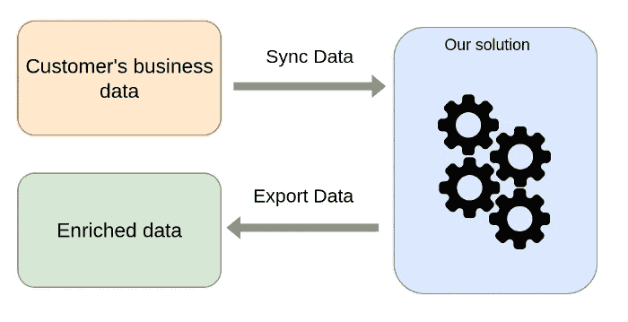

# 通过减少无自动清空的死元组来提高 Postgresql 性能

> 原文：<https://levelup.gitconnected.com/improve-postgresql-performance-by-reducing-dead-tuple-without-auto-vacuum-f7538fdb7bb0>

## 编程；编排


在 [Unsplash](https://unsplash.com?utm_source=medium&utm_medium=referral) 上由 [Max Duzij](https://unsplash.com/@max_duz?utm_source=medium&utm_medium=referral) 拍照

这个故事是关于我们在使用 Postgres 数据库时遇到的关键性能问题，以及我们的团队是如何解决的。

# 我们系统的高级概述



导入数据，处理数据，然后导出数据

如今，一切都与数据有关。我们的解决方案不断同步客户的业务数据，对其进行处理，并最终提供更多的业务见解，用有价值的信息丰富数据，以方便客户。

# 问题是怎么出现的？

在工作中，我们有观察器，当我们的系统出现问题时，它会通知我们。突然，所有的观察者开始为一个特定的应用程序开火。

在做了一些调查后，我们注意到我们的 Postgres 严重超载。深入研究 AWS 性能洞察[1]后，我发现自动清空正在对特定的表积极执行。结果，我们的系统耗尽了 CPU 信用，这导致了显著的性能下降。最后，它降低了我们整个应用程序的速度。

一个显而易见的问题是，为什么自动吸尘会突然变得如此活跃？这个问题的答案是，由于数据同步，死亡元组的**数量不断增加。**

# 我的错误

对于数据同步，我使用了 *UPSERT* (没有记录时插入，如果有记录则更新)。我不知道 Postgres 中的 *UPDATE* 命令有什么不同的实现方式。它添加一个新的元组(或行)并将旧的元组标记为 **dead** 。之后，自动真空基于自动真空设置移除这些**死元组**。

看看这篇关于这个主题的优秀文章[2]——多版本并发控制(MVCC)。

# 解决办法

根据我的发现，我想到了一个解决方案，当且仅当数据库中的现有记录有任何变化时才进行 upsert。

```
PSUEDO CODE1\. FETCH EXISTING DATA
2\. SEPARATE DATA AS UNCHANGED AND DATA-TO-BE-UPSERTED
3\. UPSERT DATA-TO-BE-UPSERTED
```

它大大减少了**死元组**和自动吸尘。它还有助于解决性能问题。

此外，我的用例是定期进行数据同步，所以我很少经常观察到数据的变化。

# 资源

[1][https://aws.amazon.com/rds/performance-insights/](https://aws.amazon.com/rds/performance-insights/)

[2][https://www . per ConA . com/blog/2018/08/06/basic-understanding-float-vacuum-PostgreSQL-mvcc/](https://www.percona.com/blog/2018/08/06/basic-understanding-bloat-vacuum-postgresql-mvcc/)

喜欢我的作品吗？你愿意跟随我来支持我的工作吗？谢谢:)