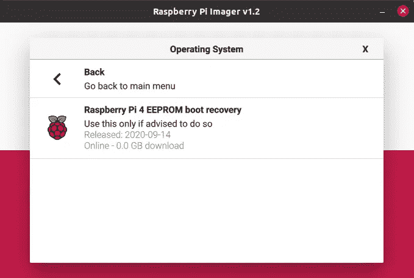
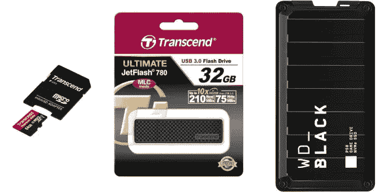
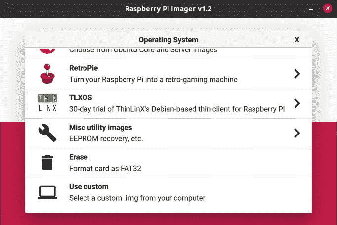
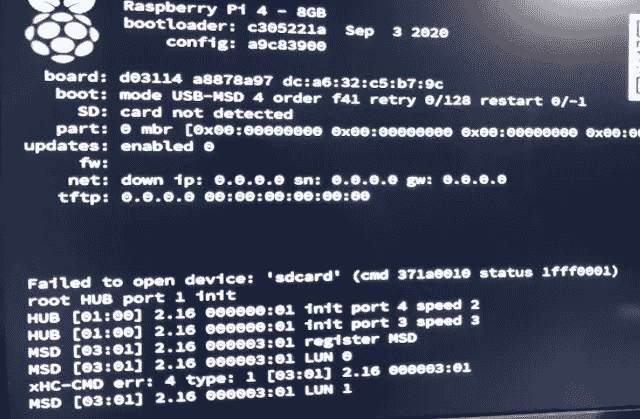

# 通过 64 位 Raspbian 操作系统和 USB 大容量存储启动提高 Raspberry Pi 4 光盘读取速度

> 原文：<https://levelup.gitconnected.com/improve-raspberry-pi-4-disc-read-speed-with-64-bit-raspbian-os-with-usb-mass-storage-boot-4a22ff2d34e1>

微型 SD 卡是将操作系统添加到 Raspberry Pi 的默认方式。但是如果你想让你的系统更可靠，你需要考虑一个替代方案。SD 卡速度不是很快，当你向光盘写入大量数据时，sd 卡可能会损坏。

在 Raspberry Pi 论坛上有一个很长的帖子[“STICKY:how to:Move the file system to a USB stick/Drive”](https://www.raspberrypi.org/forums/viewtopic.php?f=29&t=44177)，在那里你可以找到很多额外的信息，但是这篇帖子包含了一个简短的版本，它为我将我的 8GB 内存的 **Raspberry Pi 4 变成一个真正的工作狂**。

完整的过程在[“USB 大容量存储引导”](https://www.raspberrypi.org/documentation/hardware/raspberrypi/bootmodes/msd.md)中有描述，但这些是树莓 Pi 4 所需的唯一步骤:

*   在 PC、苹果或 Raspberry Pi 上，从 Raspberry Pi 网站下载[“成像仪”工具](https://www.raspberrypi.org/downloads/)
*   使用“成像仪”将最新的引导程序写入 SD 卡(注意:这不是真正的引导程序，而是替代板载引导程序)



*   关掉树莓派的电源
*   插入 sd 卡。
*   上电树莓 Pi
*   等待至少 10 秒钟
*   如果成功:绿色 LED 灯将快速闪烁(永久闪烁),如果连接了 HDMI 显示器，屏幕将显示绿色
*   如果不成功:将显示错误模式，如果连接了 HDMI 显示器，屏幕将显示红色

# Raspbian 操作系统 64 位(测试版)

Raspbian OS 是 Raspberry Pi 提供的操作系统，基于 Debian。由于只有最新的 Raspberry Pi-boards 有 64 位芯片，Raspbian OS 的官方版本只有 32 位。但是有一个正在开发的 64 位 Raspbian 操作系统版本！让我们用那一个…

在这篇文章中，我将这个 64 位测试版写到三张不同的光盘上来比较结果。



*   从树莓派论坛下载 OS-img 文件
*   再次使用“成像仪”工具，并通过“使用自定义”选项选择您刚刚下载的文件



这个 64 位操作系统版本仍在开发中，尚未完全完成。如果你对此有疑问和评论，可以看看这个论坛帖子[“STICKY:Raspberry Pi OS(64 bit)beta 测试版反馈”](https://www.raspberrypi.org/forums/viewtopic.php?f=63&t=275372)。

# 微型 SD 卡

[“创见 64GB microSD”](https://www.kiwi-electronics.nl/transcend-64GB-class-10-microsd-sdxc-met-adapter)的第一次测试如预期般顺利开始。

# 闪存盘

第二个测试，去掉 SD 卡，用的是[“32GB 创见 JetFlash 780 USB 3.0 闪存盘”](https://www.kiwi-electronics.nl/32gb-transcend-jetflash-780-usb-30-flash-drive-mlc-210mbs)…而**我们有了赢家！无需配置或其他更改！只需将闪存盘插入 USB 3(蓝色)端口，Raspberry Pi 就会像 SD 卡一样启动**。

# 固态硬盘

挑战极限……如果有一个 500Gb 的硬盘，大小和树莓派差不多，那该有多好？我们用一个[“WD BLACK P50 游戏硬盘 SSD 500 GB”](https://www.coolblue.be/nl/product/853658/wd-black-p50-game-drive-ssd-500gb.html)试试吧。

但没有运气…连接到 USB 3 的 Pi 无法启动。当连接到 USB 2 时，它可以工作，但速度比预期低很多。重新启动几次后，我似乎把光盘搞砸了，因为我又一次看到了同样的错误屏幕…



显然，**不是所有的固态硬盘都支持在 Raspberry Pi 上进行 USB 引导，所以我需要进一步调查这个问题…如果你有如何解决这个问题的想法，请告诉我！**

这是“dmesg”信息，该信息是在主板使用另一张光盘启动时连接该驱动器时记录的:

```
[  567.261232] usb 2-2: new SuperSpeed Gen 1 USB device number 8 using xhci_hcd
[  567.282283] usb 2-2: New USB device found, idVendor=1058, idProduct=2642, bcdDevice=10.03
[  567.282293] usb 2-2: New USB device strings: Mfr=2, Product=3, SerialNumber=1
[  567.282298] usb 2-2: Product: Game Drive
[  567.282302] usb 2-2: Manufacturer: Western Digital
[  567.293640] scsi host1: uas
```

在这篇文章[“磁盘速度测试(读/写):Linux 中的 HDD、SSD 性能(shellhacks . com)”](https://www.shellhacks.com/disk-speed-test-read-write-hdd-ssd-perfomance-linux/)中，我找到了几个测试磁盘速度的测试命令。让我们在不同的光盘上使用它们。

# 使用的命令

写文件:
`$ sync; dd if=/dev/zero of=tempfile bs=1M count=1024; sync`

读取一个文件，但是使用了缓存的文件，所以没有真正的速度:
`$ sync; dd if=/dev/zero of=tempfile bs=1M count=1024; sync`

读取一个文件，但是先清空缓存获得真实速度:
`$ sudo /sbin/sysctl -w vm.drop_caches=3
$ dd if=tempfile of=/dev/null bs=1M count=1024`

使用 hdparm 作为读取速度的基准工具进行测试:
`$ sudo apt-get install hdparm
$ sudo hdparm -Tt /dev/sda # For the USB disc
$ sudo hdparm -Tt /dev/mmcblk0 # For the SD card`

# 结果

如果你有一个受支持的闪存盘，从 SD 切换到 USB 启动是非常容易的，而且读取速度要快得多！与更高的可靠性相结合，这使交换机成为一个 go go go…；——)

*原载于*[*https://web techie . be*](https://webtechie.be/post/2020-09-29-64bit-raspbianos-on-raspberrypi4-with-usbboot/)*。*