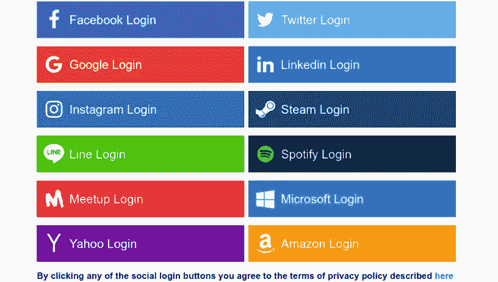
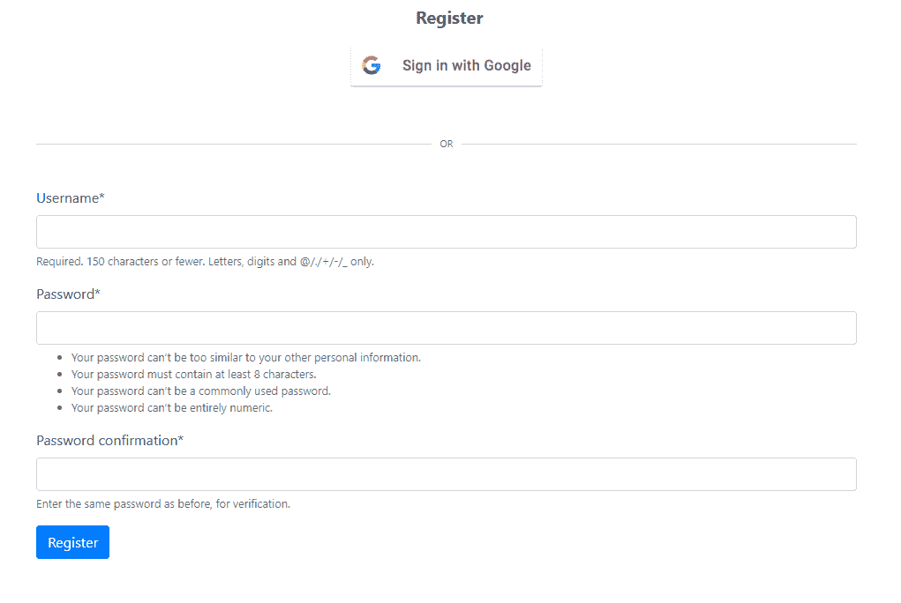
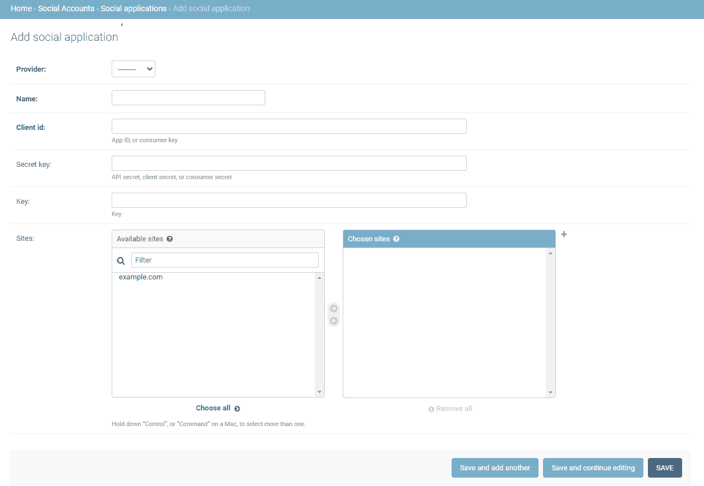
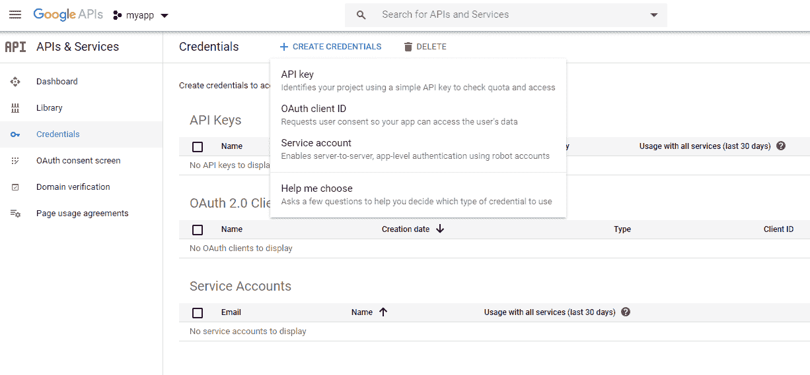
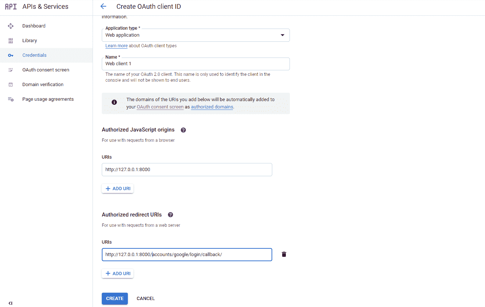

# 提高 django-allauth 的注册率

> 原文：<https://levelup.gitconnected.com/improve-signup-rates-with-django-allauth-6a11b11a15b6>



# **姜戈-阿劳斯是什么？**

[Django-allauth](https://www.intenct.nl/projects/django-allauth/) 是一款可重复使用的 Django 应用，允许注册社交账户，如脸书、谷歌、推特、Instagram。支持的功能包括注册本地和社交账户的能力，以及用于其他问题的可插拔注册表单。基本上，django-allauth 将允许您快速处理和创建注册流，而不是使用 django 内置的 UserCreationForm。以下是所有支持的提供商列表:

*   亚马逊(OAuth2)
*   AngelList (OAuth2)
*   比特里(OAuth2)
*   收存箱(OAuth)
*   脸书(OAuth2 和 JS SDK)
*   Feedly (OAuth2)
*   Github (OAuth2)
*   谷歌(OAuth2)
*   Instagram (OAuth2)
*   LinkedIn (OAuth，OAuth2)
*   OpenId
*   Paypal (OAuth2)
*   人物角色
*   SoundCloud (OAuth2)
*   堆栈交换(OAuth2)
*   Twitch (OAuth2)
*   推特(OAuth)
*   维梅奥语(OAuth)
*   VK (OAuth2)
*   微博(OAuth2)

# django-allauth 如何提高注册率？

大多数消费者已经拥有至少一个以上列出的帐户。因此，添加一个社交登录可以大大提高注册率，因为它减少了用户为他们可能还没有准备好注册的网站创建另一个用户名和密码的需要。此外，看到谷歌或脸书的标志作为注册选项，可以立即增加网站的可信度，同时减少创建帐户的时间。记住，让用户注册总是比加入更难。使注册过程尽可能简单，并在创建帐户后开始，而不是在创建帐户时。

有了大量受支持的提供者，django-allauth 还允许开发人员添加与其目标受众相匹配的提供者。例如， [dev.to](https://dev.to/) 只允许用户注册 Twitter 或 Github 账户。考虑到开发者对这些平台的亲和力，提供用户已经习惯的注册选项是有意义的。作为另一个例子，一个游戏网站可能想要实现 Twitch 注册，而一个电子商务商店可以从 Paypal 注册中受益。至于我们自己的社交登录体验，只需添加一个谷歌注册按钮，我们的注册率就提高了大约 25%。

让我们回顾一下我们是如何做到这一点的。

# **Django 设置**

首先设置您的虚拟环境。注:对于 macOS/ubuntu 用户，将`py`替换为`python3`

```
C:\Users\Owner\Desktop\code>py -m venv social
```

接下来激活虚拟环境，使用包管理器安装 Django，创建一个项目(mysite)，最后创建一个应用程序(main)。

```
C:\Users\Owner\Desktop\code>cd socialC:\Users\Owner\Desktop\code\social>Scripts\activate(social) C:\Users\Owner\Desktop\code\social>pip install Django(social) C:\Users\Owner\Desktop\code\social>django-admin startproject mysite(social) C:\Users\Owner\Desktop\code\social>cd mysite(social) C:\Users\Owner\Desktop\code\social\mysite>py manage.py startapp main
```

将主应用添加到 settings.py 中的 INSTALLED_APPS。

```
#*mysite/settings.py*INSTALLED_APPS = [
    'main.apps.MainConfig', #add this
    'django.contrib.admin',
    'django.contrib.auth',
    'django.contrib.contenttypes',
    'django.contrib.sessions',
    'django.contrib.messages',
    'django.contrib.staticfiles',
]
```

创建一个超级用户来登录 Django admin。

```
(social) C:\Users\Owner\Desktop\code\social\mysite>py manage.py createsuperuser
```

进行迁移和迁移。

```
(social) C:\Users\Owner\Desktop\code\social\mysite>py manage.py makemigrations
...
(social) C:\Users\Owner\Desktop\code\social\mysite>py manage.py migrate
```

用你的包管理器安装 django-allauth。然后将 django-allauth 添加到 settings.py 中的 INSTALLED_APPS 中，并包含多个认证后端。此外，添加一个重定向 URL 来指定用户使用社交身份验证登录后将被重定向到的位置。

```
(social) C:\Users\Owner\Desktop\code\social\mysite>pip install django-allauth#*mysite/settings.py*INSTALLED_APPS = [
    'main.apps.MainConfig', 
    'django.contrib.admin',
    'django.contrib.auth',
    'django.contrib.contenttypes',
    'django.contrib.sessions',
    'django.contrib.messages',
    'django.contrib.staticfiles', #add the following
    'django.contrib.sites',
    'allauth',
    'allauth.account',
    'allauth.socialaccount', ]AUTHENTICATION_BACKENDS = (
 #used for default signin such as loggin into admin panel
 'django.contrib.auth.backends.ModelBackend', 

 #used for social authentications
 'allauth.account.auth_backends.AuthenticationBackend',
 )SITE_ID = 1LOGIN_REDIRECT_URL = '/tutorials'
```

在 mysite/urls.py 中包含 allauth.urls。

```
#*mysite/urls.py*from django.contrib import admin
from django.urls import path, includeurlpatterns = [
    path('admin/', admin.site.urls),
    path('accounts/', include('allauth.urls')),
]
```

# **注册谷歌**

将特定于提供程序的设置添加到 settings.py。

```
#*mysite/settings.py*INSTALLED_APPS = [
    'main.apps.MainConfig', 
    'django.contrib.admin',
    'django.contrib.auth',
    'django.contrib.contenttypes',
    'django.contrib.sessions',
    'django.contrib.messages',
    'django.contrib.staticfiles', 'django.contrib.sites',
    'allauth',
    'allauth.account',
    'allauth.socialaccount',    'allauth.socialaccount.providers.google', #for google auth]... SOCIALACCOUNT_PROVIDERS = {
    'google': {
        'SCOPE': [
            'profile',
            'email',
        ],
        'AUTH_PARAMS': {
            'access_type': 'online',
        }
    }
}
```

迁移更改。

```
(social) C:\Users\Owner\Desktop\code\social\mysite>py manage.py migrate
```

好吧，让我们建立一个注册页面。首先，在主应用程序中创建新的 urls.py 文件，并将 URL 包含在 mysite/urls.py 中。

```
#*main/urls.py*from django.urls import path
from . import viewsapp_name = "main" urlpatterns = [
  path("", views.homepage, name="homepage"),
  path("register", views.register, name="register"),]#*mysite/urls.py*from django.contrib import admin
from django.urls import path, includeurlpatterns = [
    path('', include('main.urls')),
    path('admin/', admin.site.urls),
    path('accounts/', include('allauth.urls')),
]
```

向 views.py 添加适当的视图函数。注意，我们也在设置传统的注册表单。然而，我们还需要从我们的设置中指定正确的后端。

```
#*main/views.py*from django.shortcuts import render, redirect
from django.contrib.auth.forms import UserCreationForm
from django.contrib.auth import login, authenticate, logoutdef homepage(request):
  return render(request, "home.html")def register(request):
  if request.method == "POST":
    form = UserCreationForm(request.POST)
    if form.is_valid():
      user = form.save()
      username = form.cleaned_data.get('username')
      messages.success(request, f"New account created: {username}")
      login(request, user, backend='django.contrib.auth.backends.ModelBackend')
    else:
      messages.error(request,"Account creation failed") return redirect("main:homepage") form = UserCreationForm()
  return render(request,"register.html", {"form": form})
```

创建 register.html 模板。在模板中，我们将添加传统的注册表单以及 Google 注册。注意:我们还使用 django-crisp-forms 来呈现我们的注册表单。跟随这个[指南](https://www.ordinarycoders.com/blog/article/render-forms-with-django-crispy-forms)了解更多。

```
#*templates/register.html*

<div class="container mx-5">
 <div class=" signin text-center"> <a href="" class="text-dark"></a>
  </div> <br><br> <div style="width: 100%; height: 15px; border-bottom: 1px solid lightgray; text-align: center">
    <span class="text-muted" style="margin-top:-15% **!important**; font-size: 11px; background-color: white; padding: 0px 10px;">
      OR
    </span>
  </div> <br><br> <form method="post">
    
    {{ form|crispy }}
    <button type="submit"  class="btn btn-primary">Register</button> </form></div>
```



太棒了，现在我们只需要用我们之前创建的超级用户登录到管理面板，获取我们的 Google OAuth 凭证，并添加适当的信息。登录后，点击管理面板底部的“社交应用”，然后点击“添加社交应用”。



在我们输入这些信息之前，我们需要获得我们的 Google OAuth 证书。访问[谷歌开发者控制台](https://console.developers.google.com/)。转到侧面导航栏中的“凭据”。要创建凭据，您首先需要创建一个新项目和同意书。单击“创建项目”，输入与您的 web 应用程序相关的名称，然后点击“创建”。接下来，将提示您填写 OAuth 同意书。选择“外部”，这样任何用户都可以通过 Google OAuth 注册。输入应用程序的相关名称和电子邮件。只有这些字段是必需的。最后，返回到凭证，单击创建凭证，并选择 OAuth 客户端 ID。



选择“Web 应用程序”，输入名称，并指定来源和重定向 URI 的。在我们的例子中，由于我们正在开发服务器上工作，我们将输入 [http://127.0.0.1:8000/](https://www.ordinarycoders.com/) 作为我们的源 URI，输入[http://127 . 0 . 0 . 1:8000/accounts/Google/log in/callback/](https://www.ordinarycoders.com/accounts/google/login/callback/)作为我们的重定向 URI。我们之前在包含 allauth.urls 时将该路径添加到 mysite/urls.py 中。



单击“创建”接收您的客户 ID 和客户密码。回到您的 Django 管理页面，选择“Google”作为提供商，输入“Google”作为名称，输入客户端 ID，输入密钥，最后添加 example.com 站点

回到你的注册页面，点击“与谷歌签约”按钮。您应该会被重定向到可用的 Google 登录选项。选择一个帐户并通过 Google OAuth 登录。要检查您当前是否以新用户身份登录，请访问管理页面，该页面会提示您不允许使用该用户，或者在您的 home.html 模板上输入以下代码:

```

        <h2 class="text-center">{{ user.username }}</h2>

```

请确保遵守提供商关于您的社交认证按钮的徽标使用和放置的规则。对于生产，用您正在使用的域替换您的本地服务器地址。

*最初发表于*[*【https://www.ordinarycoders.com】*](https://www.ordinarycoders.com/blog/article/django-allauth)*。*