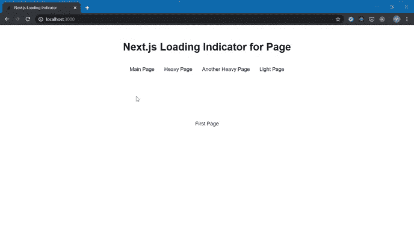
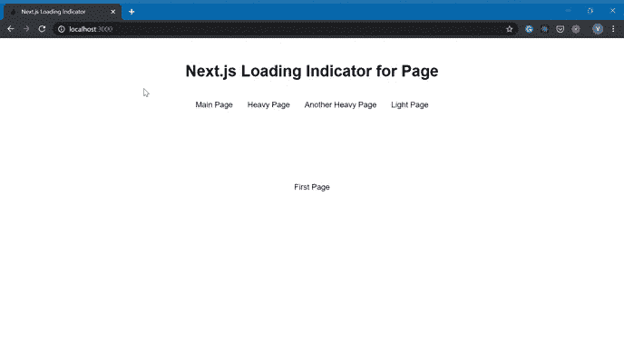

# 使用页面加载指示器，在 3 分钟内提高 Next.js 应用程序的 UX

> 原文：<https://levelup.gitconnected.com/improve-ux-of-your-next-js-app-in-3-minutes-with-page-loading-indicator-3a422113304d>


照片由 [Marcin Jozwiak](https://unsplash.com/@marcinjozwiak?utm_source=unsplash&utm_medium=referral&utm_content=creditCopyText) 在 [Unsplash](https://unsplash.com/s/photos/clarity?utm_source=unsplash&utm_medium=referral&utm_content=creditCopyText) 上拍摄

Next.js 成为构建 React 应用的标准之一。最近，我注意到 next.js 应用程序(以及其他 SPA 应用程序)中常见的一个 UX 问题。

客户端导航是 SPA 应用程序的典型特征，它有很多优点。Next.js 提供了一个易于使用的工具，比如使用客户端导航的`Link`组件和`Router`。但是尽管它有很多优点，它也有一个小小的 UX 缺点。

**不触发浏览器的加载指示**，这在多页面网站的情况下通常会发生。如果没有加载指示器，**当页面只是通过 JavaScript 获取内容时，看起来好像页面被卡住了**。这可能会让用户感到困惑，并对网站用户体验产生负面影响。

您可以在下面的示例中看到这个问题:



Next.js 应用程序中的客户端导航，不加载指示器

添加自定义加载指示器解决了这个问题。看看添加了加载器的同一个应用程序。



Next.js 应用程序中带有加载指示器的客户端导航

我想你注意到了不同之处。我将向你展示如何建立这个漂亮的进度条

# 将加载指示器添加到 next.js 项目中

这个过程非常简单:

*   安装`nprogress`包
*   将`nprogress`动画 API 绑定到 Next.js 路由器中的导航事件

## 安装程序

`nprogress`是一个提供动画进度条的包。使用以下命令之一安装它

```
npm i nprogress
```

或者

```
yarn add nprogress
```

## 绑定到导航事件

我们需要在客户端导航启动时触发`nprogress` 动画，并在导航完成时停止动画。我们可以使用 next.js 中内置的`Router` 的事件来绑定它们。我将事件绑定在一个定制的`App`组件中，以保持代码有组织。

`_app.js`

```
import Router from 'next/router';
import NProgress from 'nprogress'; //nprogress module
import 'nprogress/nprogress.css'; //styles of nprogress//Binding events. 
Router.events.on('routeChangeStart', () => NProgress.start()); Router.events.on('routeChangeComplete', () => NProgress.done()); Router.events.on('routeChangeError', () => NProgress.done());function MyApp({ Component, pageProps }) {
    return <Component {...pageProps} />
}export default MyApp;
```

上面的代码非常简单明了。只要确保事件处理程序在组件之外绑定，以避免绑定几个处理程序。CSS 在最新的 Next.js v9.3 中工作。如果你使用旧版本，你需要安装一个插件来加载 CSS。我推荐用`@webdeb/next-styles`

就是这样！几分钟后，你提高了 Next.js 应用程序的 UX。

**感谢阅读！:)**

**我是 Vova Pilipchatin，一名自由软件工程师和网页开发者。**

**如果你喜欢这篇文章，请关注我的** [**推特**](https://twitter.com/VPilipchatin) **。**

**在那里，我分享了我在开发网络应用程序、启动 SaaS 项目和建立自由职业者业务方面所学到的知识:)**