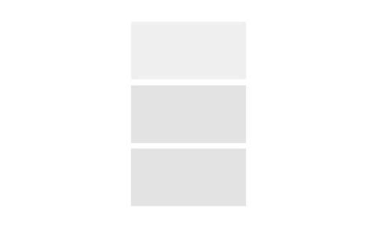
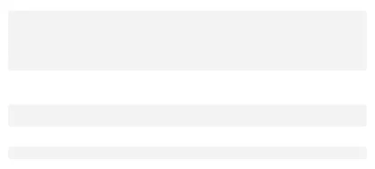
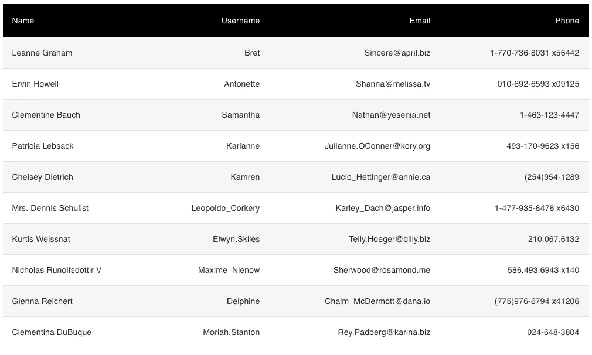
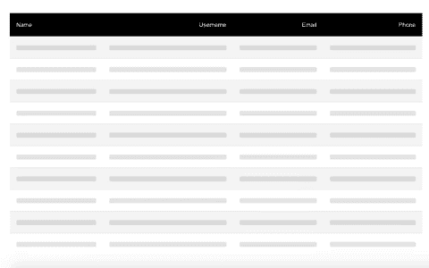

# 用 React 和 Material-UI 中的骨架组件改进 UX

> 原文：<https://levelup.gitconnected.com/improve-ux-with-the-skeleton-component-in-react-and-material-ui-c0b14a446f26>

## 在加载数据之前显示内容的占位符预览


马修·施瓦茨在 [Unsplash](https://unsplash.com?utm_source=medium&utm_medium=referral) 上的照片

Spinners 和 loader 是显示内容正在被加载的传统方式。然而，为了改善用户体验，骨架在现代开发中被更多地使用。

什么是骨架？框架是一个 UI 组件，它在数据加载之前显示内容的占位符预览。骨架通过减少加载时的挫折提供了更好的用户体验。用户将看到内容的占位符预览，而不是盯着空白的屏幕或旋转器。

在本文中，我们将了解以下内容:

*   Material-UI 中的骨架组件是什么
*   我们如何在 React 应用程序中使用框架组件

# 反应骨架成分

材质界面中的[骨骼](https://material-ui.com/components/skeleton/)组件仍然是实验室的一部分。因此，为了使用它，我们需要安装 Material-UI 核心包和 Material-UI 实验室包。

```
// with npm
npm install @material-ui/core @material-ui/lab// with yarn
yarn add @material-ui/core @material-ui/lab
```

## 形状

骨架组件有 3 种变体，*‘文本’*，*‘圆形’*，以及*‘矩形’*。我们可以通过向变量属性传递一个值来显示不同形状的骨架组件。

```
<Skeleton variant="text" />
<Skeleton variant="circle" width={100} height={100} />
<Skeleton variant="rect" width={200} height={100} />
```


## 动画片

骨架组件也有一个动画道具。默认情况下，它将被设置为*‘脉动’。*您也可以将其更改为*‘wave’*，或者将其设置为*‘false’*将其禁用。

```
<Skeleton variant="rect" width={200} height={100} />
<Skeleton variant="rect" width={200} height={100} animation={false} />
<Skeleton variant="rect" width={200} height={100} animation="wave" />
```



## 作为子组件传递

您可以通过将骨架作为子组件传递来推断其高度和宽度。例如，如果我们使用骨架作为排版组件的子组件，骨架的高度将由排版变体的高度来推断。

```
<Typography variant="h1">
  <Skeleton />
</Typography>
<Typography variant="h4">
  <Skeleton />
</Typography>
<Typography variant="body1">
  <Skeleton />
</Typography>
```



## 传递子组件

也可以将子组件传递给骨架来推断尺寸。在下面的示例中，骨架上没有设置高度或宽度。化身组件具有默认的高度和宽度设置。所以骨架推断出这个高度和宽度。

```
<Skeleton variant="circle">
  <Avatar />
</Skeleton>
```


# 如何使用骨架组件的示例

既然我们已经有了基础，让我们学习如何在一个真实的例子中使用它。在 Material-UI [文档](https://material-ui.com/components/skeleton/)中，有很多使用骨架制作卡片组件的例子。因此，在我们的例子中，让我们通过创建一个表来改变事情。

该示例来自 Material-UI 中表格文档的[定制表格](https://gist.github.com/chadmuro/aefad27cd235b79a68e6cfb21e561b2a)部分。我们将创建如下表格:



表头包括**姓名**、**用户名**、**电子邮件**和**电话**栏。表体包含用户数据。我们还将每隔一行的行样式设置为浅灰色。

在这个组件中，我们将有两个状态:一个数组`users`，和一个布尔值来确定`loading`状态。

```
const [users, setUsers] = useState([]);
const [loading, setLoading] = useState(true);
```

我们将从 JSON 占位符中获取一个用户列表。

在一个`useEffect`钩子中使用 fetch 添加一个 get 请求。收到响应后，将响应数据设置到`users`数组，并将`loading`设置为假。

```
useEffect(() => {
  fetch('https://jsonplaceholder.typicode.com/users')
    .then(*response* => response.json())
    .then(*data* => {
      setUsers(data);
      setLoading(false);
    });
}, []);
```

在我们的表体中，我们将根据`loading`和`users`的状态来决定渲染什么。如果`loading`为真，我们想要呈现一个十行表格的框架。下面的代码将生成一个包含十个项目的数组，我们可以通过映射来显示十行骨架:

```
const skeletonArray = Array(10).fill('');
```

然后，我们将使用骨架组件作为`StyledTableCell`的子组件。

```
{loading &&
  skeletonArray.map((*item*, *index*) => (
    <StyledTableRow key={index}>
      <StyledTableCell component="th" scope="row">
        <Skeleton />
      </StyledTableCell>
      <StyledTableCell align="right">
        <Skeleton />
      </StyledTableCell>
      <StyledTableCell align="right">
        <Skeleton />
      </StyledTableCell>
      <StyledTableCell align="right">
        <Skeleton />
      </StyledTableCell>
    </StyledTableRow>
))}
```

一旦数据加载完毕，我们希望映射到`users`数组上，并在一行中显示数据。

```
{users &&
  users.map(*user* => (
   <StyledTableRow key={user.id}>
     <StyledTableCell component="th" scope="row">
        {user.name}
      </StyledTableCell>
      <StyledTableCell align="right">
        {user.username}
      </StyledTableCell>
      <StyledTableCell align="right">
        {user.email}
      </StyledTableCell>
      <StyledTableCell align="right">
        {user.phone}
      </StyledTableCell>
    </StyledTableRow>
))}
```



如您所见，当数据仍在加载时，骨架组件正在被渲染。这看起来是不是比传统的旋转器或加载器好很多，或者更糟，一个空白屏幕？

以下代码片段显示了该表的完整源代码:

# 结论

感谢阅读！我希望这篇文章对你开始使用 Material-UI 中的骨架组件有所帮助。

在 React 中处理骨骼时，还有一些其他流行的库。您也可以查看[反应内容加载器](https://www.npmjs.com/package/react-content-loader)或[反应加载框架](https://www.npmjs.com/package/react-loading-skeleton)。

无论您选择哪个选项，请考虑在您的下一个项目中使用框架来改善用户体验。

如果您想了解关于另一个 Material-UI 组件的更多信息，请查看下面的文章。

[](https://medium.com/geekculture/what-really-happens-when-you-use-the-textfield-component-in-material-ui-1e62652196f) [## 在 Material-UI 中使用 TextField 组件时，实际会发生什么？

### 让我们更深入地调查一下

medium.com](https://medium.com/geekculture/what-really-happens-when-you-use-the-textfield-component-in-material-ui-1e62652196f)