# 使用吉拉仪表板提高您的产品管理技能

> 原文：<https://levelup.gitconnected.com/improve-your-product-management-with-jira-dashboard-5a5e8a90c26a>

当涉及到跟踪你的产品团队内部的事情时，有时候事情进展得太快，或者事情太多，以至于你很难随时知道你在哪里。哪些功能在使用前需要您的意见？在进行问答之前，哪些票证需要您的反馈？你的团队目前在做什么？

作为产品经理，每个人都希望你对每件事都有一个答案，这就是为什么拥有一个快速概览的机制是你掌握脉搏并帮助一切顺利进行的关键。

如果您使用吉拉来跟踪您团队的工作，那么您很幸运，因为它允许您创建自己的仪表板，可以为您做到这一点，只需几次简单的点击，您就可以创建一个中心位置，无论何时您需要了解正在发生的事情。

# **创建您的仪表板**

从主吉拉菜单中，您可以单击“Dashboards ”,然后转到“Manage Dashboards ”,在这里您可以选择“Create New Dashboard”开始操作。

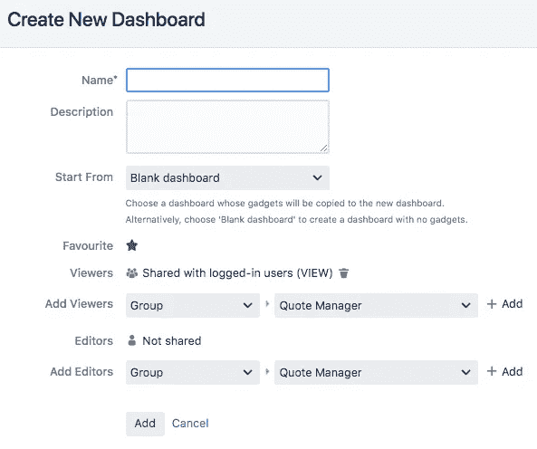

您只需要给它一个名称就可以了，但是(取决于您的访问权限)您可以管理谁可以访问您的仪表板，或者如果您愿意，可以给它一个描述。当您点击添加仪表板时，将会有一个漂亮干净的仪表板等着您。

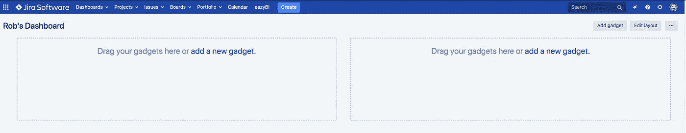

现在你需要考虑你想要什么。吉拉有一系列的“小工具”,你可以用它们来整合整个系统的信息，你会想用它们来增强你的仪表板的功能。

# **你需要做什么？**

在我的公司里，大约有 30 个人经常使用吉拉，这些人中的任何人都可以创建或编辑问题，并将它们分配给我，以便我采取行动或做出决定，这意味着我需要轻松地知道我在做什么，以及其他人对我有什么期望。为此，吉拉有“分配给我”的小工具。

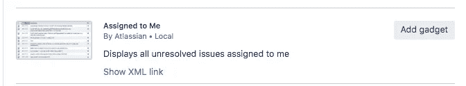

添加后，您可以配置小工具应该显示的结果数量(它最多可以显示 50 个，但太多了，所以我只显示前 10 个)、它显示的信息(它默认显示问题类型、关键、摘要和优先级，我认为这就够了)，以及它刷新的频率(它默认不刷新，除非您刷新页面，但如果需要，您可以让它每 15 分钟更新一次)。

一旦你添加了这个小工具，你就有了一个快速查看你需要做什么的方法。我的目标是让这个小工具在一天结束时变成空白，因为这意味着我已经处理了所有其他人期望我做的事情。

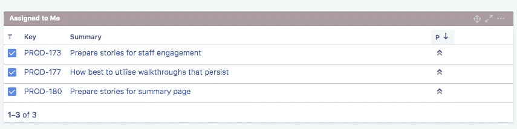

# **你的产品团队需要做什么？**

我有一个由我负责的团队，我喜欢看到他们目前正在处理的事情，所以我有一个小工具可以显示他们正在做什么，这是基于一个过滤器的。

这个小工具的第一步是创建过滤器。

为此，您需要转到“问题”并选择“搜索问题”，因为从这里您可以运行各种查询来获得您需要的吉拉数据。

在“JQL 查询”字段中，您需要构建您的查询，以便显示当前分配给您的团队成员但尚未关闭的问题。该查询如下所示:

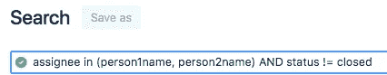

您可以添加任意多的人，只需用逗号分隔姓名，因此无论您的团队有多大。

或者，如果您的小组在一个独立于其他人的吉拉项目中工作，您可以用项目查询替换受分配人查询，例如:

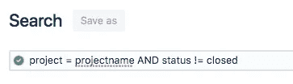

一旦您对您的查询返回您想要的结果感到满意，您应该保存它，因为您将需要从您的仪表板引用它。

回到仪表板页面，如果您要添加一个小工具，找到并添加过滤器结果小工具，您将能够配置小工具以引用您的新查询。

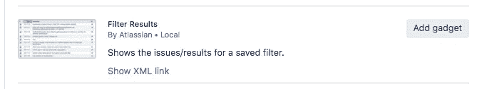

与“分配给我”过滤器一样，您可以配置一些不同的元素来满足您自己的需求，并且您肯定希望包括“被分配人”字段，以便您可以看到谁被分配了什么。

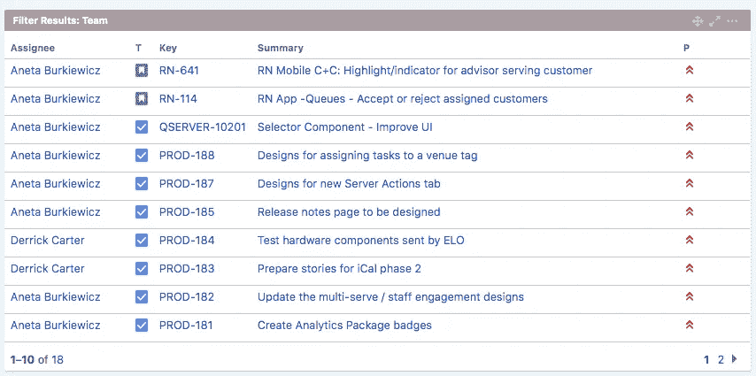

# 你的团队表现如何？

目前我们有两个工程团队在开发我们的产品，所以另一个关键的信息是看看团队在冲刺阶段进展如何。为此，我们可以使用 Sprint Health 小工具。

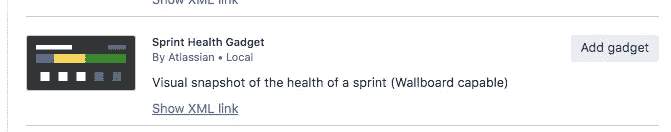

一旦您配置了这个小工具应该查看哪个吉拉板，您将能够看到在 sprint 中经过的时间、完成的工作、任何范围变更和任何标记的问题，这让您可以简单地了解它们在哪里。由于我们有多个团队，我们有多个 Sprint 健康小工具。

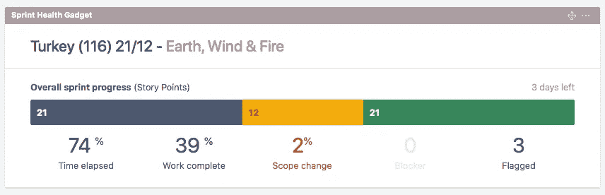

# **最近发生了什么事？**

为了了解团队在那个时刻发生了什么，活动流小工具将吉拉的最新更新拉进时间线，这意味着你可以看到谁最近更新了什么问题以及他们做了什么。

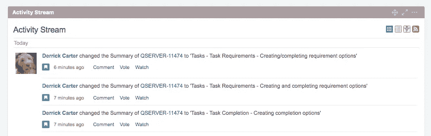

您可以限制流中的信息量(默认为 10 项)，但如果您想查看更多，也可以加载更多。

# **其他有用的小玩意**

由于您能够创建运行过滤器的小工具，选项是无穷无尽的，但我发现一些有用的是:

**被阻止的问题** —创建一个过滤器，向您显示任何处于被阻止状态的问题，以便您可以看到任何被阻止进行的工作，并允许您管理预期或介入支持。使用过滤器结果小工具来引用您保存的过滤器。

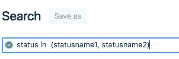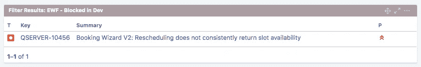

如果您想查看任何有状态的问题，无论是查看当前正在进行的还是正在测试的，您实际上可以使用这种方法

Sprint burndown —同样，这是一个查看团队活动进度的好工具，它用一个图表显示他们在 Sprint 时间段内完成的工作，让他们的进度栩栩如生。这是一个内置的吉拉小工具，所以不要乱搞过滤查询。

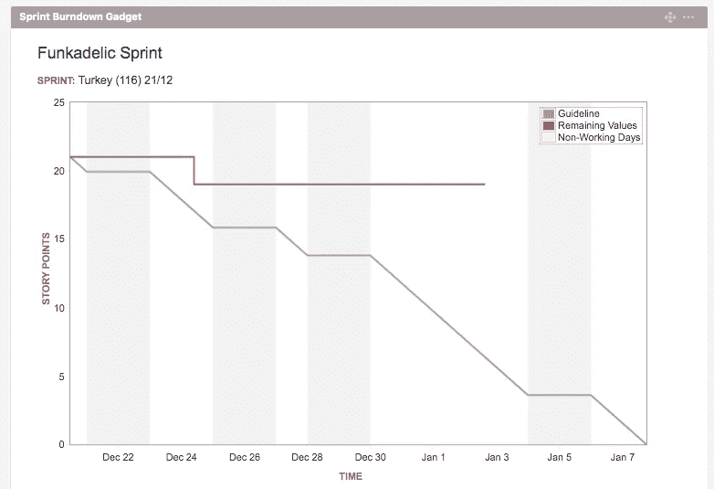

**客户问题** —如果您用客户的名称标记吉拉问题(通过添加标签或自定义字段)，那么您可以将未解决的客户问题提交到仪表板上。同样，使用保存的过滤器和过滤器结果小工具。

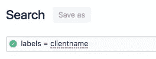

# **注意事项**

当然，根据您的吉拉实例是如何配置的，您可能可以访问大量有趣的信息，但是您真正需要的是从仪表板中快速浏览您关注的地方，所以不要陷入获取大量信息的困境。

考虑一下你需要快速知道什么，然后创建一个小工具告诉你。对于其他任何事情，你都可以在吉拉论坛或问题搜索中查看信息。

# 关于罗柏

Rob 在 20 多年前进入软件开发行业之前，是一名职业足球运动员和电影院经理。他是初创公司 Ormsby Street 的创始团队成员，领导 Qudini 的产品团队，并就产品、团队、生产力和沟通发表言论和文章。

[https://www.linkedin.com/in/robertjdrury/](https://www.linkedin.com/in/robertjdrury/)