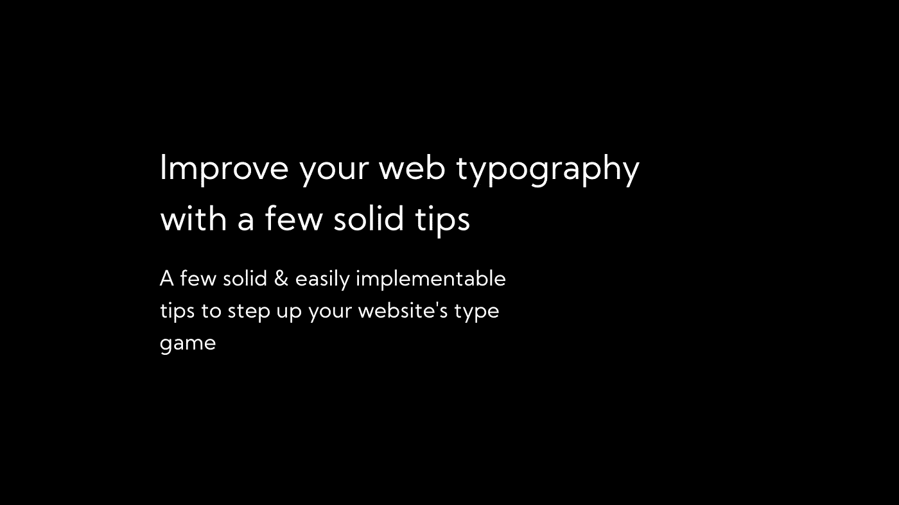
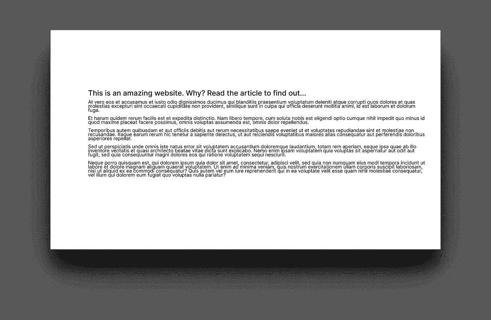
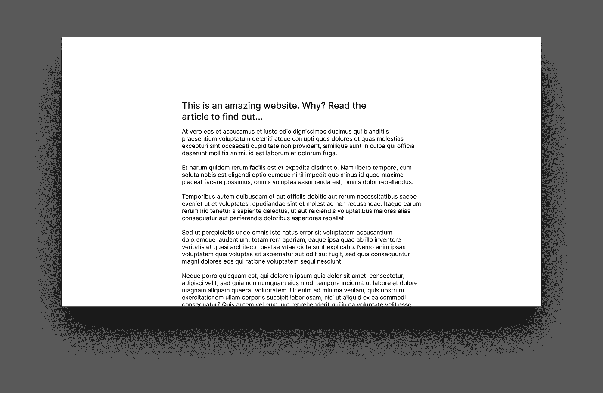

# 用一些可靠的技巧改进你的网页排版

> 原文：<https://levelup.gitconnected.com/improve-your-web-typography-with-a-few-solid-tips-ccdea4477d00>

## 一些可靠且容易实现的技巧来提升你的网站的类型游戏

我努力让我的网站看起来漂亮。我认为一个网站的视觉方面非常重要，尤其是对普通访问者来说。一个普通人并不关心你用什么架构来建立你的网站，他们关心的是它是否好看和加载速度快。由于排版对网站的外观非常重要，今天我们将讨论一些可以立即改善网站排版的方法。

排版是所有网页设计的基础。在我看来，文字是网站内容的主要部分(找不到任何关于这方面的研究，但我很确定这是真的)。那么如何让文字看起来好看呢？有几件事需要考虑:

1.  大小(以及不同级别之间的缩放比例)
2.  间隔
3.  字体选择

## 尺寸(和缩放)

字体大小至关重要，这样用户才能知道你想要表达的层次。你可以在网上找到生成字体等级的好方法，我个人是 https://type-scale.com/的粉丝，它可以让你直观地计算出你网站的字体等级。这里有一个在 CSS 中实现的类型标度的例子(这个例子的灵感来自于[的顺风](https://tailwindcss.com)):

通过阐明内容的层次结构，这将立即对你的网站产生影响。虽然这在几乎所有设备上看起来都很棒，但我们也需要考虑使用高分辨率显示器和小手机的人。为此，我已经开始使用一些媒体查询来处理我的网站中的所有类型的缩放:

正如你所看到的，我们正在改变“html”标签的大小，这将影响“rem”对你网站上其他所有内容的意义，这是一个轻松、快速缩放所有内容的好方法。

## 间隔

间距非常非常重要，看看下面的 2 个网站，你认为哪个设计得更好？

即使两者使用相同的字体，甚至相同的字号，第二种(在我看来)客观上看起来更好。所要做的就是设置正确的“行高”,并确保用户不必将眼睛从屏幕的一个角落移到另一个角落。我通常会将所有的文本放在一个`

<main>'标签中，然后相应地调整大小:</main>

就 CSS 而言非常简单，但对可读性和美观性有着巨大的影响。

## 字体选择

为你的网站选择合适的字体很大程度上取决于网站和它的目的。选择字体最重要的是你要确保它清晰易读。因为文字的目的是传达信息(至少在文字多的网站中)，使用不擅长的字体不会有很好的效果。

我让你在这方面做出好的选择，但是如果你感兴趣，你可以在下面看到一些我最喜欢的开源字体:

1.  [利息](https://fonts.google.com/specimen/Inter)
2.  [梅里韦瑟](https://fonts.google.com/specimen/Merriweather)
3.  [大都市](https://github.com/chrismsimpson/Metropolis)
4.  [EB Garamond](https://fonts.google.com/specimen/EB+Garamond)
5.  [约斯特*](https://fonts.google.com/specimen/Jost)
6.  自由巴斯克维尔

## 离别赠言

这就是这篇短文的全部内容，我只是想分享一些易于实现的网页排版技巧。我已经将我所有的基本排版样式编译成一个简单的 starter CSS 文件( [GitHub gist link](https://gist.github.com/kartiknair/00521222c6e2ae4b385d91c400debd30) )你可以随意在你的任何项目中使用它。祝您愉快&注意安全！

> 本文最初发表在我的博客上:[https://kartikn.me/writing/improve-web-typography](https://kartikn.me/writing/improve-web-typography)。想打个招呼吗？在推特上联系我