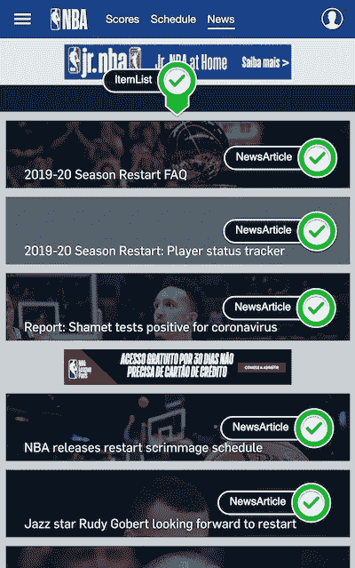

# 用 JSON-LD 改进你的网站 SEO

> 原文：<https://levelup.gitconnected.com/improve-your-website-seo-with-json-ld-44addc29ae89>

## 让你的网站对搜索引擎爬虫有效。

今天，搜索引擎是互联网上最大的流量驱动力。人们通常使用谷歌作为他们在网络浏览器上的第一页，键入他们需要的内容，然后毫无问题地等待结果。

理解 SEO 对增加你的流量至关重要。此时此刻，数百万人正在搜索像你这样的内容。通过改进你的网站搜索引擎优化来帮助他们找到你。

我将向您展示如何使用 JSON-LD 通过四个简单的步骤来利用 SEO。

# 首先，什么是 JSON-LD？

JSON-LD 代表 ***链接数据的 JavaScript 对象符号*** ，它由一种使用 JSON 对链接数据进行编码的方法组成。通常，就 SEO 而言，JSON-LD 是利用 Schema.org 词汇表实现的。由谷歌、微软、雅虎和 Yandex 创建的 Schema.org 词汇表为 web 创建了一个统一的结构化数据词汇表。

# JSON-LD 是做什么的？

JSON-LD 在一个小部件上列出元素，构建数据，然后搜索引擎可以使用这些数据来澄清元素并建立围绕实体的事实。这些实体的组织方式给了我们一个更好的网络。

JSON-LD 的一个概念性可视化，它获取 web 上的非结构化内容，对内容进行注释和结构化，以创建一个有组织、结构化的结果。

该图展示了在我们的 web 页面中添加 JSON-LD 的主要步骤:

1.  **识别相关页面元素。**
2.  将每个项目与 Schema.org 词汇联系起来。你可以在[*https://schema.org/docs/full.html*](https://schema.org/docs/full.html)*找到所有项目类型的综合列表。*
3.  利用所有的关联，**创建 JSON-LD 结构化数据标记**。
4.  **使用** [**结构化数据测试工具**](https://search.google.com/structured-data/testing-tool/u/0/) **进行测试。**

# 让我们来改善一个网页的 SEO 吧！

为此，我们将使用一个实际的例子。我们将分析并改进 NBA.com 新闻手机网页的搜索引擎优化。

NBA.com 新闻和头条页面

## 步骤 1:识别相关的页面元素

nba.com/news 展示了所有来自 NBA 的最新新闻、视频、博客和排名。

在这个页面上，我们看到主要元素是新闻文章列表。对于每条新闻，我们可以看到标题、图片或视频。但是我们可能还有其他元数据信息，比如关键词、发表日期和文章 URL。

识别页面元素

## 第二步:将每个项目与 Schema.org 词汇联系起来

现在我们有了页面元素，我们可以将这些元素与 Schema.org 词汇表关联起来。

我们使用页面**来标识每个元素的类型。在开始的时候，识别每个项目的类型有点困难，但是当你有更多的练习时，你会很容易地将它们分类。**

**我们要识别的第一个项目是 ***文章列表*** 。 ***条列表*** 是`ItemList` *类型。*如 Schema.org 所述，*项目列表*为:**

> **任何种类的项目列表，例如，关于天气预报员的前 10 部电影，或前 100 首派对歌曲。**

**该页面的其他项目是文章。为简单起见，我们将认为所有这些文章都是关于一些新闻。根据 Schema.org 的说法，我们将这些元素确定为`NewsArticle`，即:**

> **新闻文章是其内容报道新闻，或为理解新闻提供背景情况和支持材料的文章。**

****

**确定元素的类型**

## **步骤 3:创建 JSON-LD 结构化数据标记**

**现在您已经掌握了所有的信息，可以开始编写 JSON-LD 文档了。**

**在开始讨论页面元素之前，描述一下组织也是很重要的。**

**由于 NBA.com 是一个与体育相关的组织，我们在 Schema.org`SportsOrganization`有这种类型。但是如果您的组织类型不在**中，您可以使用一个通用类型，即`Organization`类型。****

***当你看到 JSON-LD 时，你首先应该看到的是一个`<script>` 标签。带有类型属性的`<script type="application/ld+json">`标签说，“嘿，浏览器，我正在调用包含 JSON-LD 的 JavaScript。”您的页面上可以有多个 JSON-LD 结构化数据。***

> *****提示:** Google 建议将 JSON-LD 添加到 HTML 文档的< head >部分；但是，如果 JSON-LD 在<主体>部分内，也没关系。***

***让我们定义一下我们组织的结构化数据:***

***使用 Schema.org 词汇来丰富你的数据。***

***最后，让我们使用我们在第二步中定义的类型来创建文章 JSON-LD(为了简单起见，我只定义了第一篇文章，但其他文章遵循相同的模式):***

## ***步骤 4:用结构化数据测试工具进行测试。***

***现在是测试结构化数据的时候了，以确认它是有效的，并且所有的条目属性都是正确的。***

***使用[结构化数据测试工具](https://search.google.com/structured-data/testing-tool/u/0/)，你可以用两种方式测试 HTML 页面。您可以告知您的网站 URL(如果它已经发布)，或者您可以粘贴 HTML 代码。***

******

***类型:体育组织***

******

***类型:项目列表和新项目***